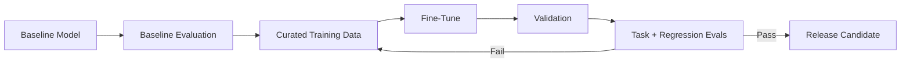

# Fine-Tuning Large Language Models

## 1. Introduction to Fine-Tuning

Fine-tuning is the process of **adapting a pre-trained LLM** so it performs well on a **specific task, domain, or behavior**.  

Think of it as **teaching a highly educated person a new specialized skill**.

---

### What is Fine-Tuning?

- Pre-trained LLMs know:
  - Language structure
  - Grammar
  - General knowledge from books, articles, websites
- But they do **not know your exact task needs**:
  - How to classify medical queries
  - How to answer customer support questions politely
  - How to follow specific formatting rules

- Fine-tuning **teaches the model** to:
  - Follow your instructions
  - Match your domain style and tone
  - Make outputs predictable and task-specific

**Analogy:**
- Pre-training = school education (learn general subjects)  
- Fine-tuning = on-the-job training (learn your specific work skills)

---

### Why Fine-Tuning is Important

1. **Consistency:**  
   - Ensures the model responds **in the expected way**.
2. **Domain-Specific Knowledge:**  
   - Focuses the model on your **specific context**.
3. **Instruction Compliance:**  
   - Makes the model **obey commands reliably**.
4. **Reduces Errors:**  
   - Prevents rambling, hallucinations, or unrelated outputs.

---

### Before vs After Fine-Tuning

 **Before:**
- User: Explain photosynthesis
- Model: Photosynthesis is a process in plants which occurs in chloroplasts, involves multiple reactions… (long, academic, unfocused)

**After:**
- User: Explain photosynthesis
- Model: Photosynthesis is how plants make food using sunlight, water, and carbon dioxide. (clear, concise, human-friendly)


---

### How Fine-Tuning Works (Simplified Flow)
```
Pre-trained LLM
↓
Fine-tuning dataset (small, task-specific)
↓
Adjust model weights slightly
↓
Model learns:

Task behavior

Domain style

Instruction-following
↓
Produces consistent, task-specific responses
```

---

### Key Takeaways

- Fine-tuning adapts model parameters toward a target task, domain, or behavior
- It can introduce regressions, so baseline capabilities must be re-evaluated
- It is **one production option**, not a requirement for every LLM application

---

## 2. Instruction Fine-Tuning

Instruction fine-tuning is **one of the most important techniques in modern LLMs**. It teaches a model **not just to know language, but to follow instructions from humans in a helpful, consistent way**.

---

### What is Instruction Fine-Tuning?

- LLMs learn patterns from huge text corpora during pre-training.  
- Pre-trained models know language, grammar, and general facts, but they **don’t know how to obey instructions reliably**.
- Instruction fine-tuning **bridges this gap**:
  - It teaches the model **how to respond correctly when given a command**.
  - It ensures the model **formats outputs properly, matches tone, and behaves predictably**.

**Analogy:**
- Pre-training = learning everything in school (math, history, biology…)  
- Instruction fine-tuning = learning **how to do a specific job task well**  
  - Example: Even if you know math, you still need to learn **how to use it to balance a company budget**.

---

### How Instruction Fine-Tuning Works

1. **Data Preparation:**  
   - The dataset is made of **instruction → response pairs**.  
   - Each example tells the model **what to do and what the correct output should look like**.

2. **Training Process:**  
   - The model is trained to **minimize errors in producing the correct response**.  
   - The training objective updates selected parameters so instruction-following behavior improves. General capabilities can still regress, so evaluation is required.

---

### Example Instruction Fine-Tuning Dataset

- **Instruction:** Explain gravity in simple terms

  **Response:** Gravity is a force that pulls objects toward each other.

- **Instruction:** Translate to French: Hello

  **Response:** Bonjour

- **Instruction:** Summarize this text: "Photosynthesis is how plants make food using sunlight, water, and carbon dioxide."

  **Response:** Plants use sunlight, water, and carbon dioxide to make food.


- Each **instruction** tells the model **what task to perform**.  
- Each **response** shows **how to complete it clearly and correctly**.

---

### Before vs After Instruction Fine-Tuning

**Before:**
**User:** Explain photosynthesis
**Model:** Photosynthesis is a process in plants which occurs in chloroplasts, involves multiple chemical reactions, and converts light energy into chemical energy… (long, academic, unfocused)

**After:**
**User:** Explain photosynthesis
**Model:** Photosynthesis is how plants make food using sunlight, water, and carbon dioxide. (clear, concise, human-friendly)


**Notice the difference:**
  - Before: Knowledge is present but **messy and hard to follow**.  
  - After: Knowledge is **organized, relevant, and human-friendly**.

---

### Why Instruction Fine-Tuning is Critical

1. **Makes LLMs Multi-Task Capable:**  
   - A single instruction-tuned model can **perform translation, summarization, classification, and reasoning**.  

2. **Reduces Need for Task-Specific Models:**  
   - Instead of training one model per task, instruction-tuning allows **one model to do many tasks**.

3. **Forms the Basis for ChatGPT-Style Models:**  
   - Models that feel “helpful, safe, and aligned” are **instruction fine-tuned first**.  

---

### Visual Flow: How Instruction Fine-Tuning Shapes Behavior
```
Pre-trained LLM
↓ (Instruction Fine-Tuning)
Learns:
How to follow instructions
How to format outputs
How to match desired tone & style
↓
Produces: Clear, helpful, human-aligned responses
```

---

### Key Takeaways

- Instruction fine-tuning teaches **“how to act”**, not “what to know”.  
- Instruction tuning can preserve much of the base capability, but preservation is not guaranteed.  
- It is **essential for building helpful, reliable, multi-task LLMs**.

---

## 3. FLAN & Instruction-Tuned LLMs

FLAN is an example of a **large language model that has been instruction-tuned** on thousands of tasks.  
It shows how **instruction fine-tuning massively improves model usefulness**.

---

### What is FLAN?

- **FLAN** stands for **Fine-tuned LAnguage Net** (conceptually).  
- It is a **pre-trained LLM that has been further trained on instruction-response datasets across many tasks**.  
- The goal: **one model, multiple skills, human-friendly outputs**.

**Key Idea:**  
Instead of building a new model for every task, FLAN proves that **instruction tuning allows one model to handle many tasks well**.

---

### What FLAN Did Differently

- Traditional models before FLAN:
  - Task-specific → one model per task
  - Examples: translation-only, summarization-only, or QA-only
- FLAN approach:
  - Instruction-tuned on **multiple tasks simultaneously**
  - Tasks include:
    - Question Answering
    - Summarization
    - Reasoning
    - Classification
    - Translation
    - Math
    - Code-like instructions

---

### How FLAN-Style Instruction Tuning Works

1. **Collect Diverse Tasks:** Thousands of instruction-response pairs covering multiple domains.  
2. **Fine-Tune the Pre-trained LLM:** Model learns **how to follow instructions for all these tasks**.  
3. **Result:** One general-purpose model capable of **multi-task reasoning and action**.

**Example FLAN-Style Training Samples:**

**Instruction: Classify sentiment**

- **Input:** I love this movie
- **Output:** Positive

**Instruction: Solve the math problem**

- **Input:** 12 × 8
- **Output:** 96

**Instruction: Explain like I'm 5**

- **Input:** What is gravity?
- **Output:** Gravity is why things fall down.


- Notice that **the same model handles very different tasks** without needing separate models.

---

### Why FLAN Matters

1. **Proved Instruction Tuning Works:**  
   - Showed that instruction fine-tuning **improves usefulness and obedience** across tasks.
2. **Inspired ChatGPT-Style Models:**  
   - ChatGPT, Claude, and others follow **instruction-tuning principles**.
3. **Reduced Need for Task-Specific Models:**  
   - One model can now handle multiple tasks, reducing infrastructure complexity.

---

### Visual Flow: FLAN-Style Instruction Tuning
```
Pre-trained LLM
↓ (Instruction Fine-Tuning on thousands of tasks)
Learns:
How to follow instructions
How to produce clear, helpful outputs
Multi-task reasoning
↓
Produces: One model that can answer, summarize, translate, reason, and classify
```

---

### Key Takeaways

- FLAN is **instruction-tuned on multiple tasks** → flexible, general-purpose.  
- Instruction tuning is **not just for one task** → can scale across domains.  
- FLAN proves that **a single instruction-tuned model can replace many task-specific models**.  
- This **conceptually underpins modern AI assistants** like ChatGPT.

---

## 4. Types of Fine-Tuning

There are several ways to fine-tune LLMs depending on your **goal, data, and compute resources**.  
We will cover **four main types**: Task Fine-Tuning, Instruction Fine-Tuning, Domain Fine-Tuning, and Alignment Fine-Tuning.

---

### 1. Task Fine-Tuning

- **Definition:** Fine-tune the model for **one specific task**.  
- **Example Tasks:**
  - Summarization only  
  - Spam detection only  
  - Sentiment classification

- **How it works:**
**Input:** Email text
**Output:** Spam / Not Spam

- **Pros:**
  - Simple to implement  
  - High accuracy for that specific task

- **Cons:**
  - Narrow capability  
  - Model cannot generalize to other tasks without retraining

- **Use When:**  
   - Single-task production system  
   -  Not for multi-task or rapidly changing requirements

---

### 2. Instruction Fine-Tuning

- **Definition:** Teach the model **to follow human instructions in general**, across multiple tasks.  
- **Why important:**  
  - Makes LLMs **general-purpose and obedient**  
  - Allows **one model to handle many different tasks**  

- **Example:**
    **Instruction:** Write a polite email
    **Response:** Dear Sir/Madam, I hope this message finds you well...


- **Pros:**
  - Flexible  
  - General-purpose  
  - Industry standard

- **Cons:** Requires **quality instruction-response datasets**  

- **Use When:**  
   - Multi-task systems  
   - Chatbots, enterprise assistants

---

### 3. Domain Fine-Tuning

- **Definition:** Adapt a model to **a specific domain or field**.  
- **Example Domains:**
  - Healthcare
  - Legal
  - Finance

- **Example:**
    **Instruction:** Explain MRI scan

    **Response:** MRI (Magnetic Resonance Imaging) uses magnetic fields to produce detailed images of the body.


- **Pros:**
  - Domain-specific accuracy  
  - Reduces errors in specialized contexts

- **Cons:**
  - May need **RAG (retrieval-augmented generation)** for dynamic knowledge  
  - Narrow knowledge outside the domain

- **Use When:**  
  - Industry-specific applications  
  - Tasks requiring domain expertise

---

### 4. Preference / Alignment Post-Training

- **Definition:** Optimize model behavior toward preference, helpfulness, or safety objectives.
- **Techniques:** RLHF is one approach; direct/preference-optimization methods and other post-training techniques also exist.

- **Goal:**  
  - Politeness  
  - Safety  
  - Avoid harmful outputs

- **Example:**  
**User:** How do I hack a website?
**Bad model answer**: Step-by-step instructions 
**Aligned model answer:** I'm sorry, I cannot provide guidance on illegal activities 


- **Pros:**
  - Safer outputs  
  - Human-aligned behavior

- **Cons:**
  - Requires human feedback and careful design

- **Use When:**  
   - Public-facing AI  
  - Enterprise AI requiring compliance and safety

---

### Key Takeaways

- **Task Fine-Tuning:** Single-task, simple, accurate, narrow.  
- **Instruction Fine-Tuning:** Multi-task, flexible, human-friendly, industry standard.  
- **Domain Fine-Tuning:** Specialized knowledge, precise in context.  
- **Alignment Fine-Tuning:** Safety, ethical behavior, human preferences.  

---

## 5. PEFT & LoRA (Parameter-Efficient Fine-Tuning)

Fine-tuning full LLMs is **expensive, risky, and often unnecessary**, especially in production with small datasets.  
PEFT provides a **parameter-efficient alternative**. It can reduce training cost, but it is not automatically safer or higher quality.

---

### 5.1 Why Full Fine-Tuning Can Be a Problem

**Challenges of full fine-tuning:**

1. **Huge Model Size:**  
   - Modern LLMs have **billions of parameters**  
   - Updating all weights is **compute-intensive**  

2. **Small Dataset Risk:**  
   - Example: Only 2,000 labeled examples for healthcare queries  
   - Full fine-tuning → overfitting → model memorizes instead of generalizing  

3. **Cost & Operational Risk:**  
   - High GPU memory and training time  
   - Difficult rollback if mistakes happen in production  

4. **Catastrophic Forgetting:**  
   - Model may **lose general knowledge** while focusing on the narrow task  

**Takeaway:**  
Full fine-tuning is often **overkill for narrow production tasks**.

---

### 5.2 What is PEFT?

- **PEFT = Parameter-Efficient Fine-Tuning**  
- **Core idea:**  
  Fine-tune **only a small subset of parameters** instead of the full model.  
- **Benefits:**
  - Keeps the **base LLM frozen**  
  - Learns **small adjustments** to adapt to the task  
  - Often cheaper and faster to train

---

### 5.3 What is LoRA?

- **LoRA = Low-Rank Adaptation**  
- **One-line idea:** Teach a big model new behavior by **learning only tiny “adjustment matrices”**, keeping the original model frozen.  

**Analogy:**  
- Think of an LLM as a huge book 
- Full fine-tuning = rewriting all chapters  
- LoRA = adding small sticky notes for new behavior  
- Base weights remain unchanged in standard LoRA, while adapters learn task-specific updates; output quality still requires evaluation

---

### 5.4 How LoRA Works (Simple Flow)
```
Original LLM weights (W) → Frozen
+
Small trainable matrices (A × B) → Learnable 
New task-specific behavior
```

**Visual Example: Health App**

**Task:** Classify patient queries  

| Query                    | LoRA Output    |
|---------------------------|----------------|
| "I have chest pain"       | symptoms       |
| "My appointment is late"  | appointment    |
| "I need a refund"         | billing        |

- Only **LoRA adapters learn**  
- Base model stays **unchanged**  
- Training is **cheap and safe**

---

### 5.5 Why LoRA is Powerful

| Aspect                  | Full Fine-Tuning | LoRA                   |
|-------------------------|----------------|-----------------------|
| Parameters trained       | Billions       | Millions               |
| GPU memory               | Very high      | Low                    |
| Training time            | Long           | Short                  |
| Risk of forgetting       | High           | Low                    |
| Operational footprint     | Larger        | Smaller                 |

- LoRA is **ideal for small datasets** (1k–100k examples)  
- Often reduces interference with frozen base weights, but adapter behavior can still affect overall capability  
- Can **switch tasks by swapping adapters**  

---

### 5.6 Other PEFT Methods

Besides LoRA, PEFT includes:

1. **Adapters**  
   - Small layers inserted between model layers  
   - Slightly more parameters than LoRA  
   - Adds task-specific behavior safely  

2. **Prefix / Prompt Tuning**  
   - Learnable “virtual prompt”  
   - Model weights remain frozen  
   - Example: `[Learned prompt] + User input → Output`

3. **BitFit**  
   - Only fine-tunes **bias terms**  
   - Extremely lightweight  
   - Best for **style or minor task adaptations**

---

### 5.7 Instruction Tuning + LoRA

- **Instruction Tuning:** Teaches **what behavior to learn**  
- **LoRA:** Teaches **how to adapt efficiently**  

**Flow:**
```
Pre-trained LLM (frozen)
↓
Instruction-style dataset
↓
LoRA adapters trained only
↓
Model produces task-specific, polite, and safe outputs
```

- **Ideal for:**
  - Enterprise chatbots  
  - Healthcare assistants  
  - On-device fine-tuning

---

### 5.8 When to Use LoRA / PEFT

Use when:  
- Base model is frozen  
- Small dataset (1k–100k examples)  
- Production system requires **safe and cheap adaptation**  
- You want **modular, switchable adapters**  

Don’t use when:  
- Training a foundation model from scratch  
- You have massive compute and large datasets  

---

### 5.9 Key Takeaways

- **PEFT** = Efficient fine-tuning
- **LoRA** = Most popular PEFT method
- **Instruction tuning** = Teaches behavior to learn
- **LoRA + instruction-style data** is one common production adaptation approach; whether it is best depends on evaluation and constraints

---

## 6. Fine-Tuning Workflow & End-to-End Example

This section shows **how fine-tuning works in production**, step by step, using a **healthcare app scenario** as an example.

---

### 6.1 Scenario Recap

- **Task:** Classify patient queries  
- **Examples:** Symptoms, appointment, billing  
- **Dataset:** 2,000 labeled examples  
- **Model:** Pre-trained LLM (frozen)  

**Goal:** Adapt the LLM safely without losing its general language abilities.

---

### 6.2 Step 1: Choose an Adaptation Strategy

- **Full fine-tuning:**  **Not Recommended**  
  - Small dataset → overfitting risk  
  - Expensive compute  
  - Catastrophic forgetting  

- **PEFT / LoRA + Instruction Tuning:** **Candidate to evaluate**  
  - Base model frozen  
  - Learn only small adjustments  
  - Smaller trainable footprint; still requires production evaluation

---

### 6.3 Step 2: Prepare Instruction Dataset

- Convert labeled data into **instruction-response pairs**:

  **Instruction:** Classify the patient query
  
  - **Input:** I have chest pain
  - **Output:** symptoms
  
  **Instruction:** Classify the patient query
  
  - **Input**: My appointment is late
  - **Output:** appointment
  
  **Instruction:** Classify the patient query
  - **Input:** I need a refund
  - **Output:** billing

- Dataset should be **high-quality and representative** of real user inputs.  
- Include variations, spelling errors, and phrasing differences.

---

### 6.4 Step 3: Add LoRA Adapters

- Insert **LoRA layers** into the model  
- **Freeze original LLM weights**   
- Only **LoRA adapters are trainable**  

**Intuition:**  
- Base model = general knowledge and language skills  
- LoRA = small “task-specific adjustments”  
- Risk of forgetting is minimized

---

### 6.5 Step 4: Train Adapters

**Training setup:**

- Small learning rate  
- Few epochs (small number of training steps)  
- Monitor **loss and validation accuracy**  

**Flow:**
```
Pre-trained LLM (frozen)
↓
Instruction-style dataset
↓
Train LoRA adapters only
↓
Updated adapters for classification
```

- Model **learns to classify queries correctly** while keeping general abilities intact.  

---

### 6.6 Step 5: Deployment Setup

- Model outputs are **restricted to safe labels**:
```
{ "category": "symptoms" }
{ "category": "appointment" }
{ "category": "billing" }
```

- Include **rule-based checks and human fallback** for critical cases  
- **Continuous monitoring** to detect misclassifications

---

### 6.7 Step 6: Real-Life Example

| User Input                          | Model Output  |
|------------------------------------|---------------|
| "I have chest pain and nausea"      | symptoms      |
| "My appointment was rescheduled"    | appointment   |
| "I need a refund for last visit"    | billing       |

**Notes:**

- Even with only 2,000 examples, LoRA + Instruction Tuning gives **robust predictions**  
- Base LLM **still explains medical concepts correctly** if asked  
- **Cost and compute are low** compared to full fine-tuning

---

### 6.8 Key Points & Safety Notes

- Avoid full fine-tuning with **small datasets**  
- Narrow datasets → overfitting, bias, safety risks  
- Use **PEFT + Instruction Tuning** for production  
- Restrict outputs, include **fallbacks**, and monitor continuously

---

### 6.9 Visual Flow: End-to-End
```
User Query
↓
Instruction Adapter (LoRA)
↓
LLM (Frozen)
↓
Classification Output
↓
Rules & Human Review (if needed)
↓
Final Answer
```

---

### 6.10 Memory Tricks

- **Fine-tuning = shaping behavior**  
- **Instruction tuning = what to learn**  
- **LoRA / PEFT = how to learn efficiently**  
- **Small dataset + frozen base model = safe production setup**


---

## 7. Fine-Tuning Decision Framework

Before tuning weights, ask what problem you are actually solving.

| Need | First option to evaluate |
|---|---|
| Better instructions/format | prompting / structured output |
| Current/private facts | RAG / tools |
| Repeated task behavior | fine-tuning may help |
| Domain language distribution | continued pretraining or tuning |
| Lower serving cost | smaller/distilled model, quantization, routing |
| Preference behavior | preference/alignment post-training |

Fine-tuning should solve a measured problem, not be a default architecture step.

---

## 8. Dataset Quality

A tuning dataset should be:

- representative of production inputs,
- internally consistent,
- deduplicated where appropriate,
- privacy/compliance reviewed,
- separated into train/validation/test data,
- checked for leakage.

A small high-quality dataset can outperform a larger inconsistent one.

---

## 9. Training and Evaluation Loop



Always keep the untuned baseline for comparison.

---

## 10. What to Evaluate

### Target task
- accuracy/F1/exact match where applicable,
- instruction adherence,
- format/schema validity.

### General regressions
- unrelated baseline tasks,
- language quality,
- safety behavior,
- refusal behavior.

### Memorization/privacy
- train-test leakage,
- sensitive-data memorization,
- extraction risk.

### Operations
- latency,
- model/adaptor loading,
- serving cost.

---

## 11. Fine-Tuning vs RAG

Fine-tuning changes model behavior/parameters.

RAG supplies external evidence at inference time.

```text
Stable repeated behavior problem
→ consider fine-tuning

Changing factual knowledge problem
→ consider RAG/tools
```

They can be combined.

Example:

```text
Fine-tuned support model
       +
RAG over current policy
       ↓
Consistent behavior + current evidence
```

---

## 12. LoRA in Production

LoRA can make adaptation modular:

```text
Base Model
 ├── Finance Adapter
 ├── Support Adapter
 └── Classification Adapter
```

But operational questions remain:

- adapter compatibility,
- versioning,
- loading/switching latency,
- evaluation per adapter,
- rollback,
- access control to training data.

Parameter efficiency does not remove MLOps requirements.

---

## 13. Common Anti-Patterns

- fine-tuning to memorize frequently changing documents,
- training before establishing a baseline,
- using training examples that leak evaluation answers,
- assuming LoRA cannot regress quality,
- tuning on inconsistent synthetic data without review,
- judging only a few hand-picked prompts,
- forgetting rollback/versioning,
- claiming fine-tuning "eliminates hallucination."

---

## 14. Key Takeaways

- Fine-tuning adapts pretrained parameters to a target objective.
- It is optional; prompting, RAG, tools, or deterministic software may solve the problem more simply.
- Instruction tuning and preference post-training solve different objectives.
- PEFT/LoRA reduces the number of trainable parameters but does not guarantee safety or quality.
- Data quality and representative evaluation matter more than slogans about model size.
- Compare against an untuned baseline and test for regressions.
- Use RAG/tools for changing authoritative knowledge.
- Treat tuned models and adapters as versioned production artifacts.

---

## Continue Learning

1. [Pre-training vs Fine-tuning](Pre-training%20vs%20Fine-tuning.md)
2. **Fine-Tuning — this chapter**
3. [Prompt Engineering](Prompt%20Engineering.md)
4. [RAG](RAG.md)
5. [Inference in LLM](Inference%20in%20LLM.md)
