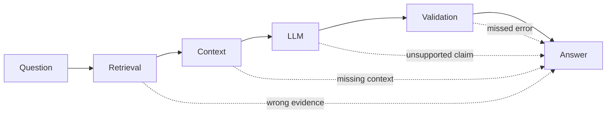

# LLM Hallucination

## 1. What Is LLM Hallucination?

LLM Hallucination occurs when a Large Language Model (LLM) produces output that:

- Is unsupported, incorrect, fabricated, or inconsistent with the relevant source/context
- May still sound fluent and confident  

**Key point:** language models generate from learned token distributions; the generation objective does not itself verify claims against an authoritative source.  

**Simple Definition:**  
> Hallucination = "Fluent but wrong output"

---

## 2️. Why Do LLMs Hallucinate?

### Core Reasons:

1. **No real-time knowledge** (unless connected to tools)  
2. **Gaps in training data**  
3. **Ambiguous or vague prompts**  
4. **Objective mismatch** — fluent completion is not the same objective as factual verification  
5. **Long reasoning chains → errors compound**  
6. **Out-of-domain questions**  

 **Insight:** probabilistic generation can produce useful knowledge-like behavior, but factuality must be evaluated and grounded when correctness matters.

---

## 3️. Hallucination Examples

### 3.1 Example 1: Factual Hallucination
**Prompt:**  
Who invented Python programming language in 1985?


**Hallucinated LLM Answer:**  
Python was invented by Dennis Ritchie in 1985.


**Correct Answer:**  
Guido van Rossum (1991)

> Model mixed C language history with Python.

---

### 3.2 Example 2: Fabricated Source
**Prompt:**  
Give me a research paper proving XYZ theory.


**Hallucinated Answer:**  
According to "Smith et al., 2019, Journal of AI Advances"...


> Paper does not exist.

---

### 3.3 Example 3: Reasoning Hallucination
**Prompt:**  
If all bloops are razzles and some razzles are zinks, are all bloops zinks?


**LLM Answer:**  
Yes.


** Correct Answer:**  
Not necessarily


> Logical error in reasoning.

---

## 4️. Types of Hallucinations

| Type | Description |
|------|------------|
| Factual | Wrong facts, dates, names |
| Logical | Invalid reasoning |
| Fabricated | Made-up sources, APIs, citations |
| Contextual | Ignores provided context |
| Overgeneralization | Applies rules where they don’t fit |


**Factual Hallucination**

- Incorrect statements about real-world facts
- E.g., wrong dates, names, or statistics

**Intrinsic Hallucination**

- Contradictions within model output
- E.g., “The cat is blue. Later, it’s green.”

**Extrinsic Hallucination**

- Makes up external knowledge
- E.g., fake references, fake events, imaginary companies
---

## 5️. Hallucination Mitigation (Most Important Part)

###  1. Prompt Engineering (First Line of Defense)
- **Bad Prompt:** `Explain quantum computing.`  
- **Better Prompt:** `Explain quantum computing using only well-established principles. If unsure, say "I don’t know".`  

 Encourages uncertainty instead of confident guessing.

---

###  2. Retrieval-Augmented Generation (RAG)
- **Idea:** Retrieve facts from trusted documents instead of relying solely on memory.  
- **Flow:**
User Question
↓
Retrieve relevant docs (DB / PDFs / Wiki)
↓
LLM answers ONLY from retrieved info


**Example Prompt:**  
Answer using only the provided document. If the answer is not present, say 'Not found'.


> RAG can reduce unsupported answers when retrieval finds authoritative evidence and the model uses it correctly; it does not eliminate hallucination.

---

###  3. Grounding & Citations
- Force the model to show evidence  
- **Prompt pattern:**  
Answer and cite the sentence from the source used. If not available, say "Cannot answer".


---

###  4. Tool Use & Function Calling
- Let LLM ask tools instead of guessing.  
- **Examples:**  
  - Calculator → math  
  - Database → customer info  
  - Search → current facts  

---

###  5. Temperature Control
- Higher temperature increases sampling diversity.
- Lower temperature can improve repeatability for some tasks.
- **Temperature is not a factuality or safety control**: a deterministic model can repeatedly produce the same wrong answer.

---

###  6. Output Validation & Guardrails
- Post-checks to catch hallucinations:  
  - Fact-checkers  
  - Regex rules  
  - Schema validation  
  - Second LLM for verification  

**Example:**  
LLM A answers → LLM B verifies


---

###  7. Fine-Tuning (Limited Use)
- Helps style & domain consistency  
- Does **NOT** guarantee factual correctness without RAG

---

## 6️. Example

###  Without Mitigation (Chatbot)
**User:**  
What is my company’s leave policy?


**LLM Answer:**  
Employees get 25 paid leaves annually.

> Completely fabricated

---

###  With RAG
**LLM retrieves HR policy PDF and answers:**  
According to HR Policy v3.2, employees receive 18 paid leaves annually.

If that retrieved source is current and authoritative, the answer is grounded and easier to verify/audit. The system should still preserve provenance and evaluate retrieval correctness.

---

## 7️. Golden Rule to Remember 
> LLMs are great speakers, not great truth-tellers.  
> Truth comes from data + constraints + verification.

---

## 8️. Summary

- **Hallucination** = confident but wrong output  
- Happens because LLMs **predict**, not **know**  
- Mitigation depends on failure type:
  - authoritative retrieval/RAG
  - grounding and provenance
  - tools for current/structured facts
  - deterministic validation where possible
  - claim/evidence verification
  - calibrated abstention
  - evaluation and monitoring


---

## 9. Hallucination Is a System Problem

The final answer can become unsupported at several layers:



Do not diagnose every wrong answer as "the model hallucinated."

Possible root causes include:

- retrieval miss,
- stale source,
- parsing error,
- incorrect tool result,
- prompt ambiguity,
- model generation,
- citation mapping bug.

---

## 10. Groundedness vs Factual Correctness

These are different.

### Groundedness

Does the answer follow the provided evidence?

### Factual correctness

Is the claim actually true in the real world/domain?

A model can faithfully summarize an outdated document and be grounded but factually stale.

This is why source quality and freshness matter.

---

## 11. Citation Hallucination

A model can invent:

- paper titles,
- URLs,
- document IDs,
- page numbers.

Safer architecture:

```text
Retriever assigns real source IDs
       ↓
Model receives evidence + IDs
       ↓
Answer references only supplied IDs
       ↓
Application validates IDs
```

Do not rely on the model to create provenance from memory.

---

## 12. Structured Facts

For values such as:

- account balance,
- inventory,
- order status,
- calculation,

prefer authoritative APIs/databases/calculators rather than asking the model to recall or infer the value.

```text
LLM decides information is needed
      ↓
Trusted tool
      ↓
Structured result
      ↓
LLM explains result
```

---

## 13. Abstention

A reliable system needs a valid "insufficient evidence" outcome.

Examples:

```text
The available documents do not specify this.
I could not verify this claim from the approved sources.
More information is required.
```

Measure whether the system abstains **when it should**, not simply whether it always answers.

---

## 14. Evaluation

Create test cases covering:

- answerable questions,
- unanswerable questions,
- stale/conflicting evidence,
- fabricated citation traps,
- ambiguous prompts,
- current-information requests,
- adversarial retrieved content.

Metrics can include:

- factual correctness,
- groundedness,
- citation accuracy,
- retrieval recall,
- abstention precision/recall,
- unsupported-claim rate.

---

## 15. Key Takeaways

- Hallucination is unsupported or incorrect generation, not merely confident wording.
- Next-token generation is not a truth-verification mechanism.
- RAG reduces some failures but can itself retrieve wrong/stale evidence.
- Groundedness and real-world factual correctness are different.
- Citations need application-managed provenance.
- Tools are preferable for authoritative structured/current values.
- Lower temperature can improve repeatability but does not guarantee truth or safety.
- Abstention is an important valid outcome.
- Diagnose the whole pipeline before blaming the model.

---

## Continue Learning

1. [Large Language Models](Large%20Language%20Models%20%28LLM%29.md)
2. [Prompt Engineering](Prompt%20Engineering.md)
3. **LLM Hallucination — this chapter**
4. [RAG](RAG.md)
5. [Production RAG System Design](../04-system-design/production-rag.md)
6. [Agentic RAG](../02-agentic-ai/advanced/agentic-rag.md)
