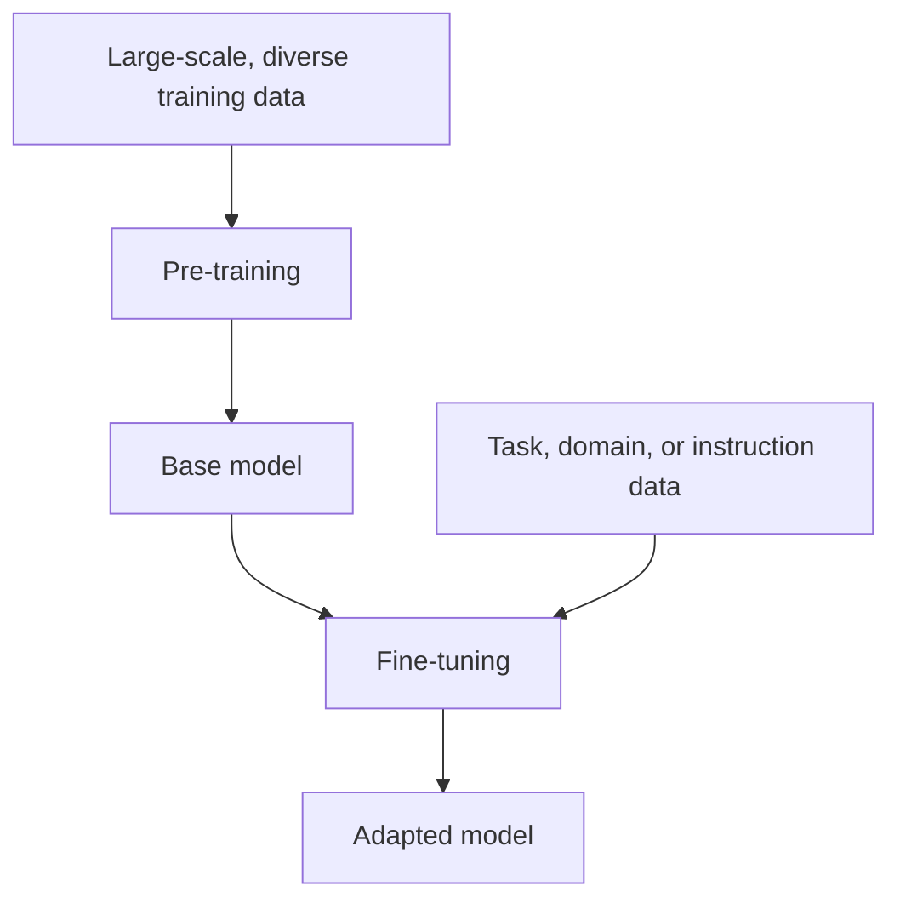
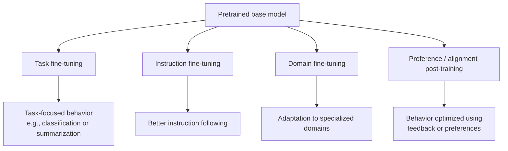

# Pre-training vs Fine-tuning

A useful first approximation is:

**Pre-training learns broad representations and capabilities from large-scale data.**  
**Fine-tuning adapts a pretrained model toward particular tasks, domains, or behaviors.**

The distinction is useful, but neither stage is limited to only "language" or only "behavior."

---




## 1. What is Pre-training?

### Definition

**Pre-training** is the first, large-scale training phase where a model learns **how language works**.

For language models, pretraining learns statistical structure from large token corpora. The resulting base model may acquire broad capabilities and knowledge-like associations, but it is not necessarily optimized for assistant-style instruction following.

---

### 1.1 What the Model Learns During Pre-training

During pre-training, the model learns:

- Grammar
- Vocabulary
- Sentence structure
- Facts (implicitly)
- Relationships between words
- Basic reasoning patterns

Many common pretraining objectives are self-supervised: targets are derived from the training data itself rather than requiring a human label for every example.

---

### 1.2 How Pre-training Works

Pre-training is the phase where a language model learns how language works by repeatedly predicting text from massive data.

### 1.2.1 Step-by-Step Flow

Huge text data (books, web, code)  
↓  
Tokenization  
↓  
Predict next token(s)  
↓  
Calculate loss  
↓  
Update weights  
↓  
Repeat billions of times

---

### 1.2.2 What’s Happening at Each Step

**Huge text data**
The model is fed massive amounts of raw text (no human-written labels).

**Tokenization**
Text is broken into tokens (words or subwords) that the model can process.

**Predict next token(s)**
Given previous tokens, the model guesses what comes next.

**Calculate loss**
The model checks how wrong its prediction was.

**Update weights**
Internal parameters are adjusted to reduce future mistakes.

**Repeat billions of times**
This loop runs over and over until the model becomes fluent in language.

---

### 1.2.3 Why This Is Called Self-Supervised Learning

The text creates its own labels.

**Example:**

**Input:**  The sun rises in the

**Target:** east

No human tells the model the answer; the next token itself is the label.

That’s why pre-training scales so well

---

### 1.3 Pre-training Example

**Training sentence:**

The capital of France is Paris.


**Model learns:**

- "capital" relates to "country"
- "France" → "Paris"

No human writes labels.  
The model learns by predicting missing or next tokens.

---

### 1.4 What Pre-training Gives You

After pre-training, the model:

- Can complete sentences
- Knows many facts
- Can generate coherent text

But it is **NOT**:

- Polite 
- Safe 
- Task-specific 
- Aligned with humans 

A pre-trained model is **powerful but raw**.

---


## 2. Pre-training Methodologies (How Models Are Trained)

There are **three main pre-training methods** you should know.


### 2.1 Masked Language Modeling (MLM)

**What it is:**  
Some words are hidden, and the model guesses them.

**Used in:** BERT-style models

**Example:**

I love [MASK] cream


Correct answer:

ice


**What the model learns:**

- Context from both left and right
- Word meanings

**Key Characteristics:**

- Looks left and right
- Excellent for understanding
- Not ideal for text generation

---

### 2.2 Next Sentence Prediction (NSP)

**What it is:**  
The model learns whether one sentence logically follows another.

**Example:**

Sentence A:
I went to the store.


Sentence B (correct):
I bought some milk.


Sentence B (wrong):
The sky is blue.


**What the model learns:**

- Sentence relationships
- Document-level coherence

**Why it matters:**

- Helps with question answering
- Helps with document understanding

---

### 2.3 Causal Language Modeling (CLM)

**MOST IMPORTANT**

**What it is:**  
The model predicts the **next token using only previous tokens**.

**Used in:** GPT, ChatGPT, LLaMA

**Example:**

I am learning


**Model predicts:**
AI


**Then:**
I am learning AI because


**Model predicts:**
it


**Key Characteristics:**

- Looks only left
- Perfect for text generation
- Powers all chat-based LLMs

**Modern LLMs = Causal Language Modeling**

---

### 2.4 MLM vs NSP vs CLM

| Method | Predicts | Looks At | Best For |
|------|---------|---------|---------|
| MLM | Missing words | Both sides | Understanding |
| NSP | Sentence order | Sentence pairs | Coherence |
| CLM | Next token | Left only | Generation |

---


## 3. How Pre-training Actually Happens

**Pre-training Flow:**

Huge text data  
↓  
Tokenization  
↓  
Choose training objective (MLM / CLM)  
↓  
Predict next token(s)  
↓  
Calculate loss  
↓  
Update model weights  
↓  
Repeat for weeks or months


Large frontier-scale pretraining can require substantial accelerator clusters, memory, time, and cost. Smaller models and continued/domain pretraining can operate at very different scales.

---

## 4. What is Fine-tuning?

###  Definition

**Fine-tuning** is additional training on **smaller, curated data** to teach the model **how to behave**.

The model already has pretrained representations. Fine-tuning updates some or all trainable parameters using a narrower objective or dataset.

---

### 4.1 How Fine-tuning Works

Fine-tuning starts **after** pre-training is complete.  
The model already understands language — now we teach it **how to behave**.


**Step 1: Start with a Pre-trained Model**

- The model already knows grammar, vocabulary, and general facts
- It can generate text but has no specific behavior or rules
- Example: It can write sentences, but may be unsafe or inconsistent


**Step 2: Prepare a Small, High-Quality Dataset**

- Data is carefully curated by humans
- Much smaller than pre-training data
- Focuses on *how the model should respond*

**Examples of fine-tuning data:**

- Question → Answer pairs  
- Instructions → Ideal responses  
- Safe vs unsafe examples  

Quality matters more than quantity here.


**Step 3: Train for Fewer Steps**

- Training runs for far fewer iterations than pre-training
- Model weights are adjusted slightly
- The model adapts instead of relearning language

This makes fine-tuning:
- Faster
- Cheaper
- More targeted


**Step 4: Behavior Improves**

After fine-tuning, the model:

- Follows instructions better
- Uses the desired tone and style
- Becomes safer and more reliable
- Performs specific tasks more accurately

Fine-tuning can improve suitability for an application, but production readiness still requires evaluation, safety controls, retrieval/tools where needed, and operational engineering.


**In Simple Terms:**

Pre-training provides broad base capabilities.  
Fine-tuning specializes or shapes those capabilities.

---

### 4.2 Fine-tuning Example

**Training data:**

Q: What is AI?


A: Artificial Intelligence is the field of making machines intelligent.


**Model learns:**

- How to answer questions
- Preferred style
- Desired tone
- Task-specific knowledge

---

## 5. Types of Fine-tuning


### 5.1 Task Fine-tuning

**Purpose:** Train for one specific task

**Examples:**

- Only summarization
- Only translation
- Only classification

---

### 5.2 Instruction Fine-tuning 

**Purpose:** Teach the model to follow instructions

**Example training data:**

Instruction: Explain gravity simply
Response: Gravity is a force that pulls objects together.


This is what makes **ChatGPT useful**.

---

### 5.3 Domain Fine-tuning

**Purpose:** Teach specialized knowledge

**Examples:**

- Legal documents
- Medical notes
- Financial reports

---

### 5.4 Preference / Alignment Post-Training

**Purpose:** Optimize behavior toward preference/safety objectives. RLHF is one family of techniques; other preference-optimization approaches also exist.

Feedback or preference data can reflect:

- Helpfulness
- Safety
- Politeness

The model learns to:

- Refuse unsafe requests
- Respond respectfully
- Follow ethical guidelines

---



*These are illustrative adaptation objectives, not a required sequence. Approaches can overlap or be combined.*


## 6. Pre-training vs Fine-tuning

| Aspect | Pre-training | Fine-tuning |
|-----|------------|-----------|
| Goal | Learn language | Learn behavior |
| Data size | Massive (TBs) | Small (MBs–GBs) |
| Cost | Extremely high | Much lower |
| Frequency | Once | Many times |
| Who does it | Big companies | Many teams |

---

## 7. Complete End-to-End Example

### Building a Medical Chatbot

**Step 1: Pre-training**

- Train on internet text
- Model learns general language

**Step 2: Domain Fine-tuning**

- Train on medical textbooks
- Learns medical terminology

**Step 3: Instruction Fine-tuning**

- Train on Q&A like:
  - "Explain diabetes to a patient"

**Step 4: Alignment**

- Ensure:
  - No harmful advice
  - Clear disclaimers

**Result:**  
A safe, helpful medical assistant.

---

## 8. (Remember This)

- **Pre-training = language intelligence**
- **Fine-tuning = usable behavior**
- Many assistant-oriented LLMs use pretraining followed by one or more post-training/adaptation stages; exact recipes differ
- ChatGPT-style models =  
  **Pre-training + Instruction tuning + Alignment**


---

## 9. Fine-Tuning vs Continued Pretraining

These are often confused.

### Continued / domain-adaptive pretraining

Continue a language-model objective on additional domain text.

Useful when the goal is adapting representations to a specialized corpus or language distribution.

### Supervised fine-tuning

Train on input → desired-output examples.

Useful when the goal is task or instruction behavior.

```text
Domain corpus
→ continued pretraining

Instruction + ideal response pairs
→ supervised fine-tuning
```

---

## 10. Fine-Tuning vs RAG

Use **RAG** when the primary problem is access to external, private, frequently changing, or source-cited knowledge.

Use **fine-tuning** when the primary problem is repeatable behavior, style, task mapping, or model adaptation.

```text
Need current company policy?
→ RAG

Need consistent classification behavior?
→ Fine-tuning may help

Need both?
→ Combine them
```

Do not fine-tune a model merely to memorize frequently changing facts.

---

## 11. Fine-Tuning Is Not Guaranteed Knowledge Preservation

Updating model parameters can create trade-offs:

- overfitting,
- capability regressions,
- catastrophic forgetting,
- unwanted style shifts.

Evaluate both the target behavior and important baseline capabilities after tuning.

---

## 12. Key Takeaways

- Pretraining learns broad representations/capabilities from large-scale data.
- Fine-tuning adapts pretrained parameters toward narrower objectives.
- Self-supervised pretraining derives learning targets from data.
- Causal and masked language modeling are different objectives for different model families.
- Continued pretraining and supervised fine-tuning solve different adaptation problems.
- Preference/alignment post-training is broader than RLHF alone.
- RAG is often better for current, private, source-backed knowledge.
- Fine-tuning does not automatically make a model safe, factual, or production-ready.

---

## Continue Learning

1. [AI Foundation Models](AI%20Foundation%20Models.md)
2. [Large Language Models](Large%20Language%20Models%20%28LLM%29.md)
3. **Pre-training vs Fine-tuning — this chapter**
4. [Fine-Tuning](Fine-Tuning.md)
5. [RAG](RAG.md)
