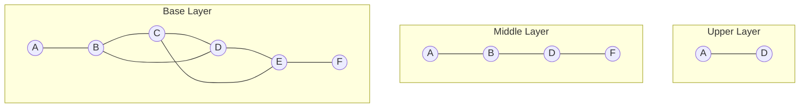
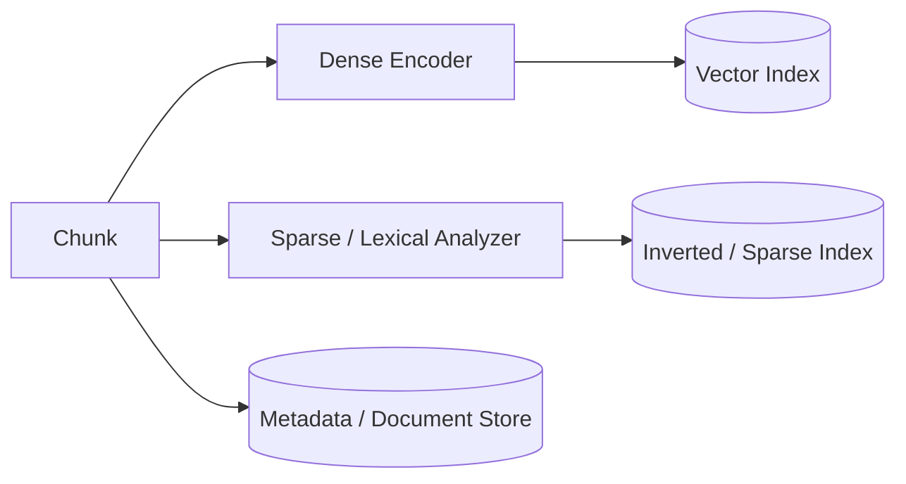
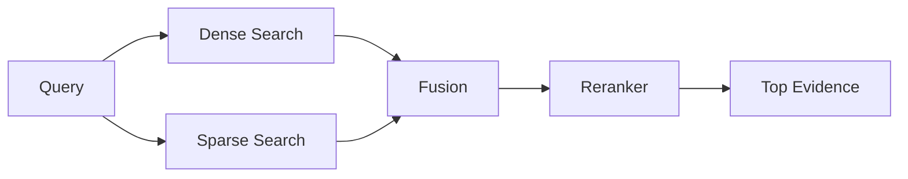

# Search & Retrieval Engineering for GenAI

Search is the evidence-selection engine underneath many RAG systems. Embeddings are one retrieval technique; a vector database is one possible piece of the search architecture.

> **Production retrieval is usually a ranking problem over multiple signals—not simply nearest-vector lookup.**

This chapter connects embeddings to information retrieval: k-NN, ANN, HNSW, lexical and sparse retrieval, BM25, learned sparse methods such as SPLADE, hybrid search, RRF, reranking, filtering, evaluation, and production trade-offs.

## 1. Where This Chapter Fits

Embeddings & Vector Databases → Search & Retrieval Engineering → RAG → Production RAG.

[Embeddings & Vector Databases](Embeddings%20%26%20Vector%20Databases.md) explains representations and vector stores. This chapter explains how retrieval engines find and rank evidence. [RAG](RAG.md) explains how evidence becomes model context.

## 2. Retrieval Is Not Generation

A retriever finds evidence; a generator produces an answer from selected evidence. Poor retrieval creates an evidence bottleneck a stronger LLM cannot reliably repair.


## 3. Core Search Vocabulary

- **document** — source object.
- **chunk** — retrievable unit.
- **embedding** — learned dense representation.
- **index** — data structure optimized for lookup.
- **retriever** — component that queries indexes.
- **ranker** — assigns or combines relevance ordering.
- **reranker** — stronger ranking stage over candidates.
- **vector database** — operational data system with vector search as a first-class capability.

An index is a data structure. A database is a larger data-management system.

## 4. Vector Index vs Vector Database

A vector index accelerates nearest-neighbor lookup. Index families include graph, inverted-file, tree/partition, and quantization approaches.

A vector database may additionally provide persistence, CRUD, metadata, filtering, replication, sharding, durability, backup, and operational features.

A database can contain one or more indexes. Relational/search databases can also provide vector indexes, so vector search does not require a dedicated vector database.

## 5. Dense Vectors

Dense embeddings usually contain a value in most dimensions:

```text
[0.12, -0.43, 0.08, 0.71, ...]
```

They are learned representations useful for semantic similarity and paraphrases. Potential weaknesses include exact identifiers, rare names, numbers, domain vocabulary, and explainability.

## 6. Sparse Vectors

A sparse vector has a large possible dimension space but relatively few non-zero values.

```text
term space = [vacation, leave, policy, engine, invoice, ...]
query      = [0.0,      1.8,   0.9,    0.0,    0.0, ...]
```

Traditional term search can be viewed through sparse representations. Learned sparse models can also assign vocabulary weights.

## 7. How Sparse Representations Are Generated

**Statistical sparse representations** derive weights from lexical occurrences and corpus statistics, as in TF-IDF/BM25-style retrieval.

**Learned sparse representations** use a neural model to predict sparse term weights and potentially expansion terms. SPLADE is a prominent example.

## 8. Converting Text Into Search Representations

Dense: text → embedding model → dense vector → dense index.

Sparse lexical: text → analyzer/tokenizer → terms/statistics → inverted index.

Learned sparse: text → sparse encoder → weighted vocabulary dimensions → sparse index.

Hybrid systems can maintain multiple representations for the same item.

## 9. Distance and Similarity

Common dense scoring choices are cosine similarity, dot product/inner product, and Euclidean distance. The right metric depends on the embedding model and normalization.

### Cosine similarity

```text
cosine(a,b) = (a · b) / (||a|| ||b||)
```

It compares direction. With unit-normalized vectors, cosine and dot-product rankings are closely related.

### Dot product

```text
a · b = Σ a_i b_i
```

Magnitude matters unless vectors are normalized.

### Euclidean distance

```text
L2(a,b) = sqrt(Σ (a_i - b_i)^2)
```

Smaller distance means closer vectors. Follow the embedding model's assumptions and validate empirically.

## 10. From Distance to Search

Given query vector q:

1. score candidates,
2. rank candidates,
3. return top k.

At small scale, comparing with every vector can be feasible. At larger scale or QPS, exhaustive comparison becomes expensive.

## 11. k-Nearest Neighbors (k-NN)

Exact k-NN finds the true k nearest stored vectors under the selected metric. Brute-force search examines all vectors.

For N vectors of dimension d, exhaustive comparison is roughly proportional to N × d work per query.

Exact search provides strong recall but can be expensive at scale.

## 12. Approximate Nearest Neighbor (ANN)

ANN trades guaranteed exactness for speed/resource efficiency. Instead of scoring every vector, it explores promising candidates.

```text
higher recall ↔ more search work ↔ more latency/compute
```

Approximate describes the search algorithm, not embedding quality.

## 13. ANN Recall

ANN indexes are often compared with exact nearest neighbors.

```text
ANN Recall@K =
exact top-K neighbors found by ANN
----------------------------------
K
```

A fast index that misses important neighbors can reduce downstream RAG quality.

## 14. ANN Index Families

Common families include graph-based indexes such as HNSW, inverted-file approaches, product quantization/compression, and partition/tree approaches.

This chapter focuses on HNSW because it demonstrates ANN quality/latency trade-offs clearly.

## 15. HNSW

**HNSW = Hierarchical Navigable Small World.**

It builds a multi-layer proximity graph.

```text
upper layers → sparse long-range navigation
lower layers → denser local neighborhood search
```

Search starts high, moves toward promising nodes, descends, and explores more candidates near the query.

## 16. HNSW Structure



The real graph is determined by vector geometry and construction rules.

## 17. How HNSW Search Works

Simplified:

1. enter at the highest layer,
2. move to a neighbor closer to the query,
3. repeat until no local improvement is found,
4. descend,
5. explore a broader candidate set at the base,
6. return the best k.

This avoids scanning the whole collection.

## 18. HNSW Parameters

**M** controls graph connectivity approximately; exact semantics vary by implementation. Higher M often improves recall but increases memory and construction work.

**efConstruction** controls construction-time search effort. Higher values can improve graph quality but make indexing more expensive.

**efSearch** (or an equivalent query-time breadth) generally improves recall when increased, at the cost of latency/compute.

These are trade-off knobs, not magic constants.

## 19. HNSW Trade-Offs

Advantages include strong recall/latency for many workloads and practical online search. Costs include graph memory, construction work, parameter tuning, filtering interactions, and operational complexity.

No ANN index is universally optimal.

## 20. Quantization

Quantization compresses vector representations to reduce memory/storage and sometimes accelerate operations.

```text
less memory / faster operations
↔
representation approximation / possible recall loss
```

Evaluate retrieval quality, not compression ratio alone.

## 21. Metadata Filtering + ANN

Real retrieval often means nearest vectors constrained by tenant, authorization, department, language, time, or other metadata.

Pre-filtering, integrated filtering, and post-filtering have different recall/latency/security implications. Authorization should not rely on retrieving forbidden data and removing it later.

## 22. Lexical Search

Lexical search excels at exact identifiers, names, error codes, SKUs, rare terminology, and exact phrases. Modern lexical retrieval is much more sophisticated than naive string matching.

## 23. The Inverted Index

An inverted index maps terms to documents/chunks containing them.

```text
vacation → [doc2, doc9, doc21]
policy   → [doc1, doc2, doc7, doc21]
engine   → [doc5, doc13]
```

A posting can include document ID, term frequency, positions, and field information.

## 24. Why Naive Term Matching Is Not Enough

If every term contributed equally, common words could dominate, repetition could overwhelm relevance, and long documents could be unfairly favored. Information retrieval therefore uses statistical ranking.

## 25. TF-IDF Intuition

**Term frequency (TF)** captures how much a term occurs in a document. **Inverse document frequency (IDF)** gives rarer corpus terms more discriminative weight.

A rare error code should usually matter more than a ubiquitous word.

## 26. BM25

BM25 is a widely used lexical ranking function. It combines term match, diminishing returns for repeated frequency, IDF, and document-length normalization.

Simplified:

```text
score(D,Q) =
Σ IDF(q) ×
  [ f(q,D) × (k1 + 1) ]
  ----------------------
  [ f(q,D) + k1 × (1 - b + b × |D|/avgdl) ]
```

Exact implementations vary.

**k1** controls term-frequency saturation. **b** controls document-length normalization. Defaults are useful baselines; tune when evaluation demonstrates a need.

## 27. Evolution of Lexical Search

```text
boolean/exact matching
→ statistical weighting
→ TF-IDF
→ BM25-style ranking
→ learned sparse / expansion
→ hybrid + learned reranking
```

Newer methods do not make lexical search obsolete.

## 28. Lexical Expansion

Expansion adds related terms to reduce vocabulary mismatch.

```text
query: vacation rules
possible expansion: vacation, leave, policy, time-off
```

Expansion may use curated synonyms, rewriting, or learned models. Excessive expansion can reduce precision.

## 29. Learned Sparse Retrieval

Learned sparse methods preserve vocabulary-aligned sparse representations while using neural models to learn term weights and expansion. They combine some neural generalization with sparse retrieval infrastructure.

## 30. SPLADE

**SPLADE** is a learned sparse retrieval family that produces sparse vocabulary-weight vectors.

Conceptually:

```text
vacation policy
→ vacation: 2.1
→ policy: 1.7
→ leave: 1.2
→ employee: 0.4
→ most dimensions: 0
```

Potential benefits include learned weighting/expansion and vocabulary-aligned interpretability. Trade-offs include encoder cost, sparse index size, domain sensitivity, and operational complexity.

## 31. Dense vs Sparse Retrieval

| Property | Dense | Sparse / lexical |
|---|---|---|
| Representation | learned continuous vector | term/vocabulary dimensions |
| Semantic paraphrase | strong | traditional lexical weaker; learned sparse improves |
| Exact rare tokens | can be weak | strong |
| Explainability | lower | often higher |
| Index | ANN/vector | inverted/sparse |
| Typical strength | meaning | exact terminology |

Neither wins universally.

## 32. Dense Index vs Sparse Index

A dense index organizes continuous vectors for nearest-neighbor search. A sparse/inverted index organizes term/dimension postings.

```text
chunk
├── dense embedding → vector index
└── terms/sparse vector → inverted/sparse index
```

Hybrid systems accept extra storage/indexing work for complementary signals.

## 33. Hybrid Search

Hybrid search combines retrieval methods—commonly dense semantic and sparse/lexical search.

A query may contain semantic intent plus exact identifiers. For example, dense retrieval can capture the meaning of an SSO problem while lexical retrieval protects an exact error code.

## 34. Hybrid Indexing



Representations should preserve a common chunk identity for fusion.

## 35. Hybrid Querying



Dense and sparse retrieval can run in parallel when independent.

## 36. Hybrid Search in Action

For a query such as "reset Acme ZX-410 after firmware update," dense retrieval may find device-reset and post-upgrade troubleshooting; sparse retrieval protects ZX-410, firmware, and exact commands. Fusion combines them.

## 37. Benefits and Good Use Cases

Hybrid retrieval can improve semantic coverage, exact-match recall, rare-term handling, and robustness. It often shines in enterprise corpora containing product codes, policy language, technical errors, acronyms, names, and natural-language questions.

## 38. When Hybrid May Not Be Needed

A single retriever may suffice when the corpus is narrow, one method already meets the target, latency/cost dominates, or evaluation shows little incremental benefit.

Complexity should be earned.

## 39. Hybrid Search Drawbacks

Costs include multiple indexes, storage, query compute, fusion logic, tuning, failure modes, and observability. Add it only when end-to-end quality improves enough.

## 40. The Score-Combination Problem

Dense and sparse scores can have unrelated scales:

```text
dense score: 0.83
BM25 score: 17.4
```

Raw addition is generally meaningless without calibration/normalization.

## 41. Weighted Score Fusion

One approach:

```text
final =
α × normalized_dense
+ β × normalized_sparse
```

This provides control but requires normalization and tuning. Rank-based fusion avoids direct score-scale dependence.

## 42. Reciprocal Rank Fusion (RRF)

RRF combines ranked lists using rank positions.

```text
RRF(d) = Σ 1 / (k + rank_i(d))
```

An item appearing near the top of multiple lists accumulates a stronger score.

## 43. RRF Example

Dense ranking: B, A, C. Sparse ranking: A, D, B. A and B receive contributions from both lists, so fusion can promote consensus without comparable raw scores.

## 44. RRF Smoothing Constant k

In 1/(k+rank), k controls how sharply top ranks dominate. Smaller k emphasizes top positions; larger k flattens nearby differences.

Values around 60 are commonly seen as defaults/examples, but there is no universal optimum. Treat k as configurable and evaluate it.

## 45. Why RRF Is Useful

Advantages: simple, score-scale independent, robust baseline, heterogeneous retriever support.

Limitations: ignores score magnitude, still requires candidate-depth choices, and may not be optimal for every workload.

## 46. Candidate Depth

Candidate depth differs from final top-k.

```text
dense top 50
+ sparse top 50
→ fuse
→ rerank top 30
→ context top 6
```

If each retriever returns only top 3, fusion cannot recover an item ranked fourth.

## 47. Reranking

First-stage retrieval aims for inexpensive candidate recall. Reranking applies a more expensive relevance model to a smaller set.

```text
fast retrieval
→ 50–200 candidates
→ reranker
→ 5–20 best evidence items
```

Cross-encoder-style rerankers can jointly consider query and candidate text, often improving relevance at higher cost.

## 48. Query Rewriting and Expansion

Transformations include acronym expansion, typo normalization, decomposition, alternate formulations, and metadata extraction.

Rewriting can accidentally remove exact identifiers, so preserve important terms and evaluate transformations.

## 49. Multi-Query Retrieval

Generating several query variants can improve recall, followed by retrieval and deduplication/fusion. It also multiplies cost and can introduce query drift.

## 50. Metadata-Aware Retrieval

Metadata can constrain language, time, product, region, source, tenant, and ACLs. Separate relevance filters from authorization filters conceptually. Authorization is mandatory, not a ranking preference.

## 51. Freshness and Deletes

Retrieval must account for new documents, updates, deletes, permission changes, and reindexing. Define freshness and deletion SLAs.

Excellent ranking over stale or unauthorized data is still failure.

## 52. Index Versioning

Track index, embedding model, sparse model, analyzer, chunking, and source versions. Representation changes can materially alter retrieval behavior.

## 53. Embedding Migration

Old/new embedding spaces may be incompatible.

```text
build new index
→ backfill
→ evaluate
→ shadow/canary
→ switch
→ retire old index
```

Do not mix incompatible spaces unless explicitly supported.

## 54. Retrieval Evaluation

Evaluate retrieval independently from final RAG answers.

Useful metrics include Recall@K, Precision@K, MRR, nDCG, hit rate, latency, and index/storage cost. Then measure groundedness and end-to-end task success.

## 55. Recall@K

```text
Recall@K =
relevant items retrieved in top K
-------------------------------
all relevant items
```

Candidate recall matters because reranking/generation cannot use evidence that was never retrieved.

## 56. Precision@K

```text
Precision@K =
relevant items in top K
-----------------------
K
```

High precision reduces distracting evidence, but the right balance depends on downstream reranking/context selection.

## 57. Mean Reciprocal Rank (MRR)

For each query, reciprocal rank is 1 divided by the rank of the first relevant result. MRR averages this across queries. It is useful when one correct item very high in the ranking matters.

## 58. nDCG

Normalized Discounted Cumulative Gain is useful when relevance is graded, multiple relevant results matter, and rank position matters. It rewards highly relevant results appearing earlier.

## 59. Retrieval Test Sets

A case can specify a query, relevant chunk IDs, required exact terms, and metadata filters. Include semantic paraphrases, exact IDs, acronyms, typos, multilingual cases, ambiguity, freshness, and no-answer cases.

## 60. Ablation Testing

Compare BM25-only, dense-only, learned-sparse-only, dense+BM25, dense+learned-sparse, and hybrid+reranker.

Measure relevance, p95 latency, compute, storage, and downstream answer quality. This identifies which complexity earns its place.

## 61. Retrieval Failure Taxonomy

Common failures include no relevant candidate, relevant result too low, wrong filter, stale index, unauthorized item, poor chunk boundary, embedding mismatch, analyzer mismatch, query rewrite drift, reranker regression, and duplicate chunks.

Classify failures before tuning.

## 62. Observability

Trace query → parsed filters → dense candidates → sparse candidates → fused ranking → reranked list → context-selected items.

Record IDs, ranks, scores, and versions where policy permits; avoid indiscriminate sensitive-text logging.

## 63. Latency Budget

Hybrid retrieval may include query embedding, dense ANN, sparse search, fusion, reranking, and metadata fetch. Parallelize independent retrieval, bound candidate counts, and measure p50/p95/p99.

## 64. Memory and Storage

Costs include dense vectors, ANN graph, sparse postings, metadata, replicas, source text, and caches. Vector dimensionality and HNSW connectivity can materially affect memory.

## 65. Scaling

Consider corpus size, QPS, tenants, filter selectivity, update rate, vector dimension, and candidate depth.

Sharding introduces routing/merge trade-offs. Tenant partitioning can improve isolation but reduce efficiency for tiny tenants.

## 66. Security

Enforce tenant isolation, document ACLs, source permissions, deletion, and safe filter construction during retrieval.

Do not retrieve unauthorized content into model context and attempt to redact it afterward.

## 67. Retrieval and Prompt Injection

Retrieved content is evidence, not trusted instruction. Malicious documents can contain instructions that conflict with product policy. Preserve the authority distinction between trusted system instructions and external evidence.

## 68. Practical Tool Example: Qdrant

Qdrant is one example of a vector search/database system. It can implement concepts such as vector search and payload metadata/filtering, with exact dense/sparse/hybrid capabilities depending on the current product version/configuration.

Conceptual mapping:

```text
collection   → searchable dataset
point        → item/chunk + vector(s) + payload
vector index → ANN acceleration
payload      → metadata
filter       → constrained retrieval
```

Use current official documentation for exact APIs/features.

## 69. Qdrant Data Model — Conceptual View

A point can contain an ID, one or more vector representations, and payload metadata such as document ID, tenant, and section. Real systems can use richer payloads and named/multiple vectors.

## 70. Qdrant Architectural Questions

Evaluate index configuration, metric, filtering, dense/sparse support, replication/sharding, updates/deletes, recovery, observability, multi-tenancy, and memory/storage.

Do not select a database from benchmark headlines alone.

## 71. Practical Tool Example: FastEmbed

FastEmbed is an embedding-oriented library intended to simplify generation of supported dense or sparse representations.

Libraries like this can handle model/runtime setup, tokenization/preprocessing, batching, and a convenient embedding interface.

It is an implementation tool, not a replacement for understanding representation compatibility, indexing, evaluation, or production serving. Consult current official docs for exact model/API support.

## 72. Tool Selection Principle

```text
retrieval requirement
→ algorithm/index choice
→ operational constraints
→ product/library selection
```

Do not begin with a favorite vector database and force every search problem into it.

## 73. Enterprise Hybrid Example

For a query such as "What changed in policy HR-104 for parental leave?", run dense and BM25 retrieval, fuse candidates, rerank, then select context. Mandatory authorization filters should be enforced in each retrieval path where supported before forbidden content can flow downstream.

Dense search captures semantic discussion; BM25 protects HR-104 and exact terminology.

## 74. Support Search Example

For "ERR_AUTH_104 after Okta redirect", dense-only search may find generic SSO material. Sparse search strongly protects the error code and product name. Hybrid plus reranking can combine exact incident evidence with semantic troubleshooting.

## 75. Choosing a Retrieval Architecture

Start simple:

```text
lexical baseline
→ dense baseline
→ compare query slices
→ hybrid if complementary
→ reranker if ranking is limiting
→ transformations only when evaluated
```

Complexity should follow measured failure modes.

## 76. Production Checklist

Before shipping:

- define relevance labels/test set,
- choose representations,
- verify embedding metric/normalization,
- benchmark exact vs ANN where useful,
- tune ANN for recall/latency,
- validate filters/ACLs,
- compare lexical/dense/hybrid,
- evaluate fusion and reranking,
- measure p50/p95/p99,
- version indexes/models/analyzers,
- test updates/deletes,
- trace retrieval stages,
- test malicious retrieved content,
- measure end-to-end RAG impact.

## 77. Interview / System-Design Framework

1. characterize corpus/query types,
2. define relevance/latency targets,
3. identify exact-term vs semantic needs,
4. choose sparse/dense representations,
5. choose exact vs ANN,
6. discuss HNSW/index trade-offs,
7. design metadata/authorization filtering,
8. add hybrid fusion if justified,
9. add reranking,
10. define freshness/index lifecycle,
11. define evaluation,
12. discuss scaling, observability, security, and cost.

## 78. Key Takeaways

- Vector search is one retrieval technique, not the whole stack.
- Dense and sparse search provide complementary signals.
- Exact k-NN and ANN make different quality/latency trade-offs.
- HNSW uses a hierarchical proximity graph to avoid exhaustive search.
- Inverted indexes and BM25 remain valuable for exact lexical evidence.
- Learned sparse methods such as SPLADE combine sparse structure with learned weighting/expansion.
- Hybrid search needs deliberate fusion; raw dense and sparse scores are not automatically comparable.
- RRF is a strong rank-based baseline; reranking gives a stronger later-stage relevance decision.
- Retrieval should be evaluated independently from generation.
- Authorization, freshness, latency, and index lifecycle are production retrieval concerns.

## Continue Learning

- [Embeddings & Vector Databases](Embeddings%20%26%20Vector%20Databases.md)
- [Retrieval-Augmented Generation (RAG)](RAG.md)
- [Production RAG System Design](../04-system-design/production-rag.md)
- [Evaluation & Observability](../03-production-ai/evaluation-and-observability.md)
- [Performance, Latency & Cost](../03-production-ai/performance-latency-and-cost.md)
