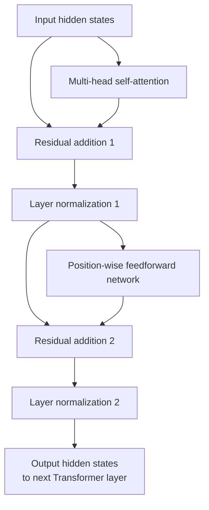
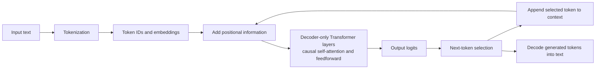

# Transformers

## 1. What is a Transformer?

**Definition:**  
A Transformer is a neural-network architecture built around attention mechanisms and position-aware representations. Transformer variants underpin most contemporary LLMs and are also used in vision, audio, and multimodal systems.

---

## 2. Why Do We Need Transformers?

**Problem with Older Models **  

Older models like **RNNs and LSTMs**:

* Process recurrent state sequentially, which limits training parallelism
* Can struggle to preserve information across long dependencies
* Become harder to scale efficiently to very long sequences

**Transformers Solve This **  

* During training, process many token positions in parallel
* Use attention to dynamically combine information from relevant token positions  

**Key Idea:** Attention computes data-dependent relationships between token representations. The human "focus" analogy is useful, but attention weights should not be treated as a literal model explanation.

---

## 3. Key Concepts in Transformers

### 3.1 Tokens & Embeddings

* **Tokens:** Text is converted into model-specific token IDs
* **Embeddings:** Each token ID is mapped to a learned vector representation  

**Example:**  
Sentence: "AI is amazing"  
Tokens: ["AI", "is", "amazing"]  
Embedding (simplified vector):  
AI → [0.2, 0.8, 0.5]
is → [0.1, 0.3, 0.7]
amazing → [0.9, 0.4, 0.2]


---

### 3.2 What is Attention?

**Definition (1 line):**  
Attention lets each token representation combine information from other token positions using learned, context-dependent weights.

**Human Analogy **  
Sentence:  
"The trophy didn’t fit in the suitcase because it was too big."  

**Question:** What was too big?  

* Trophy   
* Suitcase  

**That focus = attention**

---

### 3.3 Self-Attention (Core Concept)

* **“Self”** means each word looks at other words **in the same sentence** to understand its meaning.  

**Example:**  
Sentence: "I love playing cricket because it is fun."  
* Word "it" asks: Does "it" refer to cricket or playing?  
* Self-attention links: **it → cricket**

---

### 3.4 How Attention Works (No Math)

Each word:

1. Looks at all other words in the sentence  
2. Assigns **importance weights**  
3. Builds a better **contextual understanding**  

**Visual Idea (simplified):**  
it
↑
cricket ← high attention
playing ← low attention


---

### 3.5 Why Attention Is Powerful

Attention supports:

* modeling long-range token relationships
* contextual representations
* parallel processing across positions during training
* scalable sequence modeling  

**Result:** Transformers **scale efficiently** to large models.

---

### 3.6 Transformer = Attention + Structure

* A Transformer is made of **stacked layers**.  
* Each layer has:
  1. **Self-Attention** → Understand relationships  
  2. **Feedforward Network** → Process information  
  3. **Residual Connections** → Keep information stable  

**Note:** You don’t need internals yet—just remember the **flow**.

---

## 4. Encoder vs Decoder (Simple)

### 4.1 Encoder (Understanding)

* Reads input and builds meaning  
* Example: Translation, Document understanding  

### 4.2 Decoder (Generating)

* Produces output **one token at a time**  
* Example: ChatGPT responses, Text generation  

**ChatGPT-style models:** Mainly **decoder-only transformers**

---

## 5. Transformer Architecture Overview

**Simplified Architecture:**

Input Tokens → Embeddings → Positional Encoding → [Encoder / Decoder Layers] → Output Tokens


**Variants:**

* **Encoder-only**: BERT → understanding tasks  
* **Decoder-only**: GPT → text generation  
* **Encoder-decoder**: T5, BART → translation, summarization  

---

### 5.1 Layer Stack Details

Each layer consists of:

1. **Multi-head self-attention**  
2. **Add & Norm** (residual + layer normalization)  
3. **Feedforward network**  
4. **Add & Norm**  



*This illustrates a post-normalization Transformer block, consistent with the Add & Norm sequence above. Some modern architectures use pre-normalization instead.*

---

### 5.2 Token Flow Through a Transformer

1. Input sentence → tokenized → embeddings  
2. Add positional encodings  
3. Pass through multiple layers:
   * Self-attention computes relationships  
   * Feedforward layers process features  
   * Residual connections stabilize training  
4. Final output → logits → probabilities → predicted token  
5. Tokens decoded → text  

**Example:**  
Input: "Hello, how are you?"
Tokens: ["Hello", ",", "how", "are", "you", "?"]
Model predicts next token: "doing"
Output: "Hello, how are you doing?"



*This illustrates autoregressive generation with a decoder-only Transformer. The selected token is appended to the context before the next prediction; encoder-only and encoder-decoder Transformers have different processing flows.*

---

## 6. Advantages of Transformers

* Handle **long-range dependencies**  
* Support **parallel computation** → faster training  
* Scale to **very large datasets**  
* Enable **transfer learning** → pre-trained models adapted to new tasks  
* Robust to **variable-length input**  

---

## 7. Limitations

* Require **large amounts of data** for training  
* Computationally **expensive** (GPUs/TPUs)  
* Can be **memory-intensive** for long sequences  
* May **hallucinate or misinterpret** if context is missing  
* Complexity makes **debugging and interpreting** harder  

---

## 8. Real-World Applications

* **LLMs (GPT, Claude, LLaMA, Gemini)** → text generation, chatbots  
* **BERT** → search engines, embeddings, semantic understanding  
* **T5** → translation, summarization, question answering  
* **Vision Transformers (ViT)** → image recognition  

---

## 9. One End-to-End Example

**Input:** "She gave her dog food."  

**Ambiguity:** Did she give **food to dog** or **give her dog as food**?   

**Attention resolves:** "dog" strongly attends to "food" → meaning becomes clear

---

## 10. Why Transformers Changed Everything 

Because they:

* Handle long context  
* Scale to billions of parameters  
* Learn complex patterns  
* Power LLMs, vision models, multimodal AI  

**Conclusion:** Transformer architectures dominate contemporary LLMs, although research also explores alternative and hybrid sequence-model architectures.


----
----


---

## 11. Query, Key, and Value Intuition

Self-attention transforms each token representation into three learned views:

```text
Token representation
   ├── Query (Q)  → what information am I looking for?
   ├── Key (K)    → what information do I contain?
   └── Value (V)  → what information can I contribute?
```

For each query, the model compares it with keys, converts those scores into weights, and combines the corresponding values.

A simplified formula is:

```text
Attention(Q, K, V) = softmax(QKᵀ / √d) V
```

This is the computational mechanism behind the earlier "focus" analogy.

---

## 12. Multi-Head Attention

Instead of computing one attention pattern, Transformers use multiple attention heads.

```text
Input
 ├─ Head 1
 ├─ Head 2
 ├─ Head 3
 └─ ...
      ↓
Combine
```

Different heads can learn different interaction patterns. They should not be assumed to map cleanly to human concepts such as "grammar head" or "reasoning head."

---

## 13. Positional Information

Attention alone does not inherently encode token order.

Transformers therefore incorporate position information through approaches such as learned positional embeddings or relative/rotary position methods.

Compare:

```text
dog bites man
man bites dog
```

The tokens are similar, but order changes the meaning.

---

## 14. Causal Attention in Generative LLMs

Decoder-style language models use a causal mask during next-token prediction.

```text
Token 1 → can attend to earlier/current permitted positions
Token 2 → cannot use future token 3
...
```

During generation:

```text
Prompt
 ↓
Predict next token
 ↓
Append token
 ↓
Predict next token
 ↓
Repeat
```

Training can process token positions in parallel under the causal mask; autoregressive generation itself remains sequential across newly generated tokens.

---

## 15. Why Attention Becomes Expensive

Standard self-attention compares token positions with one another.

For sequence length `n`, the attention score matrix grows roughly with `n²`.

This contributes to:

- memory pressure,
- long-context compute cost,
- inference latency.

Modern systems use optimized kernels, caching, grouped/multi-query attention variants, sparse/local patterns, and other techniques to reduce practical cost.

---

## 16. KV Cache at Inference

During autoregressive generation, recomputing all prior key/value representations at every token would be wasteful.

A **KV cache** stores reusable attention state from previous tokens.

```text
Previous tokens → cached K/V
New token       → compute new K/V
                     ↓
              attention over cache
```

KV caching greatly improves generation efficiency but consumes memory that grows with sequence length and model architecture.

---

## 17. Transformer Is Architecture, Not the Entire LLM

A deployed LLM involves more than Transformer blocks:

```text
Tokenizer
 ↓
Token Embeddings
 ↓
Transformer Layers
 ↓
Output Projection / Logits
 ↓
Sampling / Decoding
 ↓
Generated Tokens
```

Training data, objective, post-training, inference configuration, and application architecture also strongly influence behavior.

---

## 18. Key Takeaways

- Transformers are neural architectures centered on attention and position-aware sequence representations.
- Self-attention dynamically mixes information across token positions.
- Query, key, and value projections implement attention computationally.
- Multi-head attention provides multiple learned interaction channels.
- Decoder LLMs use causal attention for next-token prediction.
- Training can parallelize positions; autoregressive generation still produces new tokens sequentially.
- Standard attention becomes expensive as sequence length grows.
- KV caching reduces repeated inference computation at the cost of memory.
- Transformer architecture is only one layer of the complete LLM/application stack.

---

## Continue Learning

1. [Tokenization](Tokenization.md)
2. **Transformers — this chapter**
3. [Large Language Models](Large%20Language%20Models%20%28LLM%29.md)
4. [Inference in LLM](Inference%20in%20LLM.md)
5. [Embeddings & Vector Databases](Embeddings%20%26%20Vector%20Databases.md)
