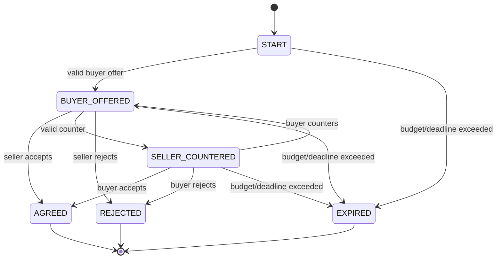
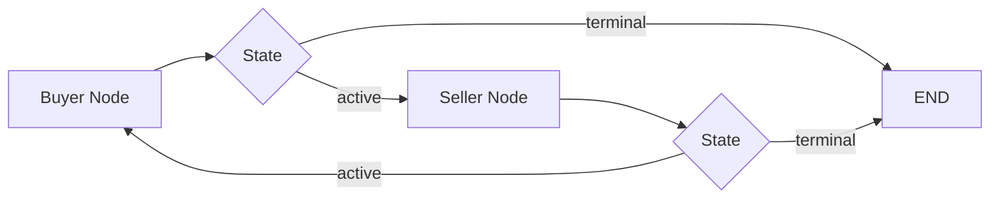
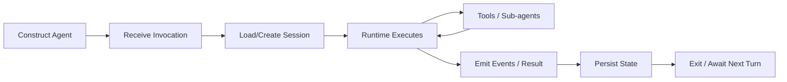
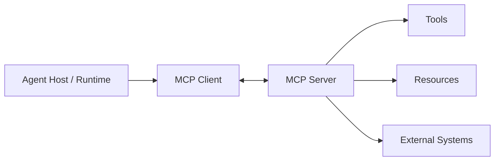
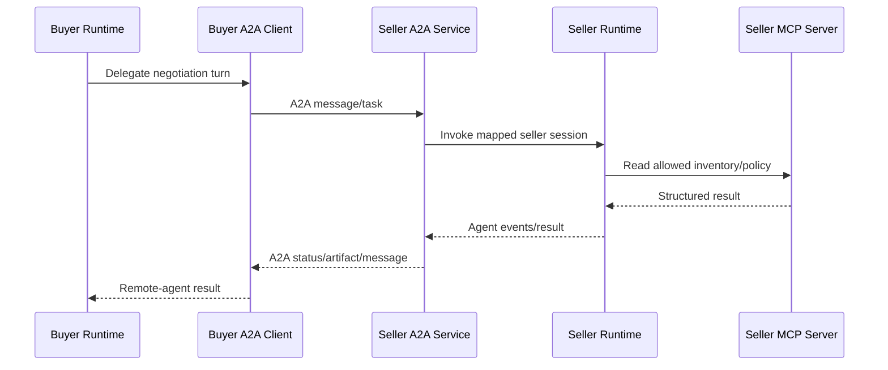
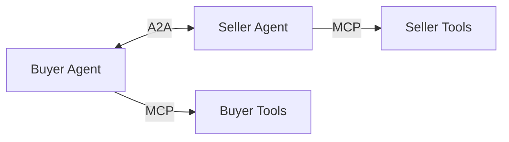
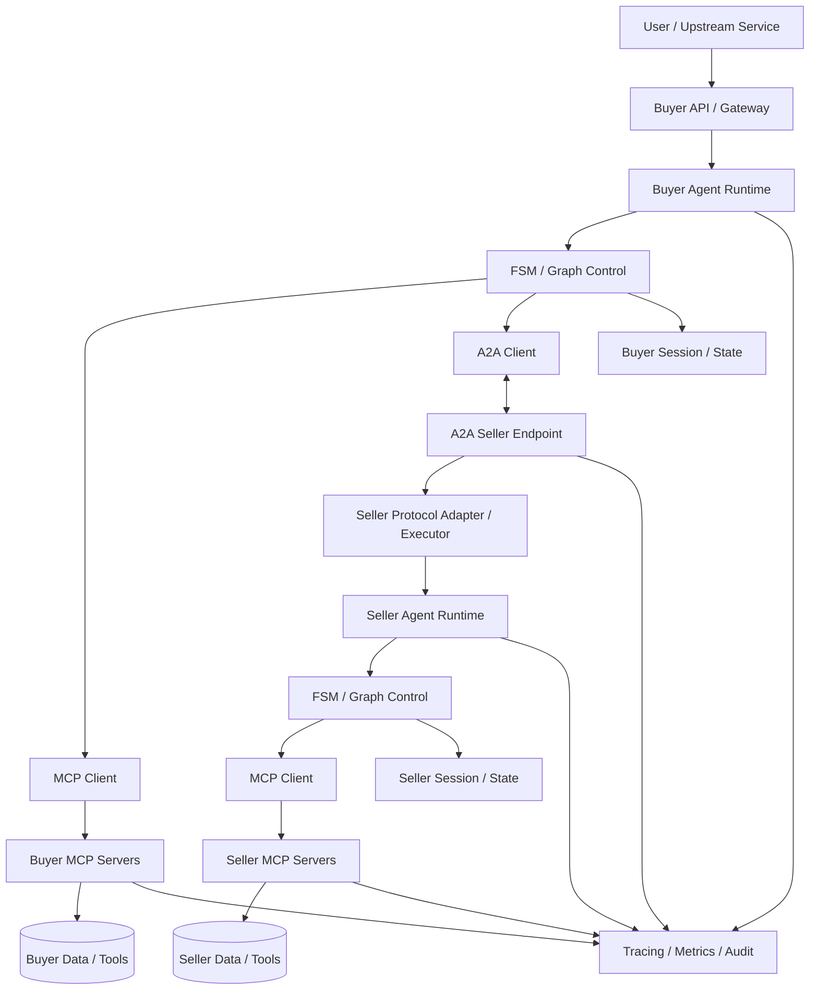

# Agent Runtime, State Machines & Communication Protocols

Production agents need more than an LLM in a loop. They need explicit control flow, bounded execution, durable state, safe tool boundaries, and clear contracts when independently deployed agents communicate.

This chapter develops one system progressively:

```text
naive loop
→ explicit state machine
→ graph orchestration
→ agent runtime
→ MCP tool boundary
→ A2A agent boundary
→ production architecture
```

It complements the dedicated [MCP](../fundamentals/MCP%20%28Model%20Context%20Protocol%29.md) and [A2A](../fundamentals/A2A%20Protocol.md) chapters. Those own protocol fundamentals; this chapter focuses on how the pieces fit into an implementation.

> **Keep the layers separate:** FSM is a control pattern. LangGraph is an orchestration framework. Google ADK is an agent development/runtime framework. MCP is an agent-to-capability protocol. A2A is an agent-to-agent interoperability protocol.

Framework APIs evolve. Treat code below as architectural skeletons and verify exact APIs against current official documentation.

---

## 1. Running Example: Buyer–Seller Negotiation

We use a negotiation because it exposes agent-loop problems clearly.

Buyer objective:

```text
purchase item
budget ceiling = 100
preferred price = 80
```

Seller objective:

```text
sell item
minimum acceptable price = 85
preferred price = 110
```

Possible outcomes:

- agreement,
- buyer walks away,
- seller rejects,
- timeout / maximum turns,
- invalid protocol message,
- policy violation.

A production system must guarantee that every run eventually reaches a terminal outcome.

---

## 2. Baseline: The Naive Agent Loop

A tempting implementation is:

```python
while True:
    buyer_message = buyer_agent(seller_message)
    seller_message = seller_agent(buyer_message)

    if "deal" in seller_message.lower():
        break
```

It is easy to demo and dangerous to treat as an architecture.

---

## 3. Ten Failure Modes in Naive Agent Systems

### 1. Infinite loops
Neither model emits the expected stop phrase.

### 2. Ambiguous termination
"Sounds like a deal might work" accidentally matches naive string logic.

### 3. Invalid state transitions
An agent accepts before an offer exists.

### 4. Unvalidated actions
A buyer offers above its budget.

### 5. Hidden business rules
Limits exist only inside prompts.

### 6. Unstructured messages
Application code parses free-form prose to infer critical actions.

### 7. Duplicate side effects
A retry executes the same purchase twice.

### 8. State drift
Buyer, seller, and coordinator disagree about the latest offer.

### 9. No execution budget
Turns, tokens, latency, and tool calls grow without bound.

### 10. Weak observability
Logs show text but not state transitions, decisions, invariants, or termination reason.

The common problem is **implicit control**.

---

## 4. Why Prompt Instructions Are Not Control Flow

A prompt can say:

```text
Never exceed $100.
Stop after 8 turns.
Only accept a valid offer.
```

Those instructions are useful model context, but business invariants should also be enforced by trusted application code.

```text
model proposes
      ↓
trusted controller validates
      ↓
state transition commits
```

The LLM should not be the sole authority over workflow validity.

---

## 5. Finite State Machine: The First Fix

A finite state machine (FSM) makes legal states and transitions explicit.

Example states:

```python
from enum import Enum

class NegotiationState(str, Enum):
    START = "start"
    BUYER_OFFERED = "buyer_offered"
    SELLER_COUNTERED = "seller_countered"
    AGREED = "agreed"
    REJECTED = "rejected"
    EXPIRED = "expired"
```

Terminal states:

```text
AGREED
REJECTED
EXPIRED
```

---

## 6. State Transition Model



The diagram is now executable policy, not merely documentation.

---

## 7. Structured Negotiation Messages

Do not infer protocol actions from prose.

```python
from typing import Literal, TypedDict

class NegotiationMessage(TypedDict):
    sender: Literal["buyer", "seller"]
    action: Literal["offer", "counter", "accept", "reject"]
    amount: float | None
    explanation: str
```

The explanation is for humans/models. The action and amount drive control logic.

---

## 8. Validated Transitions

Conceptual controller:

```python
def process_turn(state, message, policy):
    validate_schema(message)
    validate_sender_for_state(state.status, message["sender"])
    validate_action_for_state(state.status, message["action"])

    if message["amount"] is not None:
        validate_price(message["amount"])

    enforce_budget(policy, message)
    enforce_turn_limit(state, policy)

    next_state = transition(state, message)
    assert_invariants(next_state, policy)
    return next_state
```

Validation occurs before state is committed.

---

## 9. Important Invariants

Examples:

```text
buyer_offer <= buyer_budget
seller_acceptance requires an outstanding buyer offer
buyer_acceptance requires an outstanding seller counter
turn_count <= max_turns
terminal state cannot transition back to active
accepted_price must equal a valid outstanding offer
```

Invariants are stronger than "the prompt told the model not to do it."

---

## 10. Key FSM Design Decisions

### State should represent control-relevant facts
Do not put every conversation token into the enum.

### Transitions should be explicit
Avoid catch-all transitions that silently repair invalid behavior.

### Terminal states should be first-class
"Done" should not be inferred from conversational tone.

### Side effects should follow validated transitions
Do not charge a card merely because the model said "accepted."

### Persist enough state to recover
A restart should not reset a live negotiation accidentally.

---

## 11. Termination Proof

For a bounded negotiation, define a monotonically increasing turn counter:

```text
0 <= turn_count <= MAX_TURNS
```

Every active transition increments it.

If agreement/rejection does not occur first:

```text
turn_count == MAX_TURNS
→ EXPIRED
```

Therefore an execution cannot take more than MAX_TURNS active turns.

This is a simple **ranking function**: remaining turns decrease toward zero.

Real agent systems can use several bounds:

- max turns,
- deadline,
- token budget,
- tool-call budget,
- delegation depth,
- retry budget.

---

## 12. FSM Guarantees—and Limits

An FSM can guarantee:

- only modeled transitions,
- bounded execution when budgets are enforced,
- explicit terminal states,
- deterministic validation around probabilistic decisions.

It does **not** guarantee:

- good negotiation strategy,
- truthful model reasoning,
- correct external data,
- availability of dependencies,
- exactly-once side effects by itself.

Control correctness and model quality are different problems.

---

## 13. From FSM to Graph Orchestration

As workflows grow, a graph representation can make nodes, edges, branches, joins, and persisted state easier to manage.

Mental model:

```text
while True + nested if/else
             ↓
explicit graph
             ↓
nodes = work
edges = transitions
state = shared workflow data
routers = conditional control
terminal nodes = completion
```

An FSM and a workflow graph overlap conceptually, but graph frameworks often support richer dataflow, parallel branches, persistence, interrupts, and subgraphs.

---

## 14. LangGraph: Why It Matters

LangGraph is one framework for stateful graph-based agent/workflow orchestration.

The architectural value is not the brand name. It is the move from an implicit loop to an explicit stateful graph.

A conceptual negotiation state:

```python
from typing import TypedDict

class NegotiationGraphState(TypedDict):
    status: str
    turn_count: int
    latest_offer: float | None
    buyer_budget: float
    seller_floor: float
    messages: list
    termination_reason: str | None
```

---

## 15. Graph Nodes

A node performs a bounded unit of work.

```python
def buyer_node(state):
    proposal = buyer_model_decision(state)
    return validate_buyer_update(state, proposal)

def seller_node(state):
    proposal = seller_model_decision(state)
    return validate_seller_update(state, proposal)
```

Keep validation outside uncontrolled model prose.

---

## 16. Conditional Edges

Routing logic should inspect structured state:

```python
def route_after_buyer(state):
    if state["status"] in {"agreed", "rejected", "expired"}:
        return "end"
    return "seller"

def route_after_seller(state):
    if state["status"] in {"agreed", "rejected", "expired"}:
        return "end"
    return "buyer"
```

Conceptually:



---

## 17. Reducers and Concurrent State Updates

Graph systems need rules for merging updates.

For example, messages may be append-only while scalar fields use replacement semantics.

Conceptually:

```text
messages:
old [m1, m2] + update [m3]
→ [m1, m2, m3]

latest_offer:
old 90 + update 92
→ 92
```

When parallel nodes update shared state, merge semantics must be deterministic and explicit. Otherwise concurrency creates state corruption or nondeterministic behavior.

---

## 18. Graph Termination

A graph still needs budgets.

```text
terminal business state
OR max turns
OR deadline
OR cancellation
OR unrecoverable failure
→ END
```

A graph visualization does not automatically make an agent safe from loops.

---

## 19. What Google ADK Adds

Google's Agent Development Kit (ADK) is an agent development/runtime framework. At a high level, it provides abstractions for agents, tools, execution, events, sessions/state, orchestration patterns, evaluation/deployment integrations, and interoperability features.

Do not confuse:

```text
ADK = framework/runtime
A2A = interoperability protocol
MCP = capability/context protocol
```

An ADK-built agent can participate in architectures that use MCP and A2A.

---

## 20. Agent Lifecycle

A useful framework-neutral lifecycle is:



Framework APIs may expose these stages differently.

---

## 21. Runner / Execution Loop

A runtime runner generally coordinates:

- incoming user/content events,
- model calls,
- tool requests,
- tool results,
- agent/sub-agent transfers,
- session state,
- emitted events,
- completion.

The key architectural point is that the **runner owns execution mechanics** while the agent definition owns behavior/configuration.

Do not write production logic that assumes a particular method name will never change across framework versions.

---

## 22. Sessions and Conversation State

A session identifies continuity across turns.

Conceptually:

```text
session_id
├── user / tenant identity
├── conversation events
├── workflow state
├── agent state
├── artifact references
└── timestamps / versions
```

An in-memory session service is useful for demos/tests but is not durable across process loss and may not support horizontally scaled continuity without additional architecture.

Production systems need deliberate persistence, concurrency, TTL, privacy, and tenant-isolation policies.

---

## 23. Events vs Final Responses

Agent runtimes often produce a stream of events rather than one final string.

Events can represent:

- model output,
- tool request,
- tool result,
- state update,
- agent transfer,
- artifact,
- error,
- final response.

This event model is useful for streaming UX, observability, approvals, and durable workflows.

---

## 24. MCP in This Architecture

MCP standardizes how an AI application can discover and interact with exposed capabilities/context such as tools and resources.

In our negotiation example:

```text
Buyer Agent
    ↓ MCP
budget service
market-data service

Seller Agent
    ↓ MCP
inventory service
pricing-policy service
```

MCP is not the negotiation workflow and does not replace the FSM/graph.

---

## 25. MCP System Architecture



The host controls the agent/runtime. The MCP client manages protocol interaction with an MCP server.

---

## 26. MCP Message Flow

Conceptually:

```text
connect / initialize
→ discover capabilities
→ model/runtime selects allowed capability
→ structured invocation
→ server validates/executes
→ structured result
→ result enters agent context
```

Exact transport and protocol details belong in the dedicated MCP chapter and current specification.

---

## 27. MCP Server Anatomy

A production MCP server needs more than functions:

```text
MCP server
├── capability definitions
├── schemas
├── authentication
├── authorization
├── business validation
├── external-system adapters
├── timeouts/retries
├── audit/telemetry
└── error normalization
```

The server is a trust boundary.

---

## 28. How the Model Sees MCP Tools

The model should receive only relevant, authorized capability descriptions.

Conceptually:

```json
{
  "name": "get_market_price",
  "description": "Returns the current market reference price for an allowed SKU.",
  "input_schema": {
    "sku": "string"
  }
}
```

The model proposes an invocation. Trusted infrastructure still validates authorization and arguments.

---

## 29. Information Asymmetry

Buyer and seller should not automatically receive the same information.

```text
Buyer can access:
- buyer budget policy
- public market price

Seller can access:
- inventory
- seller floor policy
```

Separate MCP/tool access can preserve legitimate information boundaries.

Never place secrets such as the seller's minimum price into buyer-visible context and expect prompting alone to keep them hidden.

---

## 30. ADK + MCP

An ADK-based agent can use an MCP integration/toolset so MCP-exposed capabilities become tools available to the agent runtime.

Conceptually:

```python
agent = Agent(
    name="buyer",
    instruction="Negotiate within validated policy.",
    tools=[mcp_toolset],
)
```

Exact imports, connection classes, and runner APIs are version-specific. Use current ADK documentation when implementing.

The architectural responsibility remains:

```text
ADK runtime
→ MCP client/toolset
→ MCP server
→ authorized external capability
```

---

## 31. Why Two MCP Connections May Be Better

A seller may need separate capability domains:

```text
Seller Runtime
├── MCP connection → inventory service
└── MCP connection → pricing/policy service
```

This can create cleaner ownership, credentials, failure isolation, and least privilege than one giant server.

It is not a rule: combine or separate servers based on trust and operational boundaries.

---

## 32. A2A in This Architecture

A2A addresses communication with an independently exposed agent.

```text
Buyer Agent Runtime
        ↓ A2A
Seller Agent Service
```

The buyer should not need to know the seller's internal prompt, graph, tools, or model.

That opacity is a major architectural distinction from local sub-agent function calls.

---

## 33. Agent Card

An Agent Card provides discovery metadata about a remote agent and its capabilities.

Conceptually it answers:

- who/what is this agent?
- where is it reachable?
- what capabilities/skills does it advertise?
- what protocol features does it support?
- what authentication/security expectations apply?

Use the current A2A specification for exact fields.

---

## 34. Remote Agent Executor

On the seller side, an adapter/executor maps protocol requests into the internal runtime.

```text
A2A request
   ↓
protocol validation
   ↓
seller executor/adapter
   ↓
load seller session/task state
   ↓
invoke ADK/runtime
   ↓
stream/collect events
   ↓
map result/artifact/status to A2A
```

This is an anti-corruption layer between the external protocol and internal implementation.

---

## 35. Session Continuity Across A2A

Multi-turn remote interaction needs correlation.

A registry might map:

```text
external task/context identity
→ internal session identity
→ tenant/user/security context
→ last known task state
```

Do not rely only on process-local memory for durable production continuity.

Define cleanup/TTL, idempotency, concurrency, and authorization.

---

## 36. A2A Call Flow End-to-End



The seller's internal MCP use remains hidden behind its A2A boundary.

---

## 37. MCP and A2A Together

A useful rule:

```text
MCP: agent/application ↔ capabilities/context
A2A: agent/application ↔ remote agent
```

They solve different integration problems and can coexist.



---

## 38. Where LangGraph Fits

LangGraph can be used **inside** an agent/service to control workflow.

```text
A2A boundary
   ↓
Seller service
   ↓
LangGraph workflow
   ↓
model + MCP tools
```

Or a graph can orchestrate local specialists while A2A is reserved for independently deployed agents.

Framework choice does not redefine protocol boundaries.

---

## 39. Where Google ADK Fits

ADK can own the agent runtime and session/event lifecycle while MCP supplies capabilities and A2A supplies remote-agent interoperability.

Conceptually:

```text
Google ADK
= internal agent construction/execution framework

MCP
= external capability interface

A2A
= external remote-agent interface
```

An architecture may use ADK without LangGraph, LangGraph without ADK, or neither. Choose frameworks based on required control and operational properties.

---

## 40. Complete Architecture



Four distinct layers are visible:

1. **control** — FSM/graph,
2. **runtime** — ADK or another agent runtime,
3. **capabilities** — MCP,
4. **remote-agent interoperability** — A2A.

---

## 41. Request Lifecycle

A negotiation turn can execute as:

```text
1. receive buyer objective
2. load session/state
3. validate current FSM state
4. buyer model proposes action
5. controller validates action
6. MCP fetches authorized external facts if needed
7. commit valid buyer transition
8. send structured work/message to seller through A2A
9. seller maps request to internal session
10. seller runtime/model decides
11. seller uses its own MCP tools
12. seller controller validates transition
13. return A2A result/status/artifact
14. buyer validates remote result
15. update buyer state
16. terminate or continue within budget
```

Every boundary has an owner.

---

## 42. Failure Handling by Layer

### Model failure
Invalid output → schema validation / retry within budget / fallback.

### FSM/graph failure
Illegal transition → reject without committing state.

### MCP failure
Timeout/server unavailable → bounded retry, fallback, or explicit failure.

### A2A failure
Remote task unavailable/timeout → task state remains explicit; retry must respect idempotency.

### Runtime failure
Process crash → recover from durable state/checkpoint.

### Business failure
No mutually acceptable price → valid REJECTED/EXPIRED outcome, not infrastructure error.

---

## 43. Idempotency

Suppose the seller accepts and the network times out before the buyer receives the result.

A blind retry must not create two orders.

Use an idempotency key tied to the business action:

```text
negotiation_id + accepted_offer_version
```

Store action status durably.

Exactly-once delivery is usually not something to assume across distributed systems; design idempotent effects.

---

## 44. Timeouts, Retries, and Deadlines

Use layered budgets:

```text
overall task deadline
├── max negotiation turns
├── per-agent model timeout
├── MCP timeout
├── A2A timeout
└── retry budgets
```

Retries should not exceed the parent deadline.

Avoid retry storms across nested agent/tool layers.

---

## 45. Concurrency

Two simultaneous messages for the same negotiation can race.

Options include:

- optimistic version checks,
- compare-and-swap,
- per-task serialization,
- leases/locks,
- event-sourced ordering.

Example:

```text
expected_state_version = 12
update succeeds only if current_version == 12
```

Stateful agents are distributed systems once requests can overlap.

---

## 46. Security Boundaries

### FSM/controller
Enforces business invariants.

### Runtime
Controls model/tool execution.

### MCP server
Authenticates/authorizes capability access.

### A2A endpoint
Authenticates remote callers and validates delegated scope.

### External system
Must still enforce its own authorization.

Never make the LLM the final security boundary.

---

## 47. Delegation and Confused Deputy Risk

If Buyer Agent asks Seller Agent to perform an action, Seller must not blindly inherit Buyer authority.

The seller should determine:

```text
who is calling?
what task is delegated?
what scope is authorized?
what tools may this agent use?
what user/tenant authority applies?
```

Remote-agent identity and end-user authority are separate concepts.

---

## 48. Observability

A trace should connect:

```text
user request
→ buyer session
→ buyer graph node
→ MCP calls
→ A2A task
→ seller session
→ seller graph node
→ seller MCP calls
→ result
→ terminal state
```

Useful attributes:

- trace/task/session IDs,
- state before/after,
- transition,
- model/tool latency,
- protocol latency,
- retries,
- token/cost budgets,
- termination reason,
- policy decisions.

Avoid logging secrets or unrestricted model context.

---

## 49. Evaluation

Evaluate each layer independently.

### Controller
- illegal transition rejection rate,
- invariant violations,
- termination guarantee.

### Agent behavior
- negotiation success/utility,
- policy adherence,
- tool-selection accuracy.

### MCP
- capability success rate,
- schema errors,
- authorization tests,
- latency.

### A2A
- discovery/interoperability,
- task lifecycle correctness,
- session continuity,
- remote failure behavior.

### End-to-end
- task success,
- latency,
- cost,
- safety,
- recovery after injected failures.

---

## 50. Framework-Agnostic Implementation Skeleton

```python
async def negotiation_turn(command, context):
    state = await state_store.load(command.negotiation_id)

    controller.assert_can_process(state, command)

    buyer_decision = await buyer_runtime.decide(
        state=state,
        tools=buyer_capabilities,
    )

    state = controller.apply_buyer_decision(state, buyer_decision)
    await state_store.save(state)

    if state.is_terminal:
        return state

    remote_result = await seller_agent_client.send(
        task_id=state.task_id,
        message=to_remote_contract(state),
        deadline=context.deadline,
    )

    state = controller.apply_seller_result(state, remote_result)
    await state_store.save(state)

    return state
```

Notice that framework objects are behind interfaces.

---

## 51. Testing Strategy

### Unit tests
Test every FSM transition and invalid transition.

### Property tests
Assert invariants for generated event sequences.

### Graph tests
Test routing, reducers, terminal edges, and max-step behavior.

### Contract tests
Test MCP/A2A schemas and version compatibility.

### Integration tests
Run runtime + protocol adapters + fake external systems.

### Failure-injection tests
Inject timeouts, duplicate messages, stale state versions, tool failures, and process restarts.

---

## 52. Example FSM Test Matrix

| Current State | Input | Expected |
|---|---|---|
| START | buyer offer 90 | BUYER_OFFERED |
| START | seller accept | reject input |
| BUYER_OFFERED | seller accept | AGREED |
| BUYER_OFFERED | seller counter 95 | SELLER_COUNTERED |
| SELLER_COUNTERED | buyer accept | AGREED |
| terminal | any new offer | reject input |
| active at max turns | next action | EXPIRED |

Critical control logic should be testable without an LLM.

---

## 53. Anti-Patterns

### One giant while loop
Control and model behavior are inseparable.

### Prompt-only business rules
Probabilistic instruction becomes the only enforcement layer.

### Free-form inter-agent messages
Protocol semantics depend on text parsing.

### Framework = architecture
Code is coupled directly to one runner/session implementation everywhere.

### MCP = A2A
Tools and remote agents are modeled as the same boundary.

### Shared global session
Independent agents accidentally leak state or tenant context.

### No terminal budget
Graph/agent loops can run indefinitely.

### Remote side effects without idempotency
Retries duplicate business actions.

---

## 54. When an FSM Is Enough

Prefer a simple FSM/workflow when:

- transitions are known,
- business process is constrained,
- auditability matters,
- deterministic branching dominates,
- model decisions occur only at selected steps.

Do not introduce a graph framework merely to draw three states.

---

## 55. When a Graph Framework Helps

A graph framework becomes useful with:

- branching workflows,
- cycles with explicit bounds,
- parallel branches,
- checkpoints,
- human interrupts,
- subgraphs,
- complex state merging,
- visualization/debugging needs.

Still keep domain invariants independent of framework-specific code where practical.

---

## 56. When MCP Helps

Use MCP when a standardized capability/context boundary creates value across hosts, servers, or tools.

A direct internal function call may be simpler when the capability is local, tightly owned, and does not need protocol-level interoperability.

---

## 57. When A2A Helps

Use A2A when the other participant is meaningfully a remote agent boundary with independent ownership, runtime, lifecycle, or deployment.

Do not turn every local helper into a networked agent.

---

## 58. When ADK Helps

A mature agent framework can reduce custom runtime work around agent definitions, tools, sessions/events, orchestration, evaluation, deployment, and interoperability.

But framework adoption introduces API/version dependencies. Keep domain contracts, policy, and durable state architecture understandable outside the framework.

---

## 59. Key Patterns to Remember

### Pattern 1 — Deterministic shell, probabilistic core
Models propose; controllers validate.

### Pattern 2 — Explicit terminal states
Completion is data, not a phrase.

### Pattern 3 — Bounded autonomy
Turns, time, tokens, retries, tools, and delegation all have budgets.

### Pattern 4 — State is a contract
Version it, validate it, persist it intentionally.

### Pattern 5 — Protocol boundaries hide implementation
A2A callers should not depend on the seller's internal framework.

### Pattern 6 — Least-privilege capabilities
MCP/tool access should reflect the agent's actual role.

### Pattern 7 — Idempotent distributed actions
Retries are expected; duplicate effects are not.

---

## 60. Interview / System-Design Framework

When asked to design a multi-agent workflow:

1. define business states and terminal outcomes,
2. identify invariants,
3. prove/bound termination,
4. choose deterministic workflow vs agentic decisions,
5. define structured state/messages,
6. choose orchestration/runtime framework only after control needs are clear,
7. place tool/capability boundaries,
8. decide whether remote participants justify A2A,
9. define session/task correlation,
10. design idempotency and concurrency,
11. define auth/delegation,
12. add observability and evaluation,
13. test failures and recovery.

---

## 61. Final Mental Model

```text
FSM / Graph
  answers: what may happen next?

Agent Runtime / ADK
  answers: how is agent execution managed?

MCP
  answers: how does the agent access standardized capabilities/context?

A2A
  answers: how does this system communicate with an independently exposed agent?
```

These layers complement each other. They should not be collapsed into one concept.

## Continue Learning

- [Agent Architecture & Agent Loops](agent-architecture.md)
- [Tool Use & Agent Orchestration](tool-use-and-orchestration.md)
- [Multi-Agent Systems Architecture](multi-agent-systems.md)
- [MCP](../fundamentals/MCP%20%28Model%20Context%20Protocol%29.md)
- [A2A](../fundamentals/A2A%20Protocol.md)
- [Reliability & Resilience](../../03-production-ai/reliability-and-resilience.md)
- [Security & Guardrails](../../03-production-ai/security-and-guardrails.md)
