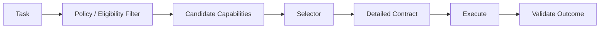
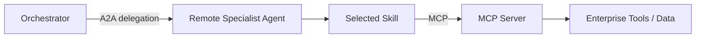
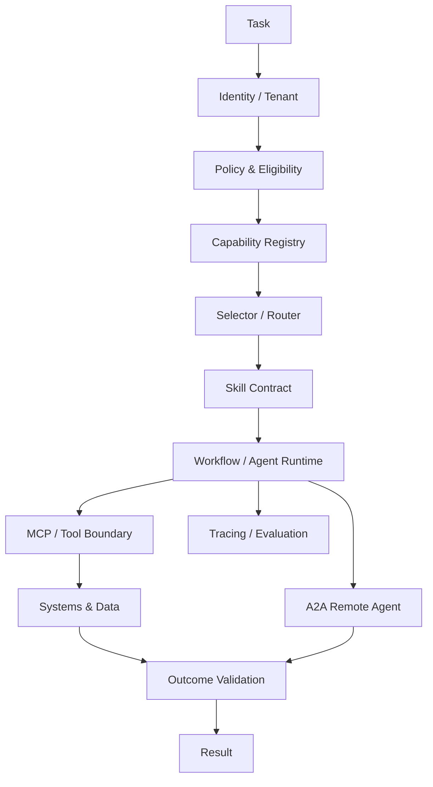

# Agent Skills & Capability Engineering

Agents become maintainable when capabilities have clear contracts, ownership, permissions, discovery rules, and lifecycle boundaries. A model knowing *how* to do something is not the same as a production system safely exposing that capability.

> **A capability should be discoverable enough to use, constrained enough to govern, and composable enough to reuse.**

This chapter distinguishes skills, tools, workflows, agents, MCP capabilities, and A2A-advertised capabilities without tying the architecture to one vendor or framework.

## 1. Why Capability Engineering Matters

A prototype often gives an agent a large list of tools and instructions. At scale this creates tool-selection confusion, oversized context, overlapping responsibilities, unclear authorization, difficult versioning, and poor observability.

Capability engineering makes those boundaries explicit.

## 2. Tool vs Skill vs Workflow vs Agent

| Concept | Mental model | Typical scope |
|---|---|---|
| Tool | atomic callable operation | lookup, send, calculate |
| Skill | reusable higher-level competency | research account, prepare quote |
| Workflow | explicit sequence/graph | approval process |
| Agent | goal-directed runtime participant | support agent |
| MCP server | standardized capability/context boundary | tools/resources exposed to hosts |
| A2A agent | independently exposed agent boundary | remote specialist |

These categories can overlap in implementation, but they should not be collapsed conceptually.

## 3. What Is an Agent Skill?

A **skill** is a reusable capability with enough description and operational contract for an agent/runtime to determine when and how it should be used.

A useful skill definition may include:

```text
identity
purpose
inputs / outputs
preconditions
permissions
procedure or strategy
available tools
success criteria
failure semantics
cost / latency characteristics
version
owner
```

A skill may internally use one tool, many tools, retrieval, deterministic code, or another workflow.

## 4. Why Skills?

Skills can reduce repeated prompt instructions, package domain procedures, make capabilities easier to discover, improve ownership/versioning, and create a level of abstraction above raw APIs.

They are especially useful when a capability has **procedure**, not merely an atomic function.

## 5. Tool or Skill?

Prefer a tool when:

```text
input → deterministic/externally executed operation → result
```

Prefer a skill when:

```text
goal
→ reusable procedure/knowledge
→ possibly several steps/tools
→ validated outcome
```

Do not turn every tool into a skill. Do not hide critical deterministic policy inside a vague skill description.

## 6. Skill Contract

Example conceptual contract:

```yaml
name: investigate_order_delay
version: 2
purpose: Determine why an order is delayed and produce supported next steps
inputs:
  - order_id
outputs:
  - cause
  - evidence
  - allowed_next_actions
requires:
  - order.read
success:
  - cause supported by authoritative evidence
failure:
  - order_not_found
  - unauthorized
  - insufficient_evidence
```

The contract is more important than any particular serialization format.

## 7. Progressive Disclosure

Giving every agent every capability definition at every turn creates context and selection problems.

Progressive disclosure means revealing capability information in stages:

```text
small capability catalog
        ↓
select likely capability
        ↓
load detailed skill contract/instructions
        ↓
expose required tools/resources
        ↓
execute
```

This reduces irrelevant context while preserving discoverability.

## 8. Discovery Metadata

A compact catalog can expose:

- name,
- short description,
- domain,
- risk class,
- required permissions,
- input type,
- approximate cost/latency,
- version.

Detailed procedure/tool schemas can be loaded only after selection.

## 9. Capability Selection

Selection may be deterministic, model-assisted, or hybrid.



Apply authorization before exposing capabilities the caller cannot use.

## 10. Capability Routing

Useful signals include task type, required data, permissions, risk, latency budget, cost budget, and capability health.

Routing quality should be evaluated separately from execution quality.

## 11. Skill Composition

A higher-level skill can compose lower-level capabilities:

```text
resolve_shipping_issue
├── retrieve_order
├── inspect_carrier_status
├── retrieve_policy
└── propose_allowed_resolution
```

Composition creates dependencies. Track versions and failures through the tree.

## 12. Skills and Deterministic Workflows

If the sequence is fixed and policy-sensitive, encode it as trusted workflow logic.

```text
skill chooses strategy
workflow enforces mandatory steps
tools perform atomic actions
```

Do not use agent discretion where deterministic control is required.

## 13. Skills and MCP

MCP can expose tools/resources used by a skill.

```text
Agent
  ↓ selects skill
Skill procedure
  ↓
MCP client
  ↓
MCP server
  ↓
authorized tools/resources
```

MCP does not automatically define the higher-level business skill. It supplies a standardized integration boundary for capabilities/context.

## 14. Skills and A2A

A remote agent can advertise capabilities/skills through its interoperability metadata.

The caller should treat the remote agent as an opaque service boundary:

```text
discover remote capability
→ delegate task
→ receive task/message/artifact/status
```

The caller need not know which internal tools or workflows implement the skill.

## 15. Skills + MCP + A2A



A2A is the remote-agent boundary; MCP is the capability/context boundary behind that agent.

## 16. Skills vs A2A Skills Metadata

The word **skill** can be used at different architectural layers.

An internal skill may be a reusable runtime capability. An A2A-advertised skill describes what a remote agent can do for other participants.

Do not assume the external advertised skill maps one-to-one to an internal module.

## 17. Input and Output Contracts

Prefer structured contracts for machine-critical fields.

```json
{
  "input": {"account_id": "A123"},
  "output": {
    "status": "resolved",
    "evidence_refs": ["..."],
    "next_actions": []
  }
}
```

Natural-language explanation can accompany structured data.

## 18. Preconditions and Postconditions

A skill should define conditions around execution.

Preconditions:
- authenticated identity,
- required data exists,
- caller has permission,
- prerequisite workflow state.

Postconditions:
- output validates,
- side effects confirmed,
- state transition committed,
- provenance recorded.

## 19. Permissions

Capabilities should carry explicit scopes.

```text
order.read
order.refund.propose
order.refund.execute
```

Read, propose, approve, and execute should not be treated as equivalent authority.

## 20. Risk Classification

Classify capabilities by consequence:

```text
R0: read-only / low impact
R1: reversible write
R2: consequential write
R3: regulated / high-impact
```

Higher-risk capabilities can require stronger validation, approvals, identity, and audit.

## 21. Human Approval

Approval should bind to an exact proposed action:

```text
skill proposes refund
→ trusted layer records amount/account/reason/version
→ human approves exact action
→ executor verifies approval binding
→ execute
```

A vague "approved" message should not authorize changed parameters.

## 22. Capability Sandboxing

Where execution can run code or access broad resources, restrict filesystem, network egress, credentials, CPU/memory/time, and process privileges.

Skill abstraction does not make unsafe execution safe.

## 23. Secrets

Do not place raw credentials in skill descriptions or model context.

Use trusted credential brokers/runtime identity so the execution layer obtains only required credentials.

## 24. Versioning

Version changes to:

- contract,
- semantics,
- required permissions,
- dependencies,
- underlying tools,
- output schema.

Breaking changes need compatibility strategy.

## 25. Capability Registry

At scale, maintain a registry/catalog containing ownership, versions, descriptions, schemas, scopes, risk, health, dependencies, and deprecation status.

The registry can support both humans and automated discovery.

## 26. Ownership

Every production capability should have an owner responsible for correctness, security, reliability, evaluation, and deprecation.

An unowned skill becomes operational debt.

## 27. Capability Health

Discovery should consider runtime health.

A capability that is semantically perfect but unavailable should not be selected blindly.

Track availability, latency, error rate, and dependency status.

## 28. Failure Semantics

Define machine-readable failures:

```text
INVALID_INPUT
UNAUTHORIZED
DEPENDENCY_UNAVAILABLE
INSUFFICIENT_EVIDENCE
POLICY_DENIED
TIMEOUT
PARTIAL_RESULT
```

Do not force the orchestrator to parse prose to understand failure.

## 29. Idempotency

Write capabilities should define idempotency semantics.

Retries are normal in distributed systems; duplicate side effects should not be.

## 30. Time and Cost Budgets

A capability contract can expose operational expectations:

```text
expected_latency
hard_deadline
max_tool_calls
cost_class
retry_policy
```

These help orchestrators choose among alternatives.

## 31. Observability

Trace:

```text
task
→ capability candidates
→ selected skill/version
→ policy decision
→ underlying tools
→ result validation
→ outcome
```

Record selection reason and versions without requiring hidden chain-of-thought.

## 32. Evaluation

Evaluate:

- discovery recall,
- routing/selection accuracy,
- input validity,
- task success,
- policy adherence,
- tool correctness,
- latency/cost,
- failure handling,
- side-effect correctness.

A skill can execute correctly while the router selected the wrong skill.

## 33. Capability Conflicts

Two skills may claim overlapping scope.

Resolve using clearer descriptions, eligibility rules, domain ownership, precedence, or a routing classifier.

Do not rely on prompt wording alone when overlap has operational consequences.

## 34. Capability Explosion

Hundreds of tiny capabilities increase selection complexity.

Mitigations:

- hierarchical catalogs,
- progressive disclosure,
- domain grouping,
- deterministic pre-routing,
- capability consolidation where semantics overlap.

## 35. Capability Injection

Capability descriptions themselves can be an attack surface if untrusted parties can register or modify them.

Protect registry writes, provenance, signing/verification where appropriate, review, and version history.

## 36. Multi-Tenant Capability Exposure

Filter capabilities by tenant, product tier, geography, policy, and user role before model-visible discovery.

Do not show forbidden capabilities and merely ask the model not to invoke them.

## 37. Deprecation

A safe lifecycle:

```text
new version
→ compatibility test
→ canary
→ migrate callers
→ mark old deprecated
→ observe
→ disable
→ remove
```

Agent prompts and cached catalogs may otherwise continue selecting old versions.

## 38. Architecture



## 39. Anti-Patterns

Avoid:

- calling every API a skill,
- one enormous capability catalog in every prompt,
- skill descriptions as authorization,
- overlapping skills with no ownership,
- unversioned contracts,
- free-form machine-critical outputs,
- exposing secrets in instructions,
- remote skills with no timeout/idempotency semantics,
- treating MCP and A2A as the same boundary,
- assuming skill composition is automatically reliable.

## 40. Production Checklist

- [ ] Tool/skill/workflow/agent boundaries are clear.
- [ ] Discovery uses compact metadata.
- [ ] Detailed context is progressively disclosed.
- [ ] Eligibility/authorization occurs before exposure.
- [ ] Inputs/outputs and failures are structured.
- [ ] Permissions and risk classes are explicit.
- [ ] Side effects have idempotency/approval semantics.
- [ ] Capabilities are versioned and owned.
- [ ] Health, latency, and cost are observable.
- [ ] Routing and execution are evaluated separately.
- [ ] MCP/A2A boundaries are modeled correctly.
- [ ] Deprecation/migration is defined.

## 41. Key Takeaways

- A tool is not automatically a skill; a skill is not automatically an agent.
- Progressive disclosure reduces context and selection overload.
- Capability discovery must be authorization-aware.
- MCP can expose tools/context used by skills; A2A can expose remote agent capabilities.
- Structured contracts, versions, ownership, and failure semantics turn capabilities into production interfaces.
- The model may select or propose; trusted infrastructure must authorize and enforce.

## Continue Learning

- [Tool Use & Agent Orchestration](tool-use-and-orchestration.md)
- [Agent Runtime, State Machines & Communication Protocols](agent-runtime-state-machines-and-protocols.md)
- [Multi-Agent Systems Architecture](multi-agent-systems.md)
- [MCP](../fundamentals/MCP%20%28Model%20Context%20Protocol%29.md)
- [A2A](../fundamentals/A2A%20Protocol.md)
