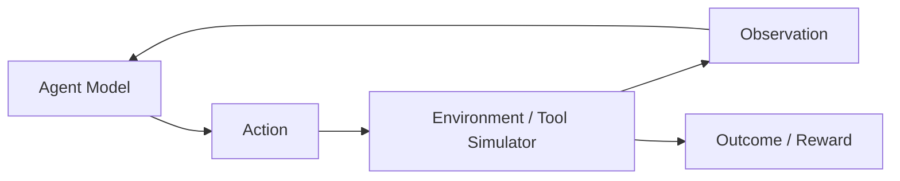
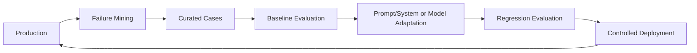

# Agent Training & Adaptation

"Fine-tuning an agent" is useful shorthand, but technically incomplete.

An agent is a system containing a model plus prompts, tools, retrieval, memory, orchestration, policy, state, and runtime controls. Fine-tuning changes model parameters; it does not automatically train the surrounding system.

> **Train the model for learnable behavior. Engineer the system for state, knowledge, permissions, reliability, and control.**

---

## 1. What Can Actually Be Adapted?

An agentic system can improve through several layers:

```text
prompt / instructions
context / retrieval
tool descriptions
workflow / orchestration
memory policy
model selection
model parameter adaptation
preference / reinforcement learning
```

Do not jump to parameter training before identifying which layer is failing.

---

## 2. Agent vs Agent Model

```text
Agent
├── model
├── instructions
├── context
├── tools
├── memory
├── planner/orchestrator
├── policy
└── runtime
```

Fine-tuning primarily changes the **model**.

A reliable training strategy evaluates whether that model change improves the complete agent.

---

## 3. When Model Adaptation Helps

Potential targets include:

- reliable tool selection,
- structured argument generation,
- domain-specific decision behavior,
- task decomposition style,
- consistent response policy,
- specialized classification/routing,
- efficient behavior in a narrow workflow,
- improved adherence to an interaction protocol.

Training is most attractive when the desired behavior is repeated, measurable, and poorly solved by simpler controls.

---

## 4. What Fine-Tuning Does Not Solve

| Need | Better primary mechanism |
|---|---|
| Fresh knowledge | RAG / tools |
| User-specific live data | authorized tools |
| Long-term memory | memory architecture |
| Tool permissions | policy / authorization |
| Durable workflow | orchestration / state machine |
| Retry safety | idempotency / reliability controls |
| Prompt injection defense | layered security controls |
| Observability | tracing / telemetry |
| Dynamic business rules | policy/configuration or tools |

A trained model can support these systems but should not replace them.

---

## 5. Adaptation Decision Ladder

Use the least invasive method that meets the requirement:

```text
prompt
  ↓
few-shot examples
  ↓
better context / RAG / tools
  ↓
workflow changes
  ↓
model routing
  ↓
parameter-efficient fine-tuning
  ↓
full fine-tuning / advanced post-training
```

Each step adds data, evaluation, deployment, and regression burden.

---

## 6. Supervised Fine-Tuning for Agent Behavior

Supervised fine-tuning (SFT) learns from demonstrations.

An agent-oriented example may encode:

```json
{
  "input": "Find my latest invoice and explain the total.",
  "available_tools": ["search_invoices", "get_invoice"],
  "target_behavior": [
    {"tool": "search_invoices", "arguments": {"sort": "latest"}},
    {"tool": "get_invoice", "arguments": {"invoice_id": "<result>"}},
    {"final": "grounded explanation"}
  ]
}
```

The exact training format depends on the model/runtime.

---

## 7. Tool-Use Training

Tool training can target:

- whether to call a tool,
- which tool to choose,
- argument construction,
- when to ask for missing information,
- how to interpret results,
- when to stop.

Tool availability at training time should resemble deployment semantics.

---

## 8. Tool Schema Quality Still Matters

A fine-tuned model cannot compensate indefinitely for ambiguous tools.

Bad:

```text
do_action(data)
```

Better:

```text
get_order(order_id)
refund_duplicate_charge(order_id, charge_id, amount)
```

Clear capabilities improve both inference and training data quality.

---

## 9. Read vs Write Actions

Training data should explicitly distinguish:

- read-only operations,
- reversible writes,
- irreversible/high-impact writes.

Do not teach a model that plausible intent is sufficient authorization.

For sensitive writes:

```text
model proposes
→ policy validates
→ approval when required
→ trusted executor acts
```

---

## 10. Trajectory Data

Agent training often uses trajectories rather than simple input/output pairs.

A trajectory can contain:

```text
observation
→ decision
→ tool call
→ tool result
→ next decision
→ final outcome
```

Store externally observable decisions and outcomes. Do not require hidden chain-of-thought as a training artifact.

---

## 11. Outcome Labels

Useful trajectory labels include:

- task success,
- tool correctness,
- policy compliance,
- number of steps,
- latency,
- cost,
- user correction,
- verifier result,
- side-effect correctness.

Outcome labels help distinguish fluent but ineffective behavior.

---

## 12. Successful Trajectories Are Not Enough

Training only on successful production runs can introduce selection bias.

Include:

- recoverable failures,
- ambiguous requests,
- missing information,
- tool errors,
- permission denials,
- abstention,
- escalation,
- adversarial cases.

The model must learn when **not** to act.

---

## 13. Data Sources

Possible sources:

- expert demonstrations,
- curated production traces,
- human corrections,
- synthetic tasks,
- simulator-generated environments,
- historical failures,
- red-team cases.

Production data requires privacy, consent, retention, and access controls.

---

## 14. Data Quality

Before training, validate:

- correct tool versions,
- valid arguments,
- policy compliance,
- outcome correctness,
- no leaked secrets,
- no cross-tenant data,
- representative task distribution,
- deduplication,
- provenance.

Training can amplify bad operational behavior.

---

## 15. Synthetic Trajectories

Synthetic generation can increase coverage.

Pattern:

```text
task generator
→ candidate trajectory
→ deterministic checks
→ model/verifier grading
→ human sampling
→ accepted training set
```

Do not assume model-generated examples are correct because they look realistic.

---

## 16. Environment / Simulator

For interactive training, the model needs an environment that responds to actions.



The simulator must represent important production constraints or the learned policy may exploit unrealistic behavior.

---

## 17. Preference Optimization

Preference data compares candidate behaviors.

Example:

```text
A: immediately issues refund
B: verifies order, checks policy, requests required approval

preferred: B
```

Preference optimization can improve behavior, but the preference rubric must reflect actual product policy.

---

## 18. Reinforcement Learning

RL-style training optimizes behavior from rewards/outcomes.

Potential reward components:

```text
task success
+ policy compliance
+ evidence quality
- unnecessary tool calls
- latency/cost penalty
- unsafe action penalty
```

Reward design is part of system design.

---

## 19. Reward Hacking

If the metric is incomplete, the policy may optimize the metric instead of the real goal.

Examples:

- minimizing steps by skipping verification,
- maximizing task completion by taking unauthorized actions,
- increasing judge score through verbosity.

Use multiple constraints and independent evaluation.

---

## 20. Process vs Outcome Feedback

Outcome feedback asks:

> Did the task succeed?

Process feedback asks:

> Were important intermediate actions valid?

For tool-using agents, both matter.

A correct final answer reached through an unauthorized side effect is a failure.

---

## 21. Verifiable Rewards

Tasks with deterministic verification are especially useful.

Examples:

- code tests,
- schema validity,
- database query result,
- exact tool state,
- simulator goal completion.

Verifiable signals reduce dependence on subjective model judges.

---

## 22. LLM-as-Judge in Training

Judges can label:

- relevance,
- groundedness,
- plan quality,
- trajectory preference.

But judge errors can become training signal errors.

Calibrate judges against trusted labels and retain deterministic checks where possible.

See [Evaluation & Observability](../../03-production-ai/evaluation-and-observability.md).

---

## 23. Distillation

A stronger model can help generate or label behavior for a smaller model.

```text
strong teacher
→ curated demonstrations
→ verification
→ smaller specialized model
```

Distillation can reduce inference cost, but the student must be evaluated independently.

---

## 24. Specialization

Instead of one model handling every agent decision, specialize:

- router,
- extraction model,
- tool selector,
- planner,
- verifier.

Specialization can improve cost or consistency but adds deployment complexity.

---

## 25. Parameter-Efficient Fine-Tuning

PEFT techniques such as LoRA adapt a subset/low-rank representation rather than updating every base parameter.

Potential advantages:

- lower training resource requirements,
- smaller adapters,
- easier specialization.

They do not remove the need for evaluation, serving compatibility, versioning, or rollback.

See [Fine-Tuning Large Language Models](../../01-genai-fundamentals/Fine-Tuning.md).

---

## 26. Full Fine-Tuning

Full parameter updates may be justified when:

- behavior shift is substantial,
- data is strong,
- infrastructure supports it,
- PEFT is insufficient,
- regression testing is mature.

It has a larger operational footprint and can regress unrelated capabilities.

---

## 27. Model Version + Agent Version

Track these separately.

```json
{
  "agent_version": "support-agent-12",
  "model_version": "support-model-7",
  "prompt_version": "p19",
  "toolset_version": "tools-5",
  "policy_version": "policy-22"
}
```

Otherwise a behavior regression is difficult to attribute.

---

## 28. Training / Serving Skew

A model trained against one environment may be deployed against another.

Skew examples:

- renamed tools,
- changed schemas,
- different system instructions,
- new policy,
- different retrieval distribution,
- changed model tokenizer/runtime.

Treat environment compatibility as a release requirement.

---

## 29. Offline Agent Evaluation

Before release, evaluate:

- task success,
- correct tool choice,
- argument correctness,
- groundedness,
- policy compliance,
- abstention,
- recovery,
- step count,
- latency/cost proxy,
- regression on general behavior.

Compare against the current production baseline.

---

## 30. End-to-End Evaluation

Do not approve a fine-tuned model based only on model benchmarks.

Run it inside the real agent stack:

```text
model
+ actual prompts
+ actual tools/sandbox
+ retrieval
+ memory policy
+ authorization
+ orchestration
```

System interactions can change the result.

---

## 31. Counterfactual / Replay Evaluation

Recorded tasks can be replayed against a candidate model when side effects are sandboxed.

Compare:

- old model trajectory,
- candidate trajectory,
- outcome,
- policy violations,
- cost/latency.

Do not replay real writes against production systems.

---

## 32. Online Rollout

Use controlled rollout patterns:

- shadow,
- internal dogfood,
- canary,
- limited cohort,
- progressive traffic.

Define rollback conditions before increasing exposure.

---

## 33. Safety Regression

A model that improves task success can still become less safe.

Maintain explicit tests for:

- unauthorized actions,
- prompt injection,
- sensitive-data leakage,
- unsafe tool use,
- policy bypass,
- escalation behavior.

Security controls remain external even after safety-oriented training.

---

## 34. Catastrophic Forgetting / Regression

Adaptation may weaken previously useful capabilities.

Maintain:

- target-task eval,
- general regression set,
- safety set,
- format/tool set.

Do not measure only the metric you optimized.

---

## 35. Continual Improvement Loop



Not every failure discovered in production should become a training example; first identify the correct architectural fix.

---

## 36. Training vs Context Engineering

If behavior fails because required evidence was absent, adding examples may not solve it.

Ask:

```text
Did the model know what behavior was expected?
Did it receive the necessary evidence?
Was the tool available?
Was the policy enforceable?
Was the workflow state correct?
```

See [Context Engineering](../../03-production-ai/context-engineering.md).

---

## 37. Training vs RAG

Use RAG/tools for dynamic facts.

Use training for reusable behavior/capability.

```text
"What is today's inventory?" → tool
"How should inventory queries be handled?" → behavior; possibly training
```

Mixing these creates stale model knowledge.

---

## 38. Training vs Orchestration

A deterministic workflow may be preferable when the sequence is known.

Do not train a model to "learn" a fixed compliance workflow that software can enforce explicitly.

Agent autonomy should exist where runtime decisions add value.

---

## 39. Training vs Model Routing

Sometimes a specialist existing model is better than training.

Evaluate:

- quality,
- latency,
- cost,
- maintenance,
- data requirements,
- provider/deployment constraints.

Training is one option, not a maturity badge.

---

## 40. Cost Model

Total adaptation cost includes:

- dataset creation,
- labeling,
- training compute,
- evaluation,
- model storage,
- serving,
- monitoring,
- retraining,
- incident/regression risk.

Compare lifecycle cost, not only training-job cost.

---

## 41. Privacy

Training data may contain durable copies of sensitive information.

Controls can include:

- minimization,
- redaction,
- access control,
- retention rules,
- lineage,
- deletion workflows,
- approved datasets.

Never casually turn raw production traces into a training corpus.

---

## 42. Security

Training pipelines are part of the supply chain.

Threats include:

- poisoned examples,
- malicious synthetic data,
- unauthorized dataset modification,
- compromised artifacts,
- secret leakage.

Version and control datasets, training code/configuration, checkpoints, and evaluation results.

---

## 43. Observability

For each deployed model/agent version, monitor:

- success rate,
- failure categories,
- tool selection,
- policy denials,
- step count,
- token use,
- latency,
- cost,
- fallback/escalation,
- drift.

Aggregate metrics should be sliceable by task category.

---

## 44. Example: Support Agent Adaptation

Problem:

> The base model frequently chooses a generic search tool instead of the account-specific billing tool.

Before training:

1. improve tool names/descriptions,
2. verify the correct tool is available,
3. add targeted few-shot examples,
4. inspect context/tool overload.

If failures remain systematic, create verified tool-selection demonstrations and compare an adapted model against the baseline.

Do not use training to bypass account authorization.

---

## 45. Example: Coding Agent

Potential training targets:

- choosing repository-search tools,
- editing only relevant files,
- interpreting test feedback,
- stopping after verified success.

Deterministic infrastructure should still enforce:

- filesystem/repository scope,
- command permissions,
- secrets,
- test execution limits,
- deployment approvals.

---

## 46. Example: Research Agent

Possible adaptation target:

- evidence-seeking behavior,
- source comparison,
- structured synthesis.

Freshness and factual evidence should still come from retrieval/tools rather than being baked into the trained model.

---

## 47. Anti-Patterns

Avoid:

- "fine-tune it" before diagnosing the failure layer,
- training on raw unverified agent traces,
- rewarding completion without policy compliance,
- teaching authorization decisions that infrastructure should enforce,
- embedding frequently changing facts into weights,
- evaluating only final prose,
- deploying a candidate without regression tests,
- assuming PEFT eliminates operational complexity,
- using hidden reasoning traces as a required observability mechanism.

---

## 48. Production Checklist

Before agent-model adaptation:

- define the behavior to improve,
- prove simpler system changes are insufficient,
- create versioned, authorized data,
- verify trajectories and outcomes,
- include negative/abstention/recovery cases,
- define baseline and release metrics,
- test tool/environment compatibility,
- run safety and general regressions,
- evaluate end-to-end agent behavior,
- canary with rollback,
- monitor drift and cost.

---

## 49. Interview Framework

For "How would you fine-tune/train an agent?":

1. clarify the failing behavior,
2. separate model vs system responsibilities,
3. choose prompt/context/tool/workflow fixes first,
4. define the learnable behavior,
5. design trajectory/demonstration data,
6. choose SFT/preference/RL/PEFT as appropriate,
7. define verifiable rewards and safety constraints,
8. evaluate model + complete agent,
9. control rollout/versioning,
10. monitor and feed failures back into the development loop.

---

## 50. Key Takeaways

- An agent is not a set of model weights.
- Fine-tuning adapts model behavior; it does not create reliable state, permissions, memory, or orchestration.
- Agent training often uses trajectories and outcomes, not only prompt/answer pairs.
- Tool correctness and policy compliance must be evaluated alongside task success.
- Prefer the least invasive adaptation that works.
- Keep authorization and side-effect enforcement outside the model.
- Evaluate the trained model inside the complete agent system.

---

## Continue Learning

- [Fine-Tuning Large Language Models](../../01-genai-fundamentals/Fine-Tuning.md)
- [Agent Architecture & Agent Loops](agent-architecture.md)
- [Tool Use & Agent Orchestration](tool-use-and-orchestration.md)
- [Evaluation & Observability](../../03-production-ai/evaluation-and-observability.md)
- [Security & Guardrails](../../03-production-ai/security-and-guardrails.md)
