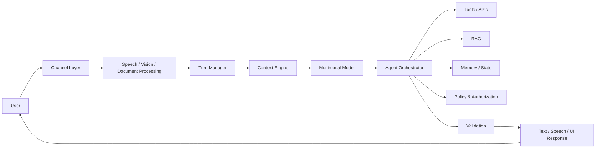
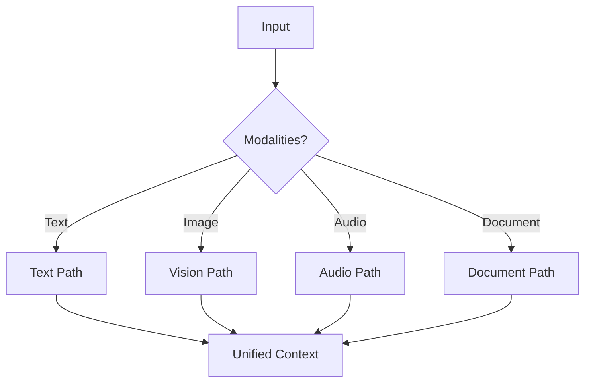
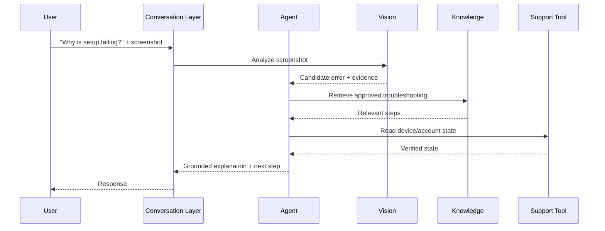

# Multimodal & Conversational Agents

A production conversational agent is not simply an LLM inside a chat window, and a multimodal agent is not simply a model that can accept an image.

A useful distinction is:

> **multimodal model ≠ conversational application ≠ conversational agent**

A multimodal model can process or generate more than one modality. A conversational application manages an interaction over turns. A conversational agent adds goal-directed decision-making, tools, state, memory, policy, and controlled actions.

---

## 1. Why This Topic Matters

Real users communicate through more than typed text:

- speech,
- screenshots,
- documents,
- images,
- video frames,
- gestures or device events,
- structured UI actions.

A customer-support agent may listen to speech, inspect a photo, retrieve an account, call a tool, ask a clarifying question, and speak a grounded answer. The engineering challenge is coordinating these channels while preserving latency, state, safety, and authorization.

---

## 2. Core Concepts

### Modality
A representation channel such as text, audio, image, video, or structured data.

### Multimodal understanding
Reasoning over one or more input modalities.

### Multimodal generation
Producing text, speech, images, or other outputs.

### Conversation
A sequence of turns with interaction state.

### Agent
A system allowed to choose bounded actions toward a goal.

These capabilities can exist independently.

---

## 3. Reference Architecture



The model is one component. The application owns state, permissions, deadlines, side effects, and recovery.

---

## 4. Channel Layer

The channel layer normalizes differences among:

- web chat,
- mobile,
- voice,
- contact-center telephony,
- messaging systems,
- embedded assistants.

Keep channel-specific transport separate from agent reasoning when possible. This allows one policy/orchestration core to support several interfaces.

---

## 5. Voice Agent Pipeline

A classic voice pipeline is:

```text
microphone
→ voice activity detection
→ speech recognition
→ turn/intent processing
→ model + tools
→ response text
→ speech synthesis
→ speaker
```

Some systems use native speech-to-speech models, but application responsibilities such as authorization, tools, state, and auditability still remain.

---

## 6. Streaming Architecture

Voice and interactive chat are latency-sensitive.

Useful stages can stream:

- incoming audio,
- partial transcription,
- safe progress events,
- model output,
- synthesized speech.

Streaming does not mean every intermediate model thought should be exposed. Stream user-safe artifacts and validated output.

---

## 7. Turn Management

A turn manager decides:

- when the user has finished,
- whether the agent should respond,
- whether more evidence is needed,
- whether a tool is still running,
- whether an interruption cancels current work.

Turn boundaries are obvious in typed chat but much harder in voice.

---

## 8. Interruptions and Barge-In

A voice user may interrupt while the agent is speaking.

A robust system should:

1. detect new user speech,
2. stop or attenuate output,
3. cancel obsolete generation/tool work where safe,
4. preserve completed side effects,
5. update conversational state,
6. answer the new turn.

Cancellation must not accidentally undo or duplicate committed actions.

---

## 9. Conversation State

Do not treat the transcript as the entire state.

Structured state may include:

```json
{
  "session_id": "s-42",
  "goal": "change-flight",
  "authenticated_user": "customer-7",
  "slots": {
    "destination": "SFO",
    "date": "2026-11-10"
  },
  "pending_action": "confirm_change",
  "last_tool_result": "quote-93"
}
```

Structured state makes workflows more reliable and testable.

---

## 10. Conversation History

Sending every prior turn forever is expensive and noisy.

Possible strategy:

```text
recent turns
+ structured task state
+ selected long-term memory
+ retrieved evidence
+ relevant tool results
```

This is a context-engineering problem, not merely a context-window problem.

See [Context Engineering](../../03-production-ai/context-engineering.md).

---

## 11. Memory Across Conversations

Long-term memory can hold durable preferences or prior task facts, but only when:

- the information is appropriate to retain,
- provenance is known,
- authorization is preserved,
- users can correct stale facts,
- retention policy permits it.

Do not silently turn every conversation into permanent memory.

See [Agent Memory Architecture](agent-memory.md).

---

## 12. Multimodal Context Representation

A request may contain:

```text
text question
+ screenshot
+ PDF
+ voice segment
+ account state
+ retrieved policy
```

The context assembler should preserve which evidence came from which modality and source.

---

## 13. Images

Image-enabled agents can support:

- screenshot troubleshooting,
- visual inspection,
- document understanding,
- product assistance,
- diagram analysis.

Do not assume visual interpretation is perfectly accurate. High-impact claims may require extraction, verification, metadata, or human review.

---

## 14. Documents

Documents combine layout, text, tables, images, and metadata.

A document pipeline may use:

```text
file
→ type validation
→ safe parsing
→ layout/text extraction
→ chunking
→ image/table extraction
→ indexing
→ retrieval
```

Treat uploaded files as untrusted input.

---

## 15. Audio

Audio carries more than transcript text:

- timing,
- speaker changes,
- interruptions,
- noise,
- uncertainty.

Do not infer sensitive personal traits merely because audio may contain signals correlated with them.

---

## 16. Video

Video introduces temporal sampling and much larger context.

A practical architecture may select:

- key frames,
- scene boundaries,
- transcript,
- timestamps,
- event metadata.

Passing every frame to a model is rarely the right default.

---

## 17. Modality Routing

Not every request needs every model.



Routing can reduce cost and latency, but must be evaluated for routing errors.

---

## 18. Tool Use

Multimodal perception should not bypass normal tool controls.

Example:

```text
user shows invoice
→ model extracts candidate invoice number
→ trusted service validates number
→ authorization checks account ownership
→ tool retrieves invoice
→ model explains result
```

The model's visual reading is evidence, not authorization.

---

## 19. Conversational Tool UX

Long-running tools need explicit conversational states:

```text
accepted
→ working
→ waiting_for_user
→ completed
→ failed
```

Avoid pretending an operation succeeded before the tool confirms it.

---

## 20. Confirmation and High-Impact Actions

Separate understanding from execution.

```text
"I think you want to cancel order 73."
          ↓
show exact action
          ↓
user confirmation / policy approval
          ↓
trusted executor
```

Confirmation should bind to the exact action parameters, not a vague future intent.

---

## 21. Grounding

Conversational fluency can make unsupported claims especially persuasive.

Ground important answers in:

- retrieved evidence,
- verified tool results,
- authoritative structured state.

Use citations or source attribution when the product benefits from inspectability.

---

## 22. Clarification

A good conversational agent asks when critical information is missing.

Bad behavior:

```text
guess missing account / date / action
```

Better:

```text
identify required field
→ ask targeted question
→ update state
→ continue
```

Do not ask unnecessary questions when the required information is already available.

---

## 23. Error Recovery

Failures should be conversationally meaningful.

Examples:

- "I couldn't verify the image; please upload a clearer copy."
- tool timeout → retry only if safe,
- speech recognition uncertainty → targeted confirmation,
- expired authentication → re-authenticate,
- stale quote → regenerate before approval.

Internal errors should not leak secrets or implementation details.

---

## 24. Multilingual Conversations

Language detection and switching affect:

- model routing,
- speech recognition,
- synthesis,
- retrieval,
- evaluation,
- safety policy.

Evaluate code-switching and domain vocabulary, not only clean monolingual examples.

---

## 25. Identity and Speaker Assumptions

A voice or image is not sufficient proof of identity.

Authentication should use trusted product mechanisms. Do not authorize actions based only on a model saying two voices/faces appear to match.

---

## 26. Prompt Injection Across Modalities

Instructions can appear inside:

- web pages,
- images,
- PDFs,
- transcripts,
- QR-derived text,
- tool output.

Content extracted from a modality remains **untrusted data**. It must not silently gain system-level authority.

See [Security & Guardrails](../../03-production-ai/security-and-guardrails.md).

---

## 27. Data Minimization

Multimodal payloads can contain much more information than needed.

Prefer:

```text
collect minimum
→ extract required evidence
→ redact where appropriate
→ retain according to policy
```

Do not send unrelated portions of sensitive media to downstream services without need.

---

## 28. Latency Budget for Voice

Voice interaction is sensitive to pauses.

A budget might decompose:

```text
endpoint detection
+ transcription
+ orchestration
+ model TTFT
+ tool latency
+ speech synthesis startup
```

Measure p50/p95/p99 and perceived responsiveness.

---

## 29. Latency Hiding

Useful techniques include:

- streaming,
- parallel safe reads,
- incremental synthesis,
- prefetching likely read-only context,
- compact context,
- fast-path routing.

Never hide latency by falsely claiming an action completed.

---

## 30. Cost

Multimodal systems can add:

- audio processing,
- vision inference,
- document parsing,
- larger contexts,
- longer sessions,
- tool calls,
- storage.

Track cost per successful conversation/task, not just per model call.

---

## 31. Evaluation Dimensions

Evaluate separately:

- perception accuracy,
- turn-taking,
- intent/task success,
- tool correctness,
- groundedness,
- conversation coherence,
- memory correctness,
- interruption handling,
- latency,
- safety,
- user outcome.

One aggregate score hides failures.

---

## 32. Multimodal Evaluation Dataset

A case can contain:

```json
{
  "input": {
    "text": "What is wrong here?",
    "image": "fixture/screenshot-17.png"
  },
  "expected": {
    "observations": ["authentication error"],
    "forbidden": ["invent hidden server logs"],
    "next_action": "offer verified troubleshooting steps"
  }
}
```

Keep media fixtures versioned and permission-safe.

---

## 33. Voice Evaluation

Test:

- accents and dialect variation,
- noise,
- overlapping speech,
- interruption,
- numbers/names,
- silence,
- tool delays,
- language switching.

Measure both transcription quality and end-to-end task success.

---

## 34. Conversation Simulation

Synthetic users can exercise long workflows.

A simulator can vary:

- user goal,
- cooperativeness,
- ambiguity,
- interruption,
- incorrect assumptions.

But simulator-based scores must be calibrated against real/human evaluation.

---

## 35. Observability

A trace may contain:

```text
session
  turn
    modality ingest
    perception
    context assembly
    model decision
    tool call
    validation
    response rendering
```

Record versions, latency, errors, and provenance while minimizing sensitive payload capture.

---

## 36. Session vs Task

A conversation may contain multiple tasks. A task may span several turns.

Model them separately:

```text
session_id ≠ task_id ≠ tool_call_id
```

This improves tracing and outcome measurement.

---

## 37. Reliability

Design for:

- dropped connections,
- duplicate events,
- partial audio,
- tool timeouts,
- reconnects,
- provider failures,
- cancelled turns.

Use idempotency for side effects and durable state for important long-running tasks.

See [Reliability & Resilience](../../03-production-ai/reliability-and-resilience.md).

---

## 38. Human Handoff

Escalate when:

- policy requires it,
- confidence/evidence is insufficient,
- user requests a human,
- repeated recovery fails,
- risk exceeds automation authority.

Handoff should include a compact, authorized summary and relevant artifacts—not an uncontrolled dump of the entire context.

---

## 39. Example: Multimodal Support Agent



No single model call owns the whole product behavior.

---

## 40. Example: Voice Booking Agent

A safe flow:

```text
speech
→ identify request
→ authenticate
→ collect required slots
→ search availability
→ read exact proposal
→ confirm
→ execute idempotent booking
→ verify
→ speak receipt
```

The model proposes; trusted services authorize and execute.

---

## 41. Anti-Patterns

Avoid:

- storing the full transcript as "memory" forever,
- trusting visual/audio extraction as authorization,
- letting embedded document instructions override system policy,
- speaking success before a write commits,
- unlimited conversation history,
- using the largest multimodal model for every turn,
- treating speech transcription as perfect,
- hiding tool errors with plausible language.

---

## 42. Production Checklist

Before launch, verify:

- supported modalities and fallbacks are explicit,
- turn/interruption semantics are tested,
- session/task state is durable where needed,
- context and memory are bounded,
- multimodal inputs are treated as untrusted,
- authorization is outside the model,
- write actions use confirmation/idempotency where required,
- latency budgets are measured end-to-end,
- evaluation includes noisy/adversarial cases,
- traces connect turns, model calls, and tools,
- retention/privacy policies cover media.

---

## 43. Interview Framework

When asked to design a conversational or multimodal agent:

1. define channels and modalities,
2. define user/task latency requirements,
3. separate perception from orchestration,
4. define conversation/task state,
5. design context and memory,
6. design tools and authorization,
7. handle streaming/interruption,
8. define grounding and clarification,
9. add security/privacy boundaries,
10. define multimodal + end-to-end evaluation,
11. design reliability and human handoff,
12. discuss cost and scaling.

---

## 44. Key Takeaways

- Multimodality is an input/output capability; agency is a control-system property.
- Conversation state should be structured, not only a transcript.
- Streaming and interruption are architectural concerns.
- Extracted media content remains untrusted.
- The model must not become the authorization boundary.
- Evaluate perception, conversation behavior, actions, safety, and end-to-end outcomes separately.
- Optimize latency and cost per successful task.

---

## Continue Learning

- [Agent Architecture & Agent Loops](agent-architecture.md)
- [Tool Use & Agent Orchestration](tool-use-and-orchestration.md)
- [Agent Memory Architecture](agent-memory.md)
- [Context Engineering](../../03-production-ai/context-engineering.md)
- [Performance, Latency & Cost](../../03-production-ai/performance-latency-and-cost.md)
