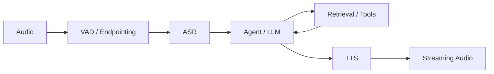
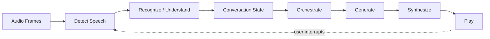
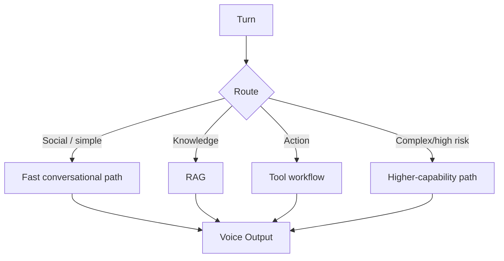

# Voice & Realtime Agent Engineering

Voice agents add a hard systems constraint to conversational AI: **the user experiences every millisecond, recognition error, interruption mistake, and synthesis artifact in real time.**

> **A successful voice agent optimizes task utility, conversational timing, and audio quality together—not transcription accuracy in isolation.**

This chapter focuses on architecture and engineering principles rather than any particular voice provider or UI framework.

## 1. Voice Agent Architectures

Two broad patterns dominate:

```text
Cascaded:
speech → ASR → text LLM/agent → TTS → speech

Native / speech-to-speech:
speech → multimodal realtime model → speech
```

Hybrid systems can combine them.

## 2. Cascaded Architecture



Advantages include component control, text-level observability, flexible model/tool selection, and independent optimization.

Costs include multiple network/model stages and accumulated latency/error.

## 3. Native Speech-to-Speech

A native realtime model can process audio and generate audio without exposing a mandatory intermediate text interface.

Potential benefits:
- lower conversational latency,
- richer paralinguistic signals,
- more natural turn-taking/prosody.

Challenges:
- harder component-level debugging,
- less explicit textual control in some designs,
- safety/tool orchestration still required,
- provider/runtime capabilities vary.

"Native" does not remove the need for state, authorization, tools, grounding, or evaluation.

## 4. Hybrid Voice Architecture

A system can use realtime speech interaction for the conversational surface while invoking text retrieval, deterministic tools, or specialized models behind it.

```text
realtime voice
→ routing/orchestration
├── direct conversational response
├── RAG
├── deterministic tool
└── higher-capability model
→ voice response
```

## 5. The Realtime Loop



Unlike text chat, input and output can overlap.

## 6. Voice Activity Detection

Voice Activity Detection (VAD) estimates when speech is present.

It affects:
- when listening starts/stops,
- interruption detection,
- bandwidth/compute,
- endpointing.

False positives capture noise as speech. False negatives miss the user.

## 7. Endpointing

Endpointing decides when a user turn is complete.

Too aggressive:
- cuts users off.

Too conservative:
- creates awkward silence and latency.

Use acoustic signals plus conversational/contextual signals where appropriate.

## 8. Turn-Taking

A voice agent needs explicit states such as:

```text
LISTENING
USER_SPEAKING
PROCESSING
AGENT_SPEAKING
INTERRUPTED
WAITING_FOR_TOOL
ENDED
```

Turn-taking is a control problem, not merely audio streaming.

## 9. Barge-In / Interruption

When the user speaks while the agent is talking:

1. detect credible speech,
2. stop/duck playback,
3. cancel obsolete synthesis/generation when possible,
4. preserve committed conversation state,
5. process the new turn.

Cancellation must propagate through the stack to avoid paying for or executing obsolete work.

## 10. ASR

Automatic Speech Recognition maps audio to text or another linguistic representation.

ASR quality depends on:
- accent/dialect,
- microphone/channel,
- noise,
- reverberation,
- speech rate,
- domain vocabulary,
- names/numbers,
- overlapping speakers.

Do not assume one aggregate benchmark predicts your workload.

## 11. Word Error Rate

A common ASR metric is Word Error Rate:

```text
WER = (S + D + I) / N
```

where:
- S = substitutions,
- D = deletions,
- I = insertions,
- N = reference words.

Lower is better.

## 12. WER Is Not Task Utility

"Transfer fifteen dollars" becoming "transfer fifty dollars" may be one word error with severe consequence.

Therefore measure:

```text
WER
+ entity accuracy
+ intent accuracy
+ critical-slot accuracy
+ end-to-end task success
```

Risk-weighted errors matter.

## 13. Domain Vocabulary

Product names, medications, airport codes, acronyms, people, and identifiers often need special attention.

Possible approaches include contextual hints, custom vocabulary where supported, post-recognition normalization, constrained confirmation, and retrieval-backed disambiguation.

Never silently "correct" a high-impact value without verification.

## 14. Numbers and Identifiers

Amounts, dates, phone numbers, confirmation codes, and IDs deserve structured handling.

```text
ASR hypothesis
→ normalize candidate
→ validate format/range
→ confirm if consequential or uncertain
→ execute
```

## 15. Noise Challenges

Noise can be:
- stationary,
- intermittent,
- competing speech,
- music/media,
- keyboard/mechanical,
- network/audio codec artifacts.

Evaluate representative environments, not only studio audio.

## 16. Acoustic Robustness

Potential mitigations:
- microphone/channel selection,
- echo cancellation,
- noise suppression,
- gain control,
- VAD tuning,
- robust ASR,
- confidence-aware confirmation,
- fallback to text.

Every enhancement can distort speech; validate end-to-end.

## 17. Echo

The agent's own TTS output can re-enter the microphone and be recognized as user speech.

Acoustic echo cancellation and playback-reference handling are important in full-duplex experiences.

## 18. Overlapping Speech

Overlap creates ambiguity about speaker and intent.

Strategies include barge-in rules, diarization where appropriate, channel separation, and clarification.

Avoid pretending overlapping audio is perfectly understood.

## 19. Streaming ASR

Streaming recognition emits partial hypotheses before the user finishes.

Benefits:
- lower perceived latency,
- early intent/routing,
- possible prefetch.

Risk:
- partial hypotheses change.

Do not execute consequential actions from unstable partial text.

## 20. TTS

Text-to-Speech turns generated content into audio.

Important dimensions include intelligibility, naturalness, prosody, pronunciation, consistency, time-to-first-audio, streaming stability, and controllability.

## 21. TTS Evaluation Triangle

A practical trade-off:

```text
naturalness
    /\
   /  \
latency — controllability
```

Improving one dimension can pressure others depending on model/runtime.

There is no universally optimal voice configuration.

## 22. Prosody

Prosody includes rhythm, stress, pitch, pauses, and intonation.

It affects:
- meaning,
- turn boundaries,
- confidence perception,
- empathy/tone,
- intelligibility.

Generated wording and punctuation can influence synthesis, but production systems should not depend on prompt tricks alone for critical pronunciation/timing.

## 23. Pronunciation

Names, acronyms, numbers, and domain terms need testing.

Use supported pronunciation controls or preprocessing where appropriate, and maintain a versioned domain lexicon if the product needs one.

## 24. Voice UX KPIs

Useful metrics include:
- time to first audio,
- response gap,
- interruption stop latency,
- false interruption rate,
- endpointing delay,
- ASR critical-slot accuracy,
- task completion,
- turns per successful task,
- repeat/clarification rate,
- abandonment,
- human handoff.

## 25. Latency Budget

```text
capture/VAD
+ endpointing
+ ASR
+ orchestration
+ retrieval/tools
+ model TTFT
+ TTS startup
+ network/playback
```

Measure p50/p95/p99.

Averages hide painful conversational stalls.

## 26. The Latency–Quality–Cost Frontier

```text
quality
  ↑
  |      ● high capability
  |   ●
  | ●
  +------------→ latency/cost
```

Choose the Pareto point required by the product, not the largest model available.

## 27. Latency Hiding

Possible techniques:
- streaming ASR/TTS,
- safe speculative retrieval,
- prefetch likely read-only context,
- parallel independent tool reads,
- compact prompts,
- route simple turns to fast paths.

Never fabricate filler that implies an action succeeded.

## 28. Routing Brain

Not every turn needs the same path.



Evaluate routing errors and escalation rate.

## 29. Voice RAG

Basic:

```text
speech → ASR → retrieve → generate → TTS
```

Production:

```text
identity / policy
→ stable query representation
→ authorized retrieval
→ rerank
→ compact evidence
→ grounded response
→ speech rendering
```

Retrieval latency competes directly with conversational responsiveness.

## 30. Hybrid RAG Pattern for Voice

Use different retrieval depth depending on the turn:

```text
simple factual turn → cached/fast retrieval
complex knowledge turn → hybrid + rerank
high-risk answer → authoritative sources + verification
follow-up → reuse valid session evidence when fresh/authorized
```

Do not rerun the most expensive pipeline unnecessarily.

## 31. Context for Voice

Spoken conversations generate large transcripts quickly.

Prefer structured state + summaries + selected recent turns rather than indefinitely replaying the transcript.

Preserve exact values separately when summarization could corrupt them.

## 32. Conversation Repair

When confidence/evidence is weak:

```text
detect uncertainty
→ ask targeted clarification
→ repeat critical interpreted value
→ continue
```

A short clarification is often better than a confidently wrong action.

## 33. Grounding

Voice fluency can amplify perceived confidence.

For factual/high-impact claims, ground against authorized retrieval/tool evidence and support a companion visual/text channel for citations when the interface permits.

## 34. Tool Actions

Use a two-phase pattern for consequential actions:

```text
understand
→ prepare exact action
→ speak concise confirmation
→ user confirms
→ trusted executor
→ verify result
→ speak receipt
```

## 35. Failure Recovery

Handle:
- ASR unavailable,
- TTS unavailable,
- model timeout,
- tool timeout,
- dropped connection,
- partial audio,
- reconnect,
- duplicate events.

Fallbacks can include text channel, alternate provider/runtime, retry where safe, or human handoff.

## 36. Session Reconnection

A reconnect should restore durable task state without replaying completed side effects.

Separate:
- transport connection,
- conversation session,
- business task,
- tool action IDs.

## 37. Cost Model

A useful abstraction:

```text
cost per successful voice task =
audio input processing
+ model inference
+ retrieval/tools
+ audio output synthesis
+ infrastructure
+ retries/fallbacks
--------------------------------
successful tasks
```

For planning, also model cost per minute and cost per concurrent session.

## 38. Capacity

Voice workloads are long-lived and streaming.

Capacity planning should consider:
- concurrent sessions,
- audio bitrate,
- streaming connections,
- ASR/TTS concurrency,
- model concurrency,
- tool QPS,
- session duration,
- burst patterns.

Requests per second alone can be misleading.

## 39. Privacy

Audio may contain biometric-like voice characteristics, bystanders, background conversations, and sensitive data.

Apply consent where required, minimization, retention controls, encryption, access controls, redaction where feasible, and clear handling of recordings/transcripts.

## 40. Security

Threats include:
- spoken prompt injection,
- replay,
- social engineering,
- untrusted audio content,
- tool abuse,
- identity assumptions.

A voice match is not automatically authentication.

## 41. Evaluation Dataset

Include:
- clean/noisy audio,
- accents/dialects,
- different devices/channels,
- fast/slow speech,
- interruptions,
- silence,
- names/numbers,
- domain vocabulary,
- multilingual/code-switching,
- tool delays,
- adversarial instructions.

## 42. Layered Evaluation

```text
audio quality
→ VAD/endpointing
→ ASR
→ intent/entities
→ routing
→ retrieval/tools
→ agent decision
→ TTS
→ task outcome
```

A final task score alone does not identify the broken layer.

## 43. Utility Scoring

For task-oriented voice systems, define utility using weighted product outcomes.

Example:

```text
utility =
task_success
- severe_action_error_penalty
- abandonment_penalty
- excessive_latency_penalty
- unnecessary_handoff_penalty
```

Weights are product/risk decisions, not universal constants.

## 44. Operational Readiness Checklist

- [ ] VAD/endpointing tuned on representative audio.
- [ ] Interruption/cancellation tested.
- [ ] WER plus critical-slot accuracy measured.
- [ ] Noise/echo/overlap tested.
- [ ] TTS pronunciation/prosody evaluated.
- [ ] End-to-end latency percentiles measured.
- [ ] Tool writes use confirmation/idempotency.
- [ ] Voice RAG is authorization-aware.
- [ ] Reconnect/fallback behavior tested.
- [ ] Cost per successful task/session tracked.
- [ ] Audio privacy/retention defined.
- [ ] Human handoff is available where needed.

## 45. Role-Specific Priorities

**Product:** task success, abandonment, perceived latency, trust.

**Engineering:** concurrency, cancellation, state, failure recovery, observability.

**ML:** ASR/TTS/model quality, routing, evaluation slices.

**Security/privacy:** identity, consent, retention, tool authority.

These priorities should meet in shared release criteria.

## 46. Anti-Patterns

Avoid:
- optimizing WER while ignoring task errors,
- waiting for full pipeline completion before streaming anything,
- executing from unstable partial ASR,
- treating voice as authenticated identity,
- replaying unlimited transcripts,
- no cancellation propagation,
- one expensive model path for every utterance,
- hiding failures behind fluent speech,
- evaluating only clean audio.

## 47. Key Takeaways

- Voice agents are realtime distributed systems.
- Cascaded and native speech-to-speech architectures have different control/latency trade-offs.
- VAD, endpointing, interruption, ASR, orchestration, and TTS jointly determine UX.
- WER is useful but insufficient; critical-slot and task utility matter.
- Streaming reduces perceived latency but introduces partial-state/cancellation complexity.
- Voice RAG must balance retrieval quality with conversational latency.
- Measure cost and capacity per successful session/task, not just model tokens.
- Audio privacy, authorization, and action confirmation remain infrastructure responsibilities.

## Continue Learning

- [Multimodal & Conversational Agents](multimodal-and-conversational-agents.md)
- [Tool Use & Agent Orchestration](tool-use-and-orchestration.md)
- [Context Engineering](../../03-production-ai/context-engineering.md)
- [Performance, Latency & Cost](../../03-production-ai/performance-latency-and-cost.md)
- [Evaluation & Observability](../../03-production-ai/evaluation-and-observability.md)
