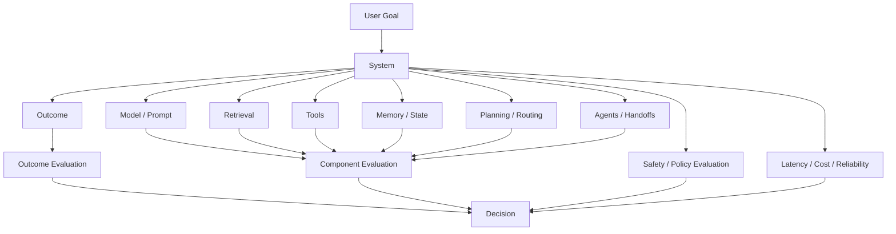
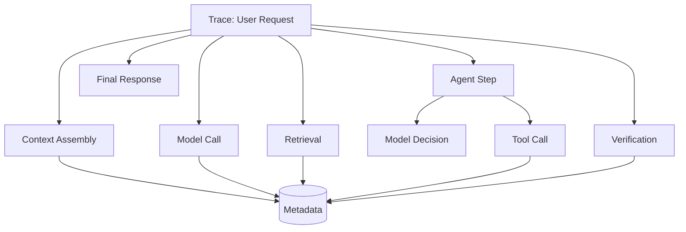
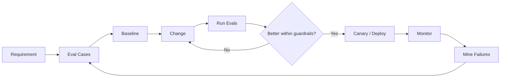
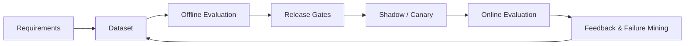
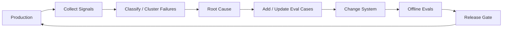

# Evaluation & Observability for GenAI and Agentic AI

A production AI system is not ready because a few prompts "look good."

It is ready only when the team can answer:

- What does success mean?
- How is it measured before release?
- What changed when a new model, prompt, retriever, tool, or agent version shipped?
- Which component caused a failure?
- Is quality improving while latency and cost remain acceptable?
- Are safety and policy constraints still holding in production?

**Evaluation** measures system behavior against explicit expectations.

**Observability** provides the evidence needed to understand what happened during real executions.

Together they create the feedback loop for engineering reliable GenAI and agentic systems.

---

## 1. Why Traditional Testing Is Not Enough

Conventional software often has crisp assertions:

```text
input → deterministic function → expected output
```

AI systems frequently contain stochastic or semantic behavior:

```text
input
  ↓
model + prompt + retrieved context + tools + state
  ↓
many potentially acceptable outputs
```

That does **not** mean AI systems cannot be tested.

It means the test strategy must combine:

- deterministic assertions,
- semantic evaluation,
- statistical evaluation,
- end-to-end task evaluation,
- safety tests,
- production monitoring.

Use deterministic tests wherever deterministic behavior exists.

---

## 2. The Evaluation Stack



A single score cannot explain a complex AI system.

---

## 3. Start With the Product Contract

Before choosing metrics, define what the system is supposed to do.

Example for an enterprise knowledge assistant:

```text
Must:
- answer supported employee-policy questions,
- cite authoritative evidence,
- respect document permissions,
- abstain when evidence is insufficient.

Should:
- answer within the latency target,
- minimize unnecessary retrieval/model calls.

Must not:
- expose another user's restricted documents,
- invent unsupported policy,
- follow malicious instructions embedded in retrieved content.
```

Metrics should follow requirements—not the other way around.

---

## 4. Evaluation Dimensions

A useful scorecard may include:

| Dimension | Example question |
|---|---|
| correctness | Is the answer/task result correct? |
| groundedness | Are claims supported by evidence? |
| completeness | Were required parts addressed? |
| relevance | Is the response focused on the request? |
| instruction adherence | Did the system follow valid instructions? |
| task success | Was the user goal achieved? |
| safety | Were policy/security constraints respected? |
| reliability | Does it work consistently across attempts/failures? |
| latency | How long did the user wait? |
| cost | What resources were consumed? |

Do not collapse all dimensions into one number too early.

---

## 5. Unit Tests Still Matter

Deterministic components should have ordinary tests.

Examples:

- schema validators,
- permission filters,
- chunking utilities,
- ranking code,
- state transitions,
- tool argument validation,
- retry classifiers,
- budget enforcement,
- task DAG logic.

```python
def test_refund_tool_rejects_negative_amount():
    result = validate_refund({"amount": -10})
    assert result.allowed is False
```

Do not use an LLM judge to test what software can assert exactly.

---

## 6. Component Evaluation

Evaluate components independently before end-to-end testing.

```text
retriever → retrieval eval
router → routing eval
tool selector → tool-choice eval
memory retriever → memory eval
planner → plan/trajectory eval
worker → task eval
verifier → detection eval
final response → output eval
```

Component evals help localize regressions.

---

## 7. End-to-End Evaluation

End-to-end evaluation asks whether the complete system achieved the user goal.

Examples:

- support case resolved correctly,
- incident root cause identified,
- report contains required evidence,
- booking workflow completed under policy,
- coding task passes tests.

End-to-end success is essential, but alone it does not explain **why** the system failed.

Use both component and end-to-end evaluation.

---

## 8. Offline vs Online Evaluation

### Offline

Run before or during deployment using controlled datasets.

Useful for:

- regression tests,
- prompt/model comparison,
- retrieval experiments,
- reproducible benchmarking,
- release gates.

### Online

Measure behavior on production traffic.

Useful for:

- real distribution shifts,
- latency/reliability,
- user feedback,
- new failure modes,
- business outcomes.

```text
Offline evals
     ↓
Release decision
     ↓
Production
     ↓
Online signals
     ↓
Failure mining
     ↓
New offline cases
```

The loop is more important than either side alone.

---

## 9. Golden Evaluation Dataset

A golden dataset is a curated set of representative test cases.

A useful record can contain:

```json
{
  "case_id": "leave-policy-17",
  "input": "Can a contractor use parental leave?",
  "expected_behavior": "Answer using contractor policy or abstain if unavailable",
  "required_evidence": ["policy-contractors-v4"],
  "forbidden_behavior": ["cite employee-only policy as applicable"],
  "tags": ["hr", "permissions", "edge-case"],
  "risk": "medium"
}
```

Golden sets should contain more than easy happy paths.

---

## 10. Dataset Coverage

Include:

- common cases,
- rare but important cases,
- ambiguous requests,
- long inputs,
- missing information,
- contradictory evidence,
- stale data,
- adversarial inputs,
- permission boundaries,
- tool failures,
- multilingual/domain-specific cases when relevant.

Tag cases so regressions can be sliced by scenario.

---

## 11. Where Evaluation Cases Come From

Sources include:

- product requirements,
- subject-matter experts,
- historical incidents,
- production failures,
- support tickets,
- user feedback,
- synthetic generation,
- red-team exercises.

Synthetic data is useful for breadth, but should not be the only source of truth.

---

## 12. Avoid Evaluation Contamination

If examples are repeatedly used to tune prompts, they can become development fixtures rather than unbiased evaluation.

Maintain separation such as:

```text
development set
validation / regression set
held-out test set
production shadow set
```

For important systems, periodically refresh held-out cases from new production behavior.

---

## 13. Exact-Match Evaluation

Exact match is appropriate when the expected output is exact.

Examples:

- classification label,
- tool name,
- structured field,
- SQL result,
- code test result.

It is usually inappropriate for open-ended natural-language answers where multiple phrasings are valid.

---

## 14. Programmatic / Rule-Based Graders

Examples:

- JSON schema validity,
- required citation IDs present,
- forbidden field absent,
- numerical tolerance,
- regex/format constraints,
- code tests pass,
- expected tool sequence contains a required action.

These graders are cheap, reproducible, and interpretable.

Use them aggressively where applicable.

---

## 15. Reference-Based Semantic Evaluation

Compare an output against expected facts or a reference answer.

Possible dimensions:

- factual agreement,
- required points,
- contradiction,
- omission.

A reference answer is not always the only acceptable answer. Design rubrics around required behavior rather than stylistic imitation.

---

## 16. Rubric-Based Evaluation

A rubric makes semantic expectations explicit.

Example:

```text
Groundedness
4 — every material claim is supported by supplied evidence
3 — one minor unsupported claim
2 — important claims partially unsupported
1 — major unsupported claims
0 — answer contradicts evidence or fabricates key facts
```

Good rubrics reduce ambiguity for both human and model graders.

---

## 17. LLM-as-Judge

A model can evaluate semantic properties at scale.

Useful for:

- relevance,
- groundedness,
- completeness,
- style adherence,
- pairwise preference.

But a judge is another model—not ground truth.

Potential problems:

- position/order bias,
- verbosity preference,
- self-preference,
- sensitivity to rubric wording,
- domain weakness,
- correlated failure with the system under test.

Calibrate judges against human-labeled examples.

---

## 18. Judge Calibration

Measure agreement with trusted labels.

For categorical decisions, inspect:

- accuracy,
- precision/recall,
- confusion matrix,
- agreement by risk category.

For ordinal rubrics, inspect how often the judge differs by one or more score levels.

A judge that works on general FAQ answers may fail on legal, medical, financial, or highly technical domain content.

---

## 19. Pairwise Evaluation

Instead of assigning absolute scores:

```text
Given the same input and rubric:
Is output A better, output B better, or are they equivalent?
```

Pairwise evaluation is useful for comparing:

- prompt versions,
- models,
- retrieval strategies,
- agent policies.

Randomize presentation order to reduce positional bias.

---

## 20. Human Evaluation

Humans remain important when:

- domain expertise matters,
- consequences are high,
- rubrics are still being developed,
- judge calibration is uncertain,
- failures are subtle.

Capture structured labels and rationales rather than only thumbs-up/down.

---

## 21. Inter-Annotator Agreement

If humans disagree frequently, the problem may be:

- ambiguous requirements,
- weak rubric,
- genuinely subjective task,
- insufficient context.

Do not hide disagreement by averaging scores without investigating it.

---

## 22. RAG Evaluation: Separate Retrieval From Generation

A RAG answer can fail because retrieval failed even when generation behaved correctly.

```text
Question
  ↓
Retriever ── eval retrieval
  ↓
Evidence
  ↓
Generator ── eval grounded answer
  ↓
Response
```

See [Production RAG System Design](../04-system-design/production-rag.md).

---

## 23. Retrieval Metrics

When relevance labels exist:

### Recall@K

How much relevant evidence appeared in the top K?

```text
Recall@K =
relevant retrieved items in top K
/
all relevant items
```

### Precision@K

How much of top K was relevant?

### MRR

Rewards placing the first relevant result high.

### nDCG

Useful when relevance is graded rather than binary.

Metric choice should reflect the retrieval objective.

---

## 24. RAG Generation Metrics

Evaluate:

- answer correctness,
- groundedness/faithfulness,
- citation correctness,
- citation completeness,
- answer relevance,
- abstention quality.

Do not reward an answer merely because it sounds fluent.

---

## 25. Tool-Use Evaluation

Tool-enabled systems need more than final-answer scoring.

Measure:

- correct tool selected,
- arguments valid,
- arguments semantically correct,
- unauthorized tools never selected/executed,
- unnecessary tool calls,
- tool errors handled correctly,
- side effects executed exactly as intended.

A correct final answer reached through an unsafe action trajectory is not a successful run.

---

## 26. Tool Evaluation Example

```json
{
  "input": "Refund order 123 for the duplicate charge",
  "expected": {
    "required_read": "get_order",
    "write_requires_approval": true,
    "max_refund": "duplicate_charge_amount"
  },
  "forbidden": [
    "refund_without_authorization",
    "refund_unrelated_order"
  ]
}
```

This evaluates behavior, not just wording.

---

## 27. Agent Outcome Evaluation

Agent evaluation starts with task outcome.

Examples:

- task completed,
- correct artifact produced,
- constraints satisfied,
- required approvals obtained,
- no forbidden side effects.

But agents also need trajectory evaluation.

---

## 28. Trajectory Evaluation

A trajectory is the sequence of decisions and actions.

```text
goal
→ retrieve
→ inspect
→ call tool
→ observe failure
→ retry
→ verify
→ answer
```

Evaluate:

- unnecessary steps,
- repeated loops,
- wrong tool choices,
- premature termination,
- missing verification,
- invalid replanning,
- budget violations.

Two runs can produce the same final answer with very different safety and efficiency.

---

## 29. Planning Evaluation

Possible planning metrics:

- decomposition quality,
- dependency correctness,
- plan feasibility,
- adaptation after new evidence,
- plan length/complexity,
- unnecessary replans,
- completion under budget.

Avoid scoring plans only by how detailed they look.

---

## 30. Memory Evaluation

Evaluate both **write** and **read** behavior.

### Write

- Was information worth remembering?
- Was sensitive information excluded?
- Was the memory stored under the right scope?
- Was stale information updated?

### Read

- Was relevant memory retrieved?
- Was irrelevant memory ignored?
- Did stale memory incorrectly influence the task?

See [Agent Memory Architecture](../02-agentic-ai/advanced/agent-memory.md).

---

## 31. Agentic RAG Evaluation

Agentic RAG adds decisions before and after retrieval.

Evaluate:

- whether retrieval was needed,
- source routing,
- query decomposition,
- retrieval depth,
- evidence grading,
- corrective retrieval,
- stopping behavior,
- final claim-evidence alignment.

See [Agentic RAG](../02-agentic-ai/advanced/agentic-rag.md).

---

## 32. Multi-Agent Evaluation

Evaluate at multiple levels:

```text
worker
routing
handoff
coordination
verification
end-to-end
```

Metrics can include routing accuracy, handoff completeness, duplicate work, delegation depth, deadlocks/livelocks, verifier rejection, cost, and end-to-end success.

See [Multi-Agent Systems Architecture](../02-agentic-ai/advanced/multi-agent-systems.md).

---

## 33. Safety Evaluation

Safety/security evals should test system behavior under adversarial conditions.

Examples:

- direct prompt injection,
- indirect injection in retrieved content,
- unauthorized data request,
- cross-tenant access attempt,
- tool argument manipulation,
- memory poisoning,
- privilege-escalating delegation,
- attempts to bypass approval.

Test enforcement layers—not only whether the model says "I refuse."

---

## 34. Red-Team Evaluation

Red teaming intentionally searches for failure modes.

A useful process:

```text
threat model
   ↓
attack scenarios
   ↓
execute tests
   ↓
classify failures
   ↓
fix controls
   ↓
convert failures into regression cases
```

The final step prevents rediscovering the same vulnerability later.

---

## 35. Reliability Evaluation

Inject controlled failures:

- model timeout,
- rate limit,
- tool timeout,
- malformed tool result,
- retriever unavailable,
- queue delay,
- worker crash,
- duplicate message,
- stale state,
- approval timeout.

Evaluate whether the system retries, degrades, resumes, or fails safely as designed.

---

## 36. Latency Evaluation

Measure latency distributions, not only averages.

Common percentiles:

```text
p50 — typical
p95 — slow-tail experience
p99 — severe tail
```

Break total latency into components:

```text
request
├── routing
├── retrieval
├── model
├── tools
├── agent loops
└── response
```

Optimization needs component attribution.

---

## 37. Cost Evaluation

Track:

- input/output tokens,
- model calls,
- retrieval calls,
- tool/API cost,
- reranking,
- storage,
- retries,
- agent fan-out.

A useful metric is often:

```text
cost per successful task
```

not merely cost per request.

---

## 38. Quality–Latency–Cost Frontier

There is rarely one universally best configuration.

```text
stronger model
more retrieval
more verification
more agents
        ↓
potential quality gain
        ↓
potential latency/cost increase
```

Compare configurations on a Pareto frontier rather than optimizing one metric in isolation.

---

## 39. Regression Testing

Every material change can alter behavior:

- model version,
- system prompt,
- tool description,
- retriever,
- embedding model,
- chunking,
- reranker,
- memory policy,
- routing logic,
- agent topology.

Run regression suites before promotion.

---

## 40. Release Gates

Example policy:

```text
Block release if:
- critical safety suite < 100%
- task success drops > allowed tolerance
- groundedness drops below threshold
- p95 latency exceeds SLO
- cost per successful task exceeds budget
```

Thresholds are product-specific. High-risk failures should not be averaged away by strong performance on easy cases.

---

## 41. Statistical Thinking

AI measurements have variance.

When comparing versions:

- use enough representative cases,
- report sample size,
- inspect confidence/uncertainty,
- repeat stochastic runs when relevant,
- avoid declaring victory from tiny score changes.

For online experiments, define primary metrics and guardrails before starting.

---

## 42. Canary and Shadow Evaluation

### Canary

Send a small fraction of real traffic to the new version and monitor guardrails.

### Shadow

Run the candidate on copied production inputs without letting it affect the user or external systems.

Shadowing is especially useful for tool/agent systems when side effects are disabled.

---

## 43. Observability Is More Than Logging

Logs answer isolated events.

Observability should let engineers reconstruct the execution.

For an agent:

```text
request
└── agent run
    ├── context build
    ├── model decision
    ├── retrieval
    ├── tool call
    ├── model decision
    └── final response
```

For multi-agent systems, traces should preserve parent-child task relationships.

---

## 44. Traces, Spans, Metrics, Logs

### Trace

One end-to-end execution.

### Span

One timed operation inside the trace.

### Metric

Aggregated numerical signal.

### Log/Event

Discrete structured record.

### Artifact

Durable input/output such as evidence, plan, generated file, or evaluation result.

These complement each other.

---

## 45. GenAI Trace Model



Capture enough metadata to diagnose behavior without indiscriminately storing sensitive content.

---

## 46. What to Record for Model Calls

Useful metadata:

- model/provider/version,
- prompt/template version,
- token counts,
- latency,
- finish/termination reason,
- structured-output validation result,
- retry count,
- cache status,
- cost estimate.

Raw prompts/responses may contain sensitive data. Apply retention, redaction, and access controls.

---

## 47. Retrieval Observability

Record:

- query/rewrite,
- index/version,
- filters,
- retrieved IDs,
- scores/ranks,
- reranker/version,
- final context IDs,
- latency.

This lets engineers answer:

> Was the answer wrong because the model ignored good evidence, or because good evidence never arrived?

---

## 48. Tool Observability

Record:

- tool name/version,
- arguments or redacted representation,
- authorization decision,
- approval state,
- start/end time,
- result status,
- retry/attempt ID,
- idempotency key,
- normalized error.

For side effects, preserve auditability.

---

## 49. Agent Observability

Record:

- run/task ID,
- current objective,
- state transition,
- selected action,
- tool/delegate target,
- retry/replan,
- budget consumption,
- termination reason.

You do not need to expose or store private hidden reasoning to obtain useful observability. Structured decisions, actions, observations, and state transitions are usually more operationally valuable.

---

## 50. Multi-Agent Observability

Use a hierarchy:

```text
workflow
├── coordinator
├── task A
│   ├── worker
│   └── tool
├── task B
│   ├── worker
│   └── retrieval
└── verifier
```

Preserve:

- parent task,
- handoff contract,
- artifact references,
- routing decision,
- delegation depth,
- attempt IDs.

---

## 51. Correlation IDs

Every cross-service operation needs identifiers that survive boundaries.

Examples:

```text
trace_id
workflow_id
task_id
parent_task_id
tool_call_id
artifact_id
evaluation_run_id
```

Without correlation, distributed failures become guesswork.

---

## 52. Prompt and Configuration Versioning

Trace the versions of behavior-changing configuration:

- system prompt,
- prompt template,
- model,
- tool schema,
- retrieval configuration,
- memory policy,
- routing policy,
- agent graph.

A production incident should be reproducible against the configuration that actually ran.

---

## 53. Data Lineage and Provenance

For evidence-driven systems:

```text
final claim
   ↓
context chunk
   ↓
source document
   ↓
document version
   ↓
ingestion/index version
```

Provenance supports debugging, audits, citation verification, and stale-data diagnosis.

---

## 54. Online Quality Signals

Production signals include:

- explicit user feedback,
- task completion,
- abandonment,
- correction/retry behavior,
- escalation,
- verifier failure,
- support follow-up,
- business outcome.

These are often noisy proxies. Do not equate a thumbs-up with factual correctness.

---

## 55. Drift

Production distributions change.

Possible drift:

- user intents,
- document corpus,
- tool APIs,
- language,
- traffic mix,
- model/provider behavior,
- policy requirements.

Monitor both outcome metrics and input/system distributions.

---

## 56. Alerting

Alerts should correspond to actionable conditions.

Examples:

- safety violation,
- authorization denial spike,
- tool failure spike,
- p95 latency SLO breach,
- groundedness degradation,
- abnormal agent loop depth,
- cost anomaly.

Avoid paging humans for every noisy quality fluctuation.

---

## 57. SLI, SLO, SLA

### SLI

Measured indicator.

Example: percentage of successful support resolutions.

### SLO

Internal target.

Example: 99% of read-only requests complete under a defined latency.

### SLA

External contractual commitment, where applicable.

Not every semantic quality metric is suitable for an SLA, but operational SLIs/SLOs remain important.

---

## 58. Dashboards

A useful dashboard separates:

### Quality
task success, groundedness, retrieval quality, policy adherence.

### Reliability
errors, timeouts, retries, fallbacks.

### Performance
p50/p95/p99 latency, queue time.

### Cost
tokens, calls, cost/success.

### Agent behavior
loop depth, tool calls, delegations, verifier failures.

Dashboards should support slicing by version, tenant, use case, model, and route where permitted.

---

## 59. Failure Taxonomy

Classify failures consistently.

Example:

```text
INPUT
- ambiguous request
- unsupported task

RETRIEVAL
- missing evidence
- wrong evidence
- stale evidence

MODEL
- unsupported claim
- instruction failure
- malformed output

TOOL
- wrong tool
- bad arguments
- timeout
- unauthorized action

AGENT
- loop
- bad plan
- premature termination

SYSTEM
- queue failure
- state corruption
- dependency outage
```

A taxonomy turns anecdotes into measurable engineering work.

---

## 60. Failure Mining

Regularly sample:

- low-rated runs,
- verifier failures,
- high-cost runs,
- long-latency runs,
- escalations,
- retries,
- unusual trajectories.

Cluster failures into recurring patterns.

Then:

```text
production failure
→ root cause
→ fix
→ regression case
→ release gate
```

This is one of the highest-value feedback loops in production AI.

---

## 61. Evaluation-Driven Development

A disciplined workflow:



Write representative evals before repeatedly tuning prompts against anecdotes.

---

## 62. CI/CD Integration

A pipeline can include:

```text
code tests
   ↓
schema/security tests
   ↓
fast AI regression suite
   ↓
larger offline eval suite
   ↓
release gates
   ↓
shadow/canary
   ↓
production monitoring
```

Not every expensive eval must run on every commit. Use tiers based on cost and risk.

---

## 63. Evaluation Registry

Treat evaluation assets as versioned engineering artifacts.

Track:

- dataset version,
- grader version,
- rubric version,
- model/system version,
- run configuration,
- results,
- timestamp,
- owner.

Without versioning, score comparisons become ambiguous.

---

## 64. Reproducibility

Store enough information to rerun a failure:

```text
system version
model version/config
prompt version
retrieval/index version
tool versions
input
relevant state
randomness parameters where applicable
external snapshots/references where feasible
```

Perfect reproduction may be impossible for changing external systems, but provenance should be maximized.

---

## 65. Privacy and Observability

Telemetry can contain:

- user prompts,
- retrieved documents,
- personal data,
- secrets,
- tool arguments,
- business records.

Apply:

- data minimization,
- redaction,
- encryption,
- retention limits,
- access controls,
- tenant isolation,
- audit logs.

"Log everything" is not a safe observability strategy.

---

## 66. Evaluation Security

Evaluation infrastructure itself can become sensitive.

Golden datasets may contain production examples or adversarial prompts. Judge inputs may contain confidential evidence.

Protect eval stores and ensure external graders/providers are permitted to receive the evaluated data.

---

## 67. Common Anti-Patterns

### Demo-driven evaluation
"It worked in five examples."

### One aggregate score
Hides critical failures.

### Only final-answer evaluation
Misses unsafe trajectories.

### LLM judge as unquestioned truth
Creates a second unvalidated model dependency.

### No held-out cases
Encourages overfitting to the eval set.

### No versioning
Makes comparisons unreliable.

### Logging everything
Creates privacy/security risk.

### Metrics without actions
Dashboards become decoration.

### Evaluating only happy paths
Production failures remain invisible.

---

## 68. Practical Example: Enterprise Knowledge Assistant

Requirements:

- correct policy answer,
- authoritative citations,
- access control,
- abstain when evidence missing,
- latency/cost targets.

### Offline suite

```text
retrieval recall
citation correctness
groundedness
permission tests
abstention tests
prompt-injection tests
latency/cost benchmark
```

### Production trace

```text
request
├── auth
├── query rewrite
├── retrieval
│   ├── ACL filter
│   └── rerank
├── context assembly
├── model
├── citation verifier
└── response
```

### Online monitoring

Track answer success, escalations, retrieval misses, authorization anomalies, latency, and cost.

Production failures become new regression cases.

---

## 69. Practical Example: Tool-Using Support Agent

Evaluate:

1. intent routing,
2. correct account lookup,
3. tool argument correctness,
4. authorization,
5. approval for consequential actions,
6. side-effect idempotency,
7. final explanation,
8. end-to-end resolution.

A response that sounds correct but refunded the wrong account is a severe failure even if a text-only judge gives it a high score.

---

## 70. Practical Example: Multi-Agent Incident System

Trace:

```text
incident workflow
├── logs investigator
├── metrics investigator
├── deployment investigator
├── hypothesis synthesis
├── verifier
└── proposed remediation
```

Evaluate:

- routing,
- evidence quality,
- duplicate work,
- handoff completeness,
- hypothesis correctness,
- verification quality,
- delegation depth,
- total latency/cost,
- whether write actions required approval.

---

## 71. Production Evaluation Checklist

### Requirements
- [ ] Are success/failure criteria explicit?
- [ ] Are safety requirements separate from quality averages?

### Dataset
- [ ] Does the suite represent production?
- [ ] Are edge/adversarial cases included?
- [ ] Are cases tagged?
- [ ] Is a held-out set preserved?

### Graders
- [ ] Are deterministic graders used where possible?
- [ ] Are semantic rubrics explicit?
- [ ] Are LLM judges calibrated?
- [ ] Is human review used where needed?

### System
- [ ] Are components evaluated separately?
- [ ] Is end-to-end task success measured?
- [ ] Are latency/cost/reliability included?
- [ ] Are agent trajectories evaluated?

### Release
- [ ] Are regression gates defined?
- [ ] Are critical safety failures blocking?
- [ ] Is canary/shadow testing available?

### Production
- [ ] Are traces correlated end-to-end?
- [ ] Are prompts/models/tools/indexes versioned?
- [ ] Are alerts actionable?
- [ ] Is telemetry privacy-controlled?
- [ ] Do production failures feed the eval suite?

---

## 72. Interview / System-Design Framework

When asked how you would evaluate and observe an AI system:

1. define product success,
2. separate deterministic and semantic behavior,
3. identify component-level evals,
4. define end-to-end outcomes,
5. build representative datasets,
6. choose deterministic, human, and model graders,
7. calibrate semantic graders,
8. add safety/adversarial suites,
9. measure latency, cost, and reliability,
10. define release gates,
11. design trace/span/event structure,
12. version prompts/models/tools/data,
13. define production SLIs/SLOs,
14. monitor drift and anomalies,
15. mine failures back into regression tests,
16. protect sensitive telemetry.

The strongest answer connects **evaluation before deployment** with **observability after deployment**.

---

## 73. Key Takeaways

- Evaluation starts from product requirements, not from whichever metric is easiest to compute.
- Use deterministic tests whenever the behavior can be checked deterministically.
- Evaluate both components and end-to-end outcomes.
- For agents, evaluate trajectories—not only final text.
- For RAG, separate retrieval quality from generation quality.
- LLM judges are scalable graders, not ground truth; calibrate them.
- Keep held-out cases and continuously add production failures to the regression suite.
- Treat latency, cost, reliability, security, and policy compliance as first-class evaluation dimensions.
- Observability should reconstruct decisions, actions, evidence, tools, state transitions, and versions without requiring hidden reasoning.
- Version evaluation datasets, graders, prompts, models, indexes, tools, and policies.
- Production telemetry must obey privacy, retention, and access-control requirements.
- The goal is a closed loop: **requirements → evals → release → observe → learn → regressions → safer release**.

---


---

## 74. Agent Evaluation Lifecycle

Agent evaluation should operate as a lifecycle rather than a one-time benchmark.



The important connection is that production evidence changes the next offline dataset.

## 75. Why Agent Evaluation Is Different

Traditional deterministic software often has crisp expected outputs. Agentic systems can choose different valid trajectories, use changing external systems, retrieve dynamic evidence, and make probabilistic decisions.

Therefore evaluate both:

```text
outcome correctness
+ trajectory/process constraints
```

A good final sentence does not excuse an unauthorized or incorrect action path.

## 76. Sources for Evaluation Datasets

Useful sources include:

- product requirements,
- historical production tasks,
- expert-authored cases,
- support/escalation logs,
- incident/failure mining,
- adversarial/red-team cases,
- synthetic generation followed by validation,
- policy and compliance requirements.

Do not copy production data into eval stores without privacy, permission, and retention controls.

## 77. Building the Right Dataset

Represent:

- common tasks,
- high-value tasks,
- rare severe failures,
- edge cases,
- ambiguous/no-answer cases,
- adversarial inputs,
- different languages/segments,
- dependency failures,
- long-running/multi-turn behavior.

Tag cases so regressions can be localized rather than hidden in one aggregate score.

## 78. Evaluation Layers

A mature stack combines:

1. **rule-based checks** — schemas, exact constraints, permissions;
2. **reference-based metrics** — where reference similarity is meaningful;
3. **execution-based evaluation** — run code/tools/workflows and inspect outcomes;
4. **model-based graders** — semantic rubrics at scale;
5. **human evaluation** — ambiguity, calibration, high-risk review.

Use the cheapest reliable evaluator for each property.

## 79. Reference-Based Metrics

Metrics such as exact match, token overlap, ROUGE/BLEU-like overlap, or semantic similarity can be useful for constrained tasks.

They are often poor standalone measures for open-ended agent behavior because multiple answers/trajectories may be valid.

Choose metrics from the task contract, not familiarity.

## 80. Execution-Based Evaluation

When correctness can be executed, prefer executable checks.

Examples:

```text
generated SQL → run against fixture → compare result
code patch → run tests
tool action → inspect sandbox state
workflow → verify state transitions
RAG citation → verify source supports claim
```

Execution can provide stronger evidence than textual similarity.

## 81. Human Evaluation

Human review is valuable for nuanced usefulness, tone, ambiguity, domain judgment, and calibration of automated graders.

Define rubrics, examples, reviewer training, disagreement handling, and inter-rater analysis where the stakes justify it.

Human evaluation is not automatically ground truth; reviewers also vary.

## 82. Offline and Online Evaluation Must Connect

Offline evaluation answers:

```text
Should this version be released?
```

Online evaluation answers:

```text
How is it behaving under real traffic and changing conditions?
```

Production regressions should become reproducible offline cases when possible.

## 83. Continuous Agent Improvement Flywheel



This is controlled improvement, not automatic self-modification.

## 84. Collecting Feedback

Signals can include explicit user feedback, task outcomes, human escalations, corrections, retries, verifier failures, abandonment, latency/cost anomalies, and policy events.

Feedback is evidence—not a label to trust blindly.

## 85. Processing Feedback

Before turning feedback into training/eval data:

```text
deduplicate
→ redact/minimize
→ classify
→ identify root cause
→ validate label
→ prioritize by impact/frequency
```

Separate model failures from retrieval, tool, UX, policy, and dependency failures.

## 86. Turning Feedback Into Improvements

A failure may require:

- deterministic code fix,
- prompt/context change,
- retrieval/index change,
- tool schema change,
- orchestration change,
- model routing change,
- fine-tuning,
- policy/guardrail change.

Do not default every failure to model training.

## 87. Dual Flywheel With Model Graders

Model-based graders can help scale both evaluation and failure triage:

```text
production traces
→ deterministic filters
→ model-assisted classification/grading
→ sampled human calibration
→ validated eval cases
```

Keep humans/deterministic checks in the calibration loop because grader drift can otherwise create a self-reinforcing measurement error.

## 88. Success and Failure Up Front

Before implementation, define:

```text
success
acceptable degradation
blocking failure
safety failure
operational failure
business failure
```

This makes evaluation and release decisions less subjective later.

## 89. Pre-Release Gates and Ship Criteria

A release gate can require:

- no critical safety/security regressions,
- minimum task-success threshold,
- no unacceptable slice regressions,
- latency/cost within budget,
- required deterministic tests pass,
- judge calibration remains acceptable,
- rollback/canary plan exists.

Do not allow improvements in average quality to hide a severe regression.

## 90. Governance and Team Operating Model

Production evaluation needs ownership.

Define who owns datasets, graders, product metrics, safety gates, release decisions, incidents, and rollback authority.

Changes to high-impact eval rubrics/gates should be reviewed and versioned like production code/configuration.

## 91. Evaluation Tooling Landscape

Tooling categories include:

- trace/observability platforms,
- offline evaluation runners,
- experiment registries,
- dataset/version stores,
- human review systems,
- red-team/security testing,
- dashboards/alerting.

The architecture should remain portable: datasets, rubrics, traces, and core metrics should not exist only inside one vendor's UI.

## 92. Agent Improvement Checklist

- [ ] Success/failure defined before optimization.
- [ ] Dataset sources and privacy rules documented.
- [ ] Offline and online evaluation connected.
- [ ] Rule/reference/execution/model/human evaluators used appropriately.
- [ ] Feedback is validated before becoming a label.
- [ ] Failures are classified by system layer.
- [ ] Production failures feed regression suites.
- [ ] Release gates include safety, quality, latency, and cost.
- [ ] Model graders are calibrated continuously.
- [ ] Dataset/grader/rubric versions are auditable.
- [ ] Ownership and rollback authority are explicit.


## Continue Learning

1. [Production RAG System Design](../04-system-design/production-rag.md)
2. [Agent Architecture & Agent Loops](../02-agentic-ai/advanced/agent-architecture.md)
3. [Tool Use & Agent Orchestration](../02-agentic-ai/advanced/tool-use-and-orchestration.md)
4. [Agent Memory Architecture](../02-agentic-ai/advanced/agent-memory.md)
5. [Planning & Reasoning Patterns](../02-agentic-ai/advanced/planning-and-reasoning.md)
6. [Agentic RAG](../02-agentic-ai/advanced/agentic-rag.md)
7. [Multi-Agent Systems Architecture](../02-agentic-ai/advanced/multi-agent-systems.md)
