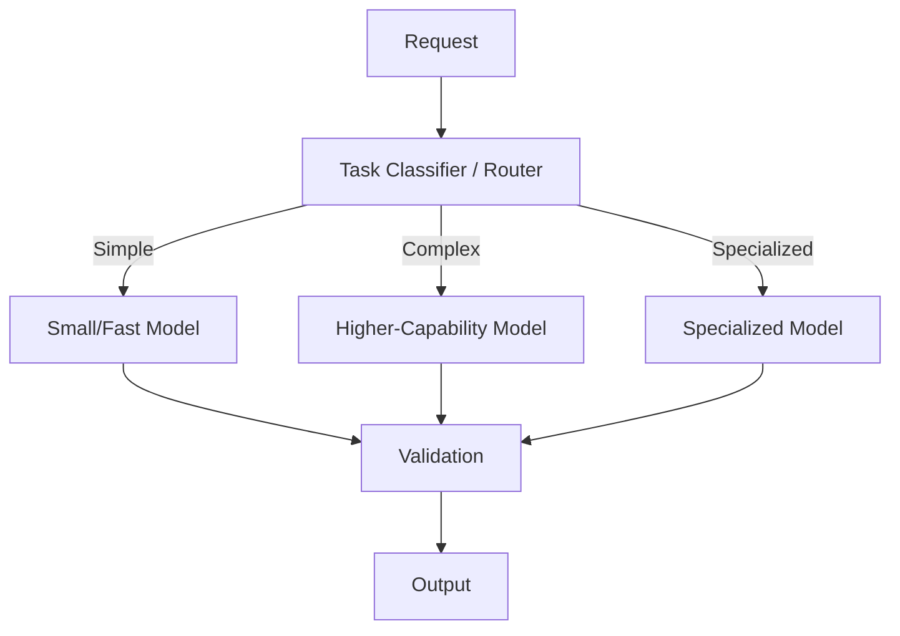
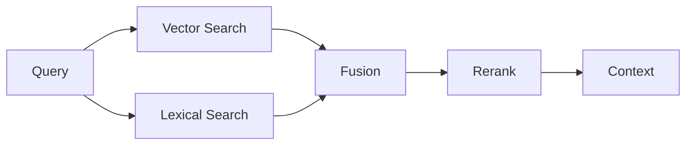
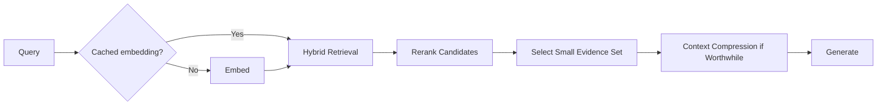
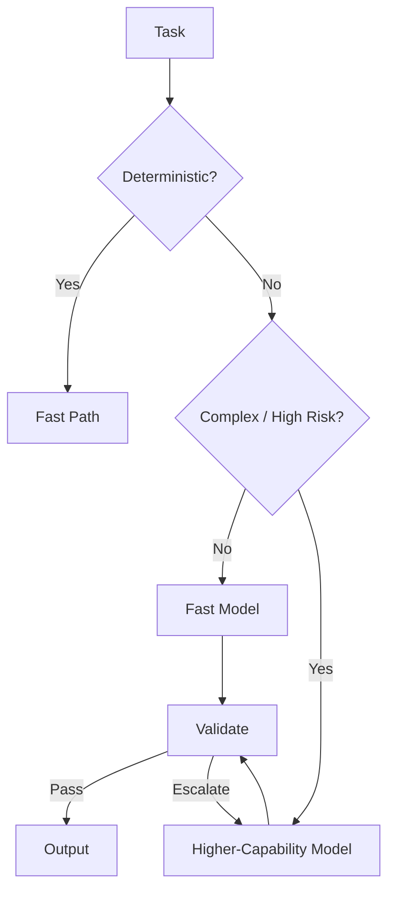

# Performance, Latency & Cost for GenAI and Agentic AI

Production AI optimization is not simply "use a faster model" or "reduce tokens."

A GenAI request can traverse authentication, retrieval, reranking, context construction, one or more model calls, tools, verification, memory, queues, and remote agents. Performance engineering must optimize the **end-to-end task** while preserving quality, security, and reliability.

> **Optimize cost and latency per successful task—not per isolated model call.**

---

## 1. Performance Is End-to-End

```text
request
→ gateway
→ retrieval
→ reranking
→ context construction
→ model prefill
→ model decode
→ tools
→ verification
→ response
```

Improving a 20 ms component does little if a sequential 4-second model/tool call dominates the critical path.

---

## 2. Define the User Experience

Different workloads optimize different metrics.

Examples:

- chat: time to first useful token,
- classification: end-to-end latency,
- agent workflow: task completion time,
- batch processing: throughput and cost,
- voice: low interaction latency,
- background research: quality under deadline/cost budget.

Start with the product contract.

---

## 3. Core Latency Metrics

### End-to-end latency
Time from request arrival to completion.

### Time to first token (TTFT)
Time until generation begins.

### Inter-token latency
Delay between generated tokens.

### Time per output token
Useful for decode performance.

### Task completion time
Critical for multi-step agents.

Measure distributions, not only averages.

---

## 4. Percentiles

Track:

- p50,
- p95,
- p99.

Averages hide long tails.

Agent/tool systems often have heavy tails due to retries, fan-out, queueing, and external dependencies.

---

## 5. Latency Decomposition

```text
E2E latency
=
queue
+ auth/routing
+ retrieval
+ reranking
+ context build
+ model prefill
+ decode
+ tools
+ verification
+ network overhead
```

Trace each component before optimizing.

---

## 6. Critical Path

Parallel work does not add all branch latencies.

```text
A ── 400 ms ──┐
B ── 900 ms ──┼→ merge
C ── 500 ms ──┘
```

The parallel segment is roughly governed by the slowest required branch plus orchestration overhead.

Optimize the critical path.

---

## 7. Queueing Delay

Under load, requests may spend more time waiting than computing.

Track:

- queue depth,
- queue age,
- utilization,
- service time,
- arrival rate.

Performance optimization without queue metrics can misdiagnose saturation.

---

## 8. Model Inference Phases

For autoregressive LLM inference, two useful phases are:

### Prefill
Process the input/context.

### Decode
Generate output tokens iteratively.

Long input often increases prefill work; long output increases decode work.

---

## 9. TTFT Drivers

TTFT can include:

- queueing,
- network,
- context size,
- model load,
- prefill compute,
- routing,
- cold start.

Reducing output length does not necessarily fix a slow TTFT.

---

## 10. Decode Drivers

Decode performance can depend on:

- model size/architecture,
- serving hardware,
- batching,
- memory bandwidth,
- KV-cache behavior,
- decoding strategy,
- output length.

Measure rather than assuming one universal bottleneck.

---

## 11. Streaming

Streaming improves perceived responsiveness by returning output before generation completes.

```text
non-streaming:
wait ───────────────→ full answer

streaming:
wait → token → token → token → ...
```

Streaming improves perceived latency, not necessarily total compute time.

---

## 12. Streaming and Agents

Do not stream speculative claims as final facts if later tool calls may invalidate them.

Possible pattern:

- stream safe progress/status,
- execute/verify,
- stream grounded final content.

UX and correctness must be designed together.

---

## 13. Token Economics

Token usage may affect:

- inference compute,
- latency,
- provider billing,
- context limits.

Track input and output separately.

---

## 14. Input Tokens

Input growth can come from:

- long system prompts,
- full conversation history,
- excessive RAG chunks,
- too many tool schemas,
- raw tool output,
- duplicated context.

Context engineering is performance engineering.

See [Context Engineering](context-engineering.md).

---

## 15. Output Tokens

Output length affects:

- decode time,
- cost,
- user wait,
- downstream parsing.

Specify the output needed for the task rather than asking for unnecessary verbosity.

---

## 16. Cost per Request vs Cost per Successful Task

A cheap call that fails and retries three times may cost more than a stronger first attempt.

Track:

```text
total model cost
+ tool cost
+ retrieval cost
+ retry cost
+ infrastructure cost
---------------------
successful completed tasks
```

This is more meaningful than model-call price alone.

---

## 17. Cost Attribution

Attribute cost by:

- tenant,
- user,
- feature,
- workflow,
- model,
- tool,
- agent,
- environment.

Without attribution, optimization becomes guesswork.

---

## 18. Cost Manifest

```json
{
  "task_id": "task-91",
  "model_calls": 4,
  "input_tokens": 18420,
  "output_tokens": 2310,
  "tool_calls": 6,
  "retrieval_queries": 3,
  "wall_time_ms": 12400,
  "fallbacks": 1
}
```

Pair cost with success/quality outcomes.

---

## 19. Quality–Latency–Cost Triangle

Optimization changes trade-offs.

```text
          Quality
         /       \
        /         \
   Latency ------- Cost
```

A production choice should sit on an acceptable frontier for the use case.

---

## 20. Pareto Frontier

Configuration A is dominated if another configuration is:

- better quality,
- lower latency,
- lower cost.

Experiment across configurations and eliminate dominated choices.

---

## 21. Model Selection

Choose models based on task requirements:

- quality,
- latency,
- cost,
- context length,
- structured output/tool ability,
- modality,
- deployment constraints.

Do not route every task to the largest model by default.

---

## 22. Model Routing



Routing itself must be evaluated because misrouting can reduce quality.

---

## 23. Escalation Routing

A useful pattern:

```text
fast model
→ validate confidence/requirements
→ escalate only when needed
```

The validator must reliably detect when escalation is required.

---

## 24. Routing Signals

Possible signals:

- task type,
- complexity,
- risk,
- context length,
- tool requirements,
- language/modality,
- previous failure,
- user/service tier.

Avoid using sensitive attributes without legitimate need and governance.

---

## 25. Model Cascades

A cascade may use:

```text
cheap filter
→ medium model
→ expensive specialist only if needed
```

Measure total cascade cost and false escalation/non-escalation.

---

## 26. Semantic Caching

Reuse a prior result for sufficiently similar requests only when semantics, freshness, authorization, and policy make reuse safe.

Semantic similarity alone is insufficient.

---

## 27. Exact Caching

Exact caches are simpler for deterministic or effectively stable operations.

Cache keys may include:

- normalized input,
- tenant/scope,
- model/version,
- prompt version,
- source/index version.

---

## 28. Prompt / Prefix Caching

Some serving systems/providers can reuse computation for repeated prefixes.

Good candidates may include stable:

- system instructions,
- large reference prefixes,
- tool definitions.

Design details depend on runtime/provider capabilities.

---

## 29. Retrieval Caching

Possible layers:

- query embedding cache,
- candidate retrieval cache,
- reranker cache,
- authorized evidence cache.

Invalidate on index, permission, or policy changes.

---

## 30. Tool Caching

Cache read-only tool results only when:

- freshness requirements allow,
- authorization scope is preserved,
- side effects are absent,
- invalidation is understood.

Never cache a write as if it were a read.

---

## 31. Cache Hit Rate Is Not Enough

A high hit rate can still be harmful if cached results are stale or wrong.

Track:

- valid hit rate,
- stale hit rate,
- latency saved,
- cost saved,
- quality impact.

---

## 32. Batching

Batching combines work to improve hardware/service utilization.

Useful for:

- embeddings,
- offline inference,
- evaluation,
- some online serving.

Batching can increase individual request wait time, so optimize throughput and latency together.

---

## 33. Dynamic Batching

A server may briefly wait to form a batch.

Trade-off:

```text
wait longer → larger batch → better throughput
wait shorter → lower queue latency
```

The optimal window depends on traffic and SLOs.

---

## 34. Embedding Batching

Document ingestion often benefits strongly from batching embeddings.

Measure:

- batch size,
- throughput,
- provider limits,
- memory,
- retry granularity.

Huge batches can make failures expensive to replay.

---

## 35. Parallelism

Parallelize independent operations.

Example:

```text
retrieve docs ─────┐
load customer state├→ context
retrieve memory ───┘
```

Do not parallelize operations with true dependencies.

---

## 36. Parallel Tool Calls

Independent reads can often run concurrently.

But parallelism increases:

- downstream load,
- concurrency,
- cost burst,
- merge complexity.

Bound fan-out.

---

## 37. Speculative Work

Starting work before it is definitely needed can reduce latency but waste cost.

Example:

```text
begin likely retrieval
while intent classifier finishes
```

Use only when probability × latency benefit justifies wasted work.

---

## 38. Agent Fan-Out

Multi-agent parallelism can reduce wall-clock time for independent semantic tasks.

It can also multiply:

- model calls,
- tool calls,
- tokens,
- merge cost.

Parallel agents are not free scalability.

---

## 39. Sequential Agent Cost

A loop with 12 model decisions creates cumulative latency.

Before adding another reasoning step, ask whether it materially improves success.

---

## 40. Reduce Agent Steps

Possible improvements:

- better tool descriptions,
- stronger initial context,
- deterministic routing,
- combined safe reads,
- explicit termination,
- better state.

The cheapest agent step is the unnecessary step you remove.

---

## 41. Tool Latency

Measure tools separately.

A 100 ms model routing decision followed by a 6-second tool call is a tool-performance problem.

Use timeouts, concurrency, caching where valid, and API-specific optimization.

---

## 42. Tool Payload Size

Huge tool responses increase:

- network transfer,
- parsing,
- context tokens,
- model prefill.

Return task-relevant fields or artifact references.

---

## 43. RAG Latency Pipeline

```text
query rewrite
→ embedding
→ candidate retrieval
→ metadata filtering
→ reranking
→ context construction
→ generation
```

Profile each stage.

---

## 44. Retrieval Candidate Size

More candidates can improve recall but increase:

- search work,
- reranking cost,
- latency.

Tune candidate K and final context K independently.

---

## 45. Reranker Trade-Off

A reranker adds latency/cost but may improve evidence quality enough to reduce downstream errors or context size.

Evaluate end-to-end task success.

---

## 46. Retrieval Parallelism

Hybrid retrieval can run lexical and vector search in parallel before fusion.



---

## 47. Context Compression for Performance

Smaller high-quality context can reduce prefill work and cost.

Compression itself has a cost, so measure whether it pays back.

---

## 48. Summarization Break-Even

If a summary requires another model call:

```text
summary cost
vs
tokens/latency saved across future calls
```

Frequently reused context is more likely to justify preprocessing.

---

## 49. Precomputation

Move stable work off the request path.

Examples:

- document parsing,
- chunking,
- embeddings,
- metadata extraction,
- summaries,
- tool catalog indexing.

Precompute only where freshness allows.

---

## 50. Online vs Offline Work

### Online
Needed for the current request.

### Offline
Can be computed before request time.

Move work offline when it reduces critical-path latency without sacrificing freshness/correctness.

---

## 51. KV Cache

During autoregressive generation, serving runtimes commonly cache key/value attention states for previously processed tokens.

This avoids recomputing all prior attention states for every next token.

KV-cache memory can become a major serving constraint for long contexts and many concurrent sequences.

---

## 52. KV-Cache Pressure

Long context + high concurrency can consume substantial accelerator memory.

This affects:

- batch size,
- concurrency,
- eviction,
- throughput,
- latency.

Context length is therefore a serving-capacity variable.

---

## 53. Quantization

Lower-precision model representations can reduce memory and sometimes improve serving efficiency.

Trade-offs depend on:

- model,
- hardware,
- quantization method,
- workload,
- quality tolerance.

Benchmark target tasks rather than assuming zero quality impact.

---

## 54. Model Compression

Possible techniques include:

- quantization,
- distillation,
- pruning in some settings,
- smaller specialized models.

The goal is task-level efficiency, not merely smaller parameter count.

---

## 55. Distillation

A smaller student model can learn behavior from a stronger teacher/model-generated dataset.

Evaluate:

- task quality,
- edge cases,
- calibration,
- safety,
- distribution shift.

Distillation can be useful for high-volume stable tasks.

---

## 56. Hardware Utilization

For self-hosted inference, monitor:

- accelerator utilization,
- memory utilization,
- memory bandwidth,
- batch occupancy,
- queueing,
- host/device transfer,
- network.

Low utilization can indicate batching/routing issues rather than insufficient hardware.

---

## 57. Memory Capacity

Serving memory may include:

- model weights,
- KV cache,
- activations/workspace,
- runtime overhead.

Capacity planning must account for concurrency and context length.

---

## 58. Tensor / Pipeline Parallelism

Large models may be distributed across devices.

Parallelism can make a model fit or increase throughput, but adds communication and coordination overhead.

Topology matters.

---

## 59. Data Parallel Serving

Multiple replicas can serve independent requests.

A load balancer/router distributes traffic based on capacity and health.

Stateful caches and sessions may complicate routing.

---

## 60. Autoscaling

Scale based on signals aligned with bottlenecks:

- queue depth/age,
- concurrency,
- accelerator utilization,
- request rate,
- latency.

Autoscaling is not instantaneous; account for startup time.

---

## 61. Capacity Headroom

Running at permanent 100% utilization leaves little room for bursts or failures.

Maintain headroom based on traffic variance, failover needs, and SLOs.

---

## 62. Throughput

Possible measures:

- requests/second,
- tokens/second,
- tasks/hour,
- documents/minute.

Choose the unit that matches the workload.

---

## 63. Goodput

Raw throughput can include failed or unusable work.

A better metric may be:

```text
successful quality-qualified tasks
per unit time / cost
```

Optimization should improve useful work.

---

## 64. Cost of Retries

Retries add hidden cost.

Track:

```text
initial cost
+ retry cost
+ fallback cost
```

Reliability improvements can therefore reduce cost.

See [Reliability & Resilience](reliability-and-resilience.md).

---

## 65. Cost of Evaluation

Production verification/judging can be expensive.

Strategies:

- deterministic checks first,
- sample expensive semantic evaluation,
- use smaller judge where validated,
- run deep evaluation asynchronously when appropriate.

Never remove required safety checks solely for cost.

---

## 66. Cost of Observability

Tracing everything at full payload can create storage and privacy costs.

Use:

- structured metadata,
- sampling,
- retention tiers,
- redaction,
- aggregated metrics.

See [Evaluation & Observability](evaluation-and-observability.md).

---

## 67. Cost Budgets

Define budgets at useful scopes.

```json
{
  "max_model_calls": 8,
  "max_tool_calls": 12,
  "max_input_tokens": 60000,
  "max_output_tokens": 5000,
  "max_cost_usd": 0.50
}
```

Illustrative values only.

---

## 68. Deadline-Aware Optimization

An agent with 2 seconds remaining should not begin a 10-second optional research branch.

Expose remaining:

- time,
- token,
- call,
- cost budgets

to orchestration policy.

---

## 69. Early Exit

Stop when the task contract is satisfied.

Examples:

- sufficient evidence found,
- deterministic answer available,
- validation passes,
- no further tool calls needed.

Do not spend remaining budget just because it exists.

---

## 70. Adaptive Depth

Use deeper processing only when needed.

```text
simple query → direct answer
knowledge query → RAG
complex task → tools
hard multi-step task → agent workflow
```

This avoids agentic overhead for simple requests.

---

## 71. Deterministic Fast Paths

Some tasks do not need an LLM.

Examples:

- exact lookup,
- arithmetic,
- known routing rule,
- schema validation,
- cached static answer.

Use deterministic software where it is more reliable and efficient.

---

## 72. Request Coalescing

If many identical requests arrive simultaneously, one computation may serve multiple waiters when semantics/security permit.

Useful for expensive shared reads.

---

## 73. Priority Scheduling

Prioritize:

- interactive over batch,
- deadlines,
- critical workflows,
- paid/service tiers where appropriate.

Prevent low-priority bulk work from causing user-facing tail latency.

---

## 74. Multi-Tenant Fairness

One tenant should not monopolize shared capacity.

Use quotas, concurrency limits, weighted scheduling, or reservations as appropriate.

---

## 75. Backpressure and Performance

When saturated, queueing everything increases latency without bound.

Admission control and load shedding can preserve useful throughput.

See [Reliability & Resilience](reliability-and-resilience.md).

---

## 76. Performance SLOs

Examples:

- p95 TTFT,
- p95 end-to-end latency,
- maximum queue age,
- minimum task throughput.

Pair latency SLOs with quality requirements so the system cannot "win" by returning fast bad answers.

---

## 77. Quality Gates

A faster configuration is not an optimization if it materially reduces required quality.

Benchmark:

```text
quality
latency
cost
reliability
security
```

together.

---

## 78. Load Testing

Test realistic:

- request distributions,
- context lengths,
- output lengths,
- tool mixes,
- concurrency,
- cache hit rates,
- failure rates.

Synthetic tiny prompts can give misleading capacity results.

---

## 79. Stress Testing

Push beyond expected capacity to learn:

- saturation point,
- queue behavior,
- tail latency,
- failure mode,
- recovery.

The system should degrade predictably rather than collapse chaotically.

---

## 80. Soak Testing

Run sustained load to detect:

- memory leaks,
- cache growth,
- connection exhaustion,
- gradual queue buildup,
- thermal/resource issues,
- long-term cost anomalies.

---

## 81. Profiling

Profile before optimizing.

For application-level systems inspect:

- trace spans,
- network time,
- serialization,
- retrieval,
- model calls,
- tools,
- queueing.

For self-hosted inference add hardware/runtime profiling.

---

## 82. Performance Regression Tests

Track representative workloads across changes to:

- model,
- prompt/context,
- retriever,
- tool schemas,
- agent graph,
- serving runtime.

A quality improvement that doubles p99 latency should be an explicit trade-off.

---

## 83. Benchmark Reproducibility

Record:

- model/version,
- hardware/runtime,
- concurrency,
- context/output lengths,
- cache state,
- dataset,
- configuration.

Performance numbers without workload context are difficult to compare.

---

## 84. Cold vs Warm Benchmarks

Separate:

- cold start,
- warm steady state,
- cached,
- uncached.

Do not report the fastest condition as universal performance.

---

## 85. Performance Observability

Trace:

- queue time,
- retrieval/reranking,
- context tokens,
- TTFT,
- output tokens,
- tool latency,
- retries,
- cache hits,
- model route,
- total task cost.

Correlate with task success.

---

## 86. Cost Anomaly Detection

Alert on:

- sudden token growth,
- agent-step growth,
- fallback spikes,
- retry spikes,
- tool fan-out,
- cache hit collapse.

Cost anomalies often reveal product or reliability regressions.

---

## 87. RAG Optimization Example



Tune retrieval recall, reranking latency, final context size, and generation together.

---

## 88. Agent Optimization Example

Before:

```text
model → search A → model → search B → model → lookup C → model → answer
```

After analysis:

```text
model routes once
→ search A + search B + lookup C in parallel
→ normalize
→ model synthesizes
```

This is only valid when the calls are independent and policy permits parallel execution.

---

## 89. Model Routing Example



Measure escalation rate and failure rate.

---

## 90. Cost Optimization Order

A useful order:

1. remove unnecessary work,
2. reduce unnecessary agent steps,
3. select better context,
4. cache safe repeated work,
5. parallelize independent critical-path work,
6. route to the smallest adequate model,
7. batch throughput workloads,
8. optimize serving/runtime/hardware.

Architecture often yields larger savings than micro-optimization.

---

## 91. Common Anti-Patterns

- **Largest model for everything** — unnecessary cost/latency.
- **Optimize model call only** — ignores tools/retrieval/queues.
- **Measure average latency only** — hides tail pain.
- **Use all available context** — increases prefill and cost.
- **Cache without scope/version/freshness** — fast wrong answers.
- **Parallelize everything** — load/cost explosion.
- **More agents means faster** — coordination/fan-out can dominate.
- **Retry to improve reliability** — can increase latency/cost and overload.
- **Batch interactive requests aggressively** — harms TTFT.
- **Benchmark tiny prompts only** — unrealistic capacity.
- **Optimize price per token** — ignores retries and task success.
- **Remove verification for speed** — can violate correctness/safety.

---

## 92. Production Performance Checklist

### Measurement
- [ ] Are TTFT, E2E, p50/p95/p99 measured?
- [ ] Is queueing separated from service time?
- [ ] Are input/output tokens tracked?
- [ ] Is cost tied to successful tasks?

### Context / RAG
- [ ] Is unnecessary context removed?
- [ ] Are retrieval and reranking profiled?
- [ ] Are caches scoped/versioned?
- [ ] Is compression evaluated for break-even?

### Models
- [ ] Is routing evaluated?
- [ ] Is the smallest adequate model used?
- [ ] Are fallbacks included in cost metrics?
- [ ] Are structured fast paths used where possible?

### Agents / tools
- [ ] Are independent calls parallelized safely?
- [ ] Is fan-out bounded?
- [ ] Are unnecessary reasoning/tool steps removed?
- [ ] Are tool payloads minimized?

### Serving
- [ ] Are batching and concurrency tuned?
- [ ] Is KV-cache/memory pressure measured?
- [ ] Is autoscaling based on real bottlenecks?
- [ ] Is capacity headroom defined?

### Validation
- [ ] Are realistic load/stress/soak tests run?
- [ ] Are quality gates paired with performance?
- [ ] Are performance regressions release-visible?
- [ ] Are cost anomalies alerted?

---

## 93. Interview / System-Design Framework

When asked to optimize a GenAI system:

1. define user-facing latency/quality/cost targets,
2. trace the end-to-end critical path,
3. separate queue, retrieval, prefill, decode, tools, and verification,
4. inspect p95/p99 rather than averages only,
5. remove unnecessary work,
6. reduce context/output tokens where quality permits,
7. cache safe repeated work,
8. parallelize independent operations,
9. tune retrieval/reranking candidate sizes,
10. route to the smallest adequate model,
11. use deterministic fast paths,
12. bound agent steps/fan-out,
13. tune batching/concurrency,
14. inspect KV-cache/memory/hardware utilization if self-hosted,
15. plan capacity/headroom/autoscaling,
16. attribute cost by feature/workflow,
17. optimize cost per successful task,
18. load/stress/soak test realistic workloads,
19. preserve quality, security, and reliability gates.

A strong answer optimizes the whole system, not just inference speed.

---

## 94. Key Takeaways

- Optimize end-to-end successful tasks, not isolated model calls.
- TTFT, decode latency, task completion time, and tail percentiles measure different experiences.
- Trace the critical path before optimizing.
- Input context affects prefill; output length affects decode.
- Streaming improves perceived responsiveness but not necessarily total compute.
- Context engineering is a major performance lever.
- Model routing can reduce cost when routing quality is evaluated.
- Caches require freshness, authorization, and version correctness.
- Parallelism reduces wall time only for independent work and increases load.
- Agent fan-out and extra reasoning steps can multiply cost.
- RAG retrieval, reranking, context size, and generation must be tuned together.
- KV-cache pressure makes context length a serving-capacity concern.
- Batching trades individual latency for throughput.
- Deterministic fast paths can outperform unnecessary LLM calls.
- Quality, security, reliability, latency, and cost must be evaluated together.
- The key question is: **what work can we remove, reuse, route, parallelize, precompute, or shrink without violating the task contract?**

---


---

## 95. Infrastructure Economics

When self-hosting or reserving inference capacity, model economics become infrastructure economics:

```text
model memory
+ KV cache
+ runtime overhead
+ concurrency
+ utilization
+ redundancy/headroom
→ required accelerator capacity
→ cost per successful task
```

Do not size hardware from parameter count alone.

## 96. Estimating Weight Memory

A rough lower-bound for model weights is:

```text
weight memory ≈ parameter count × bytes per stored parameter
```

Illustrative storage:
- FP32 ≈ 4 bytes/parameter,
- FP16/BF16 ≈ 2,
- INT8 ≈ 1,
- 4-bit ≈ 0.5 before metadata/packing overhead.

Actual runtime memory is higher because of caches, activations/workspaces, allocator overhead, kernels, and framework/runtime structures.

## 97. Example Weight Calculation

For a hypothetical 8B-parameter model:

```text
BF16 weights ≈ 8B × 2 bytes ≈ 16 GB
INT8 weights ≈ 8 GB
4-bit weights ≈ 4 GB
```

These are weight-storage approximations, **not GPU sizing recommendations**.

## 98. KV-Cache Memory

Autoregressive serving stores key/value tensors for prior tokens so they do not need to be recomputed each decode step.

KV-cache demand grows with factors such as:

- concurrent sequences,
- sequence length,
- architecture/layers,
- KV heads/head dimensions,
- cache precision.

Long context can therefore reduce concurrency even when model weights fit comfortably.

## 99. Activations and Runtime Workspace

Serving also needs memory for current computation, temporary buffers, communication, CUDA/runtime context, batching structures, and fragmentation/headroom.

Avoid planning to 100% of advertised device memory.

## 100. Memory Budget

Conceptually:

```text
GPU memory =
weights
+ KV cache
+ activations/workspaces
+ runtime overhead
+ safety headroom
```

Measure the actual serving runtime under realistic load.

## 101. GPU Count Is Not Just Memory

If a model needs multiple devices, consider:

- tensor/model parallel communication,
- pipeline boundaries,
- interconnect bandwidth,
- batch/concurrency,
- latency targets,
- fault domains.

Two GPUs with enough aggregate memory do not automatically behave like one larger GPU.

## 102. Throughput vs Goodput

**Throughput** measures work completed per unit time.

**Goodput** measures work that also meets useful constraints such as latency/quality SLOs.

```text
goodput <= throughput
```

A server producing many tokens while most requests violate latency targets has poor product capacity.

## 103. Utilization

Low utilization wastes expensive capacity. Very high utilization can create queueing and tail-latency collapse.

Optimize for an operating range that preserves headroom and SLOs rather than chasing 100% accelerator utilization.

## 104. Capacity Model

A practical capacity plan uses measured workload:

```text
traffic
× input/output length distribution
× concurrency/session duration
× model route mix
× SLO
× redundancy/headroom
```

Then benchmark candidate hardware/runtime configurations.

## 105. Replicas and Redundancy

Production capacity includes failure tolerance.

If N replicas are required for normal peak load, ask what happens during:
- one replica loss,
- zone failure,
- deployment rollout,
- traffic spike.

Capacity planning without failure headroom is optimistic.

## 106. Cost Per Capacity Unit

Infrastructure comparisons can use:

```text
$/GPU-hour
$/request
$/1M tokens
$/successful task
$/SLO-compliant task
```

The last two connect infrastructure economics to product value.

## 107. Total Cost of Ownership

TCO can include:

```text
accelerator compute
+ CPU/RAM/storage/network
+ orchestration
+ engineering/on-call
+ observability
+ idle/headroom capacity
+ data transfer
+ deployment/upgrade effort
+ security/compliance
+ failure/recovery cost
```

API price and GPU rental price are not complete TCO comparisons.

## 108. Build vs Buy

### Hosted API may win when
- traffic is uncertain,
- operational simplicity matters,
- frontier capability changes quickly,
- utilization would be low,
- managed reliability/compliance has value.

### Self-hosting may win when
- workload is large/stable enough,
- model/control requirements justify it,
- data/deployment constraints require it,
- team has serving expertise,
- measured TCO is favorable.

Hybrid routing is also possible.

## 109. Break-Even Thinking

Do not use a universal break-even traffic number.

Model:

```text
hosted variable cost
vs
self-hosted fixed + variable + operational cost
```

Then sensitivity-test utilization, traffic growth, hardware pricing, model changes, redundancy, and engineering cost.

## 110. Serving Runtime Capabilities

Evaluate serving stacks by capabilities rather than brand:

- continuous/dynamic batching,
- KV-cache management,
- quantization support,
- tensor/pipeline parallelism,
- streaming,
- speculative decoding,
- scheduling,
- prefix caching,
- metrics/tracing,
- model formats,
- hardware support.

The fastest benchmark on one model/workload may not be the best operational fit.

## 111. Quantization Economics

Quantization can reduce weight memory and sometimes improve throughput, enabling fewer/lower-cost devices or greater concurrency.

But evaluate:

```text
quality regression
+ runtime support
+ kernel performance
+ KV-cache behavior
+ operational complexity
```

Memory reduction alone is not a product win.

## 112. Deployment Decision Matrix

| Question | Hosted | Self-hosted |
|---|---|---|
| Variable traffic | often easier | needs elasticity/headroom |
| Infra operations | provider-managed | team-owned |
| Hardware control | limited | high |
| Model customization | provider-dependent | high |
| Unit economics | workload-dependent | workload/utilization-dependent |
| Upgrade burden | lower | higher |
| Data constraints | provider/deployment-dependent | greater deployment control |

Neither column is universally superior.

## 113. Worked Sizing Method

For a candidate model:

1. estimate weight storage,
2. choose serving precision,
3. measure runtime baseline memory,
4. model KV cache at target context/concurrency,
5. reserve workspace/headroom,
6. determine minimum device topology,
7. benchmark realistic request distributions,
8. find SLO-compliant goodput,
9. add redundancy/peak headroom,
10. compute cost per successful/SLO-compliant task.

Use measurement to replace assumptions as early as possible.

## 114. Economics Anti-Patterns

Avoid:

- parameter count = GPU requirement,
- fitting weights = production capacity,
- 100% utilization as the target,
- comparing API token price with bare GPU rental only,
- ignoring redundancy,
- benchmark throughput without latency SLO,
- sizing on average context length,
- assuming quantization has zero quality cost,
- choosing hardware before workload characterization.

## 115. Infrastructure Economics Checklist

- [ ] Weight/KV/runtime memory measured separately.
- [ ] Real context/output distributions used.
- [ ] Concurrency and SLO-compliant goodput benchmarked.
- [ ] Failure/deployment headroom included.
- [ ] Quantization quality validated.
- [ ] Hosted and self-hosted TCO use comparable boundaries.
- [ ] Engineering/operations costs included.
- [ ] Cost tied to successful tasks.
- [ ] Sensitivity analysis covers utilization and traffic uncertainty.
- [ ] Serving runtime selected from workload requirements.


## Continue Learning

1. [Context Engineering](context-engineering.md)
2. [Reliability & Resilience](reliability-and-resilience.md)
3. [Evaluation & Observability](evaluation-and-observability.md)
4. [Production RAG System Design](../04-system-design/production-rag.md)
5. [Inference in LLM](../01-genai-fundamentals/Inference%20in%20LLM.md)
6. [Tool Use & Agent Orchestration](../02-agentic-ai/advanced/tool-use-and-orchestration.md)
7. [Multi-Agent Systems Architecture](../02-agentic-ai/advanced/multi-agent-systems.md)
