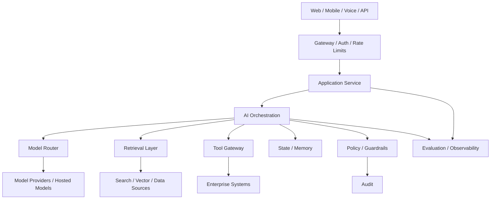
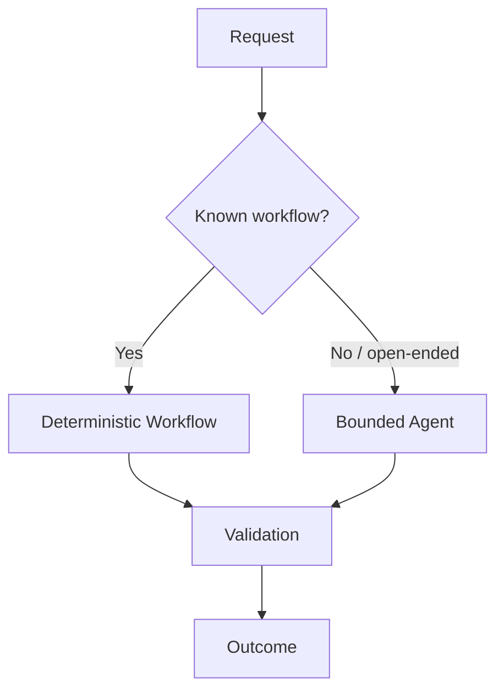
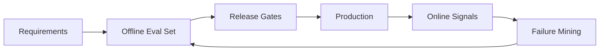
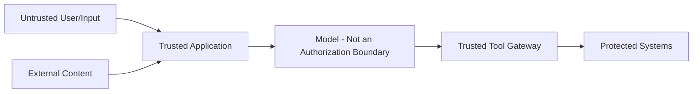
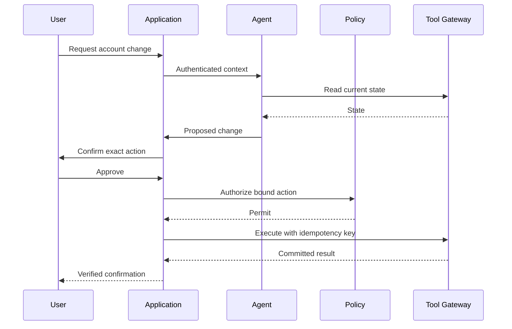

# AI Product Architecture

An AI product is not a model endpoint with a user interface.

A production AI product combines user experience, application logic, models, retrieval, tools, state, policy, evaluation, observability, reliability, and infrastructure into one governed system.

> **Design the product contract first. Choose models and frameworks after requirements and constraints are clear.**

---

## 1. Product Architecture vs Model Architecture

### Model architecture
Concerns the internal computational structure of a model.

### AI product architecture
Concerns how the entire product delivers a useful, safe, reliable outcome.

```text
UX
↓
Application / API
↓
AI orchestration
↓
Models ─ RAG ─ Agents ─ Tools
↓
State / Data / Memory
↓
Policy / Evaluation / Observability
↓
Infrastructure
```

A great model inside a weak product architecture still produces a weak product.

---

## 2. Start With the Product Contract

Define:

- who the users are,
- what jobs they need completed,
- what the system may and may not do,
- expected quality,
- acceptable latency,
- availability,
- privacy/security constraints,
- cost envelope,
- human escalation,
- regulatory/organizational requirements.

Architecture follows these constraints.

---

## 3. Functional Requirements

Example enterprise assistant:

- answer questions from authorized knowledge,
- cite evidence,
- search account information,
- create support cases,
- maintain conversational state,
- escalate to a human.

These describe capabilities, not implementation choices.

---

## 4. Non-Functional Requirements

Examples:

- p95 response target,
- availability SLO,
- tenant isolation,
- deletion/freshness SLA,
- auditability,
- maximum cost per successful task,
- regional data constraints,
- recovery objectives.

Non-functional requirements often drive architecture more than model choice.

---

## 5. High-Level Reference Architecture



The exact components vary, but separating responsibilities improves evolvability.

---

## 6. Experience Layer

The experience layer may include:

- chat,
- search,
- copilots,
- voice,
- workflow UI,
- IDE integration,
- APIs.

AI UX must expose uncertainty and action state appropriately.

For example, "drafted", "awaiting approval", and "executed" should not look identical.

---

## 7. API / Gateway Layer

Typical responsibilities:

- authentication,
- request validation,
- rate limiting,
- tenant identification,
- request IDs,
- quotas,
- routing,
- abuse protection.

Do not make the model responsible for determining who the authenticated user is.

---

## 8. Application Service

The application service owns product-level logic such as:

- session lifecycle,
- feature flags,
- user settings,
- workflow entry points,
- persistence,
- product entitlements.

Keep core business truth outside prompt text.

---

## 9. AI Orchestration Layer

The orchestration layer coordinates:

- context assembly,
- model calls,
- retrieval,
- tools,
- agent loops,
- validation,
- fallback,
- approvals.

It may be deterministic, agentic, or hybrid.

Use autonomy only where runtime decision-making adds value.

---

## 10. Deterministic vs Agentic Paths



Do not turn every feature into an agent.

---

## 11. Model Layer

A product may use different models for:

- generation,
- extraction,
- embeddings,
- reranking,
- moderation,
- vision/audio,
- classification,
- judging/evaluation.

Avoid coupling product logic directly to one provider-specific API when portability matters.

---

## 12. Model Routing

Route based on:

- task,
- risk,
- modality,
- latency,
- context size,
- tool requirements,
- cost,
- quality.

Routing must itself be evaluated.

---

## 13. Provider Abstraction

An abstraction can normalize:

- request/response contracts,
- timeouts,
- retries,
- usage accounting,
- structured output,
- tool-call representation.

Do not abstract away important provider capabilities into a lowest-common-denominator interface unless that trade-off is intentional.

---

## 14. Retrieval Layer

RAG products need more than a vector database.

```text
query understanding
→ authorization filtering
→ lexical/vector retrieval
→ fusion
→ reranking
→ context construction
→ grounded generation
```

See [Production RAG System Design](production-rag.md).

---

## 15. Knowledge Ingestion

Offline/async ingestion may include:

- source connectors,
- parsing,
- chunking,
- metadata,
- embeddings,
- indexing,
- ACL propagation,
- versioning,
- deletion.

Online serving should not carry ingestion complexity unnecessarily.

---

## 16. Data Freshness

Define:

- source-of-truth,
- synchronization model,
- freshness SLA,
- deletion propagation,
- index publication semantics.

A technically accurate answer from stale data can still be a product failure.

---

## 17. Tool / Action Layer

Tools expose capabilities such as:

- account lookup,
- ticket creation,
- code execution,
- calendar operations,
- payments.

Separate read and write capabilities where possible.

---

## 18. Tool Gateway

A centralized gateway can enforce:

- identity,
- authorization,
- schemas,
- timeouts,
- idempotency,
- egress rules,
- audit,
- secrets.

The model proposes a tool call; trusted infrastructure decides whether it may execute.

---

## 19. State

State can include:

- session,
- task/workflow,
- durable business state,
- agent checkpoint,
- pending approval.

Do not use the model context window as the database.

---

## 20. Memory

Memory is selected prior information used to improve future decisions.

Separate:

- short-term working state,
- episodic history,
- semantic/user memory,
- authoritative business data.

Authoritative business truth should usually remain in source systems.

---

## 21. Context Engineering

At each decision, assemble the minimum sufficient, trustworthy, authorized context.

Possible sources:

```text
system policy
+ task state
+ recent conversation
+ selected memory
+ retrieved evidence
+ tool schemas/results
```

See [Context Engineering](../03-production-ai/context-engineering.md).

---

## 22. Policy Layer

Policy should answer questions such as:

- may this user access this resource?
- may this agent call this tool?
- does this write require approval?
- may this data leave the region?
- is this output allowed?

Policy decisions should be enforceable outside the model.

---

## 23. Guardrails

Use layered controls:

```text
input validation
→ context trust boundaries
→ authorization
→ tool policy
→ output validation
→ human approval where needed
```

Prompt instructions alone are not a security boundary.

See [Security & Guardrails](../03-production-ai/security-and-guardrails.md).

---

## 24. Human-in-the-Loop

Human involvement can be used for:

- approval,
- exception handling,
- expert review,
- escalation,
- correction.

Design human work as part of the workflow, not as an afterthought.

---

## 25. Approval Binding

For high-impact actions, bind approval to:

- action type,
- target,
- parameters,
- version/state,
- expiration.

Do not accept "yes" as approval for a materially changed action.

---

## 26. Evaluation Architecture

Evaluation should exist before production incidents force it.



See [Evaluation & Observability](../03-production-ai/evaluation-and-observability.md).

---

## 27. Product Metrics vs Model Metrics

Model quality metrics are not product outcomes.

Track both.

Examples:

```text
model: groundedness, tool accuracy
product: resolution rate, successful task, escalation, user correction
business: conversion, support cost, time saved
```

Do not optimize a proxy without watching the actual product goal.

---

## 28. Observability

Connect:

```text
request_id
session_id
task_id
model_call_id
retrieval_id
tool_call_id
approval_id
```

A distributed AI product needs traceable causality.

---

## 29. Provenance

Record important versions:

- model,
- prompt,
- agent,
- retrieval index,
- toolset,
- policy,
- feature configuration.

Without provenance, regressions become hard to reproduce.

---

## 30. Reliability Architecture

Design for partial failure:

- provider timeout,
- search outage,
- tool failure,
- queue backlog,
- malformed model output,
- user disconnect.

Use bounded retries, idempotency, circuit breakers, graceful degradation, and durable workflows where appropriate.

See [Reliability & Resilience](../03-production-ai/reliability-and-resilience.md).

---

## 31. Graceful Degradation

Examples:

- agent unavailable → read-only search,
- reranker unavailable → safe retrieval fallback,
- write tool unavailable → draft but do not execute,
- memory unavailable → continue without personalization if safe.

Fallbacks must preserve policy/security.

---

## 32. Async Architecture

Long-running tasks may use:

```text
request
→ accepted task
→ durable queue/workflow
→ checkpoints
→ completion event
→ notification/result
```

Do not hold an interactive HTTP request open for work that naturally lasts minutes.

---

## 33. Event-Driven Workflows

Events are useful for:

- ingestion,
- asynchronous tools,
- long-running agents,
- notifications,
- evaluation pipelines.

Define delivery semantics, deduplication, ordering needs, and dead-letter handling.

---

## 34. Caching

Possible layers:

- exact response,
- semantic result,
- retrieval,
- embeddings,
- tool reads,
- prompt/prefix.

Cache keys must account for authorization, freshness, model/prompt/index versions, and policy.

---

## 35. Performance Architecture

Measure the full critical path:

```text
gateway
+ retrieval
+ model
+ tools
+ verification
+ network / queue
```

Optimize bottlenecks rather than whichever component is easiest to tune.

See [Performance, Latency & Cost](../03-production-ai/performance-latency-and-cost.md).

---

## 36. Cost Architecture

Attribute cost by:

- tenant,
- feature,
- workflow,
- model,
- agent,
- tool.

Optimize **cost per successful task**, not only token price.

---

## 37. Multi-Tenancy

Tenant isolation affects:

- authentication,
- retrieval filters,
- caches,
- memory,
- logs,
- tool credentials,
- evaluation data.

Tenant identity should flow through the architecture explicitly.

---

## 38. Data Architecture

Classify data:

- public/reference,
- internal,
- confidential,
- regulated/sensitive,
- ephemeral interaction data.

Use classification to drive storage, logging, model routing, retention, and egress.

---

## 39. Privacy

Apply:

- minimization,
- purpose limitation,
- retention,
- access controls,
- deletion,
- redaction,
- regional/provider constraints as required.

Observability should not become an uncontrolled copy of sensitive context.

---

## 40. Security Trust Boundaries



Model output is untrusted until validated for the intended use.

---

## 41. Prompt Injection

Retrieved documents and tool output can contain instructions.

Maintain authority hierarchy:

```text
trusted policy/instructions
> application-controlled context
> user request
> retrieved/tool/external content as data
```

Do not concatenate everything and assume the model will infer trust correctly.

---

## 42. Deployment Topology

Possible choices:

- managed model APIs,
- self-hosted models,
- hybrid,
- region-specific deployment.

Trade-offs include:

- control,
- cost,
- latency,
- operational burden,
- compliance,
- model availability.

---

## 43. Model Gateway

A model gateway can centralize:

- credentials,
- routing,
- quotas,
- logging,
- fallbacks,
- cost attribution,
- policy.

Avoid making it a single unscaled failure domain.

---

## 44. Configuration and Feature Flags

Version and control:

- prompts,
- model routes,
- retrieval parameters,
- tool availability,
- guardrail thresholds.

Feature flags enable canaries and emergency disablement without redeploying everything.

---

## 45. CI/CD for AI Products

A release pipeline may include:

```text
unit / deterministic tests
→ offline AI evals
→ security checks
→ integration tests
→ performance tests
→ canary
→ online monitoring
```

Treat prompts/model/configuration changes as production changes.

---

## 46. Environment Separation

Maintain controlled:

- development,
- staging,
- production.

Avoid production writes from evaluation environments. Use sandboxed tools and synthetic/test accounts.

---

## 47. Versioning

Version independently:

```text
application
agent/workflow
prompt
model
retrieval index
tool schemas
policy
evaluation set
```

This supports rollback and attribution.

---

## 48. Scalability

Scale components according to their bottlenecks:

- stateless APIs horizontally,
- model serving by compute/memory,
- retrieval by index/query load,
- queues by throughput,
- tools by downstream limits.

Agent fan-out can multiply load unexpectedly.

---

## 49. Capacity Planning

Estimate:

```text
requests/sec
× model calls/request
× average tokens
× tool calls
× retrieval queries
× peak factor
```

Use peak distributions, not only daily averages.

---

## 50. Rate Limits and Quotas

Protect:

- model providers,
- expensive tools,
- tenant fairness,
- budgets.

Apply limits at meaningful scopes rather than one global number.

---

## 51. Build vs Buy

For each component ask:

- Is this differentiated product logic?
- Is a managed service mature enough?
- What is lock-in risk?
- What operational burden does ownership create?
- What compliance/control is required?

Do not self-host simply because it feels more architectural.

---

## 52. Framework Selection

Choose frameworks after architecture.

Evaluate:

- transparency,
- control,
- portability,
- ecosystem,
- state/durability support,
- observability,
- testing,
- operational fit.

Keep important domain contracts independent of framework-specific abstractions when practical.

---

## 53. Example: Enterprise Knowledge Copilot

```text
employee
→ SSO
→ tenant/ACL-aware gateway
→ query orchestration
→ hybrid retrieval + rerank
→ context construction
→ model
→ citation validation
→ response
```

Offline ingestion synchronizes documents, ACLs, versions, and deletions.

Production concerns include groundedness, freshness, permissions, latency, and citation correctness.

---

## 54. Example: Action-Oriented Support Agent



The model never directly owns authorization.

---

## 55. Example: AI Coding Product

Architecture may include:

- repository context service,
- search/index,
- model/router,
- sandbox,
- patch generator,
- test runner,
- Git integration,
- approval/deployment boundaries.

The code model is only one subsystem.

---

## 56. Example: Multimodal Assistant

A multimodal product may add:

- speech ingress,
- image/document processing,
- modality routing,
- streaming,
- turn management.

See [Multimodal & Conversational Agents](../02-agentic-ai/advanced/multimodal-and-conversational-agents.md).

---

## 57. Architecture Decision Records

Capture important decisions:

```text
Decision: hybrid retrieval
Context: exact identifiers + semantic questions
Alternatives: vector-only, lexical-only
Trade-off: higher complexity for better coverage
Metrics: Recall@K, task success, p95 latency, cost
```

This prevents architecture from becoming unexplained convention.

---

## 58. Failure Mode Review

Before launch ask:

- What if the model is wrong?
- What if retrieval returns nothing?
- What if retrieval returns unauthorized content?
- What if a tool times out after committing?
- What if the provider is unavailable?
- What if the user disconnects?
- What if context contains malicious instructions?
- What if costs spike?
- What if a model update changes behavior?

Architecture should contain answers.

---

## 59. MVP vs Production

### MVP
Optimize learning speed while keeping essential safety boundaries.

### Production
Add mature:

- evaluation,
- observability,
- security,
- reliability,
- data lifecycle,
- scaling,
- cost control,
- governance.

Do not confuse prototype convenience with production architecture.

---

## 60. Evolution Strategy

A sensible progression may be:

```text
single model call
→ grounded RAG
→ tools
→ deterministic workflow
→ bounded agent where useful
→ durable long-running workflows
→ specialized/multi-agent architecture only when justified
```

Complexity should be earned by requirements.

---

## 61. Architecture Review Checklist

Review:

- product requirements,
- trust boundaries,
- source-of-truth ownership,
- model responsibilities,
- retrieval freshness/ACLs,
- tool authorization,
- state/memory,
- context construction,
- evaluation/release gates,
- observability,
- failure handling,
- SLOs,
- latency/cost,
- data/privacy,
- rollout/rollback,
- human escalation.

---

## 62. Common Anti-Patterns

Avoid:

- model-first architecture,
- framework-first architecture,
- one giant prompt containing the product,
- using context as durable state,
- vector DB as the authorization layer,
- agent autonomy for deterministic workflows,
- direct model access to privileged credentials,
- logging every prompt/result without data policy,
- optimizing token price while ignoring failed tasks,
- shipping without evals.

---

## 63. Interview Framework

For an AI product system-design interview:

1. clarify users and use cases,
2. define functional/non-functional requirements,
3. establish trust/data boundaries,
4. choose deterministic vs agentic control,
5. design model/retrieval/tool layers,
6. define state, memory, and context,
7. design authorization and human approval,
8. define evaluation and observability,
9. handle reliability/fallbacks,
10. estimate latency/cost/capacity,
11. discuss scaling/deployment,
12. explain alternatives and trade-offs.

---

## 64. Key Takeaways

- AI product architecture is broader than model architecture.
- Requirements and product contracts come before technology choices.
- Separate model inference from trusted authorization and execution.
- State, memory, retrieval, and context are different responsibilities.
- Evaluation, security, reliability, and cost are architectural components, not post-launch add-ons.
- Prefer the simplest architecture that satisfies the product contract.
- Optimize for successful user outcomes, not impressive model behavior.

---

## Continue Learning

- [Production RAG System Design](production-rag.md)
- [Agent Architecture](../02-agentic-ai/advanced/agent-architecture.md)
- [Multimodal & Conversational Agents](../02-agentic-ai/advanced/multimodal-and-conversational-agents.md)
- [Evaluation & Observability](../03-production-ai/evaluation-and-observability.md)
- [Security & Guardrails](../03-production-ai/security-and-guardrails.md)
- [Reliability & Resilience](../03-production-ai/reliability-and-resilience.md)
- [Performance, Latency & Cost](../03-production-ai/performance-latency-and-cost.md)
