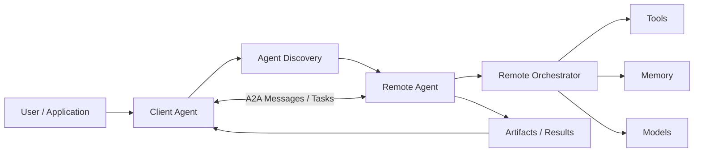
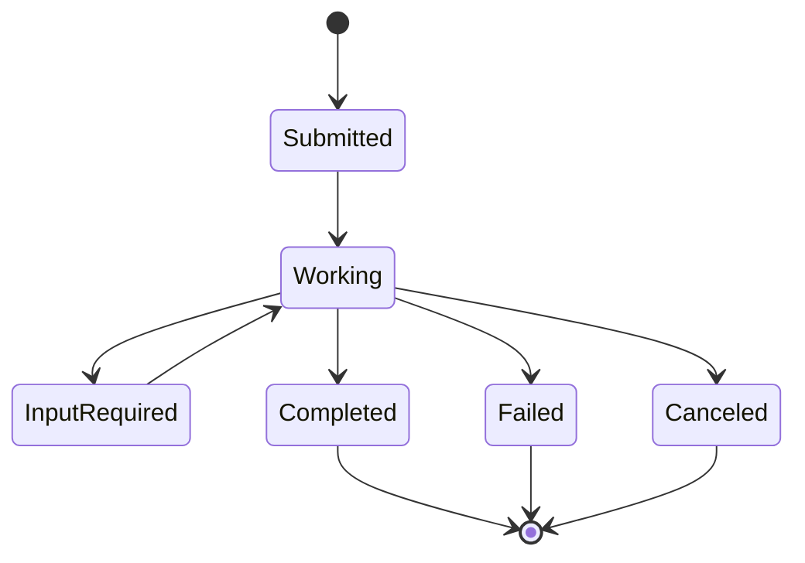
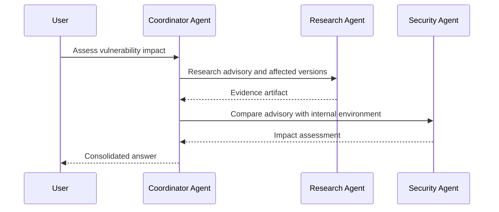
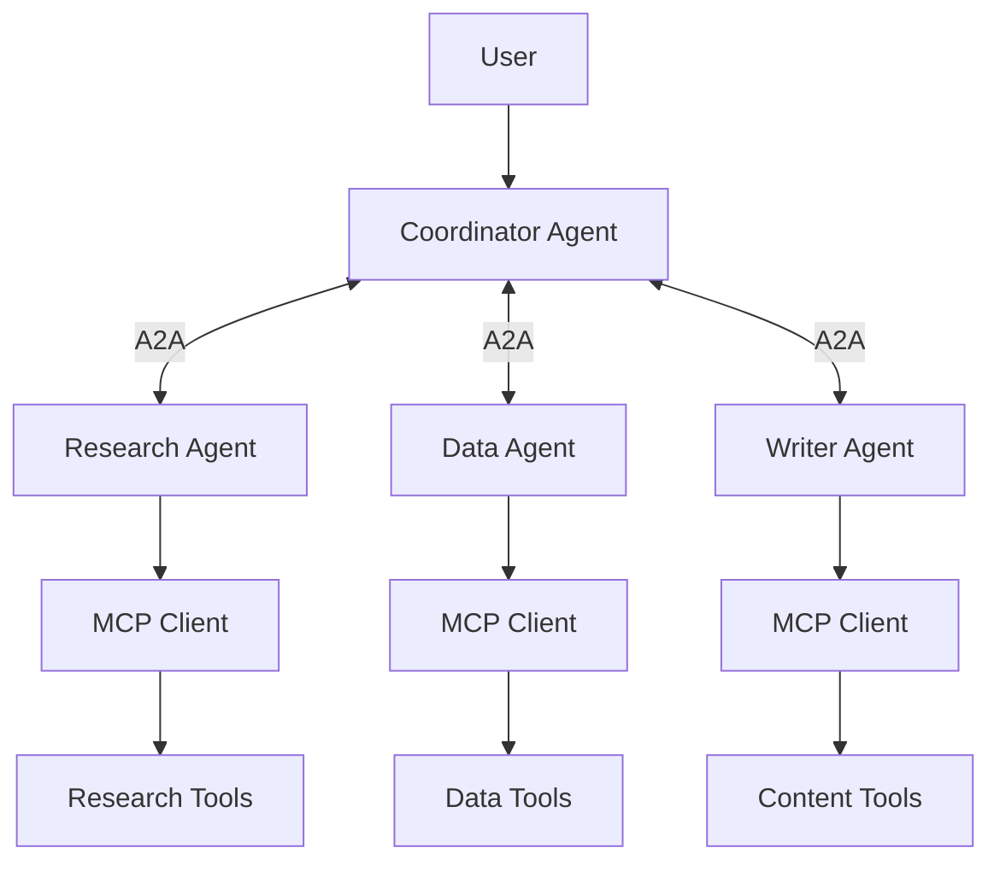

# Agent2Agent (A2A) Protocol

> **A2A = Agent2Agent:** an open protocol for communication and interoperability between independent AI agents.

A2A belongs in an Agentic AI architecture when one agent needs to discover, communicate with, delegate work to, or receive results from another agent—potentially built with a different framework or operated by a different organization.

It is **not** generic Application-to-Application messaging, and it is **not** a replacement for MCP.

---

## 1. Why A2A Exists

Agent systems are increasingly built using different:

- frameworks,
- programming languages,
- model providers,
- tool stacks,
- cloud environments,
- organizational boundaries.

Without a common interoperability layer, every pair of agents requires custom integration.

```text
Agent A ──custom integration── Agent B
Agent A ──different integration── Agent C
Agent B ──another integration── Agent C
```

A2A provides a common interaction model so independent agentic systems can collaborate without exposing their internal implementation.

### Mental Model

Think of an agent as a service with capabilities rather than as a function.

A2A helps answer:

```text
Who are you?
What can you do?
How can I communicate with you?
Can I delegate this task?
What is the task status?
What artifact/result did you produce?
```

---

## 2. A2A vs MCP

A2A and MCP solve different interoperability problems.

| Question | MCP | A2A |
|---|---|---|
| Primary relationship | AI application ↔ tools/resources | agent ↔ agent |
| Purpose | expose capabilities/data to an AI application | enable independent agents to collaborate |
| Typical interaction | call tool, access resource | delegate/manage a task |
| Internal implementation | capability exposed through server | remote agent can remain opaque |
| Example | agent queries CRM tool | travel agent delegates to booking agent |

A useful mental model:

```text
             A2A
      Agent A ↔ Agent B
         ↓         ↓
        MCP       MCP
         ↓         ↓
       Tools     Tools
```

MCP is commonly the **vertical capability layer**.

A2A is the **horizontal agent interoperability layer**.

---

## 3. Core Architecture



The client agent does not need access to the remote agent's:

- chain of internal decisions,
- private memory,
- tool implementations,
- proprietary orchestration.

It interacts through the protocol boundary.

---

## 4. Agent Discovery and Agent Cards

Before delegating work, a client needs to know what a remote agent can do.

A2A uses an **Agent Card** to advertise metadata such as:

- agent identity,
- description,
- supported protocol version,
- service interfaces,
- capabilities,
- skills,
- supported input/output media types,
- authentication/security requirements.

Conceptually:

```json
{
  "name": "Research Agent",
  "description": "Researches technical topics and returns evidence-backed reports.",
  "version": "1.4.0",
  "skills": [
    {
      "name": "technical-research",
      "description": "Research and synthesize technical subjects"
    }
  ]
}
```

Do not put secrets or private implementation details in public discovery metadata.

---

## 5. Skills

A skill describes a capability offered by an agent.

Examples:

```text
ResearchAgent
  - web research
  - literature review
  - evidence synthesis

TravelAgent
  - flight research
  - itinerary planning

SecurityAgent
  - vulnerability assessment
  - remediation guidance
```

Skills help clients determine whether delegation is appropriate.

---

## 6. Client Agent and Remote Agent

### Client Agent

Initiates interaction on behalf of a user/system.

Responsibilities may include:

- discovering remote agents,
- selecting an appropriate agent,
- authenticating,
- sending messages/tasks,
- tracking progress,
- consuming artifacts.

### Remote Agent

Exposes an A2A-compatible interface.

It may internally use:

- an LLM,
- workflows,
- multiple sub-agents,
- MCP tools,
- databases,
- human approval.

Those internals remain behind the boundary.

---

## 7. Messages, Parts, Tasks, and Artifacts

A2A distinguishes several useful concepts.

### Message

A communication turn between the client and remote agent.

### Part

A unit of content carried by a message or artifact.

Depending on the protocol/version and negotiated capabilities, content can represent text, files, or structured data.

### Task

A stateful unit of work.

This is important because agent work can be long-running rather than a single request/response.

### Artifact

An output produced by the agent.

Examples:

- report,
- generated document,
- structured analysis,
- file,
- result dataset.

---

## 8. Why Tasks Matter

Traditional APIs often look like:

```text
Request → Response
```

Agent work may look like:

```text
Delegate task
    ↓
Working
    ↓
Need more input
    ↓
Continue
    ↓
Artifact produced
    ↓
Completed
```

A2A provides semantics for stateful collaboration rather than treating every interaction as an isolated function call.

---

## 9. Task Lifecycle

Conceptually:



Exact protocol states should follow the current specification, but the architectural idea is durable task management.

---

## 10. Synchronous Interaction

For short tasks:

```text
Client Agent
    ↓ request
Remote Agent
    ↓ result
Client Agent
```

Example:

> Summarize this structured incident report.

The result may be returned immediately.

---

## 11. Streaming

For progressive results:

```text
Client → Remote Agent
           ↓
       progress
           ↓
       artifact chunk
           ↓
       status update
           ↓
       completion
```

Streaming improves user experience for long operations.

---

## 12. Asynchronous / Long-Running Work

Some tasks outlive the original connection.

Example:

> Research 50 vendors and produce a comparison report.

A robust architecture needs:

- durable task IDs,
- status retrieval,
- resumability,
- notifications or polling,
- persistent artifacts.

A2A is designed for agent interactions where work may be asynchronous.

---

## 13. Delegation Example

User asks a coordinator:

> Analyze whether our services are affected by a newly disclosed vulnerability.

Possible flow:



A2A can provide the interoperability boundary between independently implemented agents.

---

## 14. Opaque Agents

One of the useful design principles is that agents can collaborate without exposing internal state.

Remote Agent A does not need to reveal:

```text
private prompts
internal memory
proprietary planning
tool credentials
implementation details
```

It advertises capabilities and exchanges protocol-level messages/results.

This reduces coupling.

---

## 15. Transport and Bindings

Modern A2A defines a common semantic model with protocol bindings for agent communication over standard network technologies.

Architecturally, separate:

```text
A2A semantics
      ↓
protocol binding
      ↓
HTTP/network transport
```

This lets interoperability semantics remain stable even when implementations use different supported bindings.

Always check the current A2A specification when implementing because protocol details and supported bindings evolve.

---

## 16. Security

A2A does not mean "trust every agent."

A production deployment must consider:

- authentication,
- authorization,
- TLS,
- tenant isolation,
- scope-limited credentials,
- artifact validation,
- input validation,
- audit logging,
- rate limits,
- delegation policy.

```text
Remote Agent Identity
       ↓
Authentication
       ↓
Authorization
       ↓
Allowed Skill / Task
       ↓
Execution
```

---

## 17. Delegation Is Not Authorization

Suppose Agent A asks Agent B:

> Delete production customer data.

The existence of an A2A connection does not authorize that operation.

The receiving system must independently enforce:

- caller identity,
- user authority,
- organizational policy,
- action-specific permissions,
- human approval when appropriate.

Protocol connectivity is not permission.

---

## 18. Trust Boundaries

Remote agent output should be treated as external input.

A remote agent may return:

- incorrect information,
- malformed structured data,
- malicious instructions,
- stale data,
- unsupported claims.

Validate outputs before they influence high-impact actions.

---

## 19. Agent Selection

When several remote agents expose overlapping skills, a coordinator may select based on:

```text
capability match
authorization
trust
latency
cost
availability
historical success
data locality
```

Discovery tells you what agents claim they can do.

Evaluation tells you how well they actually do it.

---

## 20. Failure Handling

Distributed agents introduce distributed-systems failures:

- remote agent unavailable,
- timeout,
- partial result,
- task failure,
- duplicated request,
- stale status,
- incompatible protocol version,
- authentication failure.

Design:

- bounded retries,
- idempotency where needed,
- task correlation IDs,
- timeouts,
- cancellation,
- fallback agents,
- graceful degradation.

---

## 21. Observability

Trace across agent boundaries:

```text
User request
└── Coordinator task
    ├── Remote Agent A task
    │   ├── status
    │   └── artifact
    └── Remote Agent B task
        ├── status
        └── artifact
```

Useful metadata:

- task ID,
- remote agent identity,
- protocol version,
- skill,
- timestamps,
- status transitions,
- latency,
- artifact IDs,
- errors,
- authentication context.

Do not log secrets or unnecessary sensitive content.

---

## 22. A2A in a Multi-Agent Architecture



A2A handles inter-agent collaboration.

MCP can handle each agent's tool/resource integration.

---

## 23. A2A vs Internal Sub-Agent Calls

Not every multi-agent architecture needs A2A.

If all agents:

- run inside one process,
- share one framework,
- use the same orchestrator,
- are tightly coupled,

native framework primitives may be simpler.

A2A becomes especially valuable when agents are:

- independently deployed,
- framework-independent,
- vendor-independent,
- organization-independent,
- exposed as reusable agentic services.

---

## 24. A2A Is Not an Agent Framework

A2A does not tell you how to build:

- memory,
- planning,
- tool orchestration,
- prompts,
- model routing,
- internal sub-agents.

It standardizes the **communication boundary between agentic applications**.

---

## 25. A2A Is Not MCP

Do not model a remote autonomous agent as merely another low-level tool when the interaction requires:

- delegation,
- long-running state,
- negotiation,
- artifacts,
- agent-level collaboration.

Likewise, do not use A2A just to expose a simple calculator or database lookup. MCP or a normal API may be more appropriate.

---

## 26. Production Design Checklist

### Discovery
- How are Agent Cards discovered?
- Are capabilities cached/versioned?
- Can discovery metadata be trusted?

### Identity
- Who is calling?
- On whose behalf?

### Delegation
- Which skills may be invoked?
- What context is shared?
- What must remain private?

### Tasks
- How are long-running tasks persisted?
- How are cancellation and retries handled?

### Security
- Authentication?
- Authorization?
- Tenant isolation?
- Human approval?

### Reliability
- Timeouts?
- Fallback agents?
- Idempotency?
- Version compatibility?

### Observability
- Cross-agent tracing?
- Task correlation?
- Artifact provenance?

---

## 27. Interview Discussion Framework

For an A2A architecture question:

1. Explain why independent agents need interoperability.
2. Distinguish A2A from MCP and ordinary APIs.
3. Define client and remote agent boundaries.
4. Explain Agent Cards and skills.
5. Explain messages, tasks, and artifacts.
6. Design synchronous vs long-running interaction.
7. Add authentication and authorization.
8. Treat remote output as untrusted.
9. Add retries, cancellation, and idempotency.
10. Add cross-agent tracing.
11. Discuss version compatibility.
12. Explain when native sub-agent calls are simpler.

---

## 28. Key Takeaways

- A2A means **Agent2Agent** in this repository's Agentic AI context.
- It standardizes communication between independent agentic applications.
- Agent Cards enable capability discovery.
- Tasks model stateful work; artifacts represent outputs.
- A2A supports agent collaboration without exposing internal memory, tools, or proprietary logic.
- A2A and MCP are complementary: **agent-to-agent vs agent-to-capability**.
- Connectivity does not imply authorization.
- Remote agents and their outputs cross a trust boundary.
- Long-running agent work requires durable task management, cancellation, retries, and observability.
- Use A2A when interoperability across independent agent systems is valuable; do not add it to tightly coupled internal workflows without a reason.

---

## Continue Learning

- [AI Agents](AI%20Agents.md)
- [Single-Agent vs Multi-Agent](Single-Agent%20vs.%20Multi-Agent.md)
- [Multi-Agent Collaboration](Multi-Agent%20Collaboration.md)
- [MCP](MCP%20%28Model%20Context%20Protocol%29.md)
- [Agent Architecture & Agent Loops](docs/agentic-ai/agent-architecture.md)
- [Tool Use & Agent Orchestration](docs/agentic-ai/tool-use-and-orchestration.md)
