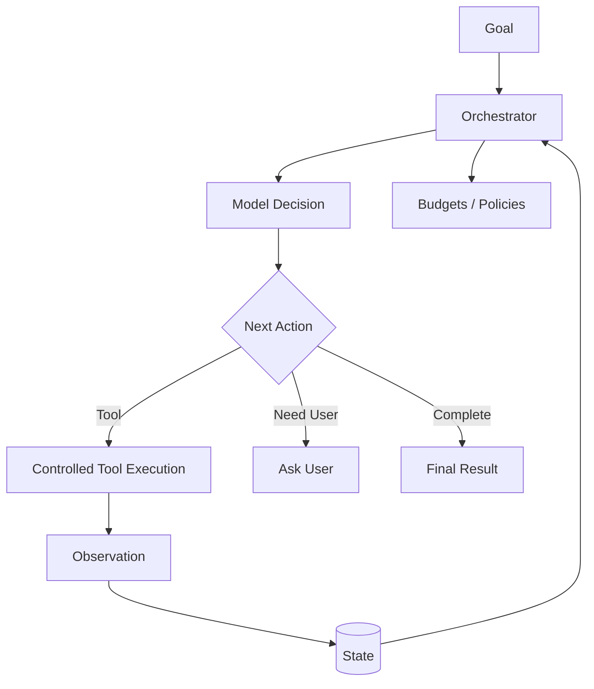
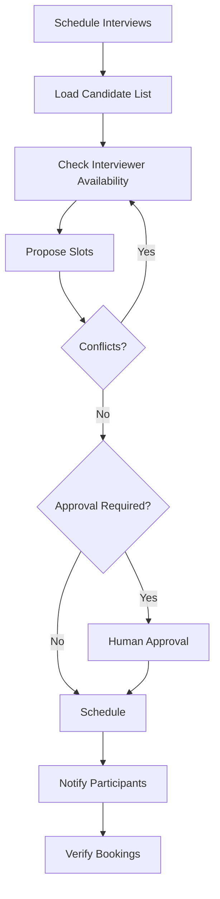

# AI Agents

An AI agent is a software system that uses a model to make **dynamic decisions about what to do next** in pursuit of a goal.

The strongest idea from the original chapter remains central:

```text
Goal
 ↓
Decide
 ↓
Act / Use Tool
 ↓
Observe Result
 ↓
Update
 ↓
Continue or Stop
```

Tools, state, memory, and planning can make an agent more capable, but they should be added because the task needs them—not because every agent must contain every feature.

This chapter provides the fundamentals. Continue into the engineering deep dives at the end.

---

## 1. LLM vs Workflow vs Agent

These concepts are related but different.

### LLM call

```text
Input → Model → Output
```

Useful for:

- summarization,
- extraction,
- classification,
- generation.

### Deterministic workflow

```text
Step A → Step B → Step C
```

Software decides the sequence.

### Agent

```text
Goal
 ↓
Model/runtime decides next action
 ↓
Environment changes
 ↓
Observation
 ↓
Next decision
```

The defining feature is **dynamic control over actions**, not simply the presence of an LLM.

---

## 2. Why Agents Exist

Many tasks cannot be solved by one response.

Examples:

- investigate an incident,
- research a topic across sources,
- schedule around changing availability,
- diagnose a system,
- complete a workflow whose next step depends on intermediate results.

An agent can adapt its next action based on what it observes.

---

## 3. Mental Model

Think of a well-designed agent as a **controlled decision loop**, not an unconstrained autonomous model.



The model helps decide.

The runtime enforces constraints.

---

## 4. Core Building Blocks

A practical agent architecture can contain:

- **goal** — desired outcome,
- **model/policy** — semantic decision-maker,
- **orchestrator** — controls the loop,
- **tools** — external capabilities,
- **state** — current execution information,
- **memory** — selected persisted information when needed,
- **planning** — decomposition when needed,
- **guardrails/policy** — deterministic boundaries,
- **observability** — traces and metrics,
- **stopping conditions** — prevent endless execution.

---

## 5. Agency

Agency means the system can choose among actions based on the current situation.

Example:

User goal:

> Investigate why checkout errors increased.

The agent may decide to:

1. inspect metrics,
2. inspect recent deployments,
3. search logs,
4. compare configuration,
5. stop when evidence is sufficient.

The exact path can change based on observations.

---

## 6. Goals

A goal should define what success means.

Weak:

```text
"Investigate."
```

Better:

```text
"Identify the most likely cause of the checkout error spike,
provide supporting evidence, and recommend a safe next action."
```

Good goals improve:

- planning,
- stopping,
- evaluation.

---

## 7. Environment

The environment is everything the agent can observe or affect.

Examples:

- APIs,
- databases,
- files,
- websites,
- calendars,
- ticket systems,
- code repositories,
- users,
- other agents.

The agent does not directly control the environment. It interacts through defined interfaces.

---

## 8. The Agent Loop

```text
Perceive
  ↓
Decide
  ↓
Act
  ↓
Observe
  ↓
Update State
  ↓
Stop or Continue
```

This loop is the foundation of agentic behavior.

---

## 9. Example: HR Interview Scheduler

The original HR scheduler example is a useful agent scenario.

Goal:

> Schedule interviews for shortlisted candidates.

Possible capabilities:

- candidate database,
- interviewer calendars,
- scheduling system,
- email/notification service.

Flow:



The agent can adapt if a calendar is unavailable or a slot conflicts.

---

## 10. Tools

Tools let the system access authoritative data or perform external actions.

Examples:

```text
search_flights
check_calendar
get_candidate
create_interview
send_notification
```

Without tools, a model can still reason or generate text, but it cannot independently change external state.

---

## 11. Tool Calling Does Not Automatically Mean Agent

A model call that invokes one predetermined tool can still be part of a normal workflow.

Example:

```text
Question → lookup_order → LLM formats answer
```

That is not necessarily an autonomous agent.

Agentic behavior appears when the system dynamically chooses and sequences actions based on observations.

---

## 12. Read vs Write Tools

Read:

```text
get_calendar
search_documents
get_order
```

Write:

```text
schedule_interview
cancel_order
send_email
```

Write tools create greater risk and usually need stronger:

- authorization,
- validation,
- confirmation,
- audit.

---

## 13. Structured Tool Calls

Prefer structured contracts:

```json
{
  "tool": "check_calendar",
  "arguments": {
    "interviewer_id": "i-42",
    "date": "2026-10-10"
  }
}
```

The application validates arguments before execution.

See [Tool Use & Agent Orchestration](docs/agentic-ai/tool-use-and-orchestration.md).

---

## 14. State

State tracks what is happening in the current run.

Example:

```json
{
  "goal": "schedule interviews",
  "candidate_index": 3,
  "scheduled": 2,
  "pending": 4,
  "tool_calls": 7
}
```

State is not the same as long-term memory.

---

## 15. Memory

Memory persists selected information for future use.

Examples:

- stable user preference,
- prior task outcome,
- validated lesson,
- unresolved commitment.

An agent **does not require long-term memory to be an agent**.

For many tasks, current-run state is enough.

Persistent memory should be added when continuity or experience materially improves future behavior.

See [Agent Memory Architecture](docs/agentic-ai/agent-memory.md).

---

## 16. Planning

Planning decomposes a goal into actions.

Example:

```text
Goal: organize team meeting

1. identify participants
2. retrieve availability
3. find candidate slots
4. confirm constraints
5. schedule
6. verify
```

But simple tasks do not need a generated plan.

If the control flow is already known, deterministic software is often better.

See [Planning & Reasoning Patterns](docs/agentic-ai/planning-and-reasoning.md).

---

## 17. Reactive Agents

A reactive agent chooses one next action at a time.

```text
Observe → Decide → Act → Observe
```

Useful for short, uncertain tasks.

---

## 18. Plan-and-Execute Agents

For longer tasks:

```text
Goal
 ↓
Create plan
 ↓
Execute steps
 ↓
Observe
 ↓
Replan if needed
 ↓
Verify completion
```

This adds visibility but also latency, cost, and state complexity.

---

## 19. Reasoning and Decisions

In engineering terms, the important output is not hidden internal reasoning; it is the observable decision trajectory:

```text
selected action
arguments
observation
state transition
completion decision
```

These are what we can test and trace.

---

## 20. Context

Context is the information given to the model for the current decision.

It may contain:

- instructions,
- current goal,
- state,
- relevant conversation,
- selected memory,
- tool schemas,
- recent observations,
- retrieved knowledge.

More context is not always better.

---

## 21. RAG and Agents

RAG retrieves external knowledge.

An agent can use retrieval as one capability.

```text
Agent
 ↓
Decides knowledge is needed
 ↓
RAG / Search
 ↓
Evidence
 ↓
Agent decides next step
```

When retrieval itself becomes adaptive and iterative, the architecture becomes [Agentic RAG](docs/agentic-ai/agentic-rag.md).

---

## 22. Guardrails

Agents that can act need deterministic boundaries.

Guardrails may enforce:

- tool permissions,
- argument constraints,
- spending limits,
- maximum iterations,
- content policy,
- approval requirements,
- data access.

Do not ask the model to enforce its own security boundary.

---

## 23. Human-in-the-Loop

Human approval is useful for:

- financial actions,
- external communication,
- production changes,
- destructive operations,
- ambiguous high-impact decisions.

```text
Agent proposes action
      ↓
Policy requires approval
      ↓
Human reviews exact action
      ↓
Approve / Reject
```

Autonomy should be proportional to risk.

---

## 24. Stopping Conditions

Agents need explicit stopping rules.

Stop when:

- goal is complete,
- user input is required,
- approval is denied,
- evidence is insufficient,
- action budget is exhausted,
- repeated actions indicate a loop,
- an unrecoverable error occurs.

Unlimited loops are not autonomy; they are a reliability bug.

---

## 25. Failure Recovery

Agents should classify failures.

Examples:

- transient tool failure → retry,
- invalid argument → repair request,
- permission denied → stop/escalate,
- missing information → ask user/retrieve,
- repeated failure → fallback/terminate.

Retries should be bounded.

---

## 26. Reliability

Production reliability requires more than a good prompt.

Consider:

- timeouts,
- retries,
- idempotency,
- durable state,
- checkpointing,
- fallbacks,
- cancellation,
- circuit breakers,
- graceful degradation.

Agent engineering is partly distributed-systems engineering.

---

## 27. Security

Agent attack surfaces include:

- user input,
- retrieved documents,
- websites,
- tool responses,
- memory,
- other agents.

Important principles:

- least privilege,
- external authorization,
- treat observations as untrusted,
- keep secrets out of model context,
- audit consequential actions.

---

## 28. Evaluation

Evaluate the trajectory, not only the final prose.

### Outcome

Did the task succeed?

### Action selection

Were the right tools/actions chosen?

### Arguments

Were calls correct?

### Efficiency

How many steps/calls/tokens?

### Safety

Were permissions and approvals respected?

### Recovery

Did the system handle failures correctly?

---

## 29. Observability

A useful trace:

```text
Agent Run
├── goal
├── decision 1
│   ├── tool call
│   └── observation
├── decision 2
│   ├── tool call
│   └── observation
├── completion check
└── result
```

Tracing makes failures diagnosable.

---

## 30. Cost and Latency

Every loop can add:

- model inference,
- tool latency,
- retrieval,
- tokens,
- external API cost.

Use budgets:

```text
max_model_calls
max_tool_calls
max_iterations
max_elapsed_time
max_cost
```

A more autonomous architecture is not automatically a better architecture.

---

## 31. Single Agent vs Multi-Agent

Start with one agent when possible.

A single agent with good tools is:

- easier to evaluate,
- easier to debug,
- cheaper,
- easier to secure.

Move to multiple agents when specialization, independent ownership, parallel work, or interoperability provides a clear benefit.

See:

- [Single-Agent vs Multi-Agent](Single-Agent%20vs.%20Multi-Agent.md)
- [Multi-Agent Collaboration](Multi-Agent%20Collaboration.md)

---

## 32. Agents vs Workflows

| Dimension | Workflow | Agent |
|---|---|---|
| Control flow | predefined | dynamic |
| Predictability | high | lower |
| Adaptability | limited | high |
| Evaluation | easier | harder |
| Cost | usually lower | often higher |
| Best for | known processes | uncertain/open-ended tasks |

A strong production design is often hybrid:

```text
Deterministic Workflow
       ↓
Agentic Decision Point
       ↓
Controlled Tools
       ↓
Deterministic Validation
```

---

## 33. Common Anti-Patterns

### Agent for everything

Use normal software when the path is known.

### Unlimited autonomy

Bound tools, iterations, cost, and risk.

### Model-enforced permissions

Authorization belongs outside the model.

### Save everything as memory

Selective memory is safer and more useful.

### Multi-agent by default

Multiple agents introduce coordination cost.

### Tool success = goal success

Verify the actual outcome.

---

## 34. Production Design Checklist

Before calling a system an agent, answer:

### Goal
- What is success?
- What ends the run?

### Decisions
- Which choices are dynamic?
- Which can remain deterministic?

### Tools
- What can the agent read/write?
- What permissions exist?

### State
- What must survive each step?

### Memory
- Is persistent memory actually needed?

### Planning
- Is decomposition required?

### Safety
- Which actions require approval?

### Evaluation
- How will task and trajectory success be measured?

### Operations
- Budgets?
- retries?
- timeouts?
- tracing?
- cancellation?

---

## 35. Key Takeaways

- An AI agent is a **controlled system that makes dynamic decisions about actions toward a goal**.
- The LLM is a component, not the entire agent.
- Tool calling alone does not automatically make a system agentic.
- State tracks the current run; memory persists selected information across time.
- Long-term memory is useful but not mandatory for every agent.
- Planning should be used when complexity requires it.
- Deterministic workflows are preferable when control flow is known.
- The runtime should own permissions, budgets, validation, and stopping.
- Evaluate actions and trajectories, not just final text.
- Start with a single agent and add multi-agent complexity only when justified.

---

## Continue Learning

1. **AI Agents — this chapter**
2. [Agent Architecture & Agent Loops](docs/agentic-ai/agent-architecture.md)
3. [Tool Use & Agent Orchestration](docs/agentic-ai/tool-use-and-orchestration.md)
4. [Agent Memory Architecture](docs/agentic-ai/agent-memory.md)
5. [Planning & Reasoning Patterns](docs/agentic-ai/planning-and-reasoning.md)
6. [Agentic RAG](docs/agentic-ai/agentic-rag.md)
7. [Single-Agent vs Multi-Agent](Single-Agent%20vs.%20Multi-Agent.md)
8. [MCP](MCP%20%28Model%20Context%20Protocol%29.md)
9. [A2A](A2A%20Protocol.md)
