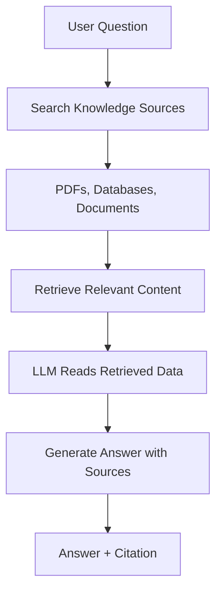

# Large Language Models (LLMs)

## 1. What are Large Language Models?

Large Language Models (LLMs) are advanced AI models trained on massive text datasets to **understand and generate human language**. They can perform a wide range of language tasks without requiring task-specific training from scratch.

**Popular Examples:**

* GPT-4 (OpenAI)
* Claude (Anthropic)
* Gemini (Google)
* LLaMA (Meta)
* Mistral

**Core Capabilities:**

* Answer questions across domains
* Generate and debug code
* Summarize long documents or reports
* Translate languages
* Reason through complex scenarios

**Real-World Example:**  
A legal assistant AI powered by GPT-4 can:
* Read and analyze contracts
* Identify potential risks and liabilities
* Summarize key obligations and terms

---

## 2. What are Foundation Models?

**Definition:**  
Foundation models are **pre-trained LLMs** trained on large, general datasets. They can be adapted for specific tasks **without retraining from scratch**.

**Key Characteristics:**

* **Pre-trained:** Ready to use via APIs immediately
* **Massive training data:** Books, websites, articles, code repositories
* **Cloud API access:** OpenAI, Azure, Google Gemini, AWS Bedrock
* **Resource intensive:** Require GPUs, memory, and network bandwidth
* **Off-the-shelf ready:** No need for users to train from scratch

**Practical Example:**  
Sending a query like "Explain quantum entanglement in simple terms" to a GPT-4-powered API will generate an explanation based on patterns learned from millions of documents.

---

## 3. Strengths of LLMs

## 3.1 Handles Many Tasks Out of the Box

**Explanation:**  
LLMs can perform multiple tasks without task-specific models.

**Examples:**

* Writing emails, essays, and reports
* Translating languages
* Summarizing documents
* Solving basic reasoning problems

## 3.2 Pre-trained on Huge Amount of Data

**Explanation:**  
LLMs are trained on: 

* Books
* Websites
* Articles
* Code Repositories

This gives them general knowledge and language understanding.

**Example:**

* You ask: "Explain photosynthesis"

The LLM answers correctly without needing extra data.

## 3.3 Can Be Used as an Off-the-Shelf Model

**Explanation:**  
You don’t need to train them yourself. 

**Example:**

* You call an API: "POST /chat/completions"

And instantly get smart responses.

## 3.4 Many Cloud APIs Are Available

**Explanation:**  
You can access LLMs through cloud providers.

* OpenAI API
* Azure OpenAI
* Google Gemini
* AWS BedRock

**Example:**

A startup builds a chatbot without owning any servers.

## 3.5 Still Needs Hardware Resources

**Explanation:**  
Even if you don’t train them: 
* They still need powerful GPUs
* Large Memory
* Fast Networks

**Example:**

* Running an LLM locally on a laptop is slow or impossible.

---

## 4. Limitations of LLMs

## 4.1 No Access to Private Knowledge

**Problem:**  
LLMs do not know your company’s internal data.

**Missing Data Examples:**

* Employee records
* Internal policies
* Confidential documents

**Example Scenario:**  
Question: "Which candidate fits our senior engineer role?"  
Response: "I don’t have access to your resumes or job requirements."

---

## 4.2 Knowledge Cutoff

**Problem:**  
LLMs only know information up to their training date.

**Example:**  
Question: "Who won the most recent Turing Award?"  
Response: May provide outdated information or admit it doesn’t know.

---

## 4.3 Hallucinations

**Problem:**  
LLMs can generate plausible but false information.

**Example:**  
Question: "What is our travel reimbursement policy?"  
Response: "Employees can claim 50% for international travel"  
Reality: No such rule exists.

---

## 4.4 Lack of Traceability

**Problem:**  
LLMs do not cite sources or explain reasoning.

**Impact:** Critical for legal, healthcare, or financial applications.

---

## 4.5 Difficulty Enforcing Rules

**Problem:**  
LLMs cannot reliably follow company-specific policies or constraints.

**Example:**  
Applying complex promotion rules may produce incorrect results.

---

## 5. Why LLMs Alone Is Not Enough

**Let's understand with this example: HR Resume Screening**

**Scenario:** Using an LLM to pick the best candidate:

## 5.1 Problems:
*  LLM has no access to actual resumes
*  Makes assumptions based on general knowledge
*  May hallucinate candidate qualifications
*  Cannot be audited

**Conclusion:** This approach is unsafe, unreliable, and not enterprise-ready.

-----

## 5.2 The Solution: RAG (Retrieval-Augmented Generation)

### What is RAG?

**Definition:** RAG connects LLMs to real, trusted knowledge sources to provide accurate, verifiable answers.

### How RAG Works: Step-by-Step

1. User asks a question
2. System searches relevant knowledge sources (PDFs, databases, documents)
3. Retrieves the most relevant content
4. LLM reads the retrieved information
5. Generates an answer based on actual data
6. Provides the answer with source citations

### RAG Flow Diagram

---

## 5.3 RAG in Action: Examples

### 5.3.1 Example 1: Candidate Resume Screening

**Without RAG:**

**Question**: *"Who is the best candidate for this role?"*

- LLM guesses without access to actual data

**With RAG:**

- Retrieves all candidate resumes from database
- Compares skills and experience against job requirements
- Explains decision with supporting evidence
- Cites specific resumes as sources

**Outcome:** Accurate, explainable, and fully auditable decision.

### 5.3.2 Example 2: Airline Promotion Rules

**Without RAG:**

- LLM invents rules or applies incorrect logic

**With RAG:**

- Retrieves official promotion policy document
- Applies exact conditions as specified
- Explains why promotion does or doesn't apply
- References specific policy sections

### 5.3.3 Example 3: Current Events Question

**Question:** *"Who won the most recent Turing Award?"*

**Without RAG:**

Provides outdated or incorrect answer based on training cutoff

**With RAG:**

- Retrieves latest article or press release
- Provides correct, current winner
- Links to source for verification

---

## 5.4 LLM vs. LLM with RAG: Comparison

| **Capability** | **LLM Only** | **LLM + RAG** |
| --- | --- | --- |
| Access private data | No | Yes |
| Current information | No | Yes |
| Prevent hallucinations | No | Yes, Significantly reduced |
| Provide source citations | No | Yes |
| Enterprise-ready | No | Yes |
| Auditable decisions | No | Yes |

---

## 6. Key Takeaway

**LLMs are powerful reasoning engines, but they lack memory of your specific world.**

RAG provides LLMs with access to real, trusted, up-to-date knowledge from your organization.

This is why **every serious enterprise GenAI system uses RAG**.

### Bottom Line

**LLM + RAG = Intelligent AI that:**

- Knows your business and data
- Provides accurate, verifiable answers
- Can be trusted for critical decisions
- Maintains audit trails and accountability

