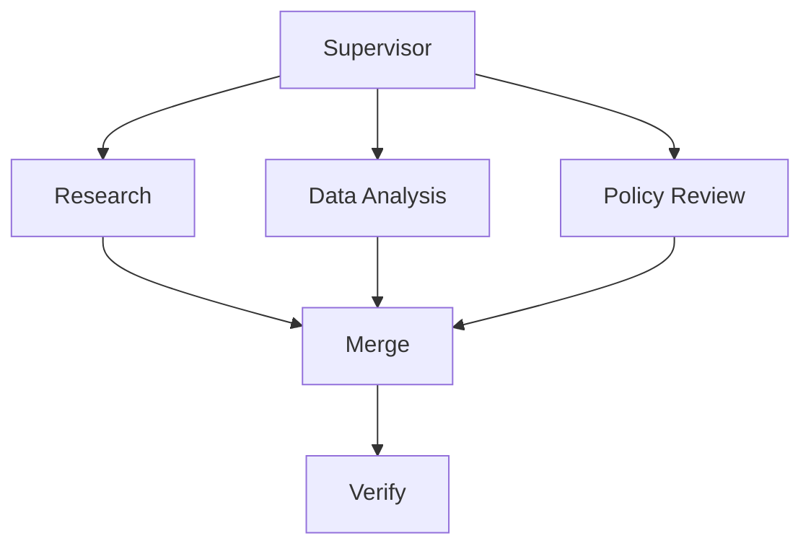
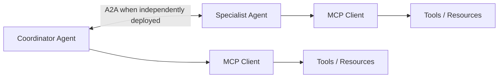

# Multi-Agent Collaboration & Swarm Approach

Multi-Agent Collaboration is when **multiple AI agents work together like a team** to solve problems.  
Instead of one AI doing everything, the work is **split among specialized agents**, improving efficiency, accuracy, and scalability.


## 1. Introduction to Multi-Agent Collaboration

- **Simple Definition:**  
  - Multiple AI agents collaborate to **solve a problem together**.  
  - Each agent may have a **specialized role or skill**.

- **Human Analogy:**  
  -  One person doing everything  
  -  Team with roles: Researcher, Writer, Reviewer

- **Key Idea:**  
  - Collaboration allows **complex, multi-step tasks** to be completed more accurately.  
  - Reduces **errors and hallucinations** compared to a single agent doing everything.

- **Why it matters:**  
  - Supports **enterprise-grade AI workflows**  
  - Enables **multi-step reasoning**  
  - Improves **accuracy and reliability**  

- **Visual Analogy:**
    ``` 
    User Question
    ↓
    Research Agent → Writer Agent → Reviewer Agent
    ↓
    Final Answer
    ```

- **Takeaway:**  
  Multi-Agent Collaboration = **AI teamwork**, where **each agent does what it is best at**.

---

## 2. Agentic Design Patterns

Agentic design patterns define **how AI agents are structured and organized** to work correctly together.  
Think of it as a **team structure** for AI agents.

---

### 2.1 Single-Agent Pattern (Baseline)

- **Description:** One agent handles everything from start to finish.  
- **Example:**  
  - Simple chatbot  
  - FAQ assistant  

- **Limitations:**  
  -  Hard to scale  
  -  Limited reasoning and task coverage  

**Flow:**
     ```
     User → Single Agent → Answer
     ```


---

### 2.2 Tool-Using Agent Pattern

- **Description:** One agent uses external tools to enhance its capabilities.  
- **Example:**  
  - Agent searches the web  
  - Agent performs calculations  
  - Agent answers the user  

- **Advantages:**  
  -  Better capabilities than single agent  
- **Limitations:**  
  -  Still relies on one “brain”  

**Flow:**
      ```
      Agent → Tool → Agent → Answer
      ```


---

### 2.3 Multi-Agent Patterns (Most Important)

Multi-agent patterns involve **multiple agents working together**, each with a **specific role**.

---

#### 2.3.1 Supervisor–Worker Pattern

- **Description:**  
  - Supervisor agent plans and assigns tasks  
  - Worker agents perform the work  

- **Example:** Report Generator  
  - Supervisor → decides steps  
  - Research Agent → gathers information  
  - Writer Agent → drafts content  
  - Reviewer Agent → checks quality  

**Flow:**
``` 
    Supervisor
    ↓
    Research → Writer → Reviewer
    ↓
    Final Output
``` 


- **Why it matters:**  
  - Most common production pattern  
  - Clear task distribution and improved accuracy

---

#### 2.3.2 Sequential Agents Pattern

- **Description:** Agents work one after another, **each improving the result**.  
- **Example:** Resume Review  
  - Agent 1 → Extract skills  
  - Agent 2 → Match job role  
  - Agent 3 → Suggest improvements  

**Flow:**
    ```
    Agent 1 → Agent 2 → Agent 3 → Final Output
    ```


- **Why it matters:**  
  - Each agent has a **single responsibility**  
  - Supports **step-by-step reasoning**

---

#### 2.3.3 Parallel Agents Pattern

- **Description:** Multiple agents work **simultaneously** on the same task, then results are combined.  
- **Example:** Decision Making  
  - Agent A → Opinion  
  - Agent B → Opinion  
  - Agent C → Opinion  
  - Aggregator → Best answer  


- **Advantages:**  
  -  Reduces bias  
  -  Improves reliability  

---

#### 2.3.4 Critic / Debate Pattern

- **Description:** One agent proposes a solution, another criticizes, and the final agent **refines the output**.  
- **Example:**  
  - Proposer Agent → Solution  
  - Critic Agent → Finds flaws  
  - Final Agent → Refined solution  

- **Why it matters:**  
  -  Great for **hallucination reduction** and **quality assurance**

---

## 3. Orchestration & Multi-Agent Systems

Orchestration is the process of **managing how multiple agents run, interact, and share tasks**.  
Without orchestration, agents may **talk endlessly, loop infinitely, or waste resources**.

---

### 3.1 What Orchestration Does

- Controls **who runs when**  
- Ensures **predictable behavior**  
- Prevents **infinite loops**  
- Optimizes **resource usage**  

**Analogy:**  
- Think of orchestration as **traffic control** for agents.  
- Only the **right agent runs at the right time**.

---

### 3.2 Example of Orchestrated Flow

    
    Start
    ↓
    Research Agent
    ↓
    Analysis Agent
    ↓
    Answer Agent
    ↓
    End
    


- **Explanation:**  
  - Agents run **in sequence**, following a defined workflow.  
  - Each agent only executes **when it’s its turn**, ensuring **smooth task completion**.

---

### 3.3 Tools Used for Orchestration

- **State Machines:** Define **agent states and transitions**  
- **Graphs:** Map **dependencies between agents**  
- **Supervisors:** Manage **task assignments and handoffs**  

**Example:** 
      
      Supervisor-Agent + Graph
      
      Supervisor → Checks dependencies → Assigns tasks to Worker Agents → Aggregates results
     


---

### 3.4 Why Orchestration Matters

-  Prevents **agents from conflicting**  
-  Ensures **tasks are completed efficiently**  
-  Reduces **computational cost**  
-  Supports **multi-agent collaboration and swarm systems**

---


## 4. MCP & A2A in Multi-Agent Systems

Multi-agent systems become **powerful and scalable** when combined with **MCP (Model Context Protocol)** and **A2A (Agent-to-Agent) communication**.  

---

### 4.1 Model Context Protocol (MCP)

- **Definition:** MCP is a **standard interface** that allows agents to **access tools, memory, and context** consistently.  
- **Purpose:**  
  - Agents can **share context and use tools** without custom integrations.  
  - Enables **reusability and interoperability**.  

**Example Flow:**
  - Research Agent → MCP → MemoryStore → Retrieves past research
  - Writer Agent → MCP → Uses retrieved data → Drafts report


- **Benefit:** All agents **speak the same “language”** to access tools and memory.

---

### 4.2 Agent-to-Agent Communication (A2A)

- **Definition:** A2A allows agents to **communicate directly using structured messages**.  
- **Purpose:**  
  - Not random chat — messages are **formal, structured, and reliable**.  
  - Enables **coordinated multi-agent workflows**.

**Example Flow:**
    
  - Research Agent → Sends findings (JSON) → Writer Agent
  - Writer Agent → Sends draft → Reviewer Agent
  - Reviewer Agent → Sends feedback → Writer Agent
  


- **Benefit:** Reduces **miscommunication**, improves **accuracy**, and supports **orchestrated workflows**.

---

### 4.3 Combining MCP + A2A

- MCP manages **access to tools and memory**  
- A2A manages **structured communication between agents**  
- Together, they enable **scalable, reusable, and collaborative multi-agent systems**

**Visual Workflow Example:**

    
    User Question
    ↓
    Supervisor Agent
    ↓
    Research Agent → MCP → Tool/Memory → Returns findings
    ↓
    Writer Agent → Receives findings via A2A → Drafts answer
    ↓
    Reviewer Agent → Receives draft via A2A → Validates → Final Output
    


- **Key Takeaway:**  
  MCP + A2A = **standardized access + structured communication**, the foundation for **multi-agent collaboration and swarm systems**.

---

## 5. Swarm Approach (Multi-Agent Collaboration)

The **Swarm Approach** is when **many specialized AI agents work together**, handing off tasks to achieve **one big goal**.  

It’s like teamwork, not a single super-AI.

---

### 5.1 Simple Definition

- **Swarm Approach:** Many agents with **specialized roles** collaborate, passing tasks between them.  
- **Goal:** Solve complex problems **efficiently, accurately, and reliably**.

---

### 5.2 Human Analogy

- Imagine a company:  
  -  Manager  
  -  Engineer  
  -  Specialist  

- One person does not do everything.  
- Tasks are handed to the **right expert** → faster and more accurate.  

-  Same principle applies to AI agents in a swarm.

---

### 5.3 Key Characteristics of a Swarm

| Feature | Meaning |
|---------|---------|
| Multiple agents | Not one monolithic AI |
| Specialized roles | Each agent is good at something |
| Handoff | Tasks move between agents |
| Shared goal | All agents work towards the same objective |

- **Analogy:**  
  - Ants   
  - Bees   
  - Human teams   

---

### 5.4 Example: Company Helpdesk AI

**Agents:**  
- Agent 1 → General Support  
- Agent 2 → Billing Expert  
- Agent 3 → Technical Expert  

**User Query:**  
“My payment failed and my app is crashing.”

**Swarm Workflow:**
Step 1: Agent 1 receives request
Step 2: Billing issue → handed to Agent 2
Step 3: App crash → handed to Agent 3
Step 4: Responses combined → Final Answer returned to User


- **Benefits:**  
  -  Accurate  
  -  No hallucination  
  -  Faster resolution  

---

### 5.5 Why Swarm Approach is Powerful

-  Single-Agent Problems:  
  - Tries to do everything  
  - Hallucinates  
  - Hard to scale and debug  

-  Swarm Benefits:  
  - Clear responsibility  
  - Better accuracy  
  - Easier scaling  
  - Realistic behavior  

---

## 6. End-to-End Example: Company Strategy Assistant

This example demonstrates **how multiple agents collaborate using MCP, A2A, and swarm principles** to solve a complex task.

---

### 6.1 Agents Involved

- **Supervisor Agent** → Plans and assigns tasks  
- **Market Research Agent** → Collects data and insights  
- **Analyst Agent** → Interprets data  
- **Strategy Writer Agent** → Drafts strategy report  
- **Critic Agent** → Reviews and refines the output  

---

### 6.2 Workflow

    
    User Question
    ↓
    Supervisor Agent → Plans tasks
    ↓
    Market Research Agent → MCP → Retrieves data from memory/tools
    ↓
    Analyst Agent → Processes data → Provides insights
    ↓
    Strategy Writer Agent → Receives findings via A2A → Drafts report
    ↓
    Critic Agent → Reviews draft via A2A → Suggests improvements
    ↓
    Final Answer returned to User
    


---

### 6.3 Key Features Highlighted

- **Task Handoff:** Each agent only works on what it is specialized for  
- **Structured Communication (A2A):** Agents share data via **standardized messages**  
- **Tool & Memory Access (MCP):** Agents access **tools and memory consistently**  
- **Orchestration:** Supervisor ensures **correct execution order**  
- **Collaboration:** Swarm behavior ensures **accuracy, reliability, and efficiency**  

---

### 6.4 Benefits of This Approach

-  Tasks are completed **faster and more accurately**  
-  Reduces **hallucinations and errors**  
-  Scales easily to **more agents or tasks**  
-  Each agent has **clear responsibility**, improving maintainability  

---

### 6.5 Summary

This end-to-end example demonstrates **advanced multi-agent collaboration**:

- **Supervisor + Swarm Agents:** Clear task assignment and handoff  
- **MCP:** Standardized access to tools and memory  
- **A2A:** Structured agent-to-agent communication  
- **Outcome:** Reliable, accurate, and scalable AI teamwork

---

## 7. When to Use Multi-Agent / Swarm Systems

Not all tasks need multiple agents. Knowing **when to use a multi-agent or swarm system** ensures **efficiency and cost-effectiveness**.

---

### 7.1 Use Cases

- **Complex Problems**  
  - Tasks that require **multi-step reasoning** or **specialized skills**  
  - Example: Company strategy generation, scientific research analysis  

- **Accuracy-Critical Applications**  
  - Errors or hallucinations are **not acceptable**  
  - Example: Financial reports, medical recommendations  

- **Enterprise-Grade Workflows**  
  - Large-scale tasks involving **multiple departments or datasets**  
  - Example: Coordinated ERP, CRM, and analytics workflows  

- **Multi-Step Reasoning**  
  - Tasks that need **intermediate outputs, review, or refinement**  
  - Example: Resume review or decision-making with sequential agents  

---

### 7.2 When Not to Use

- **Simple Q&A Tasks**  
  - Single-agent systems are sufficient and faster  
  - Example: FAQ bot, basic query answering  

- **Low-Latency Required**  
  - Swarm systems may introduce **slight delays due to orchestration and handoffs**  

- **Cost-Sensitive Applications**  
  - More agents → more compute and memory usage  

---

### 7.3 Key Takeaways

- Multi-agent / swarm systems = **AI teamwork**  
- Use when **complexity, accuracy, and multi-step reasoning matter**  
- Avoid when **tasks are simple, time-critical, or cost-sensitive**

---

## 8. One-Line Memory Tricks / Key Takeaways

Remember these **key points** for multi-agent collaboration and swarm systems:

- **Multi-agent = AI teamwork** → multiple agents work together instead of one doing everything  
- **Design patterns = team structure** → single-agent, tool-using, supervisor-worker, sequential, parallel, critic/debate  
- **Orchestration = traffic control** → manages who runs when and in what order  
- **MCP = standardized capability access; useful when agents need interoperable tools/resources
- **A2A = interoperability protocol for independent agentic applications; useful across deployment/framework boundaries
- **Swarm = right agent, right task, right time** → specialized roles with task handoffs for complex problems  

**Memory Trick:**  
Multi-agent collaboration = explicit roles + coordination + handoff contracts + shared goals


- **Final Takeaway:**  
  Multi-agent collaboration and swarm systems **combine specialized roles, orchestration, and structured communication** to solve **complex, multi-step, accuracy-critical tasks efficiently**.


---

## Collaboration Is a Distributed-Systems Problem

Once several agents participate, the architecture must answer:

```text
Who owns the task?
Who owns each piece of state?
Who may delegate?
How is work deduplicated?
How are conflicts resolved?
How does the system know it is finished?
```

Natural-language messages alone are not enough.

---

## Handoff Contract

Prefer structured handoffs.

```json
{
  "task_id": "T-104",
  "objective": "verify whether deployment caused the error spike",
  "inputs": {
    "deployment_id": "dep-42",
    "evidence_ids": ["e-7", "e-9"]
  },
  "constraints": {
    "tools": ["read_metrics", "read_logs"],
    "write_actions": false
  },
  "expected_output": {
    "status": "supported | rejected | inconclusive",
    "evidence_ids": []
  }
}
```

This improves validation, observability, and retry behavior.

---

## Task Allocation

Allocation can be:

- deterministic by skill/domain,
- capability registry based,
- semantic/model-routed,
- load-aware,
- hybrid.

Prefer deterministic routing when the mapping is known.

Use model-based routing when semantic ambiguity genuinely exists.

---

## Delegation Budgets

Without limits:

```text
Agent A → Agent B
Agent B → Agent C
Agent C → Agent A
...
```

Bound:

- delegation depth,
- total agents invoked,
- model calls,
- tool calls,
- elapsed time,
- cost.

The orchestrator should enforce these budgets.

---

## Parallel Collaboration

Independent work can run concurrently:



Parallelism is valuable only when dependencies permit it.

Do not parallelize steps whose inputs depend on earlier results.

---

## Conflict Resolution

Agents can disagree.

Possible strategies:

- deterministic source authority,
- verifier agent/model,
- evidence comparison,
- confidence plus provenance,
- human escalation.

Do not use majority voting blindly. Several agents can repeat the same error.

---

## Shared Memory vs Message Passing

### Shared state

Pros:
- easy coordination.

Risks:
- race conditions,
- context leakage,
- unclear ownership.

### Explicit message/handoff

Pros:
- stronger boundaries,
- clearer provenance.

Risks:
- more serialization and coordination logic.

Choose intentionally.

---

## Security Boundaries

Delegation must not increase authority.

```text
User permission
      ↓
Coordinator scope
      ↓
Worker receives ≤ required scope
```

A worker should not inherit every credential held by a supervisor.

Apply least privilege per agent and per task.

---

## Failure Handling

Plan for:

- worker timeout,
- worker unavailable,
- malformed handoff,
- duplicate execution,
- partial result,
- contradictory result,
- supervisor failure,
- recursive delegation,
- stale shared state.

Durable task IDs and idempotent operations matter for long-running collaboration.

---

## Observability

A trace should preserve hierarchy:

```text
User Task
└── Supervisor
    ├── Research Agent
    │   └── search tool
    ├── Data Agent
    │   └── metrics tool
    └── Verifier
```

Record:

- parent/child task IDs,
- agent identity/role,
- handoff input,
- result/artifact,
- latency,
- cost,
- errors,
- delegation depth.

---

## Evaluation

Evaluate both agents and coordination.

### Agent-level
- task accuracy,
- tool correctness.

### Coordination-level
- routing accuracy,
- handoff completeness,
- duplicate work,
- conflict resolution,
- deadlock/loop rate.

### System-level
- end-to-end success,
- latency,
- cost,
- safety,
- recovery.

Always compare against a single-agent/workflow baseline.

---

## MCP and A2A in the Correct Roles



MCP and A2A are complementary, but neither is required for every multi-agent implementation.

---

## Common Anti-Patterns

- agent for every workflow step,
- unbounded delegation,
- all agents sharing all tools/credentials,
- free-form handoffs with no schema,
- using debate as a correctness guarantee,
- no state owner,
- no task IDs,
- no cancellation,
- no single-agent baseline,
- calling ordinary parallel tool execution "multi-agent."

---

## Key Takeaways

- Multi-agent collaboration needs explicit coordination, not just multiple prompts.
- Define roles, task ownership, state ownership, and handoff contracts.
- Bound delegation depth, time, calls, and cost.
- Parallelize only independent work.
- Preserve evidence/provenance across handoffs.
- Delegation must not expand authorization.
- Evaluate coordination separately from individual agent quality.
- MCP standardizes capability access; A2A supports independent agent interoperability.
- Use multi-agent architecture only when it outperforms a simpler baseline enough to justify the complexity.

---

## Continue Learning

1. [AI Agents](AI%20Agents.md)
2. [Single-Agent vs Multi-Agent](Single-Agent%20vs.%20Multi-Agent.md)
3. **Multi-Agent Collaboration — this chapter**
4. [MCP](MCP%20%28Model%20Context%20Protocol%29.md)
5. [A2A](A2A%20Protocol.md)
6. [Agent Architecture & Agent Loops](docs/agentic-ai/agent-architecture.md)
7. [Tool Use & Agent Orchestration](docs/agentic-ai/tool-use-and-orchestration.md)
