# GenAI & Agentic AI

> A practical, beginner-to-advanced knowledge base for understanding, building, evaluating, and designing modern Generative AI and Agentic AI systems.

This repository connects **fundamentals with real engineering**: LLMs, prompting, embeddings, RAG, fine-tuning, agents, multi-agent systems, MCP, A2A, architecture, system design, evaluation, security, scalability, latency, and cost.

## What You Will Learn

| Track | Topics |
|---|---|
| Foundations | AI/ML, neural networks, transformers, tokenization, foundation models |
| LLM Engineering | prompting, embeddings, inference, RAG, fine-tuning, hallucination |
| Agentic AI | agents, tool use, planning, memory, orchestration, multi-agent systems |
| Protocols | MCP and A2A |
| System Design | RAG platforms, enterprise assistants, research/coding agents, multi-agent platforms |
| Production AI | evaluation, observability, guardrails, security, reliability, scalability, latency, cost |

## Learning Journey

```mermaid
flowchart LR
    A[AI & ML] --> B[Transformers]
    B --> C[LLMs]
    C --> D[Prompt Engineering]
    D --> E[Embeddings]
    E --> F[RAG]
    F --> G[Tool Use]
    G --> H[AI Agents]
    H --> I[Multi-Agent Systems]
    I --> J[MCP & A2A]
    J --> K[Evaluation & Production]
    K --> L[System Design]
```

## Start Here

### Beginner
[AI & ML Fundamentals](AI%20%26%20ML%20Fundamentals.md) → [Transformers](Transformers.md) → [Large Language Models](Large%20Language%20Models%20%28LLM%29.md) → [Prompt Engineering](Prompt%20Engineering.md) → [Embeddings](Embeddings%20%26%20Vector%20Databases.md) → [RAG](RAG.md)

### Applied AI Engineer
LLMs → Prompting → RAG → Tool Use → Agents → Evaluation → Production

### Agentic AI Engineer
[AI Agents](AI%20Agents.md) → **[Agent Architecture & Agent Loops](docs/agentic-ai/agent-architecture.md)** → [Single vs Multi-Agent](Single-Agent%20vs.%20Multi-Agent.md) → [Multi-Agent Collaboration](Multi-Agent%20Collaboration.md) → [MCP](MCP%20%28Model%20Context%20Protocol%29.md) → [A2A](A2A%20Protocol.md)

### System Design / Interview Preparation
LLM Architecture → **[Production RAG Design](docs/system-design/production-rag.md)** → **[Agent Architecture](docs/agentic-ai/agent-architecture.md)** → Production Concerns → Case Studies → Trade-offs

See the complete **[Learning Roadmap](ROADMAP.md)**.

---

## Core Knowledge Base

### 1. Foundations
- [AI & ML Fundamentals](AI%20%26%20ML%20Fundamentals.md)
- [AI Foundation Models](AI%20Foundation%20Models.md)
- [Transformers](Transformers.md)
- [Tokenization](Tokenization.md)
- [Large Language Models](Large%20Language%20Models%20%28LLM%29.md)
- [Pre-training vs Fine-tuning](Pre-training%20vs%20Fine-tuning.md)

### 2. LLM & GenAI Engineering
- [Prompt Engineering](Prompt%20Engineering.md)
- [Embeddings & Vector Databases](Embeddings%20%26%20Vector%20Databases.md)
- [Retrieval-Augmented Generation](RAG.md)
- [LLM Inference](Inference%20in%20LLM.md)
- [Fine-Tuning](Fine-Tuning.md)
- [LLM Hallucination](LLM%20Hallucination.md)
- [AI Frameworks](AI%20Frameworks.md)

### 3. Agentic AI
- [AI Agents](AI%20Agents.md)
- **[Agent Architecture & Agent Loops — Deep Dive](docs/agentic-ai/agent-architecture.md)**
- [Single-Agent vs Multi-Agent](Single-Agent%20vs.%20Multi-Agent.md)
- [Multi-Agent Collaboration](Multi-Agent%20Collaboration.md)

### 4. Agent Interoperability
- [Model Context Protocol — MCP](MCP%20%28Model%20Context%20Protocol%29.md)
- [Agent-to-Agent — A2A](A2A%20Protocol.md)

### 5. Architecture & System Design
- **[Production RAG System Design](docs/system-design/production-rag.md)**
- [System Design Hub](docs/system-design/README.md)

The system-design material covers requirements, architecture, data/control flow, retrieval, orchestration, memory, security, evaluation, observability, scalability, latency, cost, failure handling, and explicit trade-offs.

### 6. Design Patterns
The [Design Patterns](docs/design-patterns/README.md) catalog organizes reusable RAG, agent, memory, orchestration, and reliability patterns.

---

## How Topics Are Developed

Major engineering topics progressively follow a common structure:

1. What is it?
2. Why does it exist?
3. Mental model
4. How it works
5. Architecture
6. Step-by-step flow
7. Practical example
8. Implementation
9. Design decisions and trade-offs
10. Failure modes
11. Evaluation
12. Security
13. Performance, scalability, latency, and cost
14. Production considerations
15. Interview questions
16. Key takeaways

## Architecture-First Learning

The goal is not only to know definitions. A reader should be able to answer:

- **How does this component work?**
- **Where does it fit in an architecture?**
- **When should I use it?**
- **What breaks in production?**
- **How do I evaluate it?**
- **How does it scale?**
- **What alternatives exist?**
- **What trade-offs would I discuss in a system-design interview?**

## Repository Evolution

The repository is being progressively organized into the [structured knowledge hub](docs/README.md). Existing material is retained while deeper architecture guides, examples, production practices, design patterns, and system-design case studies are added.

## Contributing

Contributions that improve technical accuracy, diagrams, examples, system-design discussions, implementation quality, or production guidance are welcome.

---

**Goal:** bridge the gap between *learning GenAI concepts* and *engineering production-grade intelligent systems*.
