# GenAI & Agentic AI

> A practical, beginner-to-advanced knowledge base for understanding, building, evaluating, and designing modern Generative AI and Agentic AI systems.

This repository connects **fundamentals with real engineering**: LLMs, prompting, embeddings, search/retrieval, RAG, fine-tuning, agents, multi-agent systems, MCP, A2A, architecture, system design, evaluation, security, scalability, latency, and cost.

## Repository Structure

| Learning Area | Purpose |
|---|---|
| **[01 · GenAI Fundamentals](01-genai-fundamentals/README.md)** | AI/ML foundations, LLMs, tokenization, transformers, prompting, embeddings, vector databases, search/retrieval, RAG, fine-tuning, inference, hallucination, and AI frameworks |
| **[02 · Agentic AI](02-agentic-ai/README.md)** | Agents, tools, memory, planning, Agentic RAG, multi-agent systems, multimodal/conversational agents, agent training/adaptation, state machines, graph orchestration, Google ADK, agent skills/capability engineering, voice/realtime agents, MCP, and A2A |
| **[03 · Production AI](03-production-ai/README.md)** | Evaluation, observability, security, reliability, context engineering, performance, latency, cost, LLMOps/deployment, and AI data engineering |
| **[04 · System Design](04-system-design/README.md)** | End-to-end architecture and production system-design deep dives |
| **[05 · Design Patterns](05-design-patterns/README.md)** | Reusable architecture and implementation patterns for RAG, agents, memory, orchestration, and reliability |
| **[06 · Applied AI Case Studies](06-projects-and-case-studies/README.md)** | Eight runnable scenarios spanning support, incidents, voice, IT, security, finance, multi-agent pipelines, and delivery status |

The numbered folders are the primary navigation. Start with **01** and move forward, or jump directly to the engineering area you need.

## Explore Runnable Case Studies

The **[Applied AI Case Studies](06-projects-and-case-studies/README.md)** section turns concepts into executable examples with synthetic data, tests, architecture diagrams, safety controls, and production evolution. Start with [Customer Service](06-projects-and-case-studies/customer-service-ai-agent/README.md) for retrieval and action confirmation, [Agent Pipeline](06-projects-and-case-studies/agent-pipeline-workflow-builder/README.md) for orchestration, or [Project Status](06-projects-and-case-studies/project-status-assistant/README.md) for evidence-grounded business reporting.

The case studies are deterministic teaching implementations unless explicitly stated otherwise; the production diagrams describe possible future architectures.

## What You Will Learn

| Track | Topics |
|---|---|
| Foundations | AI/ML, neural networks, transformers, tokenization, foundation models |
| LLM Engineering | prompting, embeddings, search/retrieval, inference, RAG, fine-tuning, hallucination |
| Agentic AI | agents, tool use, planning, memory, orchestration, multi-agent systems, multimodal/conversational agents, agent training/adaptation, runtime control |
| Protocols & Agent Runtime | state machines, graph orchestration, Google ADK, MCP, A2A, agent-to-tool and agent-to-agent communication |
| System Design | AI product architecture, AI platform architecture, RAG platforms, enterprise assistants, production agents, multi-agent and realtime systems |
| Production AI | evaluation, observability, guardrails, security, reliability, scalability, latency, cost, LLMOps/deployment, and AI data engineering |

## Learning Journey

```mermaid
flowchart LR
    A[AI & ML] --> B[Transformers]
    B --> C[LLMs]
    C --> D[Prompt Engineering]
    D --> E[Embeddings]
    E --> ER[Search & Retrieval]
    ER --> F[RAG]
    F --> G[AI Agents]
    G --> H[Tool Use]
    H --> I[Memory]
    I --> J[Planning]
    J --> K[Agentic RAG]
    K --> L[Multi-Agent Systems]
    L --> MM[Multimodal & Conversational]
    MM --> AT[Agent Training & Adaptation]
    AT --> RT[Runtime / State Machines / Graphs]
    RT --> M[MCP & A2A]
    M --> N[Evaluation & Production]
    N --> O[System Design]
```

## Start Here

### Beginner
[AI & ML Fundamentals](01-genai-fundamentals/AI%20%26%20ML%20Fundamentals.md) → [Foundation Models](01-genai-fundamentals/AI%20Foundation%20Models.md) → [Tokenization](01-genai-fundamentals/Tokenization.md) → [Transformers](01-genai-fundamentals/Transformers.md) → [Large Language Models](01-genai-fundamentals/Large%20Language%20Models%20%28LLM%29.md) → [Prompt Engineering](01-genai-fundamentals/Prompt%20Engineering.md) → [Embeddings](01-genai-fundamentals/Embeddings%20%26%20Vector%20Databases.md) → [Search & Retrieval](01-genai-fundamentals/Search%20%26%20Retrieval%20Engineering.md) → [RAG](01-genai-fundamentals/RAG.md)

### Applied AI Engineer
LLMs → Prompting → RAG → Tool Use → Agents → **[Evaluation & Observability](03-production-ai/evaluation-and-observability.md)** → **[Security & Guardrails](03-production-ai/security-and-guardrails.md)** → **[Reliability & Resilience](03-production-ai/reliability-and-resilience.md)** → **[Context Engineering](03-production-ai/context-engineering.md)** → **[Performance, Latency & Cost](03-production-ai/performance-latency-and-cost.md)** → **[AI Data Engineering](03-production-ai/ai-data-engineering.md)** → **[LLMOps & AI Deployment](03-production-ai/llmops-and-deployment.md)** → Production

### Agentic AI Engineer
[AI Agents](02-agentic-ai/fundamentals/AI%20Agents.md) → **[Agent Architecture & Agent Loops](02-agentic-ai/advanced/agent-architecture.md)** → **[Tool Use & Orchestration](02-agentic-ai/advanced/tool-use-and-orchestration.md)** → **[Agent Memory](02-agentic-ai/advanced/agent-memory.md)** → **[Planning & Reasoning](02-agentic-ai/advanced/planning-and-reasoning.md)** → **[Agentic RAG](02-agentic-ai/advanced/agentic-rag.md)** → [Single vs Multi-Agent](02-agentic-ai/fundamentals/Single-Agent%20vs.%20Multi-Agent.md) → [Multi-Agent Collaboration](02-agentic-ai/fundamentals/Multi-Agent%20Collaboration.md) → **[Multi-Agent Systems Architecture](02-agentic-ai/advanced/multi-agent-systems.md)** → **[Multimodal & Conversational Agents](02-agentic-ai/advanced/multimodal-and-conversational-agents.md)** → **[Agent Training & Adaptation](02-agentic-ai/advanced/agent-training-and-adaptation.md)** → **[Agent Runtime, State Machines & Protocols](02-agentic-ai/advanced/agent-runtime-state-machines-and-protocols.md)** → [MCP](02-agentic-ai/fundamentals/MCP%20%28Model%20Context%20Protocol%29.md) → [A2A](02-agentic-ai/fundamentals/A2A%20Protocol.md)

### System Design / Interview Preparation
LLM Architecture → **[AI Product Architecture](04-system-design/ai-product-architecture.md)** → **[AI Platform Architecture](04-system-design/ai-platform-architecture.md)** → **[Production RAG Design](04-system-design/production-rag.md)** → **[Agent Architecture](02-agentic-ai/advanced/agent-architecture.md)** → **[Tool Orchestration](02-agentic-ai/advanced/tool-use-and-orchestration.md)** → **[Memory](02-agentic-ai/advanced/agent-memory.md)** → **[Planning](02-agentic-ai/advanced/planning-and-reasoning.md)** → **[Agentic RAG](02-agentic-ai/advanced/agentic-rag.md)** → **[Multi-Agent Architecture](02-agentic-ai/advanced/multi-agent-systems.md)** → **[Evaluation & Observability](03-production-ai/evaluation-and-observability.md)** → **[Security & Guardrails](03-production-ai/security-and-guardrails.md)** → **[Reliability & Resilience](03-production-ai/reliability-and-resilience.md)** → **[Context Engineering](03-production-ai/context-engineering.md)** → **[Performance, Latency & Cost](03-production-ai/performance-latency-and-cost.md)** → Trade-offs

See the complete **[Learning Roadmap](ROADMAP.md)**.

---

## Core Knowledge Base

### 1. Foundations
- [AI & ML Fundamentals](01-genai-fundamentals/AI%20%26%20ML%20Fundamentals.md)
- [AI Foundation Models](01-genai-fundamentals/AI%20Foundation%20Models.md)
- [Tokenization](01-genai-fundamentals/Tokenization.md)
- [Transformers](01-genai-fundamentals/Transformers.md)
- [Large Language Models](01-genai-fundamentals/Large%20Language%20Models%20%28LLM%29.md)
- [Pre-training vs Fine-tuning](01-genai-fundamentals/Pre-training%20vs%20Fine-tuning.md)

### 2. LLM & GenAI Engineering
- [Prompt Engineering](01-genai-fundamentals/Prompt%20Engineering.md)
- [Embeddings & Vector Databases](01-genai-fundamentals/Embeddings%20%26%20Vector%20Databases.md)
- **[Search & Retrieval Engineering — Deep Dive](01-genai-fundamentals/Search%20%26%20Retrieval%20Engineering.md)**
- [Retrieval-Augmented Generation](01-genai-fundamentals/RAG.md)
- [LLM Inference](01-genai-fundamentals/Inference%20in%20LLM.md)
- [Fine-Tuning](01-genai-fundamentals/Fine-Tuning.md)
- [LLM Hallucination](01-genai-fundamentals/LLM%20Hallucination.md)
- [AI Frameworks](01-genai-fundamentals/AI%20Frameworks.md)

### 3. Agentic AI
- [AI Agents](02-agentic-ai/fundamentals/AI%20Agents.md)
- **[Agent Architecture & Agent Loops — Deep Dive](02-agentic-ai/advanced/agent-architecture.md)**
- **[Tool Use & Agent Orchestration — Deep Dive](02-agentic-ai/advanced/tool-use-and-orchestration.md)**
- **[Agent Memory Architecture — Deep Dive](02-agentic-ai/advanced/agent-memory.md)**
- **[Planning & Reasoning Patterns — Deep Dive](02-agentic-ai/advanced/planning-and-reasoning.md)**
- **[Agentic RAG — Deep Dive](02-agentic-ai/advanced/agentic-rag.md)**
- [Single-Agent vs Multi-Agent](02-agentic-ai/fundamentals/Single-Agent%20vs.%20Multi-Agent.md)
- [Multi-Agent Collaboration](02-agentic-ai/fundamentals/Multi-Agent%20Collaboration.md)
- **[Multi-Agent Systems Architecture — Deep Dive](02-agentic-ai/advanced/multi-agent-systems.md)**
- **[Multimodal & Conversational Agents — Deep Dive](02-agentic-ai/advanced/multimodal-and-conversational-agents.md)**
- **[Agent Training & Adaptation — Deep Dive](02-agentic-ai/advanced/agent-training-and-adaptation.md)**
- **[Agent Runtime, State Machines & Communication Protocols — Deep Dive](02-agentic-ai/advanced/agent-runtime-state-machines-and-protocols.md)** — naive-agent failure modes, FSMs, termination, graph orchestration/LangGraph concepts, Google ADK runtime/sessions/events, MCP + A2A integration
- **[Agent Skills & Capability Engineering — Deep Dive](02-agentic-ai/advanced/agent-skills-and-capability-engineering.md)** — skills vs tools/workflows/agents, progressive disclosure, discovery, composition, contracts, MCP/A2A relationships, security and lifecycle
- **[Voice & Realtime Agent Engineering — Deep Dive](02-agentic-ai/advanced/voice-and-realtime-agent-engineering.md)** — ASR/TTS, speech-to-speech, VAD/endpointing, interruption, WER, acoustic robustness, voice RAG, realtime latency, evaluation and cost

### 4. Agent Runtime & Interoperability
- [Model Context Protocol — MCP](02-agentic-ai/fundamentals/MCP%20%28Model%20Context%20Protocol%29.md)
- [Agent-to-Agent — A2A](02-agentic-ai/fundamentals/A2A%20Protocol.md)

### 5. Production AI Engineering
- **[Evaluation & Observability — Deep Dive](03-production-ai/evaluation-and-observability.md)**
- **[Security & Guardrails — Deep Dive](03-production-ai/security-and-guardrails.md)**
- **[Reliability & Resilience — Deep Dive](03-production-ai/reliability-and-resilience.md)**
- **[Context Engineering — Deep Dive](03-production-ai/context-engineering.md)**
- **[Performance, Latency & Cost — Deep Dive](03-production-ai/performance-latency-and-cost.md)**
- **[LLMOps & AI Deployment — Deep Dive](03-production-ai/llmops-and-deployment.md)** — versioned behavioral releases, evaluation-gated CI/CD, progressive delivery, rollback, hosted/self-hosted inference, RAG/index and agent migrations, GPU serving, operational readiness, supply-chain security, and delivery economics.
- **[AI Data Engineering — Deep Dive](03-production-ai/ai-data-engineering.md)** — source-to-AI data architecture covering batch/stream/CDC, multimodal/document processing, chunking, embeddings and index generations, contracts, ACLs, datasets, agent state/memory, lineage, freshness, deletion, recovery, scaling, and data economics.
- [Production Engineering Hub](03-production-ai/README.md)

### 6. Architecture & System Design
- **[AI Product Architecture](04-system-design/ai-product-architecture.md)**
- **[AI Platform Architecture — Deep Dive](04-system-design/ai-platform-architecture.md)** — control/data/evidence/developer planes, model gateway and serving, shared RAG/tool/state capabilities, evaluation/observability, multi-tenancy, security, reliability, capacity, cost, developer experience, and platform governance.
- **[Production RAG System Design](04-system-design/production-rag.md)**
- [System Design Hub](04-system-design/README.md)

The system-design material covers requirements, architecture, data/control flow, retrieval, orchestration, memory, security, evaluation, observability, scalability, latency, cost, failure handling, and explicit trade-offs.

### 7. Design Patterns
The [Design Patterns](05-design-patterns/README.md) catalog organizes reusable RAG, agent, memory, orchestration, and reliability patterns.

---

## How Topics Are Developed

Major engineering topics progressively follow a common structure:

1. What is it?
2. Why does it exist?
3. Mental model
4. How it works
5. Architecture
6. Step-by-step flow
7. Practical example
8. Implementation
9. Design decisions and trade-offs
10. Failure modes
11. Evaluation
12. Security
13. Performance, scalability, latency, and cost
14. Production considerations
15. Interview questions
16. Key takeaways

## Architecture-First Learning

The goal is not only to know definitions. A reader should be able to answer:

- **How does this component work?**
- **Where does it fit in an architecture?**
- **When should I use it?**
- **What breaks in production?**
- **How do I evaluate it?**
- **How does it scale?**
- **What alternatives exist?**
- **What trade-offs would I discuss in a system-design interview?**

## Contributing

Contributions that improve technical accuracy, diagrams, examples, system-design discussions, implementation quality, or production guidance are welcome.

---

**Goal:** bridge the gap between *learning GenAI concepts* and *engineering production-grade intelligent systems*.
