# Multi-Agent Systems Architecture

A multi-agent system coordinates multiple agent runtimes toward a larger objective.

The production question is not "How many agents can we create?" It is: **Which responsibilities genuinely benefit from independent decision contexts, tools, permissions, state, ownership, or execution lifecycles—and how do we coordinate them safely?**

This chapter builds on [Single-Agent vs Multi-Agent](../../Single-Agent%20vs.%20Multi-Agent.md) and [Multi-Agent Collaboration](../../Multi-Agent%20Collaboration.md). Those chapters establish the concepts. This chapter owns the production architecture.

---

## 1. Start With the Simplest Architecture

A multi-step task does not automatically require multiple agents.

```text
deterministic workflow
        ↓
single LLM call
        ↓
single agent + tools
        ↓
single agent + planning
        ↓
multi-agent system
```

A single agent can already call many tools, parallelize independent reads, retrieve knowledge, maintain state, plan, and request human approval. Add agents only when separation itself creates value.

---

## 2. What Makes an Agent Boundary Useful?

Two prompts with different role names are not automatically meaningful independent agents.

A useful agent boundary commonly has one or more of:

- distinct objective,
- independent execution loop,
- isolated state/context,
- specialized tools,
- separate permissions,
- different model,
- independent lifecycle,
- separate deployment/ownership,
- explicit input/output contract.

```text
Agent
├── objective
├── model / policy
├── state
├── tools
├── permissions
├── memory policy
├── budgets
└── lifecycle
```

If two "agents" share everything and merely run consecutive prompts, a deterministic workflow may be clearer.

---

## 3. Production Architecture

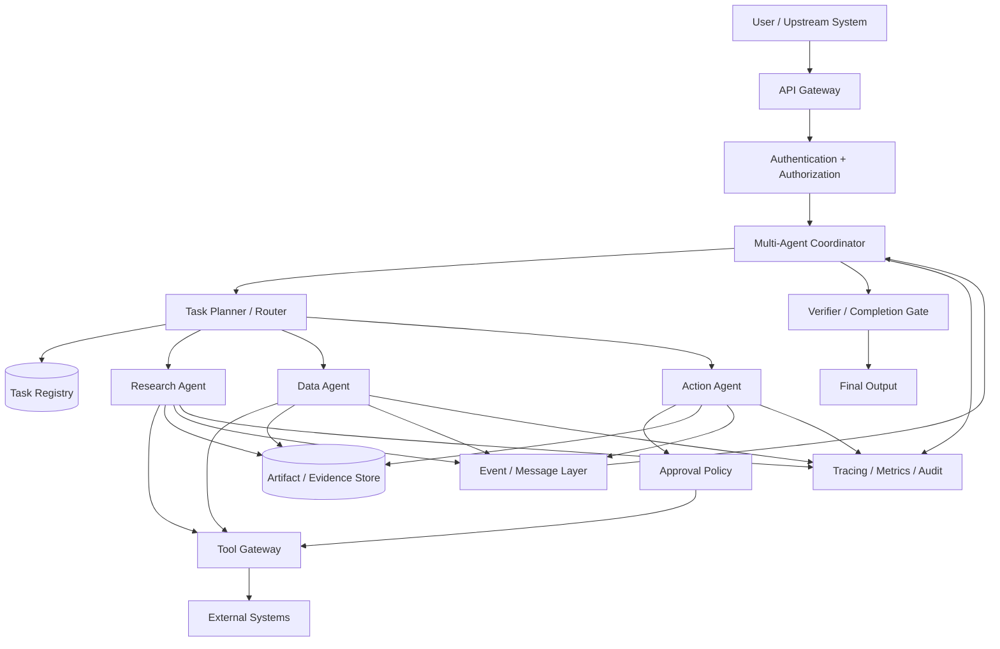

The coordinator owns global invariants: budgets, authorization boundaries, task lifecycle, cancellation, and completion. Individual agents own decisions inside their assigned scope.

---

## 4. Control Plane vs Work Plane

### Control plane

Owns task decomposition, routing, assignment, dependency tracking, budgets, cancellation, retries, escalation, and global completion.

### Work plane

Owns specialist reasoning, retrieval, tool use, artifact generation, and local verification.

```text
Coordinator / Control Plane
          ↓
     task contracts
          ↓
Specialist / Work Plane
          ↓
   results + artifacts
          ↓
Coordinator
```

Do not ask specialists to enforce global invariants they cannot reliably observe.

---

## 5. Supervisor–Worker Architecture

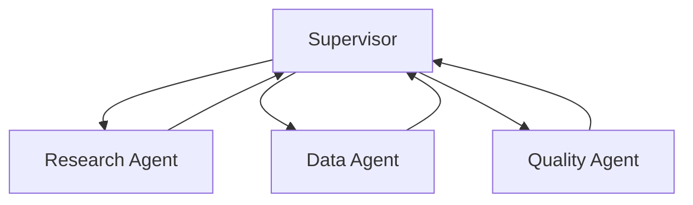

**Strengths:** clear ownership, centralized policy, easier tracing and budget enforcement.

**Risks:** supervisor bottleneck, central failure point, context overload, unnecessary serial coordination.

Use it when centralized control is more valuable than decentralized autonomy.

---

## 6. Hierarchical Architecture

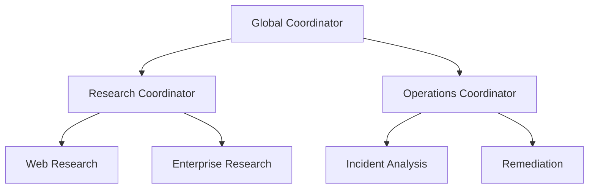

Hierarchy can reduce the detail handled by a global coordinator, but adds delegation depth, latency, failure points, and provenance complexity. Set an explicit maximum delegation depth.

---

## 7. Sequential Specialists

Some work naturally follows:

```text
Extract → Analyze → Review → Publish
```

If transitions are fixed and outputs structured, a deterministic workflow with model calls may be simpler than four autonomous agents.

---

## 8. Parallel Specialists

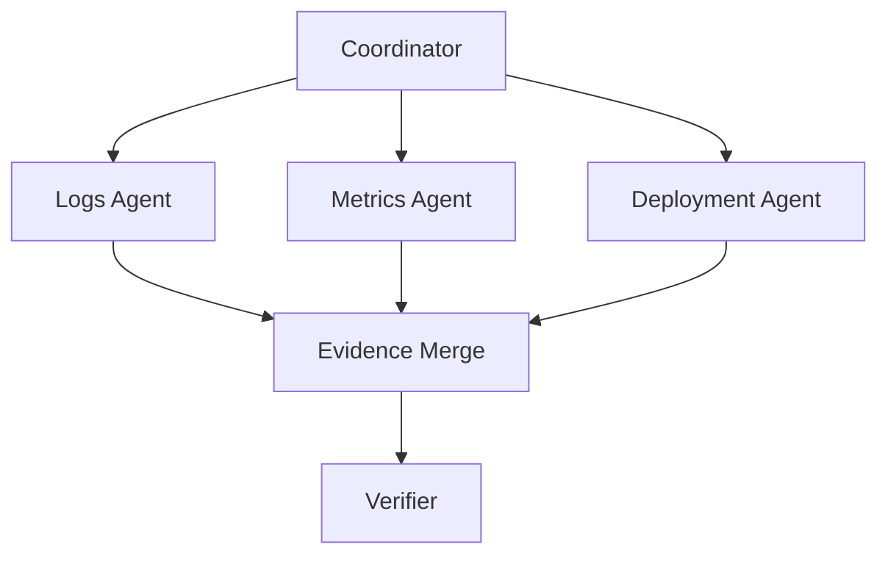

Parallelism can reduce wall-clock latency when branches are independent. It also increases model concurrency, token cost, tool load, and merge complexity.

---

## 9. Peer-to-Peer Architecture

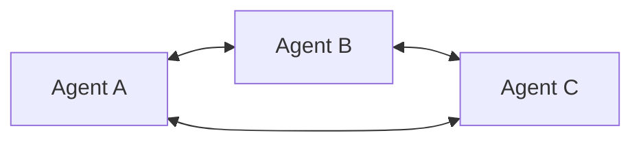

Useful for independently deployed or organizationally autonomous participants. Risks include unclear ownership, cyclic communication, inconsistent state, difficult termination, and harder auditability.

Decentralized communication does not remove the need for system-level policy and budgets.

---

## 10. Blackboard / Shared Workspace

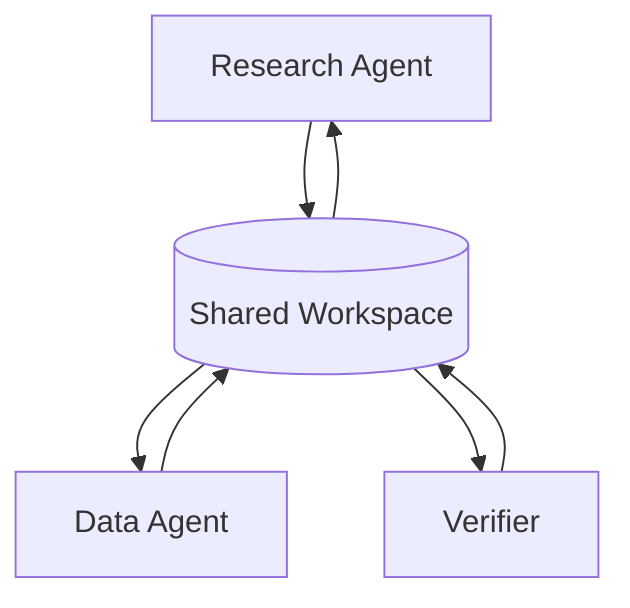

The workspace can hold tasks, hypotheses, evidence, artifacts, status, and decisions. It reduces direct coupling but requires schemas, concurrency control, ownership, and access policy.

---

## 11. Event-Driven Architecture

Long-running systems often communicate through events such as:

```text
task.created
task.assigned
task.completed
task.failed
approval.requested
approval.resolved
artifact.created
workflow.cancelled
```

Benefits include asynchronous execution, durability, loose coupling, and independent scaling. Costs include eventual consistency, duplicate delivery, ordering issues, and operational complexity.

Consumers should be idempotent where possible.

---

## 12. Task as the Unit of Coordination

Do not coordinate only through chat messages.

```json
{
  "task_id": "task-204",
  "parent_task_id": "task-100",
  "objective": "Determine whether deployment dep-42 caused checkout failures",
  "status": "assigned",
  "assignee": "deployment-investigator",
  "dependencies": ["task-201"],
  "allowed_tools": ["read_deployments", "read_logs"],
  "max_tool_calls": 8,
  "expected_output_schema": "incident_hypothesis_v1"
}
```

A durable task object can be validated, traced, retried, cancelled, and audited.

---

## 13. Task Lifecycle

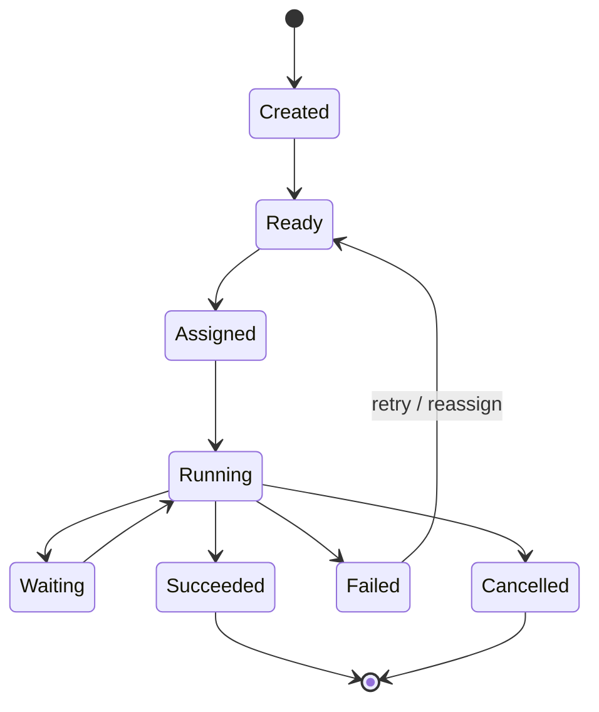

Do not infer lifecycle only from natural-language messages.

---

## 14. Structured Handoff Contract

```json
{
  "objective": "Verify the proposed root cause",
  "inputs": {
    "hypothesis": "dep-42 introduced timeout regression",
    "evidence_ids": ["ev-11", "ev-18"]
  },
  "constraints": {
    "read_only": true,
    "allowed_services": ["checkout-api"]
  },
  "expected_output": {
    "status": "supported | rejected | inconclusive",
    "evidence_ids": [],
    "gaps": []
  }
}
```

Structured handoffs improve validation, permission enforcement, retries, observability, and interoperability.

---

## 15. Pass References, Not Giant Contexts

Prefer:

```text
task contract
+ required facts
+ evidence/artifact references
+ relevant policy
```

instead of copying the supervisor's full transcript and every worker result into every agent. This reduces cost, leakage, and context contamination.

---

## 16. Artifacts vs Messages

Messages communicate. **Artifacts are durable work products.**

Examples include research reports, code patches, query results, evidence bundles, and execution plans.

```text
Agent A
  ↓
Artifact Store: artifact-81
  ↓ reference
Agent B
```

Version important outputs and pass references between agents to preserve provenance.

---

## 17. State Ownership

Every mutable state field should have an owner.

Bad:

```text
All agents can update workflow.status
```

Better:

```text
Coordinator owns workflow.status
Worker owns local task progress
Approval service owns approval state
Artifact service owns artifact versions
```

Clear ownership reduces race conditions and contradictory updates.

---

## 18. Shared vs Isolated Memory

Shared memory supports reuse and coordination but introduces contamination, authorization, freshness, and conflicting-write risks.

A robust pattern is:

```text
isolated local state
+ controlled shared artifacts
+ policy-filtered shared memory
```

See [Agent Memory Architecture](agent-memory.md).

---

## 19. Capability Registry

```json
{
  "agent_id": "research-agent-v3",
  "skills": ["web_research", "enterprise_search"],
  "input_schemas": ["research_task_v2"],
  "output_schemas": ["evidence_bundle_v2"],
  "permissions": ["read:knowledge"],
  "max_concurrency": 20,
  "health": "healthy"
}
```

A registry can support deterministic, semantic, capability-based, and load-aware routing.

---

## 20. Task Allocation

Strategies include:

- **deterministic:** known domain rules,
- **capability matching:** required skills to registered capabilities,
- **semantic routing:** model/classifier for ambiguous boundaries,
- **load-aware routing:** health, queue depth, latency, cost,
- **hybrid:** combine policy constraints and semantic selection.

A useful ordering is:

```text
authorization constraints
      ↓
required capabilities
      ↓
healthy candidates
      ↓
semantic / cost routing
```

---

## 21. Delegation Policy

Define allowed delegate types, maximum depth/fan-out, tool scopes, cost/time budgets, and approval requirements.

```text
User authority
     ↓
Coordinator authority
     ↓
Worker authority
```

Delegation must not create authority the parent task did not possess.

---

## 22. Recursive Delegation

Without bounds:

```text
A delegates to B
B delegates to C
C delegates to A
```

Controls include delegation depth, ancestor task IDs, repeated-task fingerprints, global call budgets, and cycle detection.

---

## 23. Dependency Graph

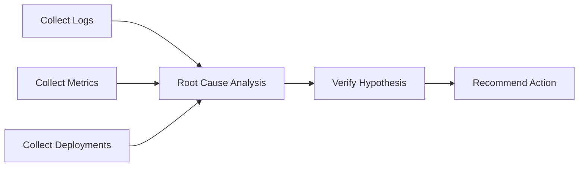

The scheduler can run A/B/C in parallel and block D until dependencies complete. Use software to enforce dependency rules.

---

## 24. Completion Semantics

"All agents stopped talking" is not a completion condition.

```text
required tasks succeeded
AND required artifacts exist
AND verification passed
AND no mandatory approval remains
```

Final states can include succeeded, partially succeeded, failed, cancelled, timed out, or awaiting human input.

---

## 25. Cancellation

```text
User cancels workflow
       ↓
Coordinator marks cancelled
       ↓
Stops new assignments
       ↓
Cancels active child tasks
       ↓
Cancels/compensates eligible tools
       ↓
Records final audit state
```

Long-running agents without cancellation become operational liabilities.

---

## 26. Timeouts

Use separate timeouts for tool calls, agent steps, delegated tasks, and the complete workflow.

Timeouts should produce structured state and preserve useful partial artifacts.

---

## 27. Retries and Reassignment

Retry only when failure is plausibly transient.

- network timeout → retry may help,
- malformed task contract → unchanged retry will not help,
- permission denied → do not treat as transient.

Reassignment can help when another compatible worker exists. Preserve attempt IDs to detect duplicates.

---

## 28. Idempotency

At-least-once delivery can execute the same task multiple times.

For side effects:

```text
task_id / operation_id
      ↓
idempotency key
      ↓
external operation
```

This matters for payments, tickets, emails, deployments, and account changes.

---

## 29. Deadlocks

```text
Agent A waits for artifact from B
Agent B waits for approval from A
```

Detect using dependency-cycle checks, wait-duration thresholds, task-state inspection, and coordinator watchdogs. Do not expect LLMs to reliably detect distributed deadlocks themselves.

---

## 30. Livelocks and Agent Ping-Pong

A system can remain active without progress:

```text
Research: needs verification
Verifier: needs more research
Research: needs verification
...
```

Detect repeated handoff pairs, unchanged evidence, repeated task fingerprints, no new artifacts, and exhausted progress budgets.

---

## 31. Duplicate Work

Use canonical task fingerprints, registry lookup, shared artifact/evidence catalogs, and deduplication windows. Parallelism should create independent value rather than duplicate cost.

---

## 32. Conflicting Results

Do not automatically resolve disagreement through majority vote.

Prefer:

1. inspect provenance,
2. compare source authority,
3. check timestamps and scope,
4. run deterministic validation,
5. request targeted verification,
6. escalate material uncertainty.

Several agents can share the same underlying error.

---

## 33. Verifier Pattern

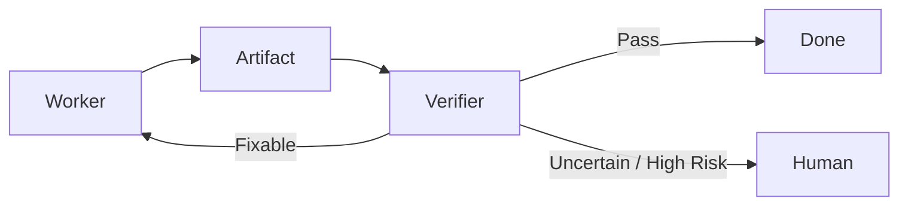

Prefer deterministic checks—schemas, tests, permissions, numerical reconciliation—before model-based semantic verification.

---

## 34. Debate / Critic Patterns

Multiple perspectives can help some ambiguous tasks, but:

```text
more agents ≠ independent truth
```

Agents can share models, biases, sources, and failure modes. Use debate only when evaluation demonstrates benefit.

---

## 35. Human-in-the-Loop

Approval should be tied to the exact consequential action.

```text
Worker proposes action
      ↓
Policy marks approval-required
      ↓
Human sees exact action + evidence
      ↓
Approve / Reject
      ↓
Executor
```

Materially changed arguments may require new approval.

---

## 36. Security Boundaries

Treat each agent as a principal with scoped authority.

Give it only required tools, data, tenant scope, and action permissions. Do not share one universal high-privilege credential across all workers.

---

## 37. Delegation Must Not Escalate Privilege

A useful mental model:

```text
effective child permission
=
parent task permission
∩ worker capability
∩ user authorization
∩ policy
```

A coordinator that cannot issue a refund must not gain that authority merely by delegating.

---

## 38. Prompt Injection Across Agents

A compromised artifact can propagate malicious instructions:

```text
Retrieved document
→ Research Agent
→ malicious text copied into artifact
→ Action Agent interprets it as instruction
```

Defenses include instruction/data separation, normalization, provenance, external permission enforcement, and approval for high-impact actions.

---

## 39. Tenant Isolation

Shared queues, memories, artifacts, and registries must preserve tenant boundaries. Enforce tenant constraints in trusted infrastructure, not through prompt instructions.

---

## 40. Secrets

Do not put long-lived raw credentials in model context.

```text
Agent requests approved capability
      ↓
Tool Gateway
      ↓
Secret Manager / Identity
      ↓
External System
```

Resolve credentials at execution time.

---

## 41. MCP in Multi-Agent Systems

MCP can standardize access to tools, resources, and prompts:

```text
Specialist Agent
      ↓
MCP Client
      ↓
MCP Server
      ↓
Enterprise Capability
```

MCP does not itself solve scheduling, delegation, consensus, global state, or workflow completion.

---

## 42. A2A in Multi-Agent Systems

A2A is relevant when independently implemented/deployed agentic applications need an interoperability boundary.

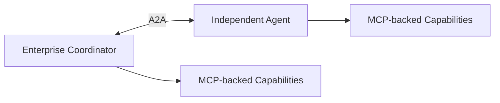

Use A2A because the boundary requires agent interoperability—not merely because an internal workflow contains multiple agents.

---

## 43. In-Process vs Distributed Agents

| Property | In-process | Distributed |
|---|---|---|
| latency | lower | network overhead |
| isolation | weaker | stronger |
| scaling | coupled | independent |
| state sharing | easier | explicit |
| failure domain | shared | separable |
| operations | simpler | more complex |

Choose deployment boundaries for engineering reasons, not to make the design look more agentic.

---

## 44. Durable Execution

Long-running tasks should survive process restarts.

Persist workflow/task state, dependency graphs, artifacts, approvals, budgets, and attempt metadata.

```text
Execute step
   ↓
Checkpoint
   ↓
Process crashes
   ↓
Restore checkpoint
   ↓
Resume safely
```

Durability is often more valuable than adding more model reasoning.

---

## 45. Backpressure

If workers produce tasks faster than downstream systems can consume them, queues grow.

Controls include bounded queues, concurrency limits, rate limits, admission control, priority, and load shedding.

Agent autonomy does not override infrastructure capacity.

---

## 46. Scaling

Scale components independently:

```text
Coordinator pool
Research worker pool
Action worker pool
Tool gateway
Artifact store
Event infrastructure
Model endpoints
```

Different specialists may require different scaling policies.

---

## 47. Model Routing

Different roles may use different models.

```text
Router → small/fast model
Research synthesis → stronger model
Schema extraction → specialized/cheap model
Verifier → deterministic checks + model if needed
```

Evaluate routing; the largest model is not automatically best everywhere.

---

## 48. Latency Model

Parallel:

```text
total latency
≈ coordinator
+ max(worker branch latencies)
+ merge
+ verification
```

Sequential:

```text
total latency
≈ coordinator
+ worker A
+ worker B
+ worker C
+ verification
```

Parallelism helps only where dependencies permit.

---

## 49. Cost Model

```text
Total Cost
=
coordinator calls
+ worker calls
+ verifier calls
+ tool/API cost
+ retrieval/storage
+ retries
+ duplicated work
```

Track cost by workflow, task, role, tenant, model, and tool.

---

## 50. Global Budgets

```json
{
  "max_model_calls": 30,
  "max_tool_calls": 50,
  "max_delegations": 8,
  "max_parallel_tasks": 5,
  "max_cost_usd": 2.0,
  "deadline_ms": 60000
}
```

Workers should not optimize locally while exhausting the workflow globally. The coordinator enforces global budgets.

---

## 51. Observability

Use hierarchical traces:

```text
workflow-100
├── coordinator
├── task-201 research
│   ├── model call
│   └── search tool
├── task-202 metrics
│   ├── model call
│   └── metrics tool
└── verifier
```

Record workflow/task IDs, parent-child relationships, routing, model/version, tools, artifacts, handoffs, retries, approvals, latency, token/cost usage, and termination reason.

---

## 52. Evaluation Layers

Evaluate:

- **worker quality** — did specialists do their tasks?
- **routing** — was the right agent selected?
- **handoff** — was required information transferred safely?
- **coordination** — were dependencies/retries/parallelism correct?
- **verification** — were bad results detected?
- **end-to-end** — did the user goal succeed safely and efficiently?

---

## 53. Multi-Agent Metrics

Useful metrics:

- end-to-end task success,
- routing accuracy,
- handoff completeness,
- retry rate,
- duplicate-work rate,
- delegation depth,
- loop/deadlock rate,
- verifier rejection rate,
- human escalation rate,
- latency,
- model/tool calls,
- cost per successful task,
- policy violations.

---

## 54. Evaluate Against a Simpler Baseline

Compare against a deterministic workflow or single agent + tools.

| Dimension | Baseline | Multi-Agent |
|---|---:|---:|
| task success | measure | measure |
| latency | measure | measure |
| cost | measure | measure |
| policy compliance | measure | measure |
| maintainability | assess | assess |
| failure recovery | measure | measure |

The multi-agent architecture must earn its complexity.

---

## 55. Example: Incident Investigation

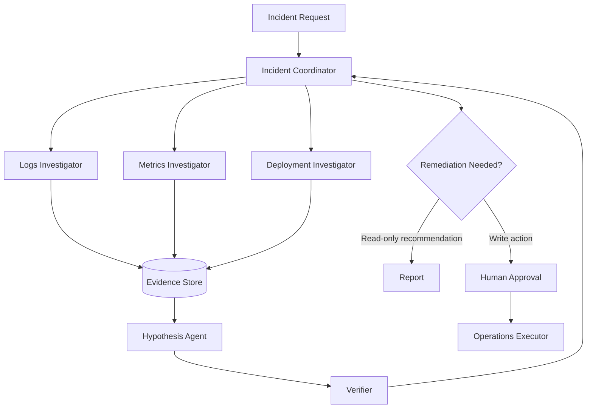

Multiple agents may help because investigations are independent, specialists use different tools, evidence can be isolated/merged, and remediation permissions are separated. A single agent with parallel tools remains an important baseline.

---

## 56. Example: Enterprise Research

Delegate to enterprise knowledge, web research, and structured-data specialists.

Each returns an **evidence bundle**, not merely a prose opinion.

A synthesis stage builds claim-evidence mappings. A verifier checks provenance, conflicts, unsupported claims, and evidence gaps.

This is stronger than asking three agents to answer independently and voting.

---

## 57. Example: Customer Support

Possible roles include triage, policy retrieval, account lookup, and resolution planning.

```text
Support Coordinator
      ↓
Read-only specialists
      ↓
Proposed resolution
      ↓
Policy check
      ↓
Approval if required
      ↓
Side-effect executor
```

Do not give every specialist refund authority.

---

## 58. Common Anti-Patterns

- **agent per step** — fixed transitions usually belong in a workflow,
- **agent per tool** — tools are capabilities, not automatically agents,
- **shared universal context** — creates leakage, cost, and confusion,
- **shared universal credentials** — violates least privilege,
- **unbounded delegation** — creates runaway loops/cost,
- **natural-language-only task state** — difficult to recover and validate,
- **majority vote as truth** — correlated agents can share the same error,
- **no cancellation** — long-running work becomes uncontrollable,
- **no baseline** — impossible to prove multi-agent complexity helped.

---

## 59. Production Design Checklist

### Architecture
- [ ] Is multi-agent justified over workflow/single-agent?
- [ ] Are agent boundaries explicit?
- [ ] Is there a global task owner?
- [ ] Are dependencies represented structurally?

### State and delegation
- [ ] Does each mutable field have an owner?
- [ ] Are artifacts durable/versioned?
- [ ] Are handoffs schema-based?
- [ ] Are delegation depth and fan-out bounded?
- [ ] Are cycles detectable?

### Security
- [ ] Does each agent have least privilege?
- [ ] Can delegation avoid privilege escalation?
- [ ] Are tenant boundaries enforced outside prompts?
- [ ] Are consequential actions approved when needed?

### Reliability
- [ ] Are timeouts explicit?
- [ ] Are retries classified?
- [ ] Are side effects idempotent?
- [ ] Can workflows resume after crashes?
- [ ] Does cancellation propagate?

### Evaluation
- [ ] Is routing evaluated?
- [ ] Are handoffs evaluated?
- [ ] Are loops/duplicates measured?
- [ ] Is there a simpler baseline?
- [ ] Are latency and cost measured end-to-end?

---

## 60. Interview / System-Design Framework

When designing a multi-agent system:

1. define the user goal,
2. define success and safety requirements,
3. establish a workflow/single-agent baseline,
4. identify why independent agents are justified,
5. define responsibilities,
6. define tools and permissions per role,
7. choose coordination topology,
8. define task/handoff schemas,
9. define state and artifact ownership,
10. define dependency and parallelism model,
11. define delegation/cost/time budgets,
12. define retries, idempotency, cancellation, and durability,
13. define security and approval boundaries,
14. define observability,
15. define evaluation against the baseline,
16. discuss latency/cost/scaling trade-offs.

A strong design explains not only **how agents collaborate**, but **why each agent boundary exists**.

---

## 61. Key Takeaways

- Multi-agent architecture is a coordination/distributed-systems problem as much as an LLM problem.
- Start with workflows or single-agent designs and add agents only when separation creates measurable value.
- Give every agent a clear objective, state boundary, capability set, permission scope, and lifecycle.
- Coordinate through structured tasks, artifacts, and state—not only natural-language messages.
- Keep global invariants in trusted orchestration software.
- Bound delegation depth, fan-out, time, model/tool calls, and cost.
- Design for duplicate delivery, retries, deadlocks, livelocks, cancellation, and partial failure.
- Delegation must never become privilege escalation.
- Evaluate workers, routing, handoffs, coordination, verification, and end-to-end outcomes.
- MCP can standardize capability access; A2A can support independent agent interoperability; neither replaces orchestration.
- A multi-agent system should outperform a simpler baseline enough to justify its complexity.

---

## Continue Learning

1. [AI Agents](../../AI%20Agents.md)
2. [Agent Architecture & Agent Loops](agent-architecture.md)
3. [Tool Use & Agent Orchestration](tool-use-and-orchestration.md)
4. [Agent Memory Architecture](agent-memory.md)
5. [Planning & Reasoning Patterns](planning-and-reasoning.md)
6. [Agentic RAG](agentic-rag.md)
7. [Single-Agent vs Multi-Agent](../../Single-Agent%20vs.%20Multi-Agent.md)
8. [Multi-Agent Collaboration](../../Multi-Agent%20Collaboration.md)
9. **Multi-Agent Systems Architecture — this chapter**
10. [MCP](../../MCP%20%28Model%20Context%20Protocol%29.md)
11. [A2A](../../A2A%20Protocol.md)
