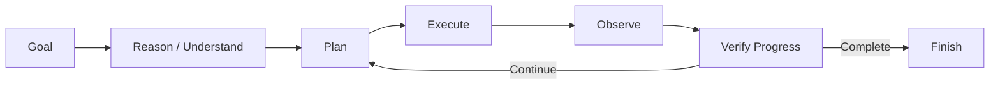
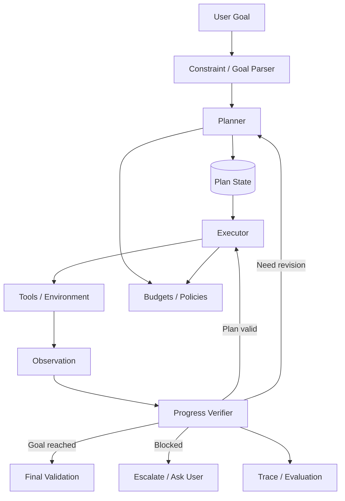
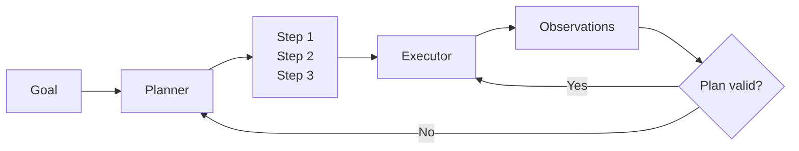
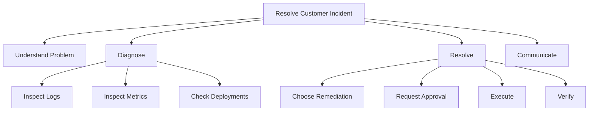
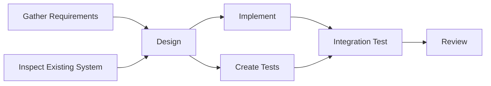
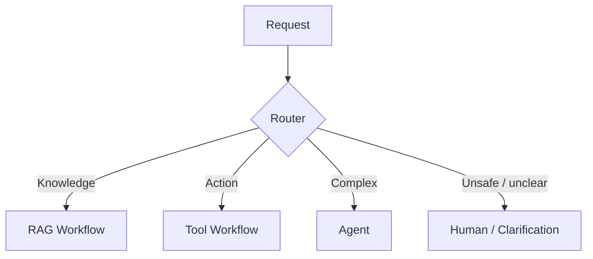
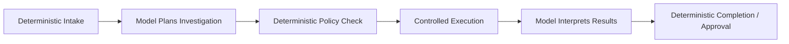
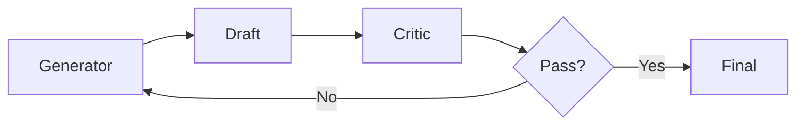
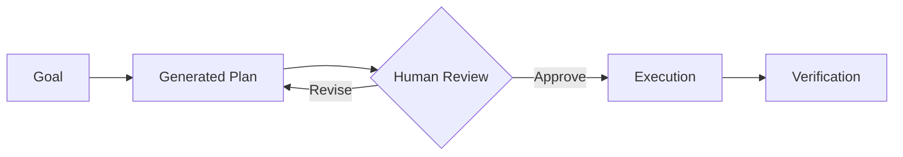
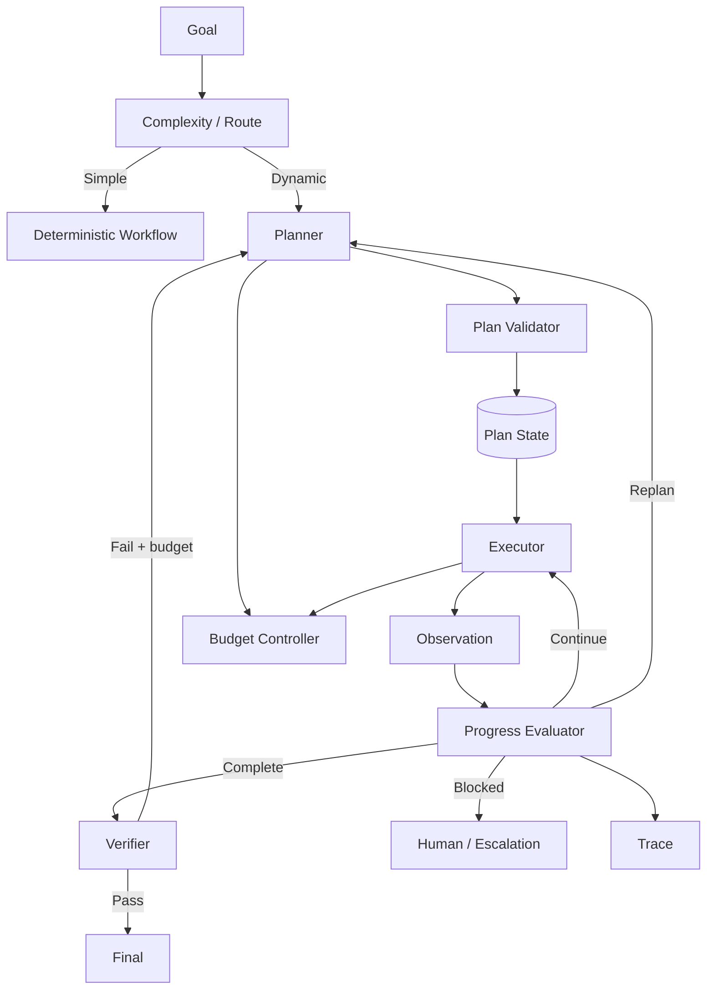

# Planning & Reasoning Patterns for AI Agents

Planning is the mechanism that turns a goal into a controlled sequence of decisions and actions.

A production agent does not need elaborate planning for every task. In fact, adding unnecessary planning can make a system slower, more expensive, less predictable, and harder to evaluate.

The engineering question is not:

> "How do I make the agent reason more?"

It is:

> **What decisions must be made dynamically, which decisions can remain deterministic, and how do we verify progress toward the goal?**

---

## 1. What Is Planning?

Planning maps a desired outcome to actions.

```text
Goal
  ↓
Understand constraints
  ↓
Decompose problem
  ↓
Select next action(s)
  ↓
Execute
  ↓
Observe
  ↓
Update / replan
  ↓
Finish
```

The plan can be:

- implicit,
- explicit,
- static,
- dynamically revised,
- hierarchical,
- deterministic,
- model-generated,
- hybrid.

---

## 2. Planning vs Reasoning vs Execution

These are related but distinct.

### Reasoning

Determining what information or decision is needed.

### Planning

Organizing decisions/actions toward a goal.

### Execution

Performing the selected actions.

A useful separation:



---

## 3. Why Planning Exists

Planning becomes useful when:

- the task requires several dependent steps,
- later actions depend on intermediate observations,
- multiple tools are available,
- the environment can change,
- failures require adaptation,
- the task has constraints,
- progress must be tracked.

Example:

```text
"Investigate the production incident and propose a remediation."
```

The system may need to:

1. inspect metrics,
2. identify the onset,
3. inspect deployments,
4. search logs,
5. form hypotheses,
6. test hypotheses,
7. propose remediation,
8. verify evidence.

A single predetermined call may not be enough.

---

## 4. When Not to Plan

If the task is:

```text
"What is the status of order 123?"
```

and the architecture already knows:

```text
get_order_status(order_id)
```

then generating a five-step plan is unnecessary.

Prefer:

```text
Request → Validate → Tool → Answer
```

Planning has overhead. Use it when the expected benefit exceeds that overhead.

---

## 5. Planning Architecture



The planner should not own security invariants. Authorization, budgets, and tool execution remain controlled by the runtime.

---

## 6. Reactive Planning

The simplest agentic pattern chooses one next action at a time.

```text
Observe
  ↓
Choose next action
  ↓
Execute
  ↓
Observe
  ↓
Choose next action
```

### Strengths

- flexible,
- simple state model,
- naturally responds to new information.

### Weaknesses

- can become myopic,
- may repeat actions,
- weak long-horizon coordination,
- difficult to estimate total cost.

Reactive planning is often sufficient for short tool-use tasks.

---

## 7. ReAct-Style Control

A common conceptual loop interleaves decision and action:

```text
Reason / decide
      ↓
Action
      ↓
Observation
      ↓
Reason / decide
      ↓
...
```

Example operational trace:

```text
Goal:
Investigate checkout errors.

Decision:
Need deployment history.

Action:
get_recent_deployments("checkout-api")

Observation:
v2.8.1 deployed 20 minutes before error spike.

Decision:
Need evidence linking deployment to failure.

Action:
search_logs("checkout-api", since=deployment_time)

Observation:
Database pool timeout increased immediately after deployment.
```

For production observability, store structured decisions/actions/observations rather than depending on hidden free-form internal reasoning.

---

## 8. Plan-and-Execute

Plan first, execute second.



Example plan:

```json
{
  "goal": "Investigate service degradation",
  "steps": [
    {"id": 1, "task": "Inspect service metrics"},
    {"id": 2, "task": "Check recent deployments"},
    {"id": 3, "task": "Correlate logs with onset"},
    {"id": 4, "task": "Test strongest hypothesis"}
  ]
}
```

### Benefits

- visible progress,
- easier checkpointing,
- easier human review,
- supports longer tasks.

### Costs

- plan may become stale,
- planning consumes tokens/time,
- false precision can make a bad plan look authoritative.

---

## 9. Replanning

Plans should often be treated as hypotheses, not immutable scripts.

```text
Initial plan
    ↓
Execute step
    ↓
Unexpected observation
    ↓
Check assumptions
    ↓
Revise remaining plan
```

Replanning triggers might include:

- tool failure,
- new contradictory evidence,
- missing prerequisite,
- changed environment,
- exceeded budget,
- newly discovered subtask.

Avoid replanning after every trivial observation. It can create excessive model calls.

---

## 10. Incremental Planning

Instead of planning the entire task:

```text
Plan next 2–3 meaningful steps
       ↓
Execute
       ↓
Update plan
```

This balances long-horizon structure with adaptability.

It is useful when the environment is uncertain and a detailed initial plan would quickly become stale.

---

## 11. Hierarchical Planning

Complex goals can be decomposed into levels.



Hierarchical planning helps manage complex tasks but adds state and orchestration complexity.

---

## 12. Task Decomposition

A useful decomposition produces steps that are:

- independently understandable,
- measurable,
- ordered by dependency,
- bounded,
- mapped to available capabilities.

Bad decomposition:

```text
1. Solve the issue.
2. Make sure it works.
```

Better:

```text
1. Determine failure onset.
2. Identify changes near onset.
3. Collect evidence for likely causes.
4. Test highest-confidence cause.
5. Select safe remediation.
6. Verify recovery.
```

---

## 13. Dependency Graphs

Some tasks are not simple lists.



Representing dependencies allows independent tasks to run concurrently.

---

## 14. Sequential vs Parallel Planning

### Sequential

Use when step B requires output from step A.

```text
A → B → C
```

### Parallel

Use when tasks are independent.

```text
   ┌→ B ─┐
A ─┼→ C ─┼→ E
   └→ D ─┘
```

Parallelism can reduce latency but increases:

- concurrency,
- aggregation complexity,
- partial-failure handling,
- resource usage.

---

## 15. Routing as a Planning Pattern

Sometimes the only dynamic decision is which path to choose.



Do not build a fully autonomous planner when a router solves the problem.

---

## 16. Deterministic Planning

A deterministic workflow encodes known steps in software.

```python
if request.type == "refund":
    verify_identity()
    order = fetch_order()
    check_policy(order)
    request_confirmation()
    execute_refund()
```

Advantages:

- predictable,
- testable,
- auditable,
- cheap.

Use deterministic control whenever business logic is known.

---

## 17. Model-Driven Planning

The model generates or modifies the plan.

Useful when:

- tasks are open-ended,
- decomposition varies substantially,
- semantic judgment is required.

Risks:

- hallucinated steps,
- impossible actions,
- missing dependencies,
- unstable plans,
- excessive complexity.

Generated plans should be validated against actual capabilities and constraints.

---

## 18. Hybrid Planning

Many production systems should be hybrid.



Use models where semantic flexibility matters and software where invariants matter.

---

## 19. Plan Representation

Plans should be machine-readable when they drive execution.

Example:

```json
{
  "goal": "prepare incident report",
  "steps": [
    {
      "id": "s1",
      "description": "collect incident timeline",
      "depends_on": [],
      "status": "pending"
    },
    {
      "id": "s2",
      "description": "identify root cause evidence",
      "depends_on": ["s1"],
      "status": "pending"
    }
  ]
}
```

Useful fields:

- ID,
- objective,
- dependencies,
- status,
- expected output,
- allowed tools,
- retry count,
- owner,
- completion criteria.

---

## 20. Plan Validation

Before execution, validate:

```text
Are all tools available?
Are requested actions permitted?
Are dependencies valid?
Are steps duplicated?
Does the plan violate budget?
Are side effects identified?
Does a step require approval?
```

A syntactically valid plan can still be operationally invalid.

---

## 21. Preconditions and Postconditions

For important actions, define:

### Preconditions

What must be true before execution?

### Postconditions

What should be true afterward?

Example:

```text
Action: rollback deployment

Preconditions:
- target version exists
- user/service is authorized
- rollback approved

Postconditions:
- active version == target version
- health checks pass
```

This makes verification concrete.

---

## 22. Progress Verification

Do not equate "step executed" with "goal progressed."

After an action ask operationally:

```text
Did expected state change?
Did evidence increase?
Was a subgoal completed?
Did uncertainty decrease?
```

Example:

```text
Action: restart service
Tool response: success
```

That does not prove the incident is resolved.

Verification might require:

```text
error rate returned to baseline
AND health checks pass
```

---

## 23. Completion Criteria

Goals should have explicit completion conditions.

Bad:

```text
"Keep investigating until done."
```

Better:

```text
Complete when:
- root-cause hypothesis has supporting evidence,
- remediation is proposed,
- unresolved uncertainty is stated,
- no further permitted tool call is expected to materially improve confidence.
```

Completion criteria help prevent loops.

---

## 24. Bounded Planning

Every planner should operate within constraints.

Possible budgets:

```text
max_plan_steps
max_replans
max_tool_calls
max_model_calls
max_elapsed_time
max_cost
```

These should be enforced by the runtime.

---

## 25. Loop Detection

Agents may:

- repeat searches,
- oscillate between hypotheses,
- regenerate equivalent plans,
- retry permanent failures.

Detection signals:

```text
same tool + same args repeatedly
same plan fingerprint
no new evidence after N steps
same failure category repeatedly
no progress metric improvement
```

When detected:

- stop,
- change strategy,
- escalate,
- ask user,
- return partial result.

---

## 26. Reflection Pattern

Reflection adds a review step.

```text
Draft / action trajectory
       ↓
Critic / reviewer
       ↓
Issues found?
   ↙          ↘
 yes          no
 ↓             ↓
Revise        Finish
```

Reflection can improve some complex tasks, but it is not free.

Costs:

- extra model calls,
- latency,
- possibility of degrading a correct result,
- self-reinforcing model biases.

Use it when evaluation demonstrates value.

---

## 27. Critic–Generator Pattern

Separate generation from critique.



The critic can check:

- missing requirements,
- unsupported claims,
- schema compliance,
- contradictions,
- policy issues.

For objective properties, deterministic validators are usually preferable.

---

## 28. Verification Before Reflection

Before asking another model to "critique," ask whether the result can be checked deterministically.

Examples:

```text
JSON validity → schema validator
code syntax → parser/compiler
calculation → calculator
URL status → HTTP check
database state → database query
permission → authorization service
```

Do not spend model reasoning on facts software can verify exactly.

---

## 29. Self-Consistency / Multiple Candidates

For difficult tasks, a system may generate multiple candidate solutions and select among them.

```text
          ┌→ Candidate A ─┐
Problem ──┼→ Candidate B ─┼→ Evaluate → Select
          └→ Candidate C ─┘
```

This can improve robustness but multiplies cost.

Candidate evaluation should use objective signals where available.

---

## 30. Search Over Alternatives

Some problems require exploring alternatives rather than committing immediately.

Conceptually:

```text
Current state
 ├─ Option A
 │   ├─ A1
 │   └─ A2
 └─ Option B
     ├─ B1
     └─ B2
```

The system can score/prune alternatives.

This resembles search/planning techniques from classical AI.

Use carefully: branching factor can make cost grow rapidly.

---

## 31. Beam-Style Exploration

Instead of keeping one path, retain the best K candidates.

```text
Step 1: 5 candidates
        ↓ score
keep best 2
        ↓ expand
Step 2: 8 candidates
        ↓ score
keep best 2
```

Useful for constrained search problems, but often excessive for ordinary agents.

---

## 32. Hypothesis-Driven Reasoning

Investigation agents benefit from explicit hypotheses.

```text
Evidence
   ↓
Candidate hypotheses
   ↓
Rank
   ↓
Choose discriminating test
   ↓
New evidence
   ↓
Update hypotheses
```

This is stronger than randomly calling tools.

Example:

```text
H1: bad deployment
H2: database outage
H3: traffic spike
```

The next action should ideally distinguish between hypotheses.

---

## 33. Evidence Tracking

A planner should distinguish claims from evidence.

```json
{
  "hypothesis": "deployment caused outage",
  "supporting_evidence": [
    "error spike began 2 minutes after deployment",
    "config diff reduced pool size"
  ],
  "contradicting_evidence": [],
  "confidence": "high"
}
```

This improves verification and final explanation.

---

## 34. Uncertainty

Agents should be able to represent uncertainty rather than converting every hypothesis into fact.

Useful states:

```text
unknown
possible
likely
verified
contradicted
```

The exact representation depends on the application.

For high-impact decisions, require stronger evidence before action.

---

## 35. Information-Gain Planning

When several actions are possible, choose the one expected to reduce uncertainty most.

Example:

```text
Could inspect:
- 100 MB logs
- deployment diff
- CPU graph

If deployment timing strongly correlates with onset,
the config diff may be the most discriminating next check.
```

This is a useful mental model for efficient investigation.

---

## 36. Planning With Tool Costs

Actions have different costs.

A planner can consider:

```text
utility(action) =
  expected_information_gain
  or expected_progress
  - latency
  - monetary_cost
  - risk
```

Not every available action should be taken.

---

## 37. Planning With Risk

A high-risk action should require a stronger justification than a read-only action.

```text
read logs
   ↓ low risk

restart staging
   ↓ medium risk

modify production data
   ↓ high risk + approval
```

Risk-aware planning works together with deterministic policy enforcement.

The planner may propose an action; the policy layer decides whether execution is allowed.

---

## 38. Human-in-the-Loop Planning

Humans can participate at plan boundaries.

Examples:

- approve plan before execution,
- choose between alternatives,
- provide missing constraints,
- approve high-risk step,
- review final outcome.



This is especially useful for long-running, expensive, or consequential tasks.

---

## 39. Long-Running Plans

Plans lasting minutes or hours require durable state.

```text
Plan
 ↓
Persistent checkpoint
 ↓
Execute step
 ↓
Persist result
 ↓
Wait / resume
 ↓
Continue
```

Store enough state to recover after:

- worker restart,
- network failure,
- deployment,
- human approval delay.

---

## 40. Plan Checkpointing

Useful checkpoint data:

```text
goal
plan version
completed steps
pending steps
observations
artifacts
approvals
budgets
tool operation IDs
```

Checkpointing reduces the need to replay expensive or side-effecting actions.

---

## 41. Plan Versioning

Replanning creates versions.

```text
Plan v1
  ↓ unexpected result
Plan v2
  ↓ new constraint
Plan v3
```

Preserving versions helps answer:

- Why did the strategy change?
- Which observation caused the change?
- Did replanning improve the outcome?

---

## 42. Context Management for Planning

Long plans and histories can overwhelm context.

The planner may need:

```text
goal
current plan
completed-step summaries
important observations
unresolved questions
remaining constraints
available tools
budget
```

It usually does not need every raw token from every previous tool response.

---

## 43. Planner Memory

Long-running agents may retrieve prior episodes or procedures to inform planning.

Example:

```text
Current incident
     ↓
Retrieve similar prior incidents
     ↓
Use lessons as candidate strategies
     ↓
Verify against current evidence
```

Memory should influence planning without being treated as unquestionable truth.

---

## 44. Planning and RAG

Planning can control retrieval.

Example:

```text
Question
 ↓
Planner decides:
  1. retrieve architecture docs
  2. retrieve recent incidents
  3. compare evidence
 ↓
RAG calls
 ↓
Synthesis
```

This is one route toward Agentic RAG.

---

## 45. Planning and Multi-Agent Systems

A planner may delegate subtasks.

```text
Coordinator
 ├─ Research task → Research Agent
 ├─ Data task → Data Agent
 └─ Review task → Review Agent
```

But delegation introduces:

- communication cost,
- duplicated context,
- coordination failures,
- global-state questions,
- budget allocation.

Do not use multiple agents merely to represent plan steps.

---

## 46. Planning Failure: Hallucinated Capabilities

A planner may create:

```text
Step 3: Query production database
```

when no such tool exists.

Mitigation:

- provide actual capability catalog,
- validate every plan step,
- reject or revise unsupported actions.

---

## 47. Planning Failure: Missing Dependencies

Generated plan:

```text
1. Deploy fix
2. Run tests
```

Correct dependency:

```text
1. Build fix
2. Run tests
3. Approve
4. Deploy
5. Verify
```

Dependency validation matters for consequential workflows.

---

## 48. Planning Failure: Over-Decomposition

A planner may turn a trivial task into 20 steps.

Consequences:

- latency,
- token cost,
- more failure points.

Mitigation:

- complexity classifier,
- maximum plan depth,
- prefer direct execution for simple tasks.

---

## 49. Planning Failure: Premature Commitment

The planner chooses one hypothesis too early and only seeks confirming evidence.

Mitigations:

- track alternatives,
- record contradictory evidence,
- use discriminating tests,
- verification stage.

---

## 50. Planning Failure: Endless Reflection

```text
draft → critique → revise → critique → revise → ...
```

Mitigation:

```text
max_revision_rounds
objective pass criteria
stop when marginal improvement is low
```

---

## 51. Planning Failure: Goal Drift

The plan gradually optimizes a different objective.

Mitigation:

- preserve original goal,
- explicit completion criteria,
- periodic goal alignment checks,
- user clarification when constraints conflict.

---

## 52. Planning Failure: Stale Plan

The environment changes but the agent follows the old plan.

Mitigation:

- validate assumptions before important actions,
- replan on material state changes,
- use current tool observations.

---

## 53. Planning Evaluation

Evaluate both outcome and process.

### Outcome

- task success,
- correctness,
- completion quality.

### Plan quality

- necessary steps included,
- dependencies correct,
- feasible actions,
- appropriate ordering.

### Execution quality

- useful actions,
- unnecessary actions,
- recovery after failure.

### Efficiency

- steps,
- replans,
- model calls,
- tool calls,
- tokens,
- latency,
- cost.

### Safety

- policy violations,
- risky proposals,
- approval bypass attempts.

---

## 54. Plan Optimality vs Sufficiency

The shortest plan is not always safest.

The most comprehensive plan is not always worth the cost.

Production systems often optimize for:

```text
successful
+ safe
+ sufficiently efficient
+ understandable
```

rather than mathematically optimal planning.

---

## 55. Planning Evaluation Example

```yaml
goal: "Diagnose why checkout-api errors increased"

available_tools:
  - get_metrics
  - get_deployments
  - search_logs
  - get_config_diff

expected_constraints:
  must_collect_evidence: true
  max_tool_calls: 8
  forbidden_actions:
    - production_write

expected_behavior:
  - inspect signals near failure onset
  - correlate recent changes
  - verify strongest hypothesis
```

The test should allow multiple valid trajectories rather than requiring one exact plan.

---

## 56. Observability

A planning trace can record:

```text
Goal
├── Plan v1
│   ├── Step 1
│   │   ├── action
│   │   ├── observation
│   │   └── progress result
│   └── Step 2
├── Replan reason
├── Plan v2
│   └── ...
├── completion decision
└── outcome
```

Useful metrics:

- average plan length,
- replan rate,
- completion rate,
- repeated-step rate,
- no-progress termination rate,
- plan validation failures,
- cost per successful task,
- latency per successful task.

---

## 57. Planner–Executor Separation

A planner can have broader strategic context while an executor receives only what is needed for the current action.

Benefits:

- smaller execution context,
- clearer permissions,
- easier tracing,
- independent testing.

But separation adds more model calls and state transitions.

Use it when complexity justifies it.

---

## 58. Planner–Verifier Separation

For high-value tasks:

```text
Planner → Executor → Verifier
```

The verifier asks whether completion criteria are actually satisfied.

It can use:

- deterministic checks,
- tools,
- a separate model evaluation,
- human review.

Prefer objective verification when possible.

---

## 59. Model Routing for Planning

Not every planning decision requires the strongest model.

Possible architecture:

```text
Simple route / classification → small fast model or rules
Complex decomposition → stronger model
Objective validation → deterministic software
Final synthesis → appropriate generation model
```

This can improve cost and latency without reducing quality everywhere.

---

## 60. Latency

Planning creates serial model calls.

Example:

```text
initial planning      500 ms
decision              350 ms
tool                   300 ms
replan                 450 ms
tool                   250 ms
verification           400 ms
final answer           600 ms
-----------------------------
total                 2850 ms + overhead
```

Optimization:

- skip planning for simple tasks,
- parallelize independent actions,
- use incremental plans,
- avoid unnecessary reflection,
- use deterministic validators,
- route simple decisions to cheaper/faster models.

---

## 61. Cost

A rough planning cost model:

```text
total =
  initial_plan
+ Σ decision_calls
+ Σ replanning_calls
+ Σ tool_cost
+ verification
+ final_generation
```

Branching and repeated reflection can multiply cost quickly.

Set explicit budgets.

---

## 62. Production Planning Controller



This architecture keeps planning bounded by deterministic controls.

---

## 63. Framework-Agnostic Skeleton

```python
def run_goal(goal, principal, budget):
    if can_use_known_workflow(goal):
        return run_workflow(goal, principal)

    plan = planner.create(goal, capabilities())
    plan = validate_plan(plan, principal, budget)

    while budget.remaining() and not plan.complete():
        step = plan.next_ready_step()

        result = executor.execute(step, principal)
        plan.record(step, result)

        progress = verify_progress(goal, plan, result)

        if progress.goal_complete:
            return verify_final(goal, plan)

        if progress.replan_required:
            plan = planner.revise(
                goal=goal,
                current_plan=plan,
                new_observation=result
            )
            plan = validate_plan(plan, principal, budget)

    return safe_partial_result(plan)
```

The runtime, not the model, owns the budget and authorization.

---

## 64. Design Pattern Selection

A practical selection guide:

| Situation | Pattern |
|---|---|
| One known action | direct workflow |
| Choose one domain | router |
| Short adaptive task | reactive / ReAct-style |
| Multi-step predictable task | deterministic workflow |
| Long dynamic task | plan-and-execute |
| Uncertain environment | incremental planning + replanning |
| Objective output checks | deterministic verifier |
| Complex subjective output | bounded critic/revision |
| Multiple plausible hypotheses | hypothesis-driven exploration |
| Independent subtasks | parallel DAG |
| High-risk execution | plan + human approval + verification |

---

## 65. Common Anti-Patterns

### Planning every request

Adds overhead without value.

### Treating generated plans as authority

Plans must respect actual tools, permissions, and policies.

### Free-form plans that drive code

Use structured plans when execution depends on them.

### Reflection without evaluation

Do not add critique loops because they sound sophisticated.

### Unlimited replanning

Bound iterations and cost.

### Confusing tool success with goal success

Verify outcomes.

### Using an LLM where deterministic validation exists

Use software for exact checks.

### Multi-agent decomposition for ordinary steps

A task list does not require an agent per task.

---

## 66. Production Design Checklist

### Goal
- What exactly is success?
- What constraints exist?
- What is the stopping condition?

### Complexity
- Is planning needed?
- Could a workflow/router solve it?

### Plan
- Structured representation?
- Dependencies?
- Preconditions/postconditions?
- Allowed tools?

### Adaptation
- What triggers replanning?
- How many replans are allowed?

### Verification
- How is progress measured?
- What can be checked deterministically?
- What proves completion?

### Control
- Step/tool/model/cost/time budgets?
- Loop detection?
- Human approval?

### Reliability
- Checkpointing?
- Resume?
- Partial failure?

### Evaluation
- Outcome?
- Plan quality?
- Efficiency?
- Safety?
- Recovery?

---

## 67. Interview Discussion Framework

For a planning-heavy agent system-design question:

1. Clarify the goal and completion criteria.
2. Determine whether planning is actually necessary.
3. Separate deterministic workflow from dynamic decisions.
4. Choose reactive, plan-and-execute, hierarchical, or hybrid planning.
5. Define structured plan state and dependencies.
6. Validate plans against capabilities and permissions.
7. Define sequential vs parallel execution.
8. Add progress verification.
9. Define replanning triggers.
10. Add budgets and loop detection.
11. Add human approval for consequential actions.
12. Design checkpoint/resume for long tasks.
13. Define outcome and trajectory evaluation.
14. Add observability.
15. Discuss latency, cost, model routing, and complexity trade-offs.

A strong design explains **how the system knows it is making progress**, not merely how it generates a list of steps.

---

## 68. Key Takeaways

- Planning is useful only when runtime uncertainty or task complexity requires it.
- Prefer deterministic workflows for known control flow.
- Reactive planning works well for short adaptive tasks.
- Plan-and-execute helps long tasks but requires replanning and validation.
- Treat generated plans as proposals, not authority.
- Represent executable plans structurally.
- Track dependencies, preconditions, postconditions, and completion criteria.
- Verify progress rather than equating action completion with goal completion.
- Use deterministic verification whenever possible.
- Bound planning, replanning, reflection, tool calls, time, and cost.
- Track hypotheses and evidence for investigation tasks.
- Reflection and search over alternatives should be justified by measured gains.
- Durable long-running plans require checkpoints and resumable state.
- Production planning is controlled decision-making under constraints, not unlimited model autonomy.

---

## Next

- [Agent Architecture & Agent Loops](agent-architecture.md)
- [Tool Use & Agent Orchestration](tool-use-and-orchestration.md)
- [Agent Memory Architecture](agent-memory.md)
- [Production RAG System Design](../system-design/production-rag.md)
- [Design Patterns](../design-patterns/README.md)
