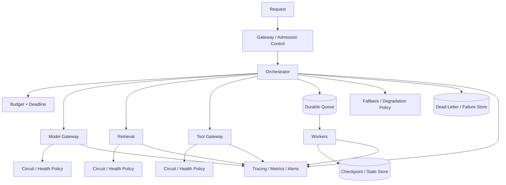
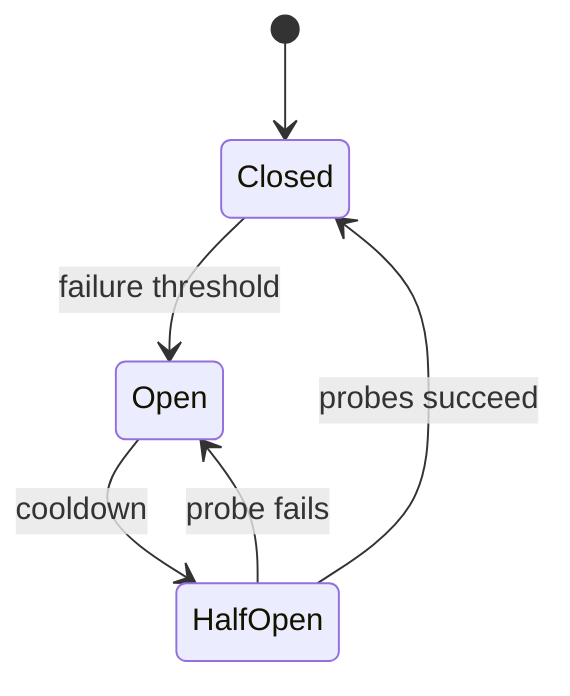
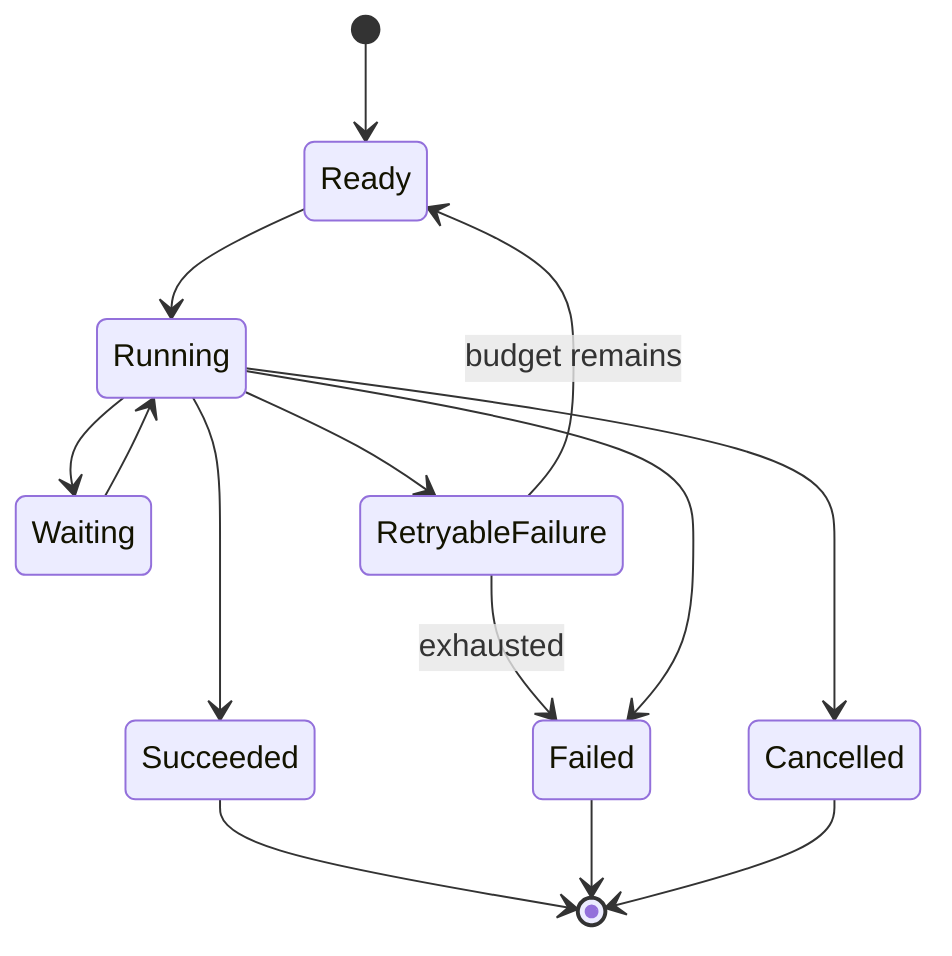
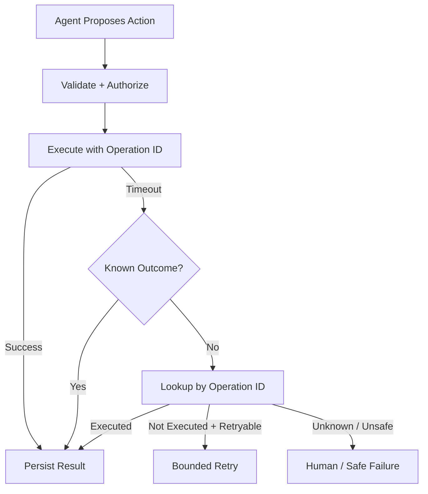
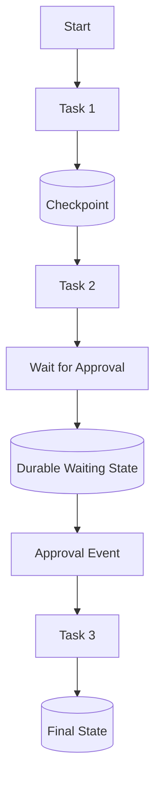
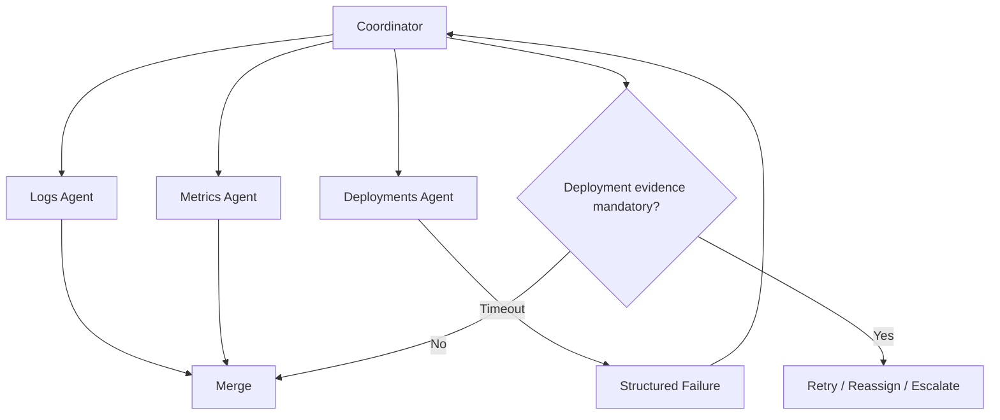

# Reliability & Resilience for GenAI and Agentic AI

A production AI system will eventually encounter model timeouts, rate limits, malformed outputs, stale indexes, unavailable tools, worker crashes, duplicate messages, partial multi-agent results, and downstream outages.

Reliability engineering asks:

> **When something fails, does the system know what happened, contain the damage, recover safely, and still provide the best valid outcome it can?**

Resilience is not "retry everything." A safe system classifies failures, bounds recovery, preserves state, avoids duplicate side effects, and degrades intentionally.

---

## 1. Reliability Is an End-to-End Property

A model can be healthy while the product is broken.

```text
User
 ↓
Gateway
 ↓
Orchestrator
 ├─ Model
 ├─ Retrieval
 ├─ Memory
 ├─ Tools
 ├─ Queue / Workers
 └─ External APIs
 ↓
Response / Action
```

End-to-end reliability is constrained by the dependencies and coordination between these components.

---

## 2. Reliability vs Resilience

**Reliability** asks how consistently the system performs correctly.

**Resilience** asks how well it responds when components fail or conditions degrade.

A resilient system may continue with reduced capability rather than fail completely.

---

## 3. Define the Service Contract

Before designing recovery, define:

- what counts as success,
- acceptable latency,
- required freshness,
- whether partial answers are acceptable,
- which actions must be exactly-once from the user's perspective,
- which dependencies are optional,
- when the system must fail closed.

Without a contract, "fallback" can silently become incorrect behavior.

---

## 4. Failure Taxonomy

Classify before retrying.

| Class | Example | Typical response |
|---|---|---|
| transient | network reset | bounded retry |
| rate limit | provider quota | backoff / queue / alternate capacity |
| timeout | dependency hangs | cancel, retry if safe |
| permanent validation | malformed request | fix/reject |
| authorization | forbidden action | do not retry unchanged |
| business rule | insufficient balance | surface result |
| dependency outage | vector store down | circuit breaker / fallback |
| partial failure | 1 of 3 branches fails | aggregate or compensate |
| duplicate delivery | message redelivered | idempotency |
| corrupted state | invalid checkpoint | quarantine / recover safely |

The same exception type can require different handling depending on operation semantics.

---

## 5. Reference Reliability Architecture



Recovery policy belongs in trusted orchestration/infrastructure, not only in prompts.

---

## 6. Timeouts Everywhere

Every external dependency should have an appropriate timeout.

Examples:

- model request,
- retrieval,
- reranker,
- tool,
- remote agent,
- queue lease,
- approval wait,
- whole workflow.

An unbounded wait can consume workers and violate user deadlines.

---

## 7. Deadline Propagation

A 10-second user deadline cannot safely contain three sequential 8-second dependency timeouts.

Propagate remaining time:

```text
request deadline = 10s
  ↓
routing = 0.2s
  ↓
retrieval budget = 1.5s
  ↓
model budget = 6s
  ↓
verification + response = remaining budget
```

Child operations should not outlive the useful parent request unless explicitly detached.

---

## 8. Cancellation

When the user or parent workflow cancels:

```text
stop new work
→ cancel cancellable children
→ release leases/resources
→ prevent unapproved side effects
→ preserve final state
```

Cancellation should propagate through agent and multi-agent task trees.

---

## 9. Retry Only Retryable Failures

Good retry candidates:

- transient network errors,
- temporary provider failures,
- selected timeouts,
- explicit retryable rate limits.

Poor retry candidates:

- invalid schema,
- permission denied,
- impossible business rule,
- deterministic bad arguments.

Repeating the same invalid request is not resilience.

---

## 10. Retry Budgets

Retries must be bounded.

```json
{
  "max_attempts": 3,
  "max_elapsed_ms": 8000,
  "retryable": ["timeout", "temporary_unavailable", "rate_limit"]
}
```

A retry budget should respect the global request/workflow deadline.

---

## 11. Exponential Backoff and Jitter

Immediate synchronized retries can amplify an outage.

Conceptually:

```text
attempt 1 → wait
attempt 2 → longer wait
attempt 3 → longer wait
              + random jitter
```

Honor provider retry hints when trustworthy and appropriate.

---

## 12. Retry Storms

During an outage:

```text
100 requests
× 3 retries
= 300 dependency calls
```

Retries can turn degradation into collapse.

Use retry budgets, circuit breakers, concurrency limits, and load shedding.

---

## 13. Idempotency

A retry of a side effect must not accidentally repeat the effect.

Example:

```text
refund request sent
→ network times out
→ was refund executed?
→ blind retry may refund twice
```

Use an operation/idempotency key where supported.

---

## 14. Idempotency Key

```json
{
  "operation_id": "refund-order-123-duplicate-charge",
  "order_id": "123",
  "amount": 42.50
}
```

The executor can return the prior result if the same operation is received again.

Idempotency is especially important for payments, messages, tickets, deployments, and account changes.

---

## 15. Exactly-Once Is Usually a System Property

Networks and queues commonly provide at-least-once delivery semantics.

User-visible "exactly once" behavior is often achieved through:

```text
at-least-once delivery
+ durable operation identity
+ idempotent consumer/executor
+ deduplication
```

Do not assume a message will only arrive once.

---

## 16. Safe vs Unsafe Retries

Read operations are often easier to retry than writes.

But even reads can be expensive or non-repeatable if they depend on changing state.

Classify operation semantics explicitly.

---

## 17. Circuit Breakers

When a dependency repeatedly fails, stop sending it normal traffic temporarily.



Circuit breakers prevent repeated calls to a dependency that is already unhealthy.

---

## 18. Circuit Breakers vs Retries

Retries handle individual transient failures.

Circuit breakers handle sustained dependency failure.

Using retries without a circuit breaker can amplify prolonged outages.

---

## 19. Bulkheads

Separate resource pools so one failure domain does not consume everything.

Examples:

```text
interactive requests → worker pool A
batch indexing       → worker pool B
high-cost agents     → concurrency pool C
```

A runaway batch job should not starve interactive users.

---

## 20. Concurrency Limits

Limit simultaneous:

- model calls,
- tool calls,
- agent runs,
- retrieval operations,
- remote-agent delegations.

Concurrency controls protect both your system and downstream dependencies.

---

## 21. Backpressure

If producers create work faster than consumers process it:

```text
incoming tasks > worker capacity
→ queue grows
→ latency grows
→ memory/storage grows
→ deadlines expire
```

Backpressure tells producers to slow down, queue within bounds, or reject/defer work.

---

## 22. Bounded Queues

An infinite queue is not resilience.

Define:

- maximum depth,
- maximum age,
- priority,
- admission policy,
- overflow behavior.

Old work may become useless before it executes.

---

## 23. Load Shedding

Under overload, deliberately reject or reduce low-priority work to preserve critical service.

Examples:

- disable optional verification,
- reject low-priority batch jobs,
- reduce agent fan-out,
- defer background enrichment.

Do not shed controls that are required for safety or authorization.

---

## 24. Admission Control

Before accepting expensive work, check:

- tenant quota,
- concurrency,
- estimated cost,
- deadline feasibility,
- required dependency health.

Rejecting early can be better than accepting work that cannot complete.

---

## 25. Rate Limits

Apply rate limits by appropriate scope:

- user,
- tenant,
- API key,
- model,
- tool,
- operation class.

Distinguish between protecting your service and respecting downstream provider limits.

---

## 26. Provider Rate Limits

On a provider limit:

```text
detect structured rate-limit response
→ respect retry window
→ queue/backoff if deadline allows
→ use approved fallback if configured
→ otherwise fail clearly
```

Do not spin in rapid retries.

---

## 27. Fallbacks Need Semantic Compatibility

A fallback is valid only if it can satisfy the contract.

Example:

```text
primary model unavailable
→ smaller model
```

may be acceptable for summarization but not for a task requiring capabilities the smaller model lacks.

Evaluate fallbacks independently.

---

## 28. Model Fallback

Possible strategies:

- alternate deployment of same model,
- alternate provider/model with compatible behavior,
- reduced-capability model,
- queued asynchronous completion.

Track which fallback produced the result.

---

## 29. Retrieval Fallback

If vector retrieval fails, possible alternatives include:

- lexical search,
- cached approved evidence,
- secondary index,
- explicit "knowledge unavailable" response.

Do not answer confidently from model memory when the product contract requires grounded enterprise evidence.

---

## 30. Tool Fallback

Tool fallback can mean:

- alternate endpoint,
- read-only mode,
- cached data,
- manual workflow,
- human escalation.

Never substitute a tool with different authorization semantics without explicit policy.

---

## 31. Graceful Degradation

A system can preserve useful service with reduced features.

```text
normal:
retrieve + rerank + verify + answer

degraded:
retrieve + answer + disclose reduced verification

unavailable:
cannot access required evidence → abstain
```

Degradation must preserve correctness and safety requirements.

---

## 32. Partial Results

For independent branches:

```text
logs investigation     ✓
metrics investigation  ✓
deployment history     ✗
```

The system may return a partial result if the contract permits it, but should preserve which evidence is missing and lower confidence appropriately.

---

## 33. Partial Failure in Parallel Work

Use structured aggregation:

```json
{
  "status": "partial",
  "successful_tasks": ["logs", "metrics"],
  "failed_tasks": ["deployments"],
  "missing_evidence": ["deployment history"]
}
```

Do not silently drop failed branches.

---

## 34. Queues for Asynchronous Work

Queues decouple request intake from execution.

Useful for:

- document ingestion,
- long-running research,
- batch evaluation,
- agent workflows,
- event-driven processing.

Queues add delivery, ordering, duplication, and operational concerns.

---

## 35. Delivery Semantics

Common concepts:

- at-most-once,
- at-least-once,
- effectively/exactly-once behavior built at application level.

Design consumers for the actual delivery semantics of the infrastructure.

---

## 36. Message Ordering

Do not assume global ordering unless guaranteed.

If order matters, use sequence/version fields or partition work by entity.

Example:

```text
memory.update v12
memory.delete v13
```

A delayed v12 update should not resurrect deleted state after v13.

---

## 37. Dead-Letter Queues

After bounded retries, move unrecoverable work to a failure store for inspection/replay.

Record:

- original task,
- attempts,
- failure classification,
- last error,
- relevant versions,
- timestamps.

A DLQ is not a trash can; it needs ownership and operational procedures.

---

## 38. Poison Messages

A malformed task that always crashes a worker can block a queue if repeatedly retried.

Detect repeated deterministic failure and quarantine the message.

---

## 39. Durable Execution

Long-running agents may span minutes, hours, approvals, or external events.

Persist enough state to resume after process failure.

```text
execute step
→ checkpoint
→ worker crashes
→ new worker loads checkpoint
→ resume from safe boundary
```

Durability is often more important than additional reasoning sophistication.

---

## 40. What to Checkpoint

Potential state:

- task/workflow status,
- completed steps,
- pending dependencies,
- artifacts/evidence references,
- tool operation IDs,
- approvals,
- budgets,
- model/tool versions,
- retry counts.

Do not checkpoint raw sensitive content unnecessarily.

---

## 41. Checkpoint Boundaries

Checkpoint after meaningful durable transitions, especially before/after consequential side effects.

A useful pattern:

```text
persist intent
→ execute idempotent action
→ persist result
```

Recovery must distinguish "not executed" from "executed but result not recorded."

---

## 42. State Machines

Represent lifecycle explicitly.



Explicit state makes recovery safer than inferring lifecycle from chat text.

---

## 43. Worker Leases

For distributed workers, a lease can mark task ownership for a bounded time.

If the worker dies and the lease expires, another worker may retry the task.

Idempotency remains necessary because the first worker may have partially executed.

---

## 44. Heartbeats

Long-running workers can emit heartbeats to indicate liveness.

Missing heartbeat may trigger lease expiration or investigation.

A heartbeat proves process liveness, not task correctness.

---

## 45. Orphaned Work

A parent request can disappear while children continue consuming resources.

Track parent-child relationships and propagate cancellation/deadlines.

---

## 46. Agent Loop Reliability

Agent-specific failures include:

- infinite/repeated loops,
- goal drift,
- repeated tool failures,
- oscillating plans,
- premature termination.

Use step budgets, progress detection, stop conditions, and structured state.

---

## 47. Progress Detection

Useful signals:

- new artifact created,
- required dependency completed,
- new evidence obtained,
- task state advanced.

Repeated actions with no new state can indicate livelock.

---

## 48. Loop Budgets

```json
{
  "max_agent_steps": 12,
  "max_same_tool_repeats": 3,
  "max_replans": 2
}
```

Budgets turn runaway behavior into controlled failure.

---

## 49. Multi-Agent Failure Propagation

A failed worker should not automatically collapse the entire workflow.

Coordinator policy decides whether to:

- retry,
- reassign,
- use partial result,
- skip optional branch,
- escalate,
- fail workflow.

See [Multi-Agent Systems Architecture](../agentic-ai/multi-agent-systems.md).

---

## 50. Deadlocks

```text
Task A waits for B
Task B waits for A
```

Detect through dependency-cycle checks, wait-duration thresholds, and coordinator watchdogs.

Do not rely on LLM reasoning alone to identify distributed deadlocks.

---

## 51. Livelocks

Agents may remain active but make no progress.

Example:

```text
research → verify → request more research → verify → ...
```

Detect repeated task fingerprints, handoff pairs, unchanged evidence, and exhausted progress budgets.

---

## 52. Duplicate Multi-Agent Work

Parallel workers may independently perform the same expensive search.

Use task fingerprints, shared artifact catalogs, and deduplication where appropriate.

---

## 53. RAG Ingestion Reliability

Ingestion is a pipeline:

```text
source sync
→ parse
→ chunk
→ embed
→ index
→ publish
```

Each stage needs retry, checkpoint, observability, and failure isolation.

See [Production RAG System Design](../system-design/production-rag.md).

---

## 54. Atomic Index Publication

Avoid exposing a partially built index as the new production version.

A safer pattern:

```text
build version N+1
→ validate
→ publish/switch alias
→ retain N for rollback
```

Exact mechanisms depend on the datastore.

---

## 55. Freshness Reliability

A RAG service can be "up" but stale.

Track:

- source sync lag,
- last successful ingestion,
- index version,
- deletion propagation,
- failed documents.

Freshness is part of correctness.

---

## 56. Memory Reliability

Memory can fail through:

- stale facts,
- duplicate writes,
- conflicting updates,
- retrieval outage,
- partial persistence.

Use versioning, ownership, expiry, idempotent writes, and conflict policy.

See [Agent Memory Architecture](../agentic-ai/agent-memory.md).

---

## 57. Tool Result Reliability

A successful HTTP status does not guarantee a semantically valid result.

Validate:

- schema,
- required fields,
- business invariants,
- freshness where needed.

Malformed observations should become structured failures, not arbitrary model context.

---

## 58. Model Output Reliability

Models can produce:

- malformed structured output,
- truncated output,
- unsupported claims,
- wrong tool arguments.

Use schema-constrained generation where supported, validation, bounded repair, grounding, and verification appropriate to the task.

---

## 59. Structured Output Repair

If output is invalid:

```text
generate
→ validate
→ bounded repair/retry
→ fail if still invalid
```

Do not create an infinite "please fix JSON" loop.

---

## 60. Provider Abstraction

A model gateway can centralize:

- timeouts,
- retries,
- routing,
- health,
- quotas,
- observability,
- fallback policy.

But abstraction should not pretend different models/providers are behaviorally identical.

---

## 61. Health Checks

Distinguish:

- process health,
- dependency health,
- readiness,
- end-to-end synthetic health.

A server returning HTTP 200 while its retriever is unusable may not be ready for traffic.

---

## 62. Readiness vs Liveness

**Liveness:** should this process be restarted?

**Readiness:** should this instance receive traffic?

Conflating them can cause restart loops during downstream outages.

---

## 63. Dependency Health

Track health separately for model providers, vector stores, rerankers, tools, queues, databases, and remote agents.

Routing can then avoid known unhealthy paths.

---

## 64. SLI

A Service Level Indicator is a measured property.

Examples:

- successful grounded responses / eligible requests,
- successful authorized tool executions / attempts,
- workflow completion rate,
- p95 latency,
- freshness lag.

Choose indicators users actually experience.

---

## 65. SLO

A Service Level Objective is a target for an SLI.

Example:

```text
99.5% of eligible read-only knowledge requests
complete successfully within the defined latency target
over the measurement window.
```

Exact targets are product-specific.

---

## 66. Error Budgets

If an SLO allows a small amount of failure, that allowance is the error budget.

Teams can use error-budget consumption to balance feature velocity and reliability work.

AI quality metrics may need separate guardrails; do not force every semantic metric into classical availability math.

---

## 67. Availability vs Correctness

An AI endpoint can be available but wrong.

Track operational availability separately from:

- groundedness,
- task success,
- policy compliance,
- freshness.

"HTTP 200" is not an AI success metric.

---

## 68. Tail Latency

Measure p50, p95, and p99 rather than only averages.

Agent systems often have long tails because retries, tool calls, and branch fan-out compound latency.

---

## 69. Latency Budgets

Allocate end-to-end time intentionally:

```text
auth          100 ms
retrieval     800 ms
model       3,500 ms
verification  500 ms
buffer      1,100 ms
------------------
deadline    6,000 ms
```

Numbers are illustrative; real budgets depend on the product.

---

## 70. Cost Reliability

A system that unpredictably costs 20× more under certain prompts has an operational reliability problem.

Track:

- tokens,
- calls,
- retries,
- fan-out,
- expensive tools,
- cost per successful task.

---

## 71. Capacity Planning

Estimate capacity for:

- peak requests,
- model concurrency,
- queue throughput,
- retrieval QPS,
- tool quotas,
- worker count,
- storage/index growth.

AI workloads can have high variance, so use distributions rather than only averages.

---

## 72. Autoscaling

Possible signals:

- queue depth/age,
- active workers,
- request concurrency,
- model utilization,
- latency.

Scaling on CPU alone may miss the real bottleneck.

---

## 73. Cold Starts

Model endpoints, containers, indexes, or workers may have startup delay.

Mitigations can include warm pools, minimum capacity, preloading, or routing around cold instances.

Evaluate cost trade-offs.

---

## 74. Caching for Resilience

Caches can reduce dependency load and survive temporary outages.

Possible caches:

- deterministic tool reads,
- retrieval results,
- embeddings,
- model responses for safe deterministic use cases.

Caches require freshness, authorization scope, invalidation, and version-aware keys.

---

## 75. Stale-While-Revalidate

For suitable low-risk reads:

```text
fresh source unavailable
→ serve bounded-age cached result
→ disclose/track freshness
→ refresh asynchronously
```

Do not use stale data where correctness requires current state.

---

## 76. Fail Open vs Fail Closed

Failure policy depends on risk.

Examples:

- authorization unavailable → usually fail closed,
- optional reranker unavailable → perhaps continue with base retrieval,
- citation verifier unavailable → maybe abstain if verification is mandatory.

Define this deliberately per component.

---

## 77. Dependency Isolation

Do not let one slow tool consume all orchestrator threads/connections.

Use separate pools, timeouts, concurrency caps, and queues.

This is the bulkhead principle applied to AI dependencies.

---

## 78. Fallback Loops

A bad fallback chain can loop:

```text
provider A → provider B → router retries A → ...
```

Track attempted routes and bound fallback depth.

---

## 79. Version Rollback

Maintain the ability to roll back:

- prompts,
- models/routes,
- tool schemas,
- agent graphs,
- retrieval/index versions,
- memory policies.

Deployment is safer when behavior-changing configuration is versioned.

---

## 80. Feature Flags

Use flags to disable risky or degraded capabilities without full redeployment.

Examples:

- disable write tools,
- disable multi-agent fan-out,
- force read-only mode,
- switch retriever,
- require approval for all writes.

Coordinate flags with security policy and auditability.

---

## 81. Kill Switches

For severe incidents, support rapid capability shutdown.

See [Security & Guardrails](security-and-guardrails.md).

A kill switch should be tested before it is needed.

---

## 82. Observability for Reliability

Record:

- timeout/retry counts,
- failure classification,
- circuit state,
- queue depth/age,
- fallback route,
- checkpoint/resume,
- dependency health,
- cancellation,
- cost/latency,
- final termination reason.

See [Evaluation & Observability](evaluation-and-observability.md).

---

## 83. Alerts

Good alerts are actionable.

Examples:

- SLO burn rate,
- queue age exceeds deadline budget,
- circuit open too long,
- fallback usage spike,
- tool error spike,
- stale index threshold exceeded,
- retry amplification,
- worker crash loop.

Avoid alerting on every individual transient failure.

---

## 84. Synthetic Probes

Run controlled requests to verify critical paths.

Examples:

- can retrieval find a known document?
- can the read-only tool execute?
- can an agent complete a minimal workflow?
- is a remote dependency reachable?

Synthetic success complements real-user telemetry.

---

## 85. Chaos / Failure Testing

Inject failures intentionally in controlled environments:

- model timeout,
- provider 429/5xx,
- vector store outage,
- malformed tool result,
- worker crash,
- duplicate queue delivery,
- lost heartbeat,
- stale index,
- approval timeout.

Measure whether recovery matches design.

---

## 86. Game Days

For important systems, rehearse scenarios:

```text
primary model provider unavailable
vector store degraded
tool API returns timeouts
queue backlog grows
worker fleet partially fails
```

Practice detection, containment, fallback, communication, and recovery.

---

## 87. Reliability Regression Tests

Every discovered failure should become a test where practical.

```text
incident
→ root cause
→ fix
→ regression scenario
→ release gate
```

This closes the reliability learning loop.

---

## 88. RAG Degradation Example

Normal:

```text
hybrid retrieval
→ reranker
→ grounded generation
→ citation verification
```

Reranker unavailable:

```text
hybrid retrieval
→ base ranking
→ grounded generation
→ citation verification
→ degraded-mode telemetry
```

Vector store unavailable:

```text
lexical fallback if contract allows
OR abstain / service unavailable
```

Never silently replace required enterprise grounding with unsupported model recall.

---

## 89. Tool Agent Recovery Example



The recovery path avoids blindly repeating a consequential action.

---

## 90. Durable Agent Workflow Example



The workflow can survive process restarts while waiting.

---

## 91. Multi-Agent Partial Failure Example



The coordinator—not an individual worker—owns global completion semantics.

---

## 92. Common Anti-Patterns

- **Retry everything** — amplifies permanent failures and side effects.
- **No deadlines** — work outlives its usefulness.
- **Infinite queues** — hide overload until latency collapses.
- **Fallback to anything available** — may violate the product contract.
- **Assume messages arrive once** — creates duplicate actions.
- **State only in process memory** — crashes lose workflow progress.
- **HTTP 200 = success** — ignores semantic correctness.
- **One shared worker pool** — one workload can starve all others.
- **No cancellation** — abandoned agents keep consuming resources.
- **No failure classification** — prompt tweaks replace engineering diagnosis.
- **No degraded-mode telemetry** — operators cannot tell which path served users.
- **Untested failover** — fallback fails during the actual incident.

---

## 93. Production Reliability Checklist

### Failure semantics
- [ ] Are failures classified?
- [ ] Are retryable errors explicit?
- [ ] Are retry budgets bounded?
- [ ] Are side effects idempotent?

### Time
- [ ] Does every dependency have a timeout?
- [ ] Is the global deadline propagated?
- [ ] Does cancellation propagate?

### Dependencies
- [ ] Are circuit breakers used where appropriate?
- [ ] Are bulkheads/concurrency limits defined?
- [ ] Are fallbacks semantically valid?
- [ ] Is degraded behavior explicit?

### Async / durable work
- [ ] Are queues bounded?
- [ ] Are duplicate deliveries safe?
- [ ] Is poison work quarantined?
- [ ] Are checkpoints durable?
- [ ] Can workflows resume safely?

### AI-specific behavior
- [ ] Are agent loops bounded?
- [ ] Is progress detectable?
- [ ] Are partial multi-agent results represented?
- [ ] Are RAG freshness/index failures monitored?

### Operations
- [ ] Are SLIs/SLOs defined?
- [ ] Are tail latency and cost measured?
- [ ] Are dependency health and queue age visible?
- [ ] Are chaos/failure tests run?
- [ ] Are rollback/feature flags/kill switches available?

---

## 94. Interview / System-Design Framework

When asked to make an AI system reliable:

1. define the service contract and SLOs,
2. enumerate dependencies and failure modes,
3. classify transient vs permanent failures,
4. define timeouts and deadline propagation,
5. add bounded retries with backoff/jitter,
6. make consequential actions idempotent,
7. add circuit breakers and bulkheads,
8. design queues/backpressure/admission control,
9. define semantically valid fallbacks,
10. define graceful degradation and partial results,
11. persist state/checkpoints for long-running work,
12. handle duplicate delivery and worker crashes,
13. bound agent loops and delegation,
14. define RAG freshness/index recovery,
15. design health/readiness checks,
16. instrument reliability telemetry,
17. define alerts and error-budget policy,
18. test failure injection and failover,
19. support rollback, feature flags, and kill switches.

A strong design explains **what happens after each dependency fails**, not merely the happy path.

---

## 95. Key Takeaways

- Reliability is end-to-end; a healthy model does not imply a healthy AI product.
- Classify failures before choosing recovery.
- Retry only plausibly transient failures and always bound retries.
- Side-effecting operations need idempotency because outcomes can be uncertain.
- Use deadlines, cancellation, circuit breakers, bulkheads, and backpressure to contain failure.
- Fallbacks must preserve the product's semantic and security contract.
- Queues add durability but also duplicates, ordering, backlog, and poison-message concerns.
- Long-running agents need explicit state machines and durable checkpoints.
- Agent loops and multi-agent delegation require progress and resource budgets.
- RAG reliability includes freshness and index publication, not only uptime.
- Track availability separately from semantic correctness.
- Tail latency, cost variance, and queue age are reliability signals.
- Failure injection and game days test whether recovery works before an incident.
- Every meaningful incident should improve the regression suite.
- The key question is: **when a dependency fails halfway through a task, can the system recover without lying, duplicating side effects, leaking state, or running forever?**

---

## Continue Learning

1. [Evaluation & Observability](evaluation-and-observability.md)
2. [Security & Guardrails](security-and-guardrails.md)
3. [Production RAG System Design](../system-design/production-rag.md)
4. [Agent Architecture & Agent Loops](../agentic-ai/agent-architecture.md)
5. [Tool Use & Agent Orchestration](../agentic-ai/tool-use-and-orchestration.md)
6. [Agent Memory Architecture](../agentic-ai/agent-memory.md)
7. [Multi-Agent Systems Architecture](../agentic-ai/multi-agent-systems.md)
